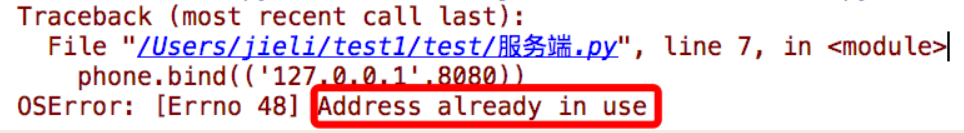
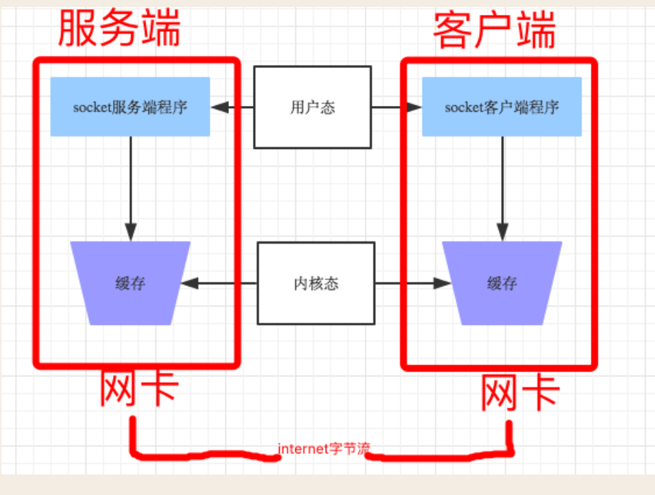
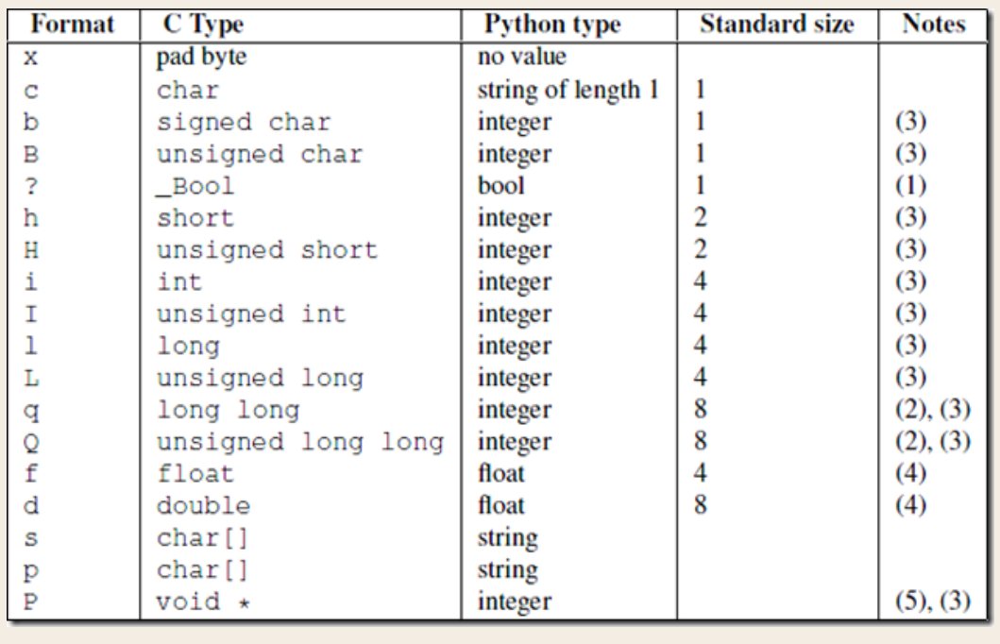

# python 网络编程

## tcp服务端因端口被占用而无法重新启动的原因



### 出现原因

- 服务端仍然处在上次四次挥手的 TIME_WAIT 状态 , 地址没有被释放

### 解决方法

- tcp服务绑定之前,设置参数选项

```python
from socket import *

ip_port = ("127.0.0.1", 8080)
buffer_size = 1024
back_log = 5
encoding = 'utf-8'

tcp_server = socket(AF_INET, SOCK_STREAM)
# 添加设置,注意需要在绑定动作之前
tcp_server.setsockopt(SOL_SOCKET, SO_REUSEADDR, 1)
tcp_server.bind(ip_port)
tcp_server.listen(back_log)
```

## 服务端与多客户端实现数据的交互

### 服务端

```python
from socket import *

ip_port = ("127.0.0.1", 8080)
buffer_size = 1024
back_log = 5
encoding = 'utf-8'

tcp_server = socket(AF_INET, SOCK_STREAM)
tcp_server.setsockopt(SOL_SOCKET, SO_REUSEADDR, 1)
tcp_server.bind(ip_port)
tcp_server.listen(back_log)
print('服务端启动成功')

while True:
    print('等待客户端连接')
    conn, address = tcp_server.accept()
    print('客户端连接成功,地址', address)

    while True:
        try:
            print('等待客户端发送数据')
            data_byte = conn.recv(buffer_size)

            # 解决部分 linux 系统当客户端关闭时,服务端程序一直收空数据的情况
            if not data_byte:
                break

            data_str = data_byte.decode(encoding)
            print('接收客户端发送的数据', data_str)

            send_data_byte = data_str.upper().encode(encoding)
            conn.send(send_data_byte)
        except Exception as ex:
            print(ex)
            break

    if not conn:
        conn.close()

tcp_server.close()
```

### 客户端

```python
from socket import *

ip_port = ("127.0.0.1", 8080)
buffer_size = 1024
encoding = 'utf-8'

tcp_client = socket(AF_INET, SOCK_STREAM)
tcp_client.connect(ip_port)

while True:
    try:
        input_data = input("请输入数据")

        if input_data == 'quit':
            break

        if not input_data:
            continue

        data_byte = input_data.encode(encoding)
        tcp_client.send(data_byte)

        recv_data_byte = tcp_client.recv(buffer_size)
        recv_data = recv_data_byte.decode(encoding)
        print('客户端接收数据', recv_data)
    except Exception as ex:
        print(ex)
        break

tcp_client.close()
```

## udp通信连接

### 服务端与客户端通信

#### 服务端

```python
from socket import *

ip_port = ("127.0.0.1", 8081)
buffer_size = 1024
encoding = 'utf-8'

udp_server = socket(AF_INET, SOCK_DGRAM)
udp_server.bind(ip_port)

while True:
    try:
        print('等待客户端发送数据')
        data, address = udp_server.recvfrom(buffer_size)
        print('客户端地址', address)

        data_str = data.decode(encoding)
        print('接收的数据', data_str)

        send_data = data_str.upper().encode(encoding)
        udp_server.sendto(send_data, address)
    except Exception as ex:
        print(ex)

udp_server.close()
```

#### 客户端

```python
from socket import *

ip_port = ("127.0.0.1", 8081)
buffer_size = 1024
encoding = 'utf-8'

udp_client = socket(AF_INET, SOCK_DGRAM)

while True:
    try:
        input_data = input("请输入数据:")
        input_data_byte = input_data.encode(encoding)

        udp_client.sendto(input_data_byte, ip_port)

        data_byte, address = udp_client.recvfrom(buffer_size)
        data_str = data_byte.decode(encoding)
        print('接收的数据', data_str)
    except Exception as ex:
        print(ex)
```

### 示例:udp实现时间同步服务器

#### 服务端

```python
from socket import *
import time

ip_port = ('127.0.0.1', 8081)
buffer_size = 1024
encoding = 'utf-8'

udp_server = socket(AF_INET, SOCK_DGRAM)
udp_server.bind(ip_port)

while True:
    data, address = udp_server.recvfrom(buffer_size)

    date_format = ''
    if not data:
        date_format = '%Y-%m-%d %X'
    else:
        date_format = data.decode(encoding)

    time_str = time.strftime(date_format)

    udp_server.sendto(time_str.encode(encoding), address)
```

#### 客户端

```python
from socket import *

ip_port = ('127.0.0.1', 8081)
buffer_size = 1024
encoding = 'utf-8'

udp_client = socket(AF_INET, SOCK_DGRAM)

while True:
    date_format = input('请输入时间格式:')

    udp_client.sendto(date_format.encode(encoding), ip_port)

    data, address = udp_client.recvfrom(buffer_size)
    time_data = data.decode(encoding)
    print(time_data)
```

## subprocess 模块

### 案例: 将shell命令执行的结果进行输出

```python
import subprocess

encoding = 'utf-8'

value = subprocess.Popen('ls', shell=True, bufsize=1024, stdin=subprocess.PIPE,
                         stdout=subprocess.PIPE, stderr=subprocess.PIPE)

print("value", value)

# 如果命令执行错误的情况下,结果会在 stderr 中
error_byte = value.stderr.read()
if error_byte:
    print('error : ' + error_byte.decode(encoding))

# 如果命令执行正确的情况下,结果会在 stdout 中
out_byte = value.stdout.read()
if out_byte:
    print('out : ' + out_byte.decode(encoding))
    
# 打印结果
# out : __init__.py
# __pycache__
# client1.py
# client2.py
# constants.py
# server1.py
# server2.py
# subprocess_module.py
```

## tcp实现远程执行shell命令

### 服务端

```python
from socket import *
import subprocess

# tcp 实现远程执行 shell 命令

ip_port = ('127.0.0.1', 8080)
buffer_size = 1024
encoding = 'utf-8'
back_log = 10

tcp_server = socket(AF_INET, SOCK_STREAM)
tcp_server.setsockopt(SOL_SOCKET, SO_REUSEADDR, 1)
tcp_server.bind(ip_port)
tcp_server.listen(back_log)

print('服务端已经启动')


def handle_data(cmd_data):
    """
    执行cmd命令
    :param cmd_data: cmd命令
    :return: 命令的返回结果
    """
    out_data = subprocess.Popen(cmd_data, shell=True, stdin=subprocess.PIPE,
                                stdout=subprocess.PIPE, stderr=subprocess.PIPE)

    result_data = out_data.stderr.read()
    if not result_data:
        result_data = data.stdout.read()

    if not result_data:
        result_data = '命令执行成功'.encode(encoding)

    return result_data


while True:
    print('等待客户端连接')
    conn, address = tcp_server.accept()
    print('客户端地址', address)

    while True:
        try:
            print('等待客户端发送数据')
            data = conn.recv(buffer_size)

            if not data:
                break

            data_str = data.decode(encoding)
            if data_str == 'quit':
                break

            print('接收到命令:', data_str)
            res_data = handle_data(data_str)

            conn.send(res_data)

        except Exception as ex:
            print(ex)
            break

    if not conn:
        conn.close()

tcp_server.close()
```

### 客户端

```python
from socket import *

ip_port = ('127.0.0.1', 8080)
buffer_size = 1024
encoding = 'utf-8'
back_log = 10

tcp_client = socket(AF_INET, SOCK_STREAM)

tcp_client.connect(ip_port)

while True:
    value = input('请输入命令:')

    if not value:
        continue

    if value == 'quit':
        break

    send_data = value.encode(encoding)
    tcp_client.send(send_data)

    receive_data = tcp_client.recv(buffer_size)
    receive_data_str = receive_data.decode('gbk')
    print('执行结果', receive_data_str)

tcp_client.close()
```

## 粘包

### 须知

- 只有TCP有粘包现象，UDP永远不会粘包 

### socket收发消息原理



发送端可以是一K一K地发送数据，而接收端的应用程序可以两K两K地提走数据，当然也有可能一次提走3K或6K数据，或者一次只提走几个字节的数据，也就是说，应用程序所看到的数据是一个整体，或说是一个流（stream），一条消息有多少字节对应用程序是不可见的，因此TCP协议是面向流的协议，这也是容易出现粘包问题的原因

而UDP是面向消息的协议，每个UDP段都是一条消息，应用程序必须以消息为单位提取数据，不能一次提取任意字节的数据，这一点和TCP是很不同的。怎样定义消息呢？可以认为对方一次性write/send的数据为一个消息，需要明白的是当对方send一条信息的时候，无论底层怎样分段分片，TCP协议层会把构成整条消息的数据段排序完成后才呈现在内核缓冲区 

### 本质原因

- 所谓粘包问题主要还是因为接收方不知道消息之间的界限，不知道一次性提取多少字节的数据所造成的
- 此外，发送方引起的粘包是由TCP协议本身造成的，TCP为提高传输效率，发送方往往要收集到足够多的数据后才发送一个TCP段。若连续几次需要send的数据都很少，通常TCP会根据优化算法把这些数据合成一个TCP段后一次发送出去，这样接收方就收到了粘包数据

### TCP与UDP总结

- TCP（transport control protocol，传输控制协议）是面向连接的，面向流的，提供高可靠性服务。收发两端（客户端和服务器端）都要有一一成对的socket，因此，发送端为了将多个发往接收端的包，更有效的发到对方，使用了优化方法（Nagle算法），将多次间隔较小且数据量小的数据，合并成一个大的数据块，然后进行封包。这样，接收端，就难于分辨出来了，必须提供科学的拆包机制。 即面向流的通信是无消息保护边界的 
- UDP（user datagram protocol，用户数据报协议）是无连接的，面向消息的，提供高效率服务。不会使用块的合并优化算法，, 由于UDP支持的是一对多的模式，所以接收端的skbuff(套接字缓冲区）采用了链式结构来记录每一个到达的UDP包，在每个UDP包中就有了消息头（消息来源地址，端口等信息），这样，对于接收端来说，就容易进行区分处理了。即面向消息的通信是有消息保护边界的 
- tcp是基于数据流的，于是收发的消息不能为空，这就需要在客户端和服务端都添加空消息的处理机制，防止程序卡住，而udp是基于数据报的，即便是你输入的是空内容（直接回车），那也不是空消息，udp协议会帮你封装上消息头
- udp的recvfrom是阻塞的，一个recvfrom(x)必须对唯一一个sendinto(y),收完了x个字节的数据就算完成,若是y>x数据就丢失，这意味着udp根本不会粘包，但是会丢数据，不可靠 
- tcp的协议数据不会丢，没有收完包，下次接收，会继续上次继续接收，己端总是在收到ack时才会清除缓冲区内容。数据是可靠的，但是会粘包

### 发生粘包的两种情况

#### 情况1 发送端需要等缓冲区满才发送出去，造成粘包（发送数据时间间隔很短，数据了很小，会合到一起，产生粘包） 

- 服务端

```python
from socket import *

ip_port = ('127.0.0.1', 8080)

tcp_socket_server = socket(AF_INET, SOCK_STREAM)
tcp_socket_server.bind(ip_port)
tcp_socket_server.listen(5)

conn, addr = tcp_socket_server.accept()

data1 = conn.recv(10)
data2 = conn.recv(10)

print('----->', data1.decode('utf-8'))
print('----->', data2.decode('utf-8'))

conn.close()
```

- 客户端

```python
import socket

BUFSIZE = 1024
ip_port = ('127.0.0.1', 8080)

s = socket.socket(socket.AF_INET, socket.SOCK_STREAM)
res = s.connect_ex(ip_port)

s.send('hello'.encode('utf-8'))
s.send('feng'.encode('utf-8'))
```

- 运行结果


#### 情况2 接收方不及时接收缓冲区的包，造成多个包接收（客户端发送了一段数据，服务端只收了一小部分，服务端下次再收的时候还是从缓冲区拿上次遗留的数据，产生粘包） 

- 服务端

```python
from socket import *

ip_port = ('127.0.0.1', 8080)

tcp_socket_server = socket(AF_INET, SOCK_STREAM)
tcp_socket_server.bind(ip_port)
tcp_socket_server.listen(5)

conn, addr = tcp_socket_server.accept()

data1 = conn.recv(2)  # 一次没有收完整
data2 = conn.recv(10)  # 下次收的时候,会先取旧的数据,然后取新的

print('----->', data1.decode('utf-8'))
print('----->', data2.decode('utf-8'))

conn.close()
```

- 客户端

```python
import socket

BUFSIZE = 1024
ip_port = ('127.0.0.1', 8080)

s = socket.socket(socket.AF_INET, socket.SOCK_STREAM)
res = s.connect_ex(ip_port)

s.send('hello feng'.encode('utf-8'))
```

- 运行结果


### 拆包发生的情况

- 当发送端缓冲区的长度大于网卡的MTU时，tcp会将这次发送的数据拆成几个数据包发送出去 

### tcp与udp可靠性的区别

- tcp是可靠传输，udp是不可靠传输
- tcp在数据传输时，发送端先把数据发送到自己的缓存中，然后协议控制将缓存中的数据发往对端，对端返回一个ack=1，发送端则清理缓存中的数据，对端返回ack=0，则重新发送数据，所以tcp是可靠的 
- 而udp发送数据，对端是不会返回确认信息的，因此不可靠

###  send(字节流)和recv(1024)及sendall

- recv里指定的1024意思是从缓存里一次拿出1024个字节的数据 
- send的字节流是先放入己端缓存，然后由协议控制将缓存内容发往对端，如果待发送的字节流大小大于缓存剩余空间，那么数据丢失，用sendall就会循环调用send，数据不会丢失

### 粘包的解决方法

#### 方法1: (low版解决方式,不推荐)

- 问题的根源在于，接收端不知道发送端将要传送的字节流的长度，所以解决粘包的方法就是围绕，如何让发送端在发送数据前，把自己将要发送的字节流总大小让接收端知晓，然后接收端来一个死循环接收完所有数据
- 不推荐的原因 :程序的运行速度远快于网络传输速度，所以在发送一段字节前，先用send去发送该字节流长度，这种方式会放大网络延迟带来的性能损耗 
- 自定义常量模块 constants

```python
ip_port = ('127.0.0.1', 8080)
buffer_size = 1024
encoding = 'utf-8'
back_log = 5


def str_to_byte(data):
    """
    字符串转换为字节
    :param data:
    :return:
    """
    return data.encode(encoding)


def byte_to_str(data):
    """
    字节转换为字符串
    :param data:
    :return:
    """
    return data.decode(encoding)
```

- 服务端

```python
from socket import *
from test5 import constants

tcp_server = socket(AF_INET, SOCK_STREAM)
tcp_server.setsockopt(SOL_SOCKET, SO_REUSEADDR, 1)
tcp_server.bind(constants.ip_port)
tcp_server.listen(constants.back_log)

print('服务端已经启动')

conn, addr = tcp_server.accept()
print('客户端地址', addr)

while True:
    try:
        # 先获取数据的长度
        data_length_byte = conn.recv(constants.buffer_size)
        data_length_str = constants.byte_to_str(data_length_byte)
        print('数据长度 : ', data_length_str)

        # 告诉客户端可以开始发送数据
        ready_data_byte = constants.str_to_byte('ready')
        conn.send(ready_data_byte)

        # 等待客户端发送数据
        data_index = 0
        send_data_str = ''
        while data_index < int(data_length_str):
            receive_data_byte = conn.recv(constants.buffer_size)
            send_data_str += constants.byte_to_str(receive_data_byte)
            data_index += len(receive_data_byte)

        print('客户端发送的数据', send_data_str)

        # 告诉客户端数据接收成功
        receive_data_success_byte = constants.str_to_byte('success')
        conn.send(receive_data_success_byte)

    except Exception as ex:
        print(ex)
        break

tcp_server.close()
```

- 客户端

```python
from socket import *
from test5 import constants

tcp_client = socket(AF_INET, SOCK_STREAM)
tcp_client.connect(constants.ip_port)

while True:
    try:
        input_data_str = input("请输入数据")
        input_data_byte = constants.str_to_byte(input_data_str)

        # 获取数据的长度
        input_data_byte_len = len(input_data_byte)
        print('数据长度', input_data_byte_len)
        send_data_len_byte = constants.str_to_byte(str(input_data_byte_len))

        # 先发送数据的长度
        tcp_client.send(send_data_len_byte)

        # 等待服务端发送的结果
        ready_receive_byte = tcp_client.recv(constants.buffer_size)
        ready_receive_str = constants.byte_to_str(ready_receive_byte)

        if ready_receive_str != 'ready':
            continue

        # 服务端准备好了,开始发送真实的数据
        tcp_client.send(input_data_byte)

        success_data_byte = tcp_client.recv(constants.buffer_size)
        success_data_str = constants.byte_to_str(success_data_byte)

        if success_data_str == 'success':
            print('数据发送成功')
        else:
            print('数据发送失败', success_data_str)

    except Exception as ex:
        print(ex)
        break

tcp_client.close()
```

### 方法2:

- 为字节流加上自定义固定长度报头，报头中包含字节流长度，然后一次send到对端，对端在接收时，先从缓存中取出定长的报头，然后再取真实数据 

- 原理

```python
"""
可以把报头做成字典，字典里包含将要发送的真实数据的详细信息
然后json序列化，然后用struck将序列化后的数据长度打包成4个字节（4个足够用了） 

发送时：
先发报头长度
再编码报头内容然后发送
最后发真实内容

接收时：
先手报头长度，用struct取出来
根据取出的长度收取报头内容，然后解码，反序列化
从反序列化的结果中取出待取数据的详细信息，然后去取真实的数据内容
"""
```

- 服务端

```python
from socket import *
from test5 import constants
import struct

tcp_server = socket(AF_INET, SOCK_STREAM)
tcp_server.setsockopt(SOL_SOCKET, SO_REUSEADDR, 1)
tcp_server.bind(constants.ip_port)
tcp_server.listen(constants.back_log)

print('服务端已经启动')

conn, addr = tcp_server.accept()
print('客户端地址', addr)

while True:
    try:
        # 先获取数据的长度
        # struct.pack('i', input_data_byte_len) 中 i 对应字节长度为 4
        data_length_byte = conn.recv(4)

        # 第一个元素为长度
        data_length_str = struct.unpack('i', data_length_byte)[0]
        print('数据长度 : ', data_length_str)

        # 等待客户端发送数据
        data_index = 0
        send_data_str = ''
        while data_index < int(data_length_str):
            receive_data_byte = conn.recv(constants.buffer_size)
            send_data_str += constants.byte_to_str(receive_data_byte)
            data_index += len(receive_data_byte)

        print('客户端发送的数据', send_data_str)

        # 告诉客户端数据接收成功
        receive_data_success_byte = constants.str_to_byte('success')
        conn.send(receive_data_success_byte)

    except Exception as ex:
        print(ex)
        break

tcp_server.close()
```

- 客户端

```python
from socket import *
from test5 import constants
import struct

tcp_client = socket(AF_INET, SOCK_STREAM)
tcp_client.connect(constants.ip_port)

while True:
    try:
        input_data_str = input("请输入数据")
        input_data_byte = constants.str_to_byte(input_data_str)

        # 获取数据的长度
        input_data_byte_len = len(input_data_byte)
        print('数据长度', input_data_byte_len)
        send_data_len_byte = struct.pack('i', input_data_byte_len)

        # 先发送数据的长度
        tcp_client.send(send_data_len_byte)

        # 发送真实的数据
        tcp_client.send(input_data_byte)

        # 等待服务端发送结果的回调
        success_data_byte = tcp_client.recv(constants.buffer_size)
        success_data_str = constants.byte_to_str(success_data_byte)

        if success_data_str == 'success':
            print('数据发送成功')
        else:
            print('数据发送失败', success_data_str)

    except Exception as ex:
        print(ex)
        break

tcp_client.close()
```

## struct模块 

### 功能

- 该模块可以把一个类型，如数字，转成固定长度的bytes 

### 使用



```python
import json, struct

# 假设通过客户端上传1T:1073741824000的文件a.txt

# 为避免粘包,必须自定制报头
header = {'file_size': 1073741824000, 'file_name': '/a/b/c/d/e/a.txt',
          'md5': '8f6fbf8347faa4924a76856701edb0f3'}  # 1T数据,文件路径和md5值

# 为了该报头能传送,需要序列化并且转为bytes
head_bytes = bytes(json.dumps(header), encoding='utf-8')  # 序列化并转成bytes,用于传输

# 为了让客户端知道报头的长度,用struck将报头长度这个数字转成固定长度:4个字节
head_len_bytes = struct.pack('i', len(head_bytes))  # 这4个字节里只包含了一个数字,该数字是报头的长度

# 客户端开始发送
conn.send(head_len_bytes)  # 先发报头的长度,4个bytes
conn.send(head_bytes)  # 再发报头的字节格式
conn.sendall(文件内容)  # 然后发真实内容的字节格式

# 服务端开始接收
head_len_bytes = s.recv(4)  # 先收报头4个bytes,得到报头长度的字节格式
x = struct.unpack('i', head_len_bytes)[0]  # 提取报头的长度

head_bytes = s.recv(x)  # 按照报头长度x,收取报头的bytes格式
header = json.loads(json.dumps(header))  # 提取报头

# 最后根据报头的内容提取真实的数据,比如
real_data_len = s.recv(header['file_size'])
s.recv(real_data_len)
```

```python
import struct
import binascii
import ctypes

values1 = (1, 'abc'.encode('utf-8'), 2.7)
values2 = ('defg'.encode('utf-8'), 101)
s1 = struct.Struct('I3sf')
s2 = struct.Struct('4sI')

print(s1.size, s2.size)
prebuffer = ctypes.create_string_buffer(s1.size + s2.size)
print('Before : ', binascii.hexlify(prebuffer))
# t=binascii.hexlify('asdfaf'.encode('utf-8'))
# print(t)

s1.pack_into(prebuffer, 0, *values1)
s2.pack_into(prebuffer, s1.size, *values2)

print('After pack', binascii.hexlify(prebuffer))
print(s1.unpack_from(prebuffer, 0))
print(s2.unpack_from(prebuffer, s1.size))

s3 = struct.Struct('ii')
s3.pack_into(prebuffer, 0, 123, 123)
print('After pack', binascii.hexlify(prebuffer))
print(s3.unpack_from(prebuffer, 0))
```

