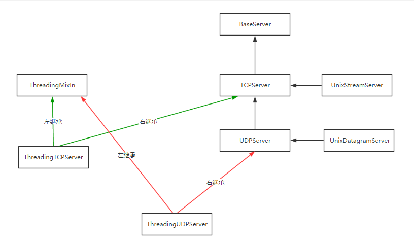
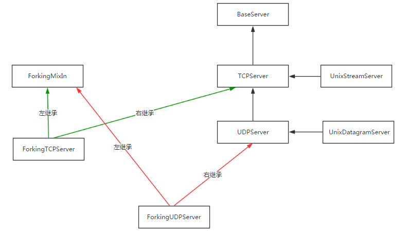
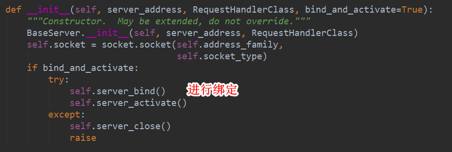
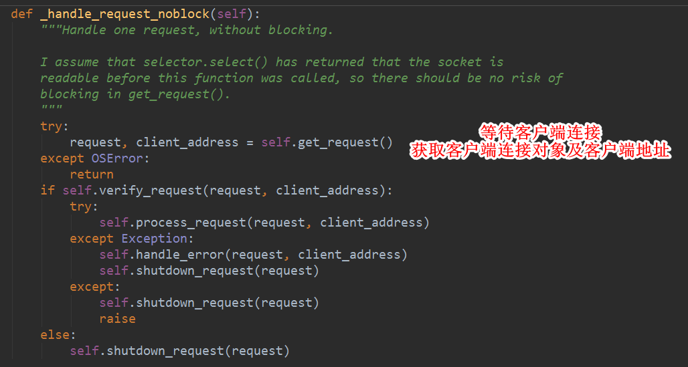

# python 网络编程

## socketServer 模块

- socketserver模块中分两大类：server类（解决链接问题）和request类（解决通信问题）

### server类


### request类


### 继承关系






## tcp通信

- 自定义常量模块

```python
ip_port = ('127.0.0.1', 8081)
buffer_size = 1024
back_log = 5
encoding = 'utf-8'


def str_to_byte(data):
    return data.encode(encoding)


def byte_to_str(data):
    return data.decode(encoding)
```

- 服务端

```python
class MyServer(socketserver.BaseRequestHandler):
    def handle(self):
        # conn
        print('conn', self.request)
        # address
        print('address', self.client_address)

        while True:
            try:
                # 收消息
                data = self.request.recv(constants.buffer_size)
                if not data:
                    break

                print('收到客户端发送的数据', data)

                # 发消息
                self.request.sendall(data.upper())
            except Exception as ex:
                print(ex)
                break


if __name__ == "__main__":
    server = socketserver.ThreadingTCPServer(constants.ip_port, MyServer)
    server.serve_forever()
```

- 客户端

```python
from socket import *
from test8 import constants

tcp_client = socket(AF_INET, SOCK_STREAM)
tcp_client.connect(constants.ip_port)

while True:
    try:
        input_data_str = input('请输入数据')
        input_data_byte = constants.str_to_byte(input_data_str)
        tcp_client.sendall(input_data_byte)

        recv_data_byte = tcp_client.recv(constants.buffer_size)
        recv_data_str = constants.byte_to_str(recv_data_byte)
        print('收到服务端发送的数据', recv_data_str)

    except Exception as ex:
        print(ex)
        break

tcp_client.close()
```

## udp通信

- 服务端

```python
import socketserver
from test8 import constants


class MyServer(socketserver.BaseRequestHandler):
    def handle(self):
        print(self.request)
        # (b'sdfsdf', <socket.socket fd=304, family=AddressFamily.AF_INET, type=SocketKind.SOCK_DGRAM, proto=0, laddr=('127.0.0.1', 8081)>)

        self.request[1].sendto(self.request[0].upper(), self.client_address)


if __name__ == "__main__":
    udp_server = socketserver.ThreadingUDPServer(constants.ip_port, MyServer)

    print(udp_server.server_address)
    print(udp_server.socket)
    print(udp_server.RequestHandlerClass)

    """
    ('127.0.0.1', 8081)
    <socket.socket fd=304, family=AddressFamily.AF_INET, type=SocketKind.SOCK_DGRAM, proto=0, laddr=('127.0.0.1', 8081)>
    <class '__main__.MyServer'>
    """

    udp_server.serve_forever()
    pass
```

- 客户端

```python
from socket import *
from test8 import constants

ip_port = constants.ip_port
buffer_size = constants.buffer_size

udp_client = socket(AF_INET, SOCK_DGRAM)

while True:
    value = input('请输入数据:')
    data = value.encode(encoding='utf-8')
    # 发数据
    udp_client.sendto(data, ip_port)

    data, addr = udp_client.recvfrom(buffer_size)
    print('接收到服务端发送的数据', data.decode('utf-8'))
```

## socketServer源码分析

### tcp流程分析(基于上面tcp通信源码)

- 属性/方法查询顺序
  - ThreadingTCPServer
  - ThreadingMixIn
  - TCPServer
  - BaseServer


#### 初始化

- 调用 socketserver.ThreadingTCPServer(constants.ip_port, MyServer) 将ip地址,端口及自定义RequestHandle对象传入

- ThreadingTCPServer类寻找 \_\_init\_\_ 方法

  

  由于ThreadingTCPServer没有实现 \_\_init\_\_ 方法, 先从左继承 ThreadingMixIn 进行寻找

- ThreadingMixIn 中寻找 \_\_init\_\_ 方法

  

  ThreadingMixIn 中没有实现 \_\_init\_\_ 方法,回到 TCPServer 模块中寻找

- TCPServer 模块寻找 \_\_init\_\_ 方法

  

- 调用BaseServer的 \_\_init\_\_ 方法

  

- 服务绑定

  

- 根据上述的查询流程,寻找到 TCPServer 类的 server_bind方法

  

- 执行 server_activate 方法

  

- 设置监听数目

  

- 初始化 \_\_init\_\_ 方法执行完成

  

#### 开启服务

- 执行 serve_forever 方法

  

- 查询 serve_forever 方法

  

- 执行 _handle_request_noblock 方法

  

- 等待客户端连接  

  

- 处理请求

  

- 调用 process_request 方法

  

  

- 调用初始化方法

  

- 执行自定义的 handle 方法,处理消息逻辑

  ```python
  class MyServer(socketserver.BaseRequestHandler):
      def handle(self):
          # 客户端连接对象
          print('conn', self.request)
          # 客户端连接地址
          print('address', self.client_address)
  
          # 消息循环
          while True:
              try:
                  # 收消息
                  data = self.request.recv(constants.buffer_size)
                  if not data:
                      break
  
                  print('收到客户端发送的数据', data)
  
                  # 发消息
                  self.request.sendall(data.upper())
              except Exception as ex:
                  print(ex)
                  break
  ```

### udp流程分析(基于上面udp通信源码)  

- 查找顺序
  - ThreadingUDPServer
  - ThreadingMixIn
  - UDPServer
  - TCPServer
  - BaseServer

#### 初始化

- 创建socket对象

  ```python
  socketserver.ThreadingUDPServer(constants.ip_port, MyServer)
  ```

- 调用 \_\_init\_\_ 方法

  

  

- server_bind 与 TCP 一致 , 主要进行服务端 ip 和 端口 的绑定

- 调用 server_activate 方法

  

- 返回对象

  

#### 开启服务

- 执行serve_forever 方法

  

- 等待连接,获取客户端发送的数据

  

  

- 接下来的步骤与TCP一致,创建线程,对自定义BaseRequestHandler进行初始化操作,最终调用handle方法

  ```python
  class MyServer(socketserver.BaseRequestHandler):
      def handle(self):
          print(
              self.request)  # (b'sadf', <socket.socket fd=304, family=AddressFamily.AF_INET, type=SocketKind.SOCK_DGRAM, proto=0, laddr=('127.0.0.1', 8081)>)
          print(self.client_address)  # ('127.0.0.1', 65430)
          print(self.server)  # <socketserver.ThreadingUDPServer object at 0x00000000028B0D30>
  
          self.request[1].sendto(self.request[0].upper(), self.client_address)
  ```

  
