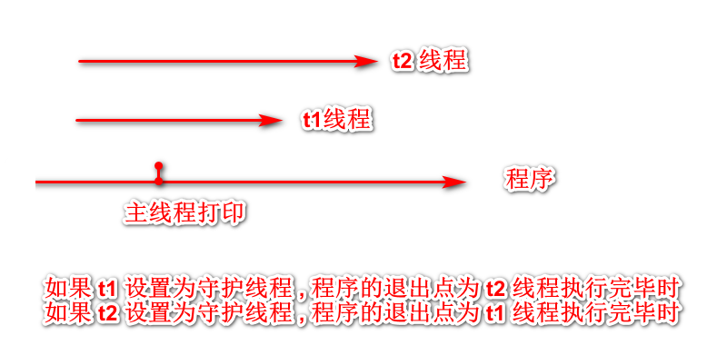

# python 网络编程 进程及线程

## 进程

- 是一个程序在一个数据集散的一次动态执行过程
- 进程一般由程序,数据集,进程控制块三部分组成
- 程序用来描述进程要完成哪些功能以及如何完成
- 数据集是程序在执行过程中所需要使用的资源
- 进程控制块用来记录进程的外部特征,描述进程的执行变化过程,系统可以利用它来控制和管理进程,它是系统感知进程存在的唯一标志

## 线程

- 它的出现是为了降低上下文切换的消耗,提高系统的并发性,并突破一个进程只能干一件事的缺陷,使进程内并发成为可能
- 线程也叫轻量级进程,它是一个基本的cpu执行单元,也是程序执行过程中的最小单元
- 由线程ID,程序计数器,寄存器集合和堆栈共同组成
- 线程的引入减小了程序并发执行的开销,提高了操作系统的并发性能.线程没有自己的系统资源

## 进程与线程的区别

- 一个程序至少有一个进程,一个进程至少有一个线程

- 进程在执行过程中拥有独立的内存单元,而多个线程共享内存,从而极大提高程序的运行效率

- 线程在执行过程中与进程还是有区别的,每个独立的进程有一个程序运行的入口,顺序执行序列和程序的出口.但是线程不能独立运行,必须存在于程序中,由应用程序提供多个线程执行控制

- 进程是具有一定独立功能的程序关于某个数据集合上的一次运行活动,进程是系统进行资源分配和调度的一个独立单位

- 线程是进程的一个实体,是CPU调度和分派的基本单位,它是比进程更小的独立运行的基本单位

- 线程自己基本上不拥有系统资源,只拥有一点在运行中必不可少的资源(如:程序计数器,一组寄存器和栈)但是它可与同属一个进程的其他的线程共享进程所拥有的全部资源

- 一个线程可以创建和撤销另一个线程,同一个进程中多个线程之间可以并发执行

- 总结:

  - 线程: 最小的执行单元
  - 进程: 最小的资源单位

# 创建线程  

### 模块引入

- 涉及到线程操作时,需要引入 threading 模块 

### 创建方式1 (推荐)

```python
import threading
import time

def print_data(num):
    print(f'{num}')
    time.sleep(3)


if __name__ == '__main__':
    # 创建线程对象
    # target 代表目标方法,当线程开启时,会执行对应的方法
    # 如果目标方法需要传递参数,需要设置args参数,值设置为元祖的形式
    # 如果目标方法不需要传递参数,不需要设置args参数
    t1 = threading.Thread(target=print_data, args=(10,))
    t1.start()

    t2 = threading.Thread(target=print_data, args=(9,))
    t2.start()

    print('ending')
```

### 创建方式2 (不推荐)  

```python
class MyThread(threading.Thread):
    def __init__(self, data):
        threading.Thread.__init__(self)
        self.num = data

    def run(self):
        print(f'num = {self.num}')
        time.sleep(2)


if __name__ == '__main__':
    t1 = MyThread(1)
    t2 = MyThread(2)
    t1.start()
    t2.start()

    print('end main')
```

## 并发   

- 与单线程不同的是,多线程的执行时间不再受单线程的影响(必须等到前一个操作执行完后才可以执行操作)

```python
class MyThread(threading.Thread):
    def __init__(self, data):
        threading.Thread.__init__(self)
        self.num = data

    def run(self):
        print(f'num = {self.num}')
        time.sleep(2)


if __name__ == '__main__':
    t1 = MyThread(1)
    t2 = MyThread(2)
    t1.start()
    t2.start()

    print('end main')
    
# 运行结果:
# music time begin : Thu Aug  2 16:59:04 2018
# game time begin : Thu Aug  2 16:59:04 2018
# music time end : Thu Aug  2 16:59:07 2018
# game time end : Thu Aug  2 16:59:09 2018
```

##  join 

```python
def music():
    print(f'music time begin : {time.ctime()}')
    time.sleep(3)
    print(f'music time end : {time.ctime()}')


def game():
    print(f'game time begin : {time.ctime()}')
    time.sleep(5)
    print(f'game time end : {time.ctime()}')


if __name__ == '__main__':
    t1 = threading.Thread(target=music)
    t2 = threading.Thread(target=game)

    t1.start()
    t2.start()

    # 等待 t1 执行完,才能做下一个操作
    t1.join()
    # 等待 t2 执行完,才能做下一个操作
    t2.join()

    print('ending')

    
# 执行结果
# music time begin : Thu Aug  2 17:11:09 2018
# game time begin : Thu Aug  2 17:11:09 2018
# music time end : Thu Aug  2 17:11:12 2018
# game time end : Thu Aug  2 17:11:14 2018
# ending
```

## 守护线程

```python
def music():
    print(f'music time begin : {time.ctime()}')
    time.sleep(1)
    print(f'music time end : {time.ctime()}')


def game():
    print(f'game time begin : {time.ctime()}')
    time.sleep(2)
    print(f'game time end : {time.ctime()}')


if __name__ == '__main__':
    t1 = threading.Thread(target=music)
    t2 = threading.Thread(target=game)

    thread_list = []
    thread_list.append(t1)
    thread_list.append(t2)

    # 设置 t1 为守护线程
    # t1.setDaemon(True)
    # 设置 t2 为守护线程
    # t2.setDaemon(True)

    for item_thread in thread_list:
        item_thread.start()

    print('ending')
```

### 情况1 : 将 t1 设置为守护线程

```python
# 设置 t1 为守护线程
t1.setDaemon(True)
# 设置 t2 为守护线程
# t2.setDaemon(True)

# 运行结果:
# music time begin : Thu Aug  2 17:17:06 2018
# game time begin : Thu Aug  2 17:17:06 2018
# ending
# music time end : Thu Aug  2 17:17:07 2018
# game time end : Thu Aug  2 17:17:08 2018
```

### 情况2 : 将 t2 设置为守护线程

```python
# 设置 t1 为守护线程
# t1.setDaemon(True)
# 设置 t2 为守护线程
t2.setDaemon(True)

# 运行结果:
# music time begin : Thu Aug  2 17:19:55 2018
# game time begin : Thu Aug  2 17:19:55 2018
# ending
# music time end : Thu Aug  2 17:19:56 2018
```

### 分析



### 守护线程总结

- 将线程定义为守护线程,必须在 start() 之前调用,如果不设置为守护进程将会被无限挂起
- 这个方法和join是相反的,当程序运行过程中,执行一个主线程,或者主线程又创建一个子线程,就兵分两路,分别运行
- 当主线程执行完成想退出时,会检测子线程是否完成,如果子线程完成,则主线程会等待子线程完成后再退出
- 但是有时候需要的是 主线程完成了不管子线程是否完成,都要和主线程一起退出,这时候可以使用守护线程

## 线程的其他方法

```
start() 启动线程活动
isActive() 线程是否活动
getName() 获取线程名
setName() 设置线程名

threading 模块的其他方法
threading.currentThread() 当前线程变量
threading.enumerate() 返回一个包含正在运行的线程list
threading.activeCount() 正常运行的线程数量
```

