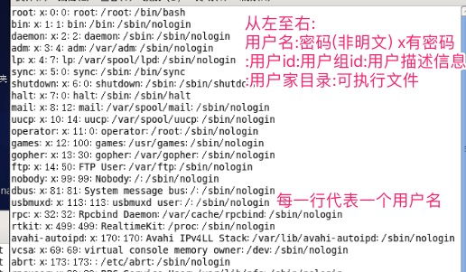
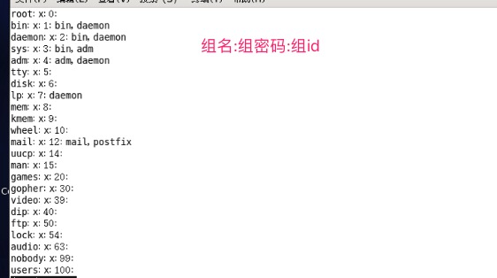

### 用户在新建时涉及到的相关文件

#### /etc/passwd

- 可执行文件

  - sbin/nologin

    用户不可以进行登录

  - /bin/bash

    用户可以进行登录

- 用户id

  - 系统用户ID分配 0-499
  - 普通用户ID分配 500之后

#### /etc/shadow 密码文件

  -  密码(已经被加密)

#### /etc/group 组文件  

#### /etc/gshadow 组密码文件

#### /home/用户目录

#### /var/spool/main/用户目录

- 用户的邮箱

  

  

  

  

  

  

  

