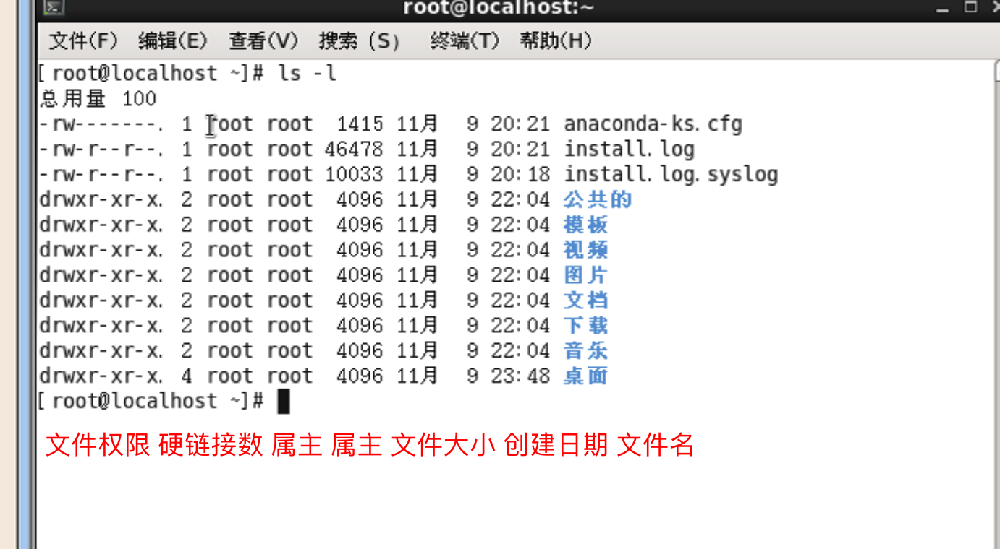

### 用户在新建时涉及到的相关文件

#### /etc/passwd


- 可执行文件

  - sbin/nologin

    用户不可以进行登录

  - /bin/bash

    用户可以进行登录

- 用户id

  - 系统用户ID分配 0-499
  - 普通用户ID分配 500之后

#### /etc/shadow 密码文件

  -  密码(已经被加密)

#### /etc/group 组文件  


#### /etc/gshadow 组密码文件

#### /home/用户目录

#### /var/spool/main/用户目录

- 用户的邮箱

## 文件权限管理



- 第1位 文件类型

  d 代表目录 , - 代表文件 , l 代表软链接 , b 代表设备文件 , p 代表管道文件

- 第2-4 5-7 8-10位

  2-4 属主权限 (u)

  5-7 属组权限 (g)

  8-10 不属于属组的其他用户权限 (o)

  r : 读 

  w : 写

  x : 可执行

### 修改文件权限

- chmod

  ```shell
  # 属主删除读写权限
  chmod u-rw 文件名
  # 属主添加读写权限
  chmod u+rw 文件名
  # 赋值权限
  chmod u=rwx 文件名
  # 赋值所有权限
  chmod 777 文件名
  ```

### 运行文件

- 常用方式

  ./文件名

  sh 文件名

