# 文件合并与文件归档

## >与>>

- 一个>符号表示文件覆盖

  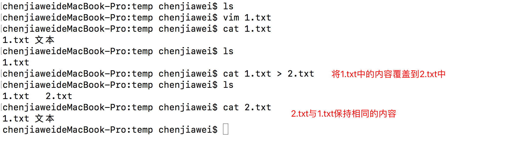

  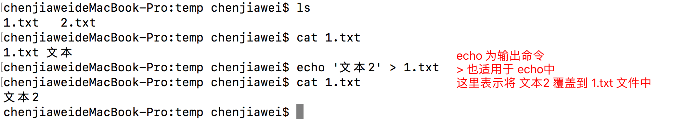

- 两个>>符号表示追加内容

  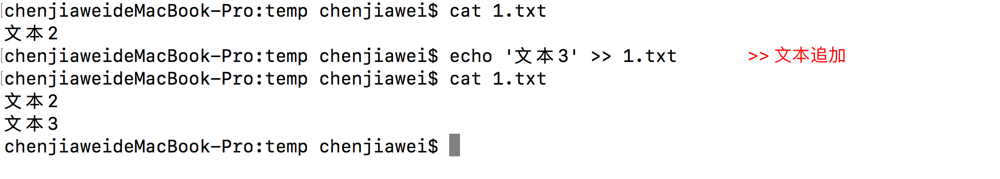

## 文件合并  

- 将多个文件进行合并

  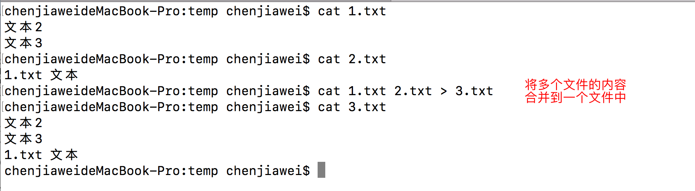

## 补充知识 管道操作

- 管道操作

  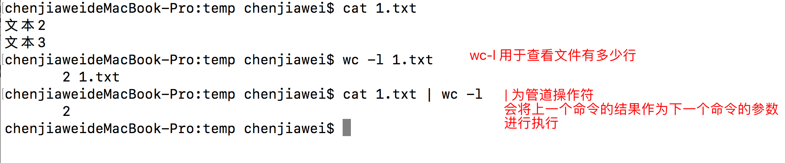

## 文件归档(打包)

- 打包

  - 打包与压缩的区别
    1. 打包是多个文件合并为一个文件
    2. 压缩是将文件的大小进行减小

  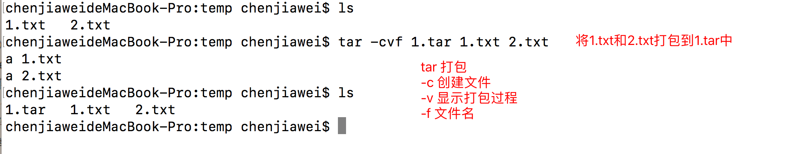

- 查看打包文件

  

- 解包

  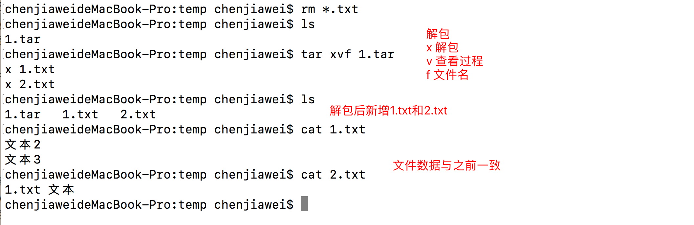
  
# 文件压缩  

## 压缩算法

### gzip  

- 压缩与解压

  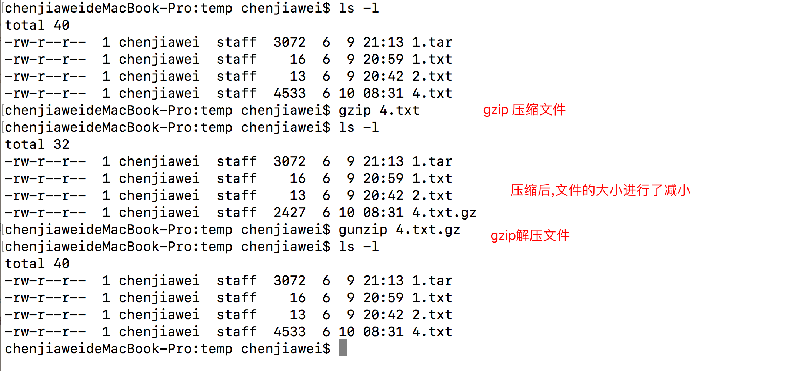
  
### bzip2

- 压缩与解压

  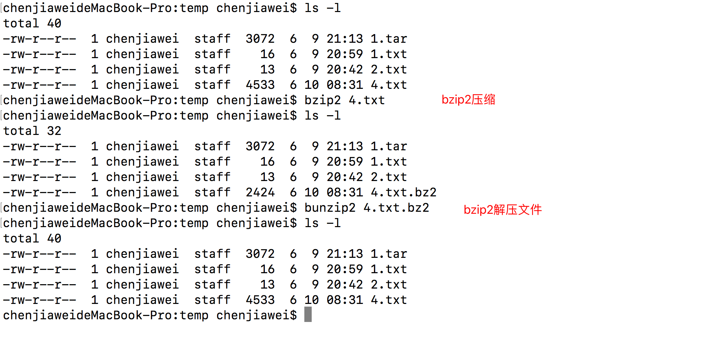

## 打包并压缩文件

- z参数进行压缩

  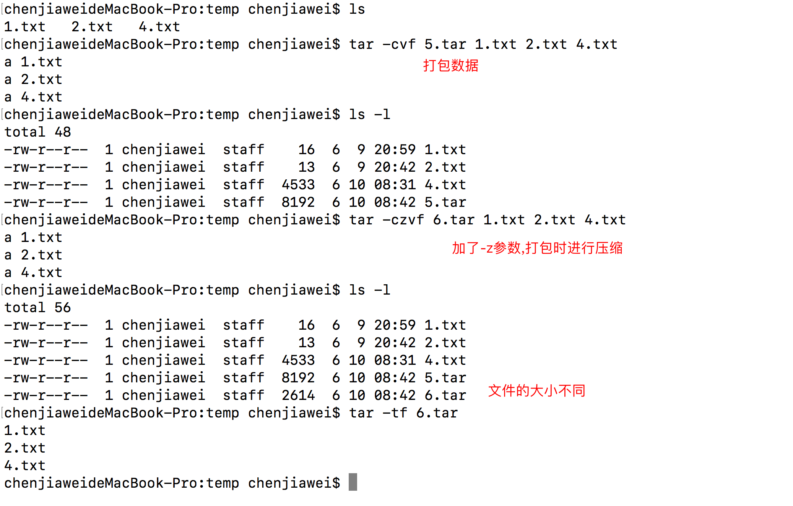

- 目录压缩

  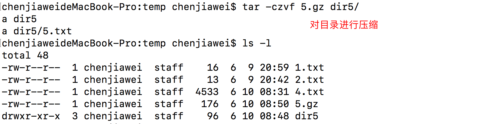

# vim编辑器

## 命令模式

- 常用快捷键

  ```
  dd 删除光标所在的那一行
  ndd 删除光标所在的向下n行,例如 20dd
  yy 复制光标所在的那一行
  nyy 复制光标向下所在的n行,例如 20yy
  u 撤销
  p 将复制的数据进行粘贴(下一行)
  P 将复制的数据进行粘贴(上一行)
  ctrl+r 重做上一次操作
  $ 跳转到该行末尾
  0 跳转到该行起始
  gg 跳转到整个文件第一行
  G 跳转到整个文件最后一行
  nG 跳转到指定行,例如 20nG
  ```

## 扩展模式  

- 常用快捷键

  ```
  w 保存
  q 退出
  wq! 强制保存
  q! 强制退出
  set nu 显示行号
  ```

# linux进程管理

## 常用命令

- top

  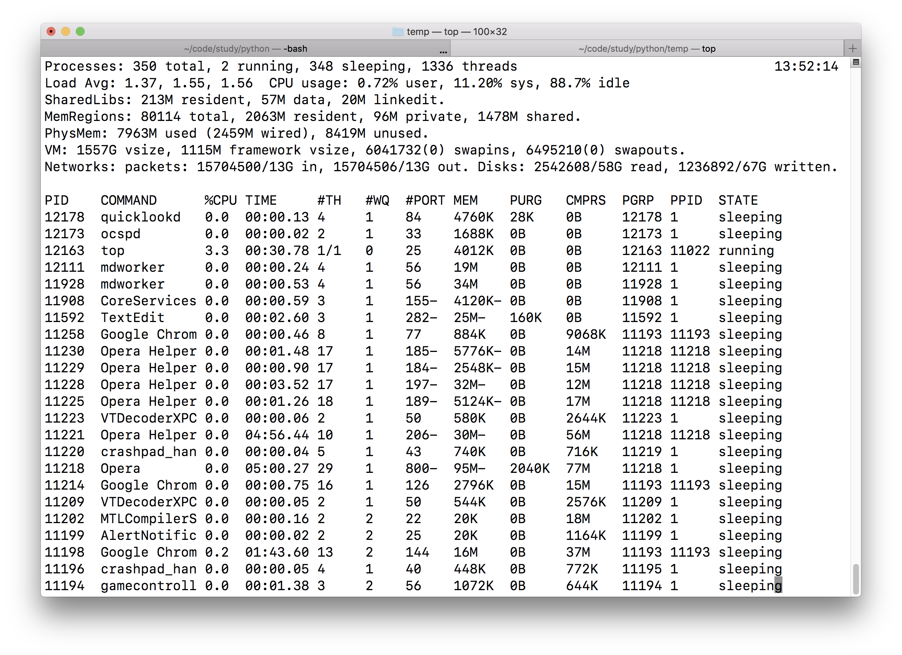


