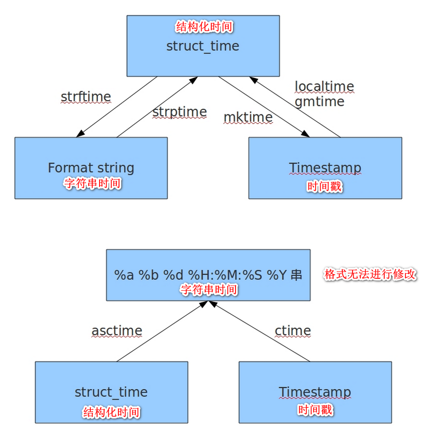
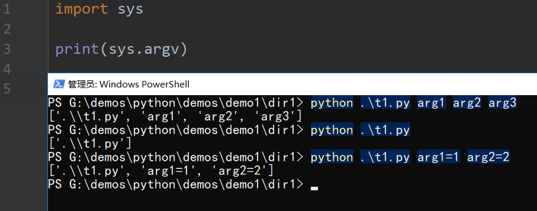

# python基础 collections,时间模块,random,os,sys

## collections模块

- 在内置数据类型（dict、list、set、tuple）的基础上，collections模块还提供了几个额外的数据类型：Counter、deque、defaultdict、namedtuple和OrderedDict
  - namedtuple: 生成可以使用名字来访问元素内容的tuple 
  - deque: 双端队列，可以快速的从另外一侧追加和推出对象 
  - Counter: 计数器，主要用来计数 
  - OrderedDict: 有序字典 
  - defaultdict: 带有默认值的字典 

### namedtuple

- 对元祖可以进行命名

```python
from collections import namedtuple

Point = namedtuple('Point', ['x', 'y'])
p = Point(1, 2)
print(p)
print(f'x = {p.x}')
print(f'y = {p.y}')

# Point(x=1, y=2)
# x = 1
# y = 2
```

### deque

- 使用list存储数据时，按索引访问元素很快，但是插入和删除元素就很慢了，因为list是线性存储，数据量大的时候，插入和删除效率很低 
- deque是为了高效实现插入和删除操作的双向列表，适合用于队列和栈 
- deque除了实现list的 **append()** 和 **pop()** 外，还支持 **appendleft()** 和  **popleft()** ，这样就可以非常高效地往头部添加或删除元素 

```python
from collections import deque

q = deque([])
for item in range(1, 3):
    # 添加到末尾
    q.append(item)

print(q)
# deque([1, 2])

# 添加到起始
q.appendleft(0)
print(q)
# deque([0, 1, 2])

# 删除末尾
q.pop()
print(q)
# deque([0, 1])

# 删除初始
q.popleft()
print(q)
# deque([1])

# 指定位置添加元素
q.insert(1, 2)
print(q)
# deque([1, 2])
```

### OrderedDict

- 使用dict时，Key是无序的。在对dict做迭代时，我们无法确定Key的顺序 
- 如果要保持Key的顺序，可以用 OrderedDict
- OrderedDict 的 Key 会按照插入的顺序排列，不是Key本身排序 

```python
from collections import OrderedDict

# dict的Key是无序的
d = dict([('a', 1), ('b', 2), ('c', 3)])
print(d)

# OrderedDict的Key是有序的
od = OrderedDict([('a', 1), ('b', 2), ('c', 3)])
print(od)
# OrderedDict([('a', 1), ('b', 2), ('c', 3)])
```

### defaultdict 

```python
from collections import defaultdict

values = [11, 22, 33, 44, 55, 66, 77, 88, 99, 90]

my_dict = defaultdict(list)

for value in values:
    if value > 66:
        my_dict['k1'].append(value)
    else:
        my_dict['k2'].append(value)

print(my_dict)
# defaultdict(<class 'list'>, {'k2': [11, 22, 33, 44, 55, 66], 'k1': [77, 88, 99, 90]})

for key, value in my_dict.items():
    print(key, value)

# k2 [11, 22, 33, 44, 55, 66]
# k1 [77, 88, 99, 90]
```

- 使用 dict 时，如果引用的 Key 不存在，就会抛出 KeyError。如果希望 key 不存在时，返回一个默认值，就可以用 defaultdict

```python
from collections import defaultdict

dd = defaultdict(lambda: 'N/A')
dd['key1'] = 'abc'

# key1存在
print(dd['key1'])
# 'abc'

# key2不存在，返回默认值
print(dd['key2'])
# 'N/A'
```

### Counter

- Counter类的目的是用来跟踪值出现的次数。它是一个无序的容器类型，以字典的键值对形式存储，其中元素作为key，其计数作为value。计数值可以是任意的Interger（包括0和负数）。Counter类和其他语言的bags或multisets很相似 

```python
from collections import Counter

c = Counter('abcdeabcdabcaba')
print(c)
# Counter({'a': 5, 'b': 4, 'c': 3, 'd': 2, 'e': 1})
```

## 时间模块

### 表示时间的三种方式

#### 时间戳(timestamp) 

- 通常来说，时间戳表示的是从1970年1月1日00:00:00开始按秒计算的偏移量。我们运行“type(time.time())”，返回的是float类型 

```python
import time

# 时间戳
# 返回一个秒值
print(time.time())
# 1538054432.2160265
```

#### 格式化的时间字符串(Format String)

```
%y 两位数的年份表示（00-99）
%Y 四位数的年份表示（000-9999）
%m 月份（01-12）
%d 月内中的一天（0-31）
%H 24小时制小时数（0-23）
%I 12小时制小时数（01-12）
%M 分钟数（00=59）
%S 秒（00-59）
%a 本地简化星期名称
%A 本地完整星期名称
%b 本地简化的月份名称
%B 本地完整的月份名称
%c 本地相应的日期表示和时间表示
%j 年内的一天（001-366）
%p 本地A.M.或P.M.的等价符
%U 一年中的星期数（00-53）星期天为星期的开始
%w 星期（0-6），星期天为星期的开始
%W 一年中的星期数（00-53）星期一为星期的开始
%x 本地相应的日期表示
%X 本地相应的时间表示
%Z 当前时区的名称
%% %号本身
```

```python
import time

local_time = time.localtime(time.time())
str_time = time.strftime('%Y-%m-%d %X', local_time)
print(str_time)
# 2018-09-27 21:25:21
```

#### 结构化时间(struct_time) 

- struct_time元组共有9个元素共九个元素:(年，月，日，时，分，秒，一年中第几周，一年中第几天等） 

| 索引（Index） | 属性（Attribute）         | 值（Values）       |
| ------------- | ------------------------- | ------------------ |
| 0             | tm_year（年）             | 比如2011           |
| 1             | tm_mon（月）              | 1 - 12             |
| 2             | tm_mday（日）             | 1 - 31             |
| 3             | tm_hour（时）             | 0 - 23             |
| 4             | tm_min（分）              | 0 - 59             |
| 5             | tm_sec（秒）              | 0 - 60             |
| 6             | tm_wday（weekday）        | 0 - 6（0表示周一） |
| 7             | tm_yday（一年中的第几天） | 1 - 366            |
| 8             | tm_isdst（是否是夏令时）  | 默认为0            |

```python
import time

local_time = time.localtime(time.time())
print(local_time)
# time.struct_time(tm_year=2018, tm_mon=9, tm_mday=27, tm_hour=21, tm_min=23, tm_sec=0, tm_wday=3, tm_yday=270, tm_isdst=0)

print(local_time.tm_year)
print(local_time.tm_mon)

# 2018
# 9
```

### 时间转换



### 时间戳与结构化时间的转换

```python
import time

time_stamp = time.time()
stime = time.localtime(time_stamp)
str_time = time.strftime('%Y-%m-%d %X', stime)
print(stime)
print(str_time)

# time.struct_time(tm_year=2018, tm_mon=9, tm_mday=27, tm_hour=21, tm_min=46, tm_sec=44, tm_wday=3, tm_yday=270, tm_isdst=0)
# 2018-09-27 21:46:44

stime = time.gmtime(time_stamp)
str_time = time.strftime('%Y-%m-%d %X', stime)
print(stime)
print(str_time)

# time.struct_time(tm_year=2018, tm_mon=9, tm_mday=27, tm_hour=13, tm_min=46, tm_sec=44, tm_wday=3, tm_yday=270, tm_isdst=0)
# 2018-09-27 13:46:44
```

```python
import time

str_time = '2018-10-01'
stime = time.strptime(str_time, '%Y-%m-%d')
timestamp = time.mktime(stime)
print(timestamp)
# 1538323200.0
```

### 结构化时间与字符串时间的转换

```python
import time

stime = time.localtime(1538323200)
str_time = time.strftime('%Y-%m-%d %X', stime)
print(str_time)
```

```python
import time

str_time = '01/10/2018 10:30:00'
stime = time.strptime(str_time, '%d/%m/%Y %X')
print(stime)
print(stime.tm_year)
print(stime.tm_mon)

# time.struct_time(tm_year=2018, tm_mon=10, tm_mday=1, tm_hour=10, tm_min=30, tm_sec=0, tm_wday=0, tm_yday=274, tm_isdst=-1)
# 2018
# 10
```

### ctime asctime

```python
import time

str_time = time.ctime(time.time())
print(str_time)
# Thu Sep 27 22:15:13 2018
```

```python
import time

str_time = time.asctime(time.localtime(time.time()))
print(str_time)
# Thu Sep 27 22:16:17 2018
```

### 计算时间差

```python
import time

s1_time = '2018-10-01 17:00:00'
s2_time = '2018-10-02 09:30:00'

stime1 = time.strptime(s1_time, '%Y-%m-%d %X')
stime2 = time.strptime(s2_time, '%Y-%m-%d %X')

waste_time = time.mktime(stime2) - time.mktime(stime1)
waste_stime = time.gmtime(waste_time)
print('%d年%d月%d日%d时%d分%d秒' % (
    waste_stime.tm_year - 1970, waste_stime.tm_mon - 1, waste_stime.tm_mday - 1, waste_stime.tm_hour,
    waste_stime.tm_min,
    waste_stime.tm_sec))

# 0年0月0日16时30分0秒
```

### datetime

```python
import datetime

# 获取当前时间
print(datetime.datetime.now())
# 2018-09-28 07:59:39.698195

# 计算时间差
time1 = datetime.datetime(2018, 10, 1, 17, 0, 0, 0)
time2 = datetime.datetime(2018, 10, 2, 17, 30, 0, 0)

# 相隔天数
print((time2 - time1).days)
# 1

# 相隔秒数
print((time2 - time1).total_seconds())
# 88200.0
```

## random模块

### 小数

```python
import random

# 随机小数

# 大于0且小于1之间的小数
print(random.random())
# 0.7664338663654585

# 大于1小于3的小数
print(random.uniform(1, 3))
# 1.6270147180533838
```

### 整数

```python
# 大于等于1且小于等于5之间的整数
print(random.randint(1, 5))
# 大于等于1且小于10之间的奇数
print(random.randrange(1, 10, 2))
```

### 指定个数

```python
# 随机选择一个返回
# #1或者23或者[4,5]
print(random.choice([1, '23', [4, 5]]))

# 随机选择多个返回，返回的个数为函数的第二个参数
# #列表元素任意2个组合
print(random.sample([1, '23', [4, 5]], 2))
# [[4, 5], '23']
```

### 打乱顺序

```python
import random

# 打乱列表顺序
li = [i for i in range(10)]

random.shuffle(li)
print(li)
# [9, 0, 6, 4, 7, 8, 1, 2, 3, 5]

random.shuffle(li)
print(li)
# [3, 1, 8, 6, 9, 4, 2, 0, 5, 7]
```

### 案例:验证码

```python
import random

random_list = []
for item in range(ord('0'), ord('z') + 1):
    if ord('9') < item < ord('A') or ord('Z') < item < ord('a'):
        pass
    else:
        random_list.append(chr(item))

code_len = int(input('请输入验证码位数 : '))
res = random.sample(random_list, code_len)
code = ''.join(res)
print(f'验证码为 {code}')
```

## os模块

- 是与操作系统交互的一个接口 

```
可生成多层递归目录
os.makedirs('dirname1/dirname2')
若目录为空，则删除，并递归到上一级目录，如若也为空，则删除，依此类推
os.removedirs('dirname1')    
生成单级目录；相当于shell中mkdir dirname
os.mkdir('dirname')    
删除单级空目录，若目录不为空则无法删除，报错；相当于shell中rmdir dirname
os.rmdir('dirname')    
列出指定目录下的所有文件和子目录，包括隐藏文件，并以列表方式打印
os.listdir('dirname')    
删除一个文件
os.remove()  
重命名文件/目录
os.rename("oldname","newname")  
获取文件/目录信息
os.stat('path/filename')  

运行shell命令，直接显示
os.system("bash command")  
运行shell命令，获取执行结果
os.popen("bash command).read()  
获取当前工作目录，即当前python脚本工作的目录路径
os.getcwd() 
改变当前脚本工作目录；相当于shell下cd
os.chdir("dirname")  

os.path
返回path规范化的绝对路径
os.path.abspath(path)
将path分割成目录和文件名二元组返回 
os.path.split(path) 
返回path的目录。其实就是os.path.split(path)的第一个元素 
os.path.dirname(path) 
返回path最后的文件名。如path以／或\结尾,那么就会返回空值。即os.path.split(path)的第二个元素
os.path.basename(path)
如果path存在，返回True；如果path不存在，返回False
os.path.exists(path) 
如果path是绝对路径，返回True
os.path.isabs(path)  
如果path是一个存在的文件，返回True。否则返回False
os.path.isfile(path) 
如果path是一个存在的目录，则返回True。否则返回False 
os.path.isdir(path)  
将多个路径组合后返回，第一个绝对路径之前的参数将被忽略
os.path.join(path1[, path2[, ...]])  
返回path所指向的文件或者目录的最后访问时间
os.path.getatime(path)  
返回path所指向的文件或者目录的最后修改时间
os.path.getmtime(path)
返回path的大小
os.path.getsize(path) 
```

```
获取文件/目录信息 的结构说明
os.stat('path/filename')

stat 结构:

st_mode: inode 保护模式
st_ino: inode 节点号。
st_dev: inode 驻留的设备。
st_nlink: inode 的链接数。
st_uid: 所有者的用户ID。
st_gid: 所有者的组ID。
st_size: 普通文件以字节为单位的大小；包含等待某些特殊文件的数据。
st_atime: 上次访问的时间。
st_mtime: 最后一次修改的时间。
st_ctime: 由操作系统报告的"ctime"。在某些系统上（如Unix）是最新的元数据更改的时间，在其它系统上（如Windows）是创建时间（详细信息参见平台的文档）
```

- 其他属性

```
os.sep    输出操作系统特定的路径分隔符，win下为"\\",Linux下为"/"
os.linesep    输出当前平台使用的行终止符，win下为"\r\n",Linux下为"\n"
os.pathsep    输出用于分割文件路径的字符串 win下为;,Linux下为:
os.name    输出字符串指示当前使用平台。win->'nt'; Linux->'posix'
```

## sys模块

- 与python解释器交互的一个接口

```
sys.argv           命令行参数List，第一个元素是程序本身路径
sys.exit(n)        退出程序，正常退出时exit(0),错误退出sys.exit(1)
sys.version        获取Python解释程序的版本信息
sys.path           返回模块的搜索路径，初始化时使用PYTHONPATH环境变量的值
sys.platform       返回操作系统平台名称
```



