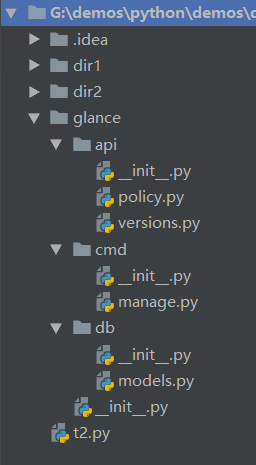
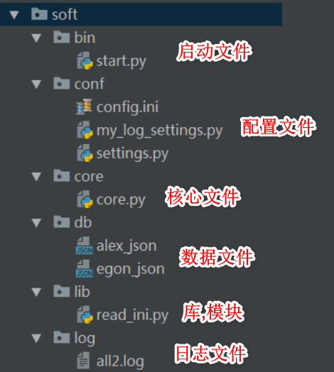

# python基础 模块导入,包,异常

## 模块导入

### from ... import *

```python
# 自定义模块 my_module
num1 = 1


def func1():
    print('func1')


def __func2__():
    print('func2')
```

```python
# from my_module import *
# 把my_module中所有的不是以下划线(_)开头的名字都导入到当前位置
# 大部分情况下我们的python程序不应该使用这种导入方式
# 因为*你不知道你导入什么名字，很有可能会覆盖掉你之前已经定义的名字
from dir2.my_module import *

print(num1)

func1()
```

### \_\_all\_\_

- 如果外部通过 **from ... import *** 方式进行导入, 可以限制导入的模块

```python
# 自定义模块 my_module

# 进行限制, 如果通过 from ... import * , 只允许使用 num1
__all__ = ['num1']

num1 = 1


def func1():
    print('func1')


def __func2__():
    print('func2')
```

```python
from dir2.my_module import *

print(num1)

# 报错
# func1()
```

## 模块搜索路径

- python解释器在启动时会自动加载一些模块，可以使用sys.modules查看

- 搜索步骤

  - 在第一次导入某个模块时（比如my_module），会先检查该模块是否已经被加载到内存中（当前执行文件的名称空间对应的内存），如果有则直接引用

  - 如果没有，解释器则会查找同名的内建模块，如果还没有找到就从sys.path给出的目录列表中依次寻找my_module.py文件

- **模块的查找顺序是：内存中已经加载的模块->内置模块->sys.path路径中包含的模块**

- 自定义的模块名不应该与系统内置模块重名

- 在初始化后，python程序可以修改sys.path,路径放到前面的优先于标准库被加载

- 搜索时按照sys.path中从左到右的顺序查找，位于前的优先被查找，sys.path中还可能包含.zip归档文件和.egg文件，python会把.zip归档文件当成一个目录去处理


## 包

- 包是一种通过使用‘.模块名’来组织python模块名称空间的方式

### 注意点

- 无论是import形式还是from...import形式，凡是在导入语句中（而不是在使用时）遇到带点的，都要第一时间提高警觉：这是关于包才有的导入语法
- 包是目录级的（文件夹级），文件夹是用来组成py文件（包的本质就是一个包含**\_\_init\_\_.py** 文件的目录)
- import导入文件时，产生名称空间中的名字来源于文件，import 包，产生的名称空间的名字同样来源于文件，即包下的 **\_\_init\_\_.py** ，导入包本质就是在导入该文件
  - 在python3中，即使包下没有 **\_\_init\_\_.py** 文件，import 包仍然不会报错，而在python2中，包下一定要有该文件，否则import 包报错
  - 创建包的目的不是为了运行，而是被导入使用，记住，包只是模块的一种形式而已，包即模块

### 包的导入

案例目录结构



### \_\_init\_\_.py

- 与模块导入的不同, 如果导入的是一个包, 那么会执行包下的 **\_\_init\_\_.py** 文件

  ```python
  # import glance
  # 执行 glance 包下的 __init__.py 文件
  
  # from glance import *
  # 执行 glance 包下的 __init__.py 文件
  ```

### 引用包中的模块

- 调用 policy.py 文件的方法

  - 正确方式

    ```python
    import glance.api.policy
    
    glance.api.policy.get()
    
    # glance __init__.py 执行
    # api __init__.py 执行
    # policy.py get方法调用
    ```

    ```python
    from glance.api import policy
    
    policy.get()
    
    # glance __init__.py 执行
    # api __init__.py 执行
    # policy.py get方法调用
    ```

  - 错误方式

    ```python
    import glance
    
    # 程序报错
    glance.api.policy.get()
    
    # glance __init__.py 执行
    
    # Traceback (most recent call last):
    #   File "G:/demos/python/demos/demo1/t2.py", line 3, in <module>
    #     glance.api.policy.get()
    
    # 找不到 api 属性
    # AttributeError: module 'glance' has no attribute 'api'
    ```

    ```python
    from glance import api
    
    api.policy.get()
    
    # glance __init__.py 执行
    # api __init__.py 执行
    
    # Traceback (most recent call last):
    #   File "G:/demos/python/demos/demo1/t2.py", line 3, in <module>
    #     api.policy.get()
    
    # glance.api 找不到 policy 属性
    # AttributeError: module 'glance.api' has no attribute 'policy'
    ```

### 绝对路径导入模块

- 上述问题的第一种解决方法, 使用绝对路径进行导入

  ```python
  # glance 包 __init__.py 文件
  print('glance __init__.py 执行')
  
  from glance import api
  ```

  ```python
  # api 包 __init__.py 文件
  print('api __init__.py 执行')
  
  from glance.api import policy
  ```

  ```python
  # t2.py 文件
  import glance
  
  glance.api.policy.get()
  
  # glance __init__.py 执行
  # api __init__.py 执行
  # policy.py get方法调用
  ```

- 优点

  - 包的内部可以使用包内的其他模块

- 缺点

  - 如果需要移动包的目录结构, 需要修改整个 \_\_init\_\_.py 文件

### 相对路径导入模块

```python
# glance 包 __init__.py 文件
from . import api

print('glance __init__.py 执行')
```

```python
# api 包 __init__.py 文件
print('api __init__.py 执行')

from . import policy
```

```python
# t2.py 文件
import glance

glance.api.policy.get()
```

- 优点
  - 可以更换目录结构
- 缺点
  - 包内部的模块无法调用其他包内的模块

### \_\_all\_\_

- 与上述的 \_\_all\_\_ 类似, 当使用 from ... import * 方式导入时, 可以指定导入的模块

```python
# glance 包 __init__.py 文件

__all__ = ['cmd', 'db']

from . import api
from . import cmd
from . import db

print('glance __init__.py 执行')
```

```python
from glance import *

# 正常
cmd.manage.main()

# 程序报错
# api.policy.get()

# Traceback (most recent call last):
#   File "G:/demos/python/demos/demo1/t2.py", line 8, in <module>
# from manage.py
#     api.policy.get()
# NameError: name 'api' is not defined
```

## 软件开发规范



## 异常

### 异常和错误

- 程序中难免出现错误，而错误分成两种
  1. 语法错误（这种错误，根本过不了python解释器的语法检测，必须在程序执行前就改正）
  2. 逻辑错误（逻辑错误）

### 定义

- 异常就是程序运行时发生错误的信号，在python中,错误触发的异常如下

  

### 异常种类

- 常见异常

  ```
  AttributeError 试图访问一个对象没有的树形，比如foo.x，但是foo没有属性x
  IOError 输入/输出异常；基本上是无法打开文件
  ImportError 无法引入模块或包；基本上是路径问题或名称错误
  IndentationError 语法错误（的子类） ；代码没有正确对齐
  IndexError 下标索引超出序列边界，比如当x只有三个元素，却试图访问x[5]
  KeyError 试图访问字典里不存在的键
  KeyboardInterrupt Ctrl+C被按下
  NameError 使用一个还未被赋予对象的变量
  SyntaxError Python代码非法，代码不能编译(个人认为这是语法错误，写错了）
  TypeError 传入对象类型与要求的不符合
  UnboundLocalError 试图访问一个还未被设置的局部变量，基本上是由于另有一个同名的全局变量，导致你以为正在访问它
  ValueError 传入一个调用者不期望的值，即使值的类型是正确的
  ```

- 更多异常

  ```
  ArithmeticError
  AssertionError
  AttributeError
  BaseException
  BufferError
  BytesWarning
  DeprecationWarning
  EnvironmentError
  EOFError
  Exception
  FloatingPointError
  FutureWarning
  GeneratorExit
  ImportError
  ImportWarning
  IndentationError
  IndexError
  IOError
  KeyboardInterrupt
  KeyError
  LookupError
  MemoryError
  NameError
  NotImplementedError
  OSError
  OverflowError
  PendingDeprecationWarning
  ReferenceError
  RuntimeError
  RuntimeWarning
  StandardError
  StopIteration
  SyntaxError
  SyntaxWarning
  SystemError
  SystemExit
  TabError
  TypeError
  UnboundLocalError
  UnicodeDecodeError
  UnicodeEncodeError
  UnicodeError
  UnicodeTranslateError
  UnicodeWarning
  UserWarning
  ValueError
  Warning
  ZeroDivisionError
  ```

### 异常处理

 **首先须知，异常是由程序的错误引起的，语法上的错误跟异常处理无关，必须在程序运行前就修正**

  #### if 条件判断

  ```python
  import re
  
  input_str = input('请输入年龄')
  
  age_li = re.findall(r'^\d+$', input_str)
  
  if not age_li:
      print('输入的不是一个数字')
  else:
      age = int(input_str)
      if age < 0 or age > 150:
          print('数字超出范围')
      else:
          print(f'年龄为 {age}')
  ```

  #### try except

  ```
  try:
       被检测的代码块
  except 异常类型：
       try中一旦检测到异常，就执行这个位置的逻辑
  ```

  ```python
  input_str = input('请输入年龄')
  
  try:
      age = int(input_str)
      if age > 150:
          raise Exception('数字超出范围')
      print(f'年龄为 {age}')
  except Exception as ex:
      print(ex)
  ```

  #### except 多分支使用方式

  ```python
  try:
      pass
  except ValueError as error:
      print(error)
  except IndexError as error:
      print(error)
  except Exception as ex:
      print(ex)
  ```

  #### 万能异常

  ```python
  try:
      pass
  except Exception as ex:
      print(ex)
  ```

  #### try except else

  ```python
  try:
      pass
  except Exception as ex:
      print(f'程序发生异常执行 {ex}')
  else:
      print('没有异常时执行')
  ```

  #### try except finally

  ```python
  try:
      pass
  except Exception as ex:
      print(f'程序发生异常执行 {ex}')
  else:
      print('没有异常时执行')
  finally:
      print('不管是否发生异常,最后都会执行')
  ```

### 抛出异常

```python
try:
    # 抛出异常
    raise Exception('异常的说明')
except Exception as ex:
    print(f'程序发生异常执行 {ex}')
else:
    print('没有异常时执行')
finally:
    print('不管是否发生异常,最后都会执行')
```

### 自定义异常

```python
# 所有的异常必须继承自 BaseException
class MyException(BaseException):
    def __init__(self, msg):
        self.msg = msg

    def __str__(self):
        return self.msg


try:
    raise MyException('无法找到文件')
except MyException as ex:
    print(ex)
```

