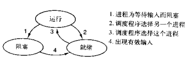
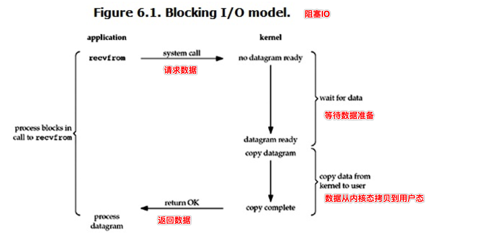
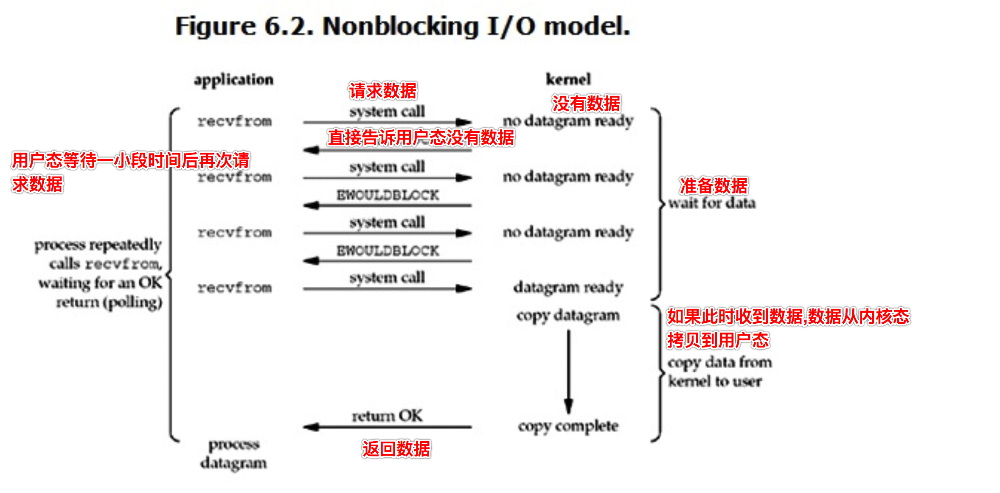
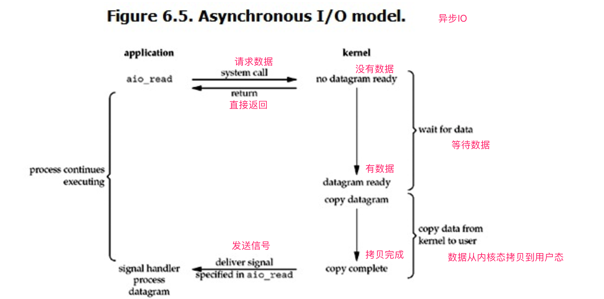

# python笔记 协程,Greenlet模块,Gevent模块,五种IO模型

## 协程前篇

- 操作系统中**进程是资源分配的最小单位,线程是CPU调度的最小单位。**按道理来说我们已经算是把cpu的利用率提高很多了。但是我们知道无论是创建多进程还是创建多线程来解决问题，都要消耗一定的时间来创建进程、创建线程、以及管理他们之间的切换
- 随着我们对于效率的追求不断提高，**基于单线程来实现并发**又成为一个新的课题，即只用一个主线程（很明显可利用的cpu只有一个）情况下实现并发。这样就可以节省创建线进程所消耗的时间。
- **并发的本质：切换+保存状态**
- cpu正在运行一个任务，会在两种情况下切走去执行其他的任务（切换由操作系统强制控制），一种情况是该任务发生了阻塞，另外一种情况是该任务计算的时间过长



- 在介绍进程理论时，提及进程的三种执行状态，而线程才是执行单位，所以也可以将上图理解为线程的三种状态 

  - 其中第二种情况并不能提升效率，只是为了让cpu能够雨露均沾，实现看起来所有任务都被“同时”执行的效果，如果多个任务都是纯计算的，这种切换反而会降低效率

  - 为此我们可以基于yield来验证。yield本身就是一种在单线程下可以保存任务运行状态的方法

    1. yiled可以保存状态，yield的状态保存与操作系统的保存线程状态很像，但是yield是代码级别控制的，更轻量级
    2. send可以把一个函数的结果传给另外一个函数，以此实现单线程内程序之间的切换

  - 通过 yield 模拟方法之间的切换

    ```python
    def func1():
        print(1)
        yield
        print(3)
        yield
    
    
    def func2():
        gen = func1()
        next(gen)
        print(2)
        next(gen)
        print(4)
    
    
    if __name__ == '__main__':
        func2()
    
    # 1
    # 2
    # 3
    # 4
    ```

  - 通过yield模拟生产者消费者模型

    ```python
    import time
    
    
    def time_wrappter(func):
        def wrapper(*args, **kwargs):
            start_time = time.time()
            res = func(*args, **kwargs)
            end_time = time.time()
            print(f'时间消耗 {end_time - start_time}')
            return res
    
        return wrapper
    
    
    def consumer(data_list):
        for item in data_list:
            print(f'消费 {item}')
    
    
    @time_wrappter
    def producer():
        data_list = []
        for item in range(5):
            data_list.append(item)
    
        consumer(data_list)
    
    
    if __name__ == '__main__':
        producer()
    
    # 消费 0
    # 消费 1
    # 消费 2
    # 消费 3
    # 消费 4
    # 时间消耗 3.695487976074219e-05
    ```

    ```python
    import time
    
    
    def time_wrappter(func):
        def wrapper(*args, **kwargs):
            start_time = time.time()
            res = func(*args, **kwargs)
            end_time = time.time()
            print(f'时间消耗 {end_time - start_time}')
            return res
    
        return wrapper
    
    
    def consumer():
        while 1:
            res = yield
            print(f'消费 {res}')
    
    
    @time_wrappter
    def producer():
        gen = consumer()
        next(gen)
    
        for item in range(5):
            print(f'生产 {item}')
            gen.send(item)
    
    
    if __name__ == '__main__':
        producer()
    
    # 生产 0
    # 消费 0
    # 生产 1
    # 消费 1
    # 生产 2
    # 消费 2
    # 生产 3
    # 消费 3
    # 生产 4
    # 消费 4
    # 时间消耗 5.412101745605469e-05
    ```

    从上面的例子来看, 如果只是单纯的切换反而会影响效率

  - 在任务一遇到io情况下，切到任务二去执行，这样就可以利用任务一阻塞的时间完成任务二的计算，效率的提升就在于此. **对于yield来说,遇到io操作,程序会阻塞,并不会切换到该线程的其他任务去执行**

    ```python
    import time
    
    
    def time_wrappter(func):
        def wrapper(*args, **kwargs):
            start_time = time.time()
            res = func(*args, **kwargs)
            end_time = time.time()
            print(f'时间消耗 {end_time - start_time}')
            return res
    
        return wrapper
    
    
    def get_current_time():
        return time.strftime('%X')
    
    
    def consumer():
        while 1:
            res = yield
            time.sleep(2)
    
    
    @time_wrappter
    def producer():
        gen = consumer()
        next(gen)
    
        for item in range(5):
            print(f'生产者在 {get_current_time()} 生产 {item}')
            gen.send(item)
    
    
    if __name__ == '__main__':
        producer()
    
    # 生产者在 10:31:08 生产 0
    # 生产者在 10:31:10 生产 1
    # 生产者在 10:31:12 生产 2
    # 生产者在 10:31:14 生产 3
    # 生产者在 10:31:16 生产 4
    # 时间消耗 10.015597105026245
    ```

- **对于单线程下，我们不可避免程序中出现io操作，但如果我们能在自己的程序中（即用户程序级别，而非操作系统级别）控制单线程下的多个任务能在一个任务遇到io阻塞时就切换到另外一个任务去计算，这样就保证了该线程能够最大限度地处于就绪态，即随时都可以被cpu执行的状态，相当于我们在用户程序级别将自己的io操作最大限度地隐藏起来，从而可以迷惑操作系统，让其看到：该线程好像是一直在计算，io比较少，从而更多的将cpu的执行权限分配给我们的线程**
- 协程的本质就是在单线程下，由用户自己控制一个任务遇到io阻塞了就切换另外一个任务去执行，以此来提升效率。为了实现它，我们需要找寻一种可以同时满足以下条件的解决方案
  1. 可以控制多个任务之间的切换，切换之前将任务的状态保存下来，以便重新运行时，可以基于暂停的位置继续执行
  2. 作为1的补充：可以检测io操作，在遇到io操作的情况下才发生切换

## 协程

### 定义

- 是单线程下的并发，又称微线程，纤程。英文名Coroutine
- **协程是一种用户态的轻量级线程，即协程是由用户程序自己控制调度的**
- python的线程属于内核级别的，即由操作系统控制调度（如单线程遇到io或执行时间过长就会被迫交出cpu执行权限，切换其他线程运行）
- 单线程内开启协程，一旦遇到io，就会从应用程序级别（而非操作系统）控制切换，以此来提升效率（非io操作的切换与效率无关）

- 对比操作系统控制线程的切换，用户在单线程内控制协程的切换
  - 优点
    1. 协程的切换开销更小，属于程序级别的切换，操作系统完全感知不到，因而更加轻量级
    2. 单线程内就可以实现并发的效果，最大限度地利用cpu
  - 缺点
    1. 协程的本质是单线程下，无法利用多核，可以是一个程序开启多个进程，每个进程内开启多个线程，每个线程内开启协程
    2. 协程指的是单个线程，因而一旦协程出现阻塞，将会阻塞整个线程

### 特点

1. **必须在只有一个单线程里实现并发**
2. **修改共享数据不需要加锁**
3. **用户程序里自己保持多个控制流的上下文栈**
4. **一个协程遇到IO操作会自动切换到其他协程**

## Greenlet模块

- 模块安装 pip3 install greenlet

- 实现任务的切换

  ```python
  import greenlet
  
  
  def func1():
      print(1)
      g2.switch()
      print(3)
      g2.switch()
  
  
  def func2():
      print(2)
      g1.switch()
      print(4)
  
  
  if __name__ == '__main__':
      g1 = greenlet.greenlet(run=func1)
      g2 = greenlet.greenlet(run=func2)
  
      g1.switch()
  
  # 1
  # 2
  # 3
  # 4
  ```

- **单纯的切换(在没有io的情况下或者没有重复开辟内存空间的操作), 反而会降低程序的执行速度**

- greenlet只是提供了一种比generator更加便捷的切换方式，当切到一个任务执行时如果遇到io，那就原地阻塞，仍然是没有解决遇到IO自动切换来提升效率的问题

- 单线程里的这20个任务的代码通常会既有计算操作又有阻塞操作，我们完全可以在执行任务1时遇到阻塞，就利用阻塞的时间去执行任务2。。。。如此，才能提高效率，这就用到了Gevent模块

## Gevent模块

- 模块安装 pip3 install gevent
- Gevent 是一个第三方库，可以轻松通过gevent实现并发同步或异步编程，在gevent中用到的主要模式是**Greenlet** (底层使用了 greenlet), 它是以C扩展模块形式接入Python的轻量级协程。 Greenlet全部运行在主程序操作系统进程的内部，但它们被协作式地调度

### 用法

```
# 创建一个协程对象g1，spawn括号内第一个参数是函数名，如eat，后面可以有多个参数，可以是位置实参或关键字实参，都是传给函数eat的
g1 = gevent.spawn(func, 1, 2, 3, x=4, y=5)

g2 = gevent.spawn(func2)

g1.join()  # 等待g1结束
g2.join()  # 等待g2结束
# 或者上述两步合作一步：gevent.joinall([g1,g2])

g1.value  # 拿到func1的返回值
```

- 案例: 对IO操作进行自动切换

  ```python
  import gevent
  from gevent import monkey
  
  # 必须写在导包的前面
  # 作用:
  # 对于io阻塞, gevent只识别内部方法的io操作 (如 gevent.sleep)
  # 如果要对一些内部模块的io操作进行识别, 就需要添加这行代码 (如 time.sleep() , conn.recv() , socket.accept() , requests.get(url)等)
  monkey.patch_all()
  
  import time
  
  
  def func1(a, b):
      print(f'接收参数 a = {a} , b = {b}')
      time.sleep(2)
  
  
  def func2():
      time.sleep(3)
  
  
  if __name__ == '__main__':
      start_time = time.time()
      g1 = gevent.spawn(func1, 1, 2)
      g2 = gevent.spawn(func2)
  
      print(type(g1))
      # <class 'gevent._greenlet.Greenlet'>
  
      # 可以使用 joinall 替代下面的两步
      # g1.join()
      # g2.join()
  
      gevent.joinall((g1, g2))
  
      print(f'消耗时间 {time.time() - start_time}')
  
  # <class 'gevent._greenlet.Greenlet'>
  # 接收参数 a = 1 , b = 2
  # 消耗时间 3.0027689933776855
  ```

  如果不设置 monkey.patch_all() , gevent 可能不会识别

  ```python
  import gevent
  from gevent import monkey
  
  # 必须写在导包的前面
  # 作用:
  # 对于io阻塞, gevent只识别内部方法的io操作 (如 gevent.sleep)
  # 如果要对一些内部模块的io操作进行识别, 就需要添加这行代码 (如 time.sleep() , conn.recv() , socket.accept() , requests.get(url)等)
  # monkey.patch_all()
  
  import time
  
  
  def func1(a, b):
      print(f'接收参数 a = {a} , b = {b}')
      time.sleep(2)
  
  
  def func2():
      time.sleep(3)
  
  
  if __name__ == '__main__':
      start_time = time.time()
      g1 = gevent.spawn(func1, 1, 2)
      g2 = gevent.spawn(func2)
  
      print(type(g1))
      # <class 'gevent._greenlet.Greenlet'>
  
      # 可以使用 joinall 替代下面的两步
      # g1.join()
      # g2.join()
  
      gevent.joinall((g1, g2))
  
      print(f'消耗时间 {time.time() - start_time}')
  
  # <class 'gevent._greenlet.Greenlet'>
  # 接收参数 a = 1 , b = 2
  # 消耗时间 5.00868034362793
  ```

### dummy thread 虚拟的线程

```python
from gevent import monkey

monkey.patch_all()

import gevent
import time
from threading import current_thread


def func1():
    print(f'func1 当前线程 {current_thread().name}')
    time.sleep(2)


def func2():
    print(f'func2 当前线程 {current_thread().name}')
    time.sleep(3)


if __name__ == '__main__':
    print(f'主线程 {current_thread().name}')
    start_time = time.time()
    g1 = gevent.spawn(func1)
    g2 = gevent.spawn(func2)

    gevent.joinall((g1, g2))

# 主线程 MainThread
# func1 当前线程 DummyThread-1
# func2 当前线程 DummyThread-2
```

### 案例:爬取网页信息

```python
from gevent import monkey

monkey.patch_all()
import requests
from gevent import spawn
from gevent import joinall
import time


def get_response(url):
    time.sleep(1)
    response = requests.get(url)
    return {
        'url': response.url,
        'status_code': response.status_code,
        'content_length': len(response.content)
    }


if __name__ == '__main__':
    url_list = [
        'http://www.baidu.com',
        'http://www.qq.com',
        'http://www.taobao.com',
        'http://www.jd.com',
        'http://www.python.org'
    ]

    greenlet_list = []

    start_time = time.time()

    for item in url_list:
        let = spawn(get_response, item)
        greenlet_list.append(let)

    joinall(greenlet_list)

    for item in greenlet_list:
        print(item.value)

    end_time = time.time()
    print(f'消耗时间 : {end_time - start_time}')

# {'url': 'http://www.baidu.com/', 'status_code': 200, 'content_length': 2381}
# {'url': 'http://www.qq.com/', 'status_code': 200, 'content_length': 245600}
# {'url': 'http://www.taobao.com/market/global/index_new.php', 'status_code': 200, 'content_length': 167440}
# {'url': 'https://www.jd.com/', 'status_code': 200, 'content_length': 113043}
# {'url': 'https://www.python.org/', 'status_code': 200, 'content_length': 49385}
# 消耗时间 : 2.759645938873291
```

### 案例:通过协程实现socket通信

- 服务端

  ```python
  from gevent import monkey
  
  monkey.patch_all()
  
  import socket
  
  from config import common
  from gevent import spawn
  
  
  def handle_conn(conn, addr):
      print(f'客户端 {addr} 已经连接')
  
      try:
          while 1:
              recv_data = conn.recv(common.BUF)
              if not recv_data:
                  break
  
              data = recv_data.decode(common.ENCODING)
              print(f'服务端接收数据 {data}')
  
              conn.send(bytes(data.upper(), common.ENCODING))
      finally:
          if conn:
              conn.close()
  
  
  if __name__ == '__main__':
      sk = socket.socket()
      sk.setsockopt(socket.SOL_SOCKET, socket.SO_REUSEADDR, 1)
      sk.bind(common.IP_PORT)
      sk.listen()
      print(f'服务器已启动')
  
      try:
          while 1:
              conn, addr = sk.accept()
              spawn(handle_conn, conn, addr)
      finally:
          sk.close()
  ```

- 客户端

  ```python
  from gevent import monkey
  
  monkey.patch_all()
  
  import socket
  
  from config import common
  
  if __name__ == '__main__':
      sk = socket.socket()
      sk.connect(common.IP_PORT)
  
      while 1:
          data = input(">>> ").strip()
  
          if not data or data == 'q':
              break
  
          sk.send(bytes(data, common.ENCODING))
  
          data_recv = sk.recv(common.BUF)
          if not data_recv:
              break
  
          recv_data = data_recv.decode(common.ENCODING)
          print(f'客户端接收数据 {recv_data}')
  
      sk.close()
  ```

## IO模型

### 五种IO模型

- blocking IO --- 阻塞IO
- nonblocking IO --- 非阻塞IO
- IO multiplexing --- IO多路复用
- signal driven IO --- 信号驱动IO (使用的比较少)
- asynchronous IO --- 异步IO

IO发生时涉及的对象和步骤。对于一个network IO (这里我们以read举例)，它会涉及到两个系统对象，一个是调用这个IO的process (or thread)，另一个就是系统内核(kernel)。当一个read操作发生时，该操作会经历两个阶段

1. 等待数据准备
2. 将数据从内核拷贝到进程中

### 阻塞IO (blocking IO)



#### 示例代码 socket通信

- 服务端

  ```python
  import socket
  from config import common
  import random
  import time
  
  if __name__ == '__main__':
      sk = socket.socket()
      sk.setsockopt(socket.SOL_SOCKET, socket.SO_REUSEADDR, 1)
      sk.bind(common.IP_PORT)
      sk.listen()
  
      conn, addr = sk.accept()
  
      time.sleep(2)
  
      data = str(random.randint(1, 100))
      print(f'服务端发送数据 {data}')
      conn.send(bytes(data, common.ENCODING))
  
      conn.close()
      sk.close()
  ```

- 客户端

  ```python
  import socket
  import time
  
  from config import common
  
  
  def get_current_time():
      return time.strftime('%X')
  
  
  if __name__ == '__main__':
      sk = socket.socket()
      sk.connect(common.IP_PORT)
  
      print(f'等待接收数据, 时间 {get_current_time()}')
  
      data = sk.recv(common.BUF).decode(common.ENCODING)
  
      print(f'客户端接收到数据 {data} , 时间 {get_current_time()}')
  
      sk.close()
  
  # 等待接收数据, 时间 15:29:29
  # 客户端接收到数据 3 , 时间 15:29:31
  ```

- 当用户进程调用了recvfrom这个系统调用，kernel就开始了IO的第一个阶段：准备数据。对于network io来说，很多时候数据在一开始还没有到达（比如，还没有收到一个完整的UDP包），这个时候kernel就要等待足够的数据到来

- 而在用户进程这边，整个进程会被阻塞。当kernel一直等到数据准备好了，它就会将数据从kernel中拷贝到用户内存，然后kernel返回结果，用户进程才解除block的状态，重新运行起来

- **blocking IO的特点就是在IO执行的两个阶段（等待数据和拷贝数据两个阶段）都被block了**

- 网络编程都是从listen()、send()、recv() 等接口开始的，使用这些接口可以很方便的构建服务器/客户机的模型。然而大部分的socket接口都是阻塞型的

  所谓阻塞型接口是指系统调用（一般是IO接口）不返回调用结果并让当前线程一直阻塞，只有当该系统调用获得结果或者超时出错时才返回

- 实际上，除非特别指定，几乎所有的IO接口 ( 包括socket接口 ) 都是阻塞型的。这给网络编程带来了一个很大的问题，如在调用recv(1024)的同时，线程将被阻塞，在此期间，线程将无法执行任何运算或响应任何的网络请求

#### 阻塞IO的解决方案

- 在服务器端使用多线程（或多进程）。多线程（或多进程）的目的是让每个连接都拥有独立的线程（或进程），这样任何一个连接的阻塞都不会影响其他的连接

#### 该解决方案问题

- 开启多进程或都线程的方式，在遇到要同时响应成百上千路的连接请求，则无论多线程还是多进程都会严重占据系统资源，降低系统对外界响应效率，而且线程与进程本身也更容易进入假死状态

#### 改进方案

- 很多程序员可能会考虑使用“线程池”或“连接池”。“线程池”旨在减少创建和销毁线程的频率，其维持一定合理数量的线程，并让空闲的线程重新承担新的执行任务。“连接池”维持连接的缓存池，尽量重用已有的连接、减少创建和关闭连接的频率。这两种技术都可以很好的降低系统开销，都被广泛应用很多大型系统，如websphere、tomcat和各种数据库等

#### 改进方案存在的问题

- “线程池”和“连接池”技术也只是在一定程度上缓解了频繁调用IO接口带来的资源占用。而且，所谓“池”始终有其上限，当请求大大超过上限时，“池”构成的系统对外界的响应并不比没有池的时候效果好多少。所以使用“池”必须考虑其面临的响应规模，并根据响应规模调整“池”的大小

### 非阻塞IO (non-blocking IO)



#### 示例代码 socket通信

- 服务端

  ```python
  import socket
  from config import common
  
  if __name__ == '__main__':
      sk = socket.socket()
      sk.setsockopt(socket.SOL_SOCKET, socket.SO_REUSEADDR, 1)
      sk.bind(common.IP_PORT)
      sk.listen()
      # 设置为非阻塞IO
      sk.setblocking(False)
  
      # 已经连接成功的 conn 列表
      conn_l = []
      # 待删除的 conn 列表
      del_l = []
      while True:
          try:
              conn, addr = sk.accept()
              conn_l.append(conn)
          except BlockingIOError:
              for conn in conn_l:
                  try:
                      data = conn.recv(1024)
                      if not data:
                          del_l.append(conn)
                          continue
                      conn.send(data.upper())
                  except BlockingIOError:
                      pass
                  except ConnectionResetError:
                      del_l.append(conn)
  
              for conn in del_l:
                  conn_l.remove(conn)
                  conn.close()
              del_l = []
  ```

- 客户端

  ```python
  import socket
  import time
  
  from config import common
  
  
  def get_current_time():
      return time.strftime('%X')
  
  
  if __name__ == '__main__':
      sk = socket.socket()
      sk.connect(common.IP_PORT)
  
      sk.send(b'hello')
  
      print(f'等待接收数据, 时间 {get_current_time()}')
  
      data = sk.recv(common.BUF).decode(common.ENCODING)
  
      print(f'客户端接收到数据 {data} , 时间 {get_current_time()}')
  
      sk.close()
  
  # 等待接收数据, 时间 17:13:37
  # 客户端接收到数据 HELLO , 时间 17:13:37
  ```

#### 非阻塞IO的优缺点

- 优点

  能够在等待任务完成的时间里干其他活了, 包括提交其他任务，也就是 “后台” 可以有多个任务在“”同时“”执行

- 缺点

  1. 循环调用recv()将大幅度推高CPU占用率；这也是我们在代码中留一句time.sleep(2)的原因,否则在低配主机下极容易出现卡机情况

  2. 任务完成的响应延迟增大了，因为每过一段时间才去轮询一次read操作，而任务可能在两次轮询之间的任意时间完成。这会导致整体数据吞吐量的降低

此外，在这个方案中recv()更多的是起到检测“操作是否完成”的作用，实际操作系统提供了更为高效的检测“操作是否完成“作用的接口，例如select()多路复用模式，可以一次检测多个连接是否活跃

### 多路复用IO (IO multiplexing)

IO multiplexing这个词可能有点陌生，但是如果我说select/epoll，大概就都能明白了。有些地方也称这种IO方式为**事件驱动IO**(event driven IO)。我们都知道，select/epoll的好处就在于单个process就可以同时处理多个网络连接的IO。它的基本原理就是select/epoll这个function会不断的轮询所负责的所有socket，当某个socket有数据到达了，就通知用户进程


### 异步IO (Asynchronous I/O)

- Linux下的asynchronous IO其实用得不多，从内核2.6版本才开始引入




