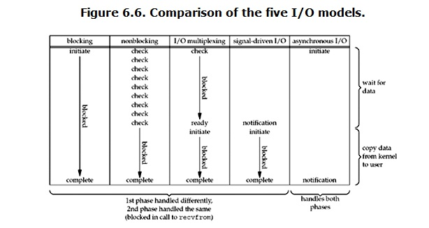

# python笔记 多路复用IO模型,select模块,IO模型的比较,selectors模块

## 网络IO模型

### 多路复用IO


- 当用户进程调用了select，那么整个进程会被block，而同时，kernel会“监视”所有select负责的socket，当任何一个socket中的数据准备好了，select就会返回。这个时候用户进程再调用read操作，将数据从kernel拷贝到用户进程
- 这个图和blocking IO的图其实并没有太大的不同，事实上还更差一些。因为这里需要使用两个系统调用(select和recvfrom)，而blocking IO只调用了一个系统调用(recvfrom)。但是，用select的优势在于它可以同时处理多个connection

#### 总结

- **如果处理的连接数不是很高的话，使用select/epoll的web server不一定比使用multi-threading + blocking IO的web server性能更好，可能延迟还更大。select/epoll的优势并不是对于单个连接能处理得更快，而是在于能处理更多的连接**
- **在多路复用模型中，对于每一个socket，一般都设置成为non-blocking，但是，如上图所示，整个用户的process其实是一直被block的。只不过process是被select这个函数block，而不是被socket IO给block**
- **结论: select的优势在于可以处理多个连接，不适用于单个连接** 

#### 使用select的网络IO多路复用模型

- 服务端

  ```python
  import socket
  from config import common
  import select
  
  sk = socket.socket()
  sk.setsockopt(socket.SOL_SOCKET, socket.SO_REUSEADDR, 1)
  sk.bind(common.IP_PORT)
  sk.listen()
  # 设置为非阻塞
  sk.setblocking(False)
  print(f'服务端已经开启')
  
  # 这里存储 sk 对象及所有连接成功的 conn 对象
  read_list = [sk, ]
  
  
  def handle_sk():
      # 此时的accept不是阻塞的,因为只有新的客户端连接过来才能回调这个 handle_sk 方法
      conn, addr = sk.accept()
      print(f'客户端 {addr} 连接成功')
      read_list.append(conn)
  
  
  def handle_conn(conn):
      try:
          recv_data = conn.recv(common.BUF).decode(common.ENCODING)
          if not recv_data:
              conn.close()
              read_list.remove(conn)
              return
  
          print(f'服务端接收数据 {recv_data}')
          conn.send(bytes(recv_data.upper(), common.ENCODING))
  
      except ConnectionResetError:
          conn.close()
          read_list.remove(conn)
  
  
  if __name__ == '__main__':
      while 1:
          # 使用select模块进行监听
          r_list, w_list, x_list = select.select(read_list, [], [])
  
          for item in r_list:
              if item == sk:
                  # 有新的客户端进行连接
                  handle_sk()
              else:
                  # conn收到了数据
                  handle_conn(item)
  ```

- 客户端

  ```python
  import socket
  from config import common
  
  if __name__ == '__main__':
      sk = socket.socket()
      sk.connect(common.IP_PORT)
  
      while 1:
          data = input(">>> ").strip()
          if not data:
              break
  
          sk.send(bytes(data, common.ENCODING))
  
          data_recv = sk.recv(common.BUF).decode(common.ENCODING)
          print(f'客户端接收数据 {data_recv}')
  
      sk.close()
  ```

#### select 监听fd变化过程分析

- 用户进程创建socket对象，拷贝监听的fd到内核空间，每一个fd会对应一张系统文件表，内核空间的fd响应到数据后，就会发送信号给用户进程数据已到；
- 用户进程再发送系统调用，比如（accept）将内核空间的数据copy到用户空间，同时作为接受数据端内核空间的数据清除，这样重新监听时fd再有新的数据又可以响应到了（发送端因为基于TCP协议所以需要收到应答后才会清除）。

- 优点

  相比其他模型，使用select() 的事件驱动模型只用单线程（进程）执行，占用资源少，不消耗太多 CPU，同时能够为多客户端提供服务。如果试图建立一个简单的事件驱动的服务器程序，这个模型有一定的参考价值

- 缺点

  1. 首先select()接口并不是实现“事件驱动”的最好选择。因为当需要探测的句柄值较大时，select()接口本身需要消耗大量时间去轮询各个句柄
  2. 很多操作系统提供了更为高效的接口，如linux提供了epoll，BSD提供了kqueue，Solaris提供了/dev/poll
  3. 如果需要实现更高效的服务器程序，类似epoll这样的接口更被推荐。遗憾的是不同的操作系统特供的epoll接口有很大差异. 所以使用类似于epoll的接口实现具有较好跨平台能力的服务器会比较困难
  4. 其次，该模型将事件探测和事件响应夹杂在一起，一旦事件响应的执行体庞大，则对整个模型是灾难性的

## 五种IO模型的比较



## selectors模块

IO复用：为了解释这个名词，首先来理解下复用这个概念，复用也就是共用的意思，这样理解还是有些抽象，为此，咱们来理解下复用在通信领域的使用，在通信领域中为了充分利用网络连接的物理介质，往往在同一条网络链路上采用时分复用或频分复用的技术使其在同一链路上传输多路信号，到这里我们就基本上理解了复用的含义，即公用某个“介质”来尽可能多的做同一类(性质)的事

IO复用的“介质”是什么呢？为此我们首先来看看服务器编程的模型，客户端发来的请求服务端会产生一个进程来对其进行服务，每当来一个客户请求就产生一个进程来服务，然而进程不可能无限制的产生，因此为了解决大量客户端访问的问题，引入了IO复用技术，即：一个进程可以同时对多个客户请求进行服务。也就是说IO复用的“介质”是进程(准确的说复用的是select和poll，因为进程也是靠调用select和poll来实现的)，复用一个进程(select和poll)来对多个IO进行服务，虽然客户端发来的IO是并发的但是IO所需的读写数据多数情况下是没有准备好的，因此就可以利用一个函数(select和poll)来监听IO所需的这些数据的状态，一旦IO有数据可以进行读写了，进程就来对这样的IO进行服务

### IO复用中的三个API(select、poll和epoll)的区别和联系

select，poll，epoll都是IO多路复用的机制，I/O多路复用就是通过一种机制，可以监视多个描述符，一旦某个描述符就绪（一般是读就绪或者写就绪），能够通知应用程序进行相应的读写操作。但select，poll，epoll本质上都是同步I/O，因为他们都需要在读写事件就绪后自己负责进行读写，也就是说这个读写过程是阻塞的，而异步I/O则无需自己负责进行读写，异步I/O的实现会负责把数据从内核拷贝到用户空间

```
三者的原型如下所示：

int select(int nfds, fd_set *readfds, fd_set *writefds, fd_set *exceptfds, struct timeval *timeout);

int poll(struct pollfd *fds, nfds_t nfds, int timeout);

int epoll_wait(int epfd, struct epoll_event *events, int maxevents, int timeout);
```

#### select

select的第一个参数nfds为fdset集合中最大描述符值加1，fdset是一个位数组，其大小限制为__FD_SETSIZE（1024），位数组的每一位代表其对应的描述符是否需要被检查。第二三四参数表示需要关注读、写、错误事件的文件描述符位数组，这些参数既是输入参数也是输出参数，可能会被内核修改用于标示哪些描述符上发生了关注的事件，所以每次调用select前都需要重新初始化fdset。timeout参数为超时时间，该结构会被内核修改，其值为超时剩余的时间

- select的调用步骤
  1. 使用copy_from_user从用户空间拷贝fdset到内核空间
  2. 注册回调函数__pollwait
  3. 遍历所有fd，调用其对应的poll方法（对于socket，这个poll方法是sock_poll，sock_poll根据情况会调用到tcp_poll,udp_poll或者datagram_poll）
  4. 以tcp_poll为例，其核心实现就是__pollwait，也就是上面注册的回调函数
  5. __pollwait的主要工作就是把current（当前进程）挂到设备的等待队列中，不同的设备有不同的等待队列，对于tcp_poll 来说，其等待队列是sk->sk_sleep（注意把进程挂到等待队列中并不代表进程已经睡眠了）。在设备收到一条消息（网络设备）或填写完文件数 据（磁盘设备）后，会唤醒设备等待队列上睡眠的进程，这时current便被唤醒了
  6. poll方法返回时会返回一个描述读写操作是否就绪的mask掩码，根据这个mask掩码给fd_set赋值
  7. 如果遍历完所有的fd，还没有返回一个可读写的mask掩码，则会调用schedule_timeout是调用select的进程（也就是 current）进入睡眠。当设备驱动发生自身资源可读写后，会唤醒其等待队列上睡眠的进程。如果超过一定的超时时间（schedule_timeout 指定），还是没人唤醒，则调用select的进程会重新被唤醒获得CPU，进而重新遍历fd，判断有没有就绪的fd
  8. 把fd_set从内核空间拷贝到用户空间
- select的几大缺点
  1. 每次调用select，都需要把fd集合从用户态拷贝到内核态，这个开销在fd很多时会很大
  2. 同时每次调用select都需要在内核遍历传递进来的所有fd，这个开销在fd很多时也很大
  3. select支持的文件描述符数量太小了，默认是1024

#### poll

poll与select不同，通过一个pollfd数组向内核传递需要关注的事件，故没有描述符个数的限制，pollfd中的events字段和revents分别用于标示关注的事件和发生的事件，故pollfd数组只需要被初始化一次

poll的实现机制与select类似，其对应内核中的sys_poll，只不过poll向内核传递pollfd数组，然后对pollfd中的每个描述符进行poll，相比处理fdset来说，poll效率更高。poll返回后，需要对pollfd中的每个元素检查其revents值，来得指事件是否发生

#### epoll

直到Linux2.6才出现了由内核直接支持的实现方法，那就是epoll，被公认为Linux2.6下性能最好的多路I/O就绪通知方法。epoll可以同时支持水平触发和边缘触发（Edge Triggered，只告诉进程哪些文件描述符刚刚变为就绪状态，它只说一遍，如果我们没有采取行动，那么它将不会再次告知，这种方式称为边缘触发），理论上边缘触发的性能要更高一些，但是代码实现相当复杂。epoll同样只告知那些就绪的文件描述符，而且当我们调用epoll_wait()获得就绪文件描述符时，返回的不是实际的描述符，而是一个代表就绪描述符数量的值，你只需要去epoll指定的一个数组中依次取得相应数量的文件描述符即可，这里也使用了内存映射（mmap）技术，这样便彻底省掉了这些文件描述符在系统调用时复制的开销。另一个本质的改进在于epoll采用基于事件的就绪通知方式。在select/poll中，进程只有在调用一定的方法后，内核才对所有监视的文件描述符进行扫描，而epoll事先通过epoll_ctl()来注册一个文件描述符，一旦基于某个文件描述符就绪时，内核会采用类似callback的回调机制，迅速激活这个文件描述符，当进程调用epoll_wait()时便得到通知

epoll既然是对select和poll的改进，就应该能避免上述的三个缺点。那epoll都是怎么解决的呢？在此之前，我们先看一下epoll 和select和poll的调用接口上的不同，select和poll都只提供了一个函数——select或者poll函数。而epoll提供了三个函 数，epoll_create,epoll_ctl和epoll_wait，epoll_create是创建一个epoll句柄；epoll_ctl是注 册要监听的事件类型；epoll_wait则是等待事件的产生

对于第一个缺点，epoll的解决方案在epoll_ctl函数中。每次注册新的事件到epoll句柄中时（在epoll_ctl中指定 EPOLL_CTL_ADD），会把所有的fd拷贝进内核，而不是在epoll_wait的时候重复拷贝。epoll保证了每个fd在整个过程中只会拷贝 一次

对于第二个缺点，epoll的解决方案不像select或poll一样每次都把current轮流加入fd对应的设备等待队列中，而只在 epoll_ctl时把current挂一遍（这一遍必不可少）并为每个fd指定一个回调函数，当设备就绪，唤醒等待队列上的等待者时，就会调用这个回调 函数，而这个回调函数会把就绪的fd加入一个就绪链表）。epoll_wait的工作实际上就是在这个就绪链表中查看有没有就绪的fd（利用 schedule_timeout()实现睡一会，判断一会的效果，和select实现中的第7步是类似的）

对于第三个缺点，epoll没有这个限制，它所支持的FD上限是最大可以打开文件的数目，这个数字一般远大于2048,举个例子, 在1GB内存的机器上大约是10万左右，具体数目可以cat /proc/sys/fs/file-max察看,一般来说这个数目和系统内存关系很大

### 总结

- select，poll实现需要自己不断轮询所有fd集合，直到设备就绪，期间可能要睡眠和唤醒多次交替。而epoll其实也需要调用 epoll_wait不断轮询就绪链表，期间也可能多次睡眠和唤醒交替，但是它是设备就绪时，调用回调函数，把就绪fd放入就绪链表中，并唤醒在 epoll_wait中进入睡眠的进程。虽然都要睡眠和交替，但是select和poll在“醒着”的时候要遍历整个fd集合，而epoll在“醒着”的 时候只要判断一下就绪链表是否为空就行了，这节省了大量的CPU时间，这就是回调机制带来的性能提升
- select，poll每次调用都要把fd集合从用户态往内核态拷贝一次，并且要把current往设备等待队列中挂一次，而epoll只要 一次拷贝，而且把current往等待队列上挂也只挂一次（在epoll_wait的开始，注意这里的等待队列并不是设备等待队列，只是一个epoll内 部定义的等待队列），这也能节省不少的开销

**这三种IO多路复用模型在不同的平台有着不同的支持，而epoll在windows下就不支持，好在我们有selectors模块，帮我们默认选择当前平台下最合适的**

### 案例: socket通信

- 服务端

  ```python
  from socket import *
  import selectors
  
  # 获取当前平台下最适用的 selector
  sel = selectors.DefaultSelector()
  
  
  def accept(server_fileobj, mask):
      conn, addr = server_fileobj.accept()
      sel.register(conn, selectors.EVENT_READ, read)
  
  
  def read(conn, mask):
      try:
          data = conn.recv(1024)
          if not data:
              print('closing', conn)
              sel.unregister(conn)
              conn.close()
              return
          conn.send(data.upper() + b'_SB')
      except Exception:
          print('closing', conn)
          sel.unregister(conn)
          conn.close()
  
  
  sk = socket(AF_INET, SOCK_STREAM)
  sk.setsockopt(SOL_SOCKET, SO_REUSEADDR, 1)
  sk.bind(('127.0.0.1', 8088))
  sk.listen(5)
  # 设置socket的接口为非阻塞
  sk.setblocking(False)
  # 相当于网select的读列表里append了一个文件句柄server_fileobj,并且绑定了一个回调函数accept
  sel.register(sk, selectors.EVENT_READ, accept)
  
  while True:
      # 检测所有的sk，是否有完成wait data的
      events = sel.select()
      for sel_obj, mask in events:
          # 对于对象的回调函数调用回调方法
          callback = sel_obj.data  # callback = accpet
          callback(sel_obj.fileobj, mask)  # accpet(server_fileobj, 1)
  ```

- 客户端

  ```python
  from socket import *
  
  c = socket(AF_INET, SOCK_STREAM)
  c.connect(('127.0.0.1', 8088))
  
  while True:
      msg = input('>>: ')
      if not msg:
          continue
      c.send(msg.encode('utf-8'))
      data = c.recv(1024)
      print(data.decode('utf-8'))
  ```

