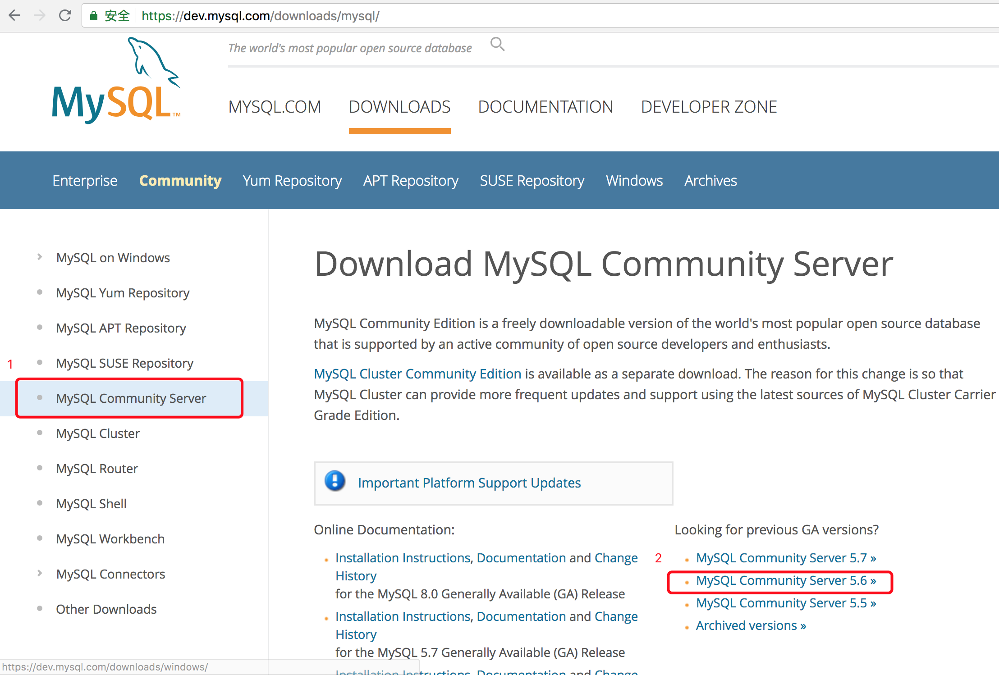
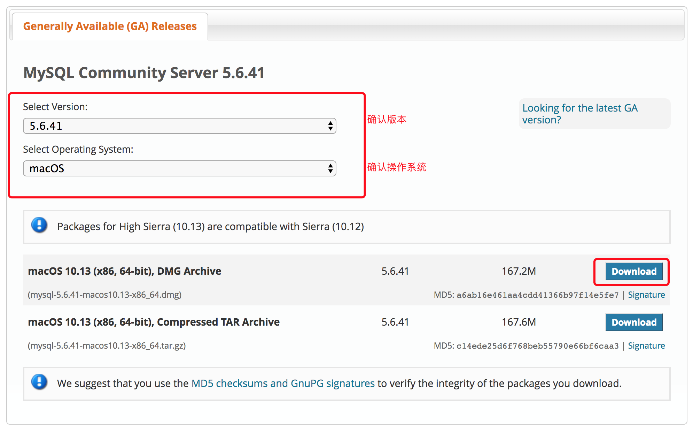
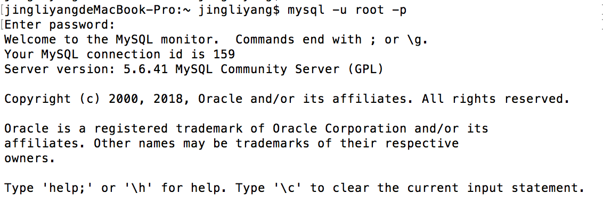
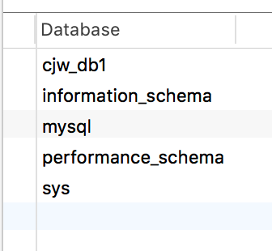
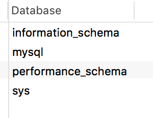
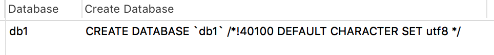
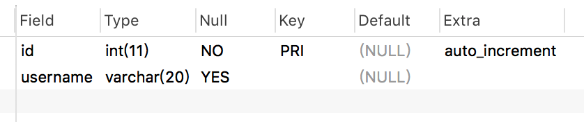

# mysql基础 软件安装,库,表,记录,数据SQL语句

## 概念

- 数据库

  **数据库**就是一个存放数据的仓库，这个仓库是按照一定的数据结构（数据结构是指数据的组织形式或数据之间的联系）来组织、存储的，我们可以通过数据库提供的多种方法来管理数据库里的数据

- 数据库表

  数据表是关系数据库中一个非常重要的对象，是其它对象的基础，也是一系列**二维数组的集合**，用来存储、操作数据的逻辑结构

  一个数据库中可能包含若干个数据表，每张表是由行和列组成，记录一条数据,数据表就增加一行，每一列是由字段名和字段数据集合组成，列被称之为**字段**

  每一列还有自己的多个**属性**，例如是否允许为空、默认值、长度、类型、存储编码、注释

- 数据

  存储在表中的信息就叫做**数据**

- 数据库系统有3个主要的组成部分

  1. 数据库（Database System）：用于存储数据的地方
  2. 数据库管理系统（Database Management System，DBMS）：用户管理数据库的软件
  3. 数据库应用程序（Database Application）：为了提高数据库系统的处理能力所使用的管理数据库的软件补充

- 数据库特点

  1. 实现数据共享

     数据共享包含所有用户可同时存取数据库中的数据，也包括用户可以用各种方式通过接口使用数据库，并提供数据共享

  2. 减少数据的冗余度

     同文件系统相比，由于数据库实现了数据共享，从而避免了用户各自建立应用文件。减少了大量重复数据，减少了数据冗余，维护了数据的一致性

  3. 数据一致性和可维护性，以确保数据的安全性和可靠性

     - 安全性控制：以防止数据丢失、错误更新和越权使用
     - 完整性控制：保证数据的正确性、有效性和相容性
     - 并发控制：使在同一时间周期内，允许对数据实现多路存取，又能防止用户之间的不正常交互作用

  4. 故障恢复

     由数据库管理系统提供一套方法，可及时发现故障和修复故障，从而防止数据被破坏。数据库系统能尽快恢复数据库系统运行时出现的故障，可能是物理上或是逻辑上的错误。比如对系统的误操作造成的数据错误等

- 数据库分类

  - 关系型数据库

    是把复杂的数据结构归结为简单的二元关系（即二维表格形式）

    主流的关系型数据库:MySQL、Oracle 、 Sql server、DB2

  - 非关系型数据库

    非关系型数据库也被成为NoSQL数据库，NOSQL的本意是“Not Only SQL”.而不是“No SQL”的意思，因此，NoSQL的产生并不是要彻底地否定非关系型数据库，而是作为传统关系型数据库的一个有效补充。NOSQL数据库在特定的场景下可以发挥出难以想象的高效率和高性能

    1. NOSQL不是否定关系数据库，而是作为关系数据库的一个重要补充 
    2. NOSQL为了高性能、高并发而生，但是要求对数据一致性要求不能高
    3. NOSQL典型产品memcached （纯内存,k-v），redis（持久化缓存,k-v），mongodb（文档的数据库,xml-json)

## mysql优点

- MySQL性能卓越、服务稳定，很少出现异常宕机
- MySQL开放源代码且无版权制约，自主性及使用成本低
- MySQL历史悠久，社区及用户活跃，遇到问题可以解决 
- MySQL软件体积小，安装使用简单，并且易于维护，安装及维护成本低 
- MySQL品牌口碑效应，使得企业无需考虑就直接用 
- MySQL支持多用操作系统，提供多种API接口，支持多用开发语言，特别对流行的语言有很好的支持

## mysql安装

1. https://dev.mysql.com/downloads/ , 点击MySQL Community Server进入下面的页面，再点击5.6版本的数据库

   

2. 下载

   

3. 安装,此处省略

4. 添加 mysql 的环境变量

   ```
   mysql 安装目录
   /usr/local/mysql/bin
   ```

5. 查看mysql服务是否能正常启动关闭

   ```
   停止MySQL服务
   sudo mysql.server stop
   
   重启MySQL服务
   sudo mysql.server restart
   
   查看MySQL服务状态
   sudo mysql.server status
   ```

6. 控制台检测root用户是否能够登录

   ```
   # 没有设置密码的情况下
   mysql -u root -p
   
   # 设置了密码的情况下
   mysql -u root -p 123456
   ```

7. 能够看到欢迎页面代表安装成功

   

8. root密码的更改(可以不用做这个操作)

   ```
   set password = password('123456');
   ```

## Navicat for mysql 安装

- 可视化 mysql 软件
- 破解软件见附件

## SQL 账号操作

- 查看当前用户

  select user();

- 退出

  exit

  也可以用\q quit退出

- 使用root账号进行登录

  默认用户登陆之后并没有实际操作的权限, 需要使用管理员root用户登录

  mysql -u root -p

- 给当前的数据库设置密码

  set password = password('root')

- 创建账号

  ```sql
  create user 'eva'@'192.168.10.%' IDENTIFIED BY PASSWORD '123'  -- 指示网段
  mysql> create user 'eva'@'192.168.10.5'  -- 指示某机器可以连接
  mysql> create user 'eva'@'%'  -- 指示所有机器都可以连接  
  ```

- 远程登录

  mysql -uroot -p123 -h 192.168.10.3

- 给账号授权

  ```sql
  grant all on *.* to 'eva'@'%'
  flush privileges  -- 刷新使授权立即生效
  ```

## SQL命令快速入门

### 数据库操作

- 创建数据库

  ```sql
  CREATE DATABASE cjw_db1
  CREATE DATABASE db1 CHARACTER utf8  -- 创建数据库并指定编码
  ```

- 查询所有的数据库

  ```sql
  SHOW DATABASES
  ```

  

- 删除指定的数据库

  ```sql
  DROP DATABASE cjw_db1
  ```

- 切换到指定的数据库

  ```sql
  use cjw_db1
  ```

### 表操作

- 创建表

  ```sql
  CREATE TABLE tb1 ( NAME VARCHAR ( 20 ), age INT );
  
  -- 自增 auto_increment
  -- 主键 primary key
  ```

- 查询表

  ```sql
  SHOW TABLES
  ```

- 删除表

  ```sql
  DROP TABLE tb1
  ```

- 修改表

  ```sql
  ALTER TABLE tb1 MODIFY NAME VARCHAR(50)
  ```

### 记录操作

- 增加数据

  ```sql
  -- 创建表
  CREATE TABLE tb_person ( id INT PRIMARY KEY auto_increment, username VARCHAR ( 20 ), age INT );
  
  -- 增加数据
  INSERT INTO tb_person(username,age) VALUES('a',10),('b',20),('c',30);
  ```

- 更新数据

  ```sql
  UPDATE tb_person SET username='c',age = 18 WHERE id=1;
  ```

- 查询数据

  ```sql
  SELECT * FROM tb_person;
  ```

- 删除数据

  ```sql
  -- 删除指定数据
  DELETE FROM tb_person WHERE id = 1;
  
  -- 删除所有数据 
  -- 如果有自增id，新增的数据，仍然是以删除前的最后一样作为起始
  DELETE FROM tb_person;
  
  -- 删除所有数据
  -- 数据量大，删除速度比 DELETE FROM 快，且直接从零开始
  TRUNCATE TABLE tb_person;
  ```

## 系统的数据库

```sql
SHOW DATABASES
```



- information_schema

  虚拟库，不占用磁盘空间，存储的是数据库启动后的一些参数，如用户表信息、列信息、权限信息、字符信息等

- mysql

  核心数据库，里面包含用户、权限、关键字等信息。不可以删除

- performance_schema

  mysql 5.5版本后添加的新库，主要收集系统性能参数，记录处理查询请求时发生的各种事件、锁等现象 

- sys

  mysql5.7版本新增加的库,通过这个库可以快速的了解系统的元数据信息,可以方便DBA发现数据库的很多信息，解决性能瓶颈都提供了巨大帮助

## 数据库的操作

### 创建数据库

```sql
-- 语法: 
CREATE DATABASE db_name charset utf8;

-- 创建一个名字为 db1 的数据库,并指定当前库的编码集为utf8
CREATE DATABASE db1 CHARSET utf8;
```

### 查看数据库

- 显示所有的数据库

  ```sql
  SHOW DATABASES
  ```

- 查看创建数据库的信息

  ```sql
  SHOW CREATE DATABASE db1;
  ```

  

### 选择数据库

```sql
USE db1;
```

### 删除数据库

```sql
DROP DATABASE db1;
```

## 命名规范

```
可以由字母、数字、下划线、＠、＃、＄
数据库的名称区分大小写
唯一性
不能使用关键字如: CREATE SELECT
不能单独使用数字
最长128位
```

## 用户权限

### 用户管理

```sql
-- 创建用户
create user '用户名'@'IP地址' identified by '密码';

-- 删除用户
drop user '用户名'@'IP地址';

-- 修改用户
rename user '用户名'@'IP地址'; to '新用户名'@'IP地址';
```

### 授权管理

```sql
show grants for '用户'@'IP地址'                  -- 查看权限
grant  权限 on 数据库.表 to   '用户'@'IP地址'      -- 授权
revoke 权限 on 数据库.表 from '用户'@'IP地址'      -- 取消权限
```

### 案例

```sql
-- 创建新用户
create user 'alex'@'localhost' identified by '123456';

-- 授权方式一:为alex授权 db1数据库下的所有表的 查询.更新.修改权限
grant select,update,delete on db1.*  to 'alex'@'localhost';

-- 授权方式二:为alex 授权 所有库的所有权限(除grant权限外)
grant all privileges on *.*  to 'alex'@'localhost';

-- 刷新用户权限
flush privileges;
```

### 权限列表

```
all privileges  除grant外的所有权限
            select          仅查权限
            select,insert   查和插入权限
            ...
            usage                   无访问权限
            alter                   使用alter table
            alter routine           使用alter procedure和drop procedure
            create                  使用create table
            create routine          使用create procedure
            create temporary tables 使用create temporary tables
            create user             使用create user、drop user、rename user和revoke  all privileges
            create view             使用create view
            delete                  使用delete
            drop                    使用drop table
            execute                 使用call和存储过程
            file                    使用select into outfile 和 load data infile
            grant option            使用grant 和 revoke
            index                   使用index
            insert                  使用insert
            lock tables             使用lock table
            process                 使用show full processlist
            select                  使用select
            show databases          使用show databases
            show view               使用show view
            update                  使用update
            reload                  使用flush
            shutdown                使用mysqladmin shutdown(关闭MySQL)
            super                   使用change master、kill、logs、purge、master和set global。还允许mysqladmin调试登陆
            replication client      服务器位置的访问
            replication slave       由复制从属使用
```

## 修改密码的三种方式

- mysqladmin

  ```sql
  mysqladmin -u用户名 -p密码 password 新密码
  ```

- 直接设置用户密码　

  ```sql
  set password for '用户名'@'IP' = password('新密码');
  flush privileges;
  ```

- 修改mysql库下的user表

  ```sql
  -- 5.7版本修改密码方式:
  update mysql.user set authentication_string=password('新密码') where user= '用户名'          
  flush privileges; -- 刷新权限
  
  -- 5.6 版本
  update mysql.user set password = password('新密码') where user= '用户名'
  flush privileges; -- 刷新权限
  ```

## 忘记密码

1. 首先打开cmd 窗口,关闭mysql服务

   net stop mysql

2. 然后跳过权限检查,启动mysql,输入命令

   mysqld --skip-grant-tables

3. 直接进来,修改密码

   update mysql.user set authentication_string=password('123456') where user='root';

4. 刷新权限

   flush privileges;

## 中文乱码问题

### 查询字符编码

```sql
SHOW VARIABLES LIKE 'char%';
```

### 解决方式

```
修改方法:
# 1. 创建my.ini文件,放在mysql根路径下
# 2. 在该文件中添加以下内容即可:
# 3.添加此文件后需要重新启动服务,以保证此文件生效
------------------------------------------------------------
[client]
default-character-set=utf8
[mysql]

# 设置mysql客户端默认字符集
default-character-set=utf8

[mysqld]

# 设置3306端口
port = 3306

# 允许最大连接数
max_connections=200

# 服务端使用的字符集默认为8比特编码的latin1字符集
character-set-server=utf8

# 创建新表时将使用的默认存储引擎
default-storage-engine=INNODB

# 解决mysql在执行sql语句后出现1055错误,sql_mode = only_full_group_by不相容
sql_mode='NO_ENGINE_SUBSTITUTION'
```

如果使用的是mysql5.7版本,则需要创建my.ini文件,5.7版本以前数据库自带my,ini文件,直接改动编码即可.

目前最稳定与常用的数据库版本为(5.6版本与5.5版本)

## 创建表

### 语法

```
CREATE TABLE 表名(
字段名``1` `类型[(宽度) 约束条件],
字段名``2` `类型[(宽度) 约束条件],
字段名``3` `类型[(宽度) 约束条件]
)ENGINE``=``innodb DEFAULT CHARSET utf8;
```

- not null :表示此列不能为空

- auto_increment :表示自增长,默认每次增长+1

  自增长只能添加在主键或者唯一索引字段上

- primary key :表示主键(唯一且不为空)

- engine =innodb :表示指定当前表的存储引擎

- default charset utf8 :设置表的默认编码集

### 案例

```sql
-- 创建学生表 Student
-- id  数字类型 不能为空 主键 自增长
-- 姓名 字符串类型 最大长度50 不能为空
-- 年龄 数字类型 不能为空
-- 性别 枚举类型 值为男或者女 不能为空 默认男
-- 薪水 浮点型 2位小数 包含小数位最多10位 不能为空

CREATE TABLE tb_student (
	id INT NOT NULL PRIMARY KEY auto_increment,
	username VARCHAR ( 50 ) NOT NULL,
	age INT NOT NULL,
	gender enum ( '男', '女' ) NOT NULL DEFAULT '男',
	salary DOUBLE ( 10, 2 ) NOT NULL 
);
```

### 主键

一种特殊的唯一索引，不允许有空值，如果主键使用单个列，则它的值必须唯一，如果是多列，则其组合必须唯一

```sql
-- 单一主键: 只有一个字段是主键
CREATE TABLE tb2 ( id INT PRIMARY KEY auto_increment, username VARCHAR ( 20 ) );

-- 复合主键(联合主键): 多个字段是主键
CREATE TABLE tb3 ( id INT, username VARCHAR ( 20 ), PRIMARY KEY ( id, username ) );
```

### 自增长

自增，如果为某列设置自增列，插入数据时无需设置此列，默认将自增（表中只能有一个自增列）

```sql
CREATE TABLE db1 ( id INT auto_increment , username VARCHAR ( 20 ) );
CREATE TABLE db2 ( id INT auto_increment PRIMARY KEY , username VARCHAR ( 20 ) );
```

- 对于自增列，必须是索引（含主键）
- 对于自增可以设置步长和起始值

```sql
show session variables like 'auto_inc%';
set session auto_increment_increment=2;
set session auto_increment_offset=10;

show global  variables like 'auto_inc%';
set global auto_increment_increment=2;
set global auto_increment_offset=10;
```

## 查询表数据

### 查询表数据

```
select 字段(多个以","间隔) from 表名;
```

```sql
SELECT * FROM tb1;
SELECT id, username FROM tb1;
```

### 查看表结构

```sql
DESC 表名
```

```
DESC tb1;
```



### 查看创建表信息

```
SHOW CREATE TABLE 表名;
```

## 修改表结构

### 添加表字段

```
alter table 表名 add 字段名 类型 约束;
```

```sql
-- 添加年龄字段, 不可为空
ALTER TABLE tb1 ADD age int not null;
```

### 修改表字段

```
alter table student modify 字段 类型 约束;
alter table student change 旧字段 新字段 类型 约束;
```

```sql
-- 将年龄字段修改为可以为空
ALTER TABLE tb1 MODIFY age INT NULL;

-- 将 age 字段改为 new_age 字段
ALTER TABLE tb1 CHANGE age user_age INT NULL;
```

- change 与 modify 的区别
  - **change 可以改变字段名字和属性**
  - modify只能改变字段的属性

### 删除表字段

```
alter table student drop 字段名;
```

```sql
-- 删除 user_age 字段
ALTER TABLE tb1 DROP user_age;
```

### 更新表名称(重命名)

```
rename table 旧表名 to 新表名;
```

```sql
-- 表 tb1 重命名为 tb2
RENAME TABLE tb1 to tb2;
```

## 删除表

```sql
-- 删除表
-- 如果有自增id，新增的数据，仍然是以删除前的最后一样作为起始
DELETE FROM tb_person;
 
-- 清空表
-- 数据量大，删除速度比 DELETE FROM 快，且直接从零开始
truncate table 表名;
```

## 复制表

- 只复制表结构和表中数据

  主键自增/索引/触发器/外键 不会 被复制

  ```sql
  CREATE TABLE tb2 SELECT * FROM tb1;
  ```

- 只复制表结构

  数据/触发器/外键 不会被复制

  ```sql
  create table tb2 like tb1;
  ```

## 数据类型

- MySQL支持多种类型，大致可以分为四类：数值、字符串类型、日期/时间和其他类型

- 二进制类型

  - bit[(M)]

    二进制位（101001），m表示二进制位的长度（1-64），默认m＝1

- 整数类型

  - tinyint[(m)][unsigned] [zerofill]

    小整数，数据类型用于保存一些范围的整数数值范围：

    有符号：-128 ～ 127

    无符号：255

    特别的： MySQL中无布尔值，使用tinyint(1)构造

  - int[(m)][unsigned][zerofill]

    整数，数据类型用于保存一些范围的整数数值范围：

    有符号： -2147483648 ～ 2147483647

    无符号：4294967295

    **注意**：为该类型指定宽度时，仅仅只是指定查询结果的显示宽度，与存储范围无关，所以使用默认的就可以了
    有符号和无符号的最大数字需要的显示宽度均为10
    而针对有符号的最小值则需要11位才能显示完全，所以int类型默认的显示宽度为11是非常合理的

  - 小数型 decimal[(m[,d])][unsigned] [zerofill]

    准确的小数值，m是数字总个数（负号不算），d是小数点后个数。 m最大值为65，d最大值为30

    特别的：对于精确数值计算时需要用此类型

    decaimal能够存储精确值的原因在于其内部按照字符串存储

  - FLOAT[(M,D)][UNSIGNED] [ZEROFILL]

    单精度浮点数（非准确小数值），m是数字总个数，d是小数点后个数。

    有符号：(-3.402823466E+38 to -1.175494351E-38),0,(1.175494351E-38 to 3.402823466E+38)

    无符号：0，(1.175 494 351 E-38，3.402 823 466 E+38)

    **数值越大，越不准确**

  - DOUBLE[(M,D)][UNSIGNED] [ZEROFILL]

    双精度浮点数（非准确小数值），m是数字总个数，d是小数点后个数

    有符号：(-1.797 693 134 862 315 7 E+308，-2.225 073 858 507 201 4 E-308)，0，
    (2.225 073 858 507 201 4 E-308，1.797 693 134 862 315 7 E+308)

    无符号：0，(2.225 073 858 507 201 4 E-308，1.797 693 134 862 315 7 E+308)

    **数值越大，越不准确**

- 字符型

  - char (m)

    char数据类型用于表示固定长度的字符串，可以包含最多达255个字符。其中m代表字符串的长度

    即使数据小于m长度，也会占用m长度,但是在查询时，查出的结果会自动删除尾部的空格

    特点:定长，简单粗暴，浪费空间，存取速度快

  - varchar(m)

    varchar 数据类型用于变长的字符串，可以包含最多达65535个字符(理论上可以,但是实际上在超出21845长度后,mysql会自动帮您转换数据类型为文本类型)

    其中m代表该数据类型所允许保存的字符串的最大长度，只要长度小于该最大值的字符串都可以被保存在该数据类型中

    varchar类型存储数据的真实内容，例如:如果'ab  ',尾部的空格也会被存起来

    **强调**：varchar类型会在真实数据前加1-2Bytes的前缀，该前缀用来表示真实数据的bytes字节数（1-2Bytes最大表示65535个数字，正好符合mysql对row的最大字节限制，即已经足够使用）

    如果真实的数据<255bytes则需要1Bytes的前缀（1Bytes=8bit 2**8最大表示的数字为255）

    如果真实的数据>255bytes则需要2Bytes的前缀（2Bytes=16bit 2**16最大表示的数字为65535）

    **特点**:变长，精准，节省空间，存取速度慢

    sql优化：创建表时，定长的类型往前放，变长的往后放

    虽然varchar使用起来较为灵活，但是从整个系统的性能角度来说，char数据类型的处理速度更快，有时甚至可以超出varchar处理速度的50%. 因此，用户在设计数据库时应当综合考虑各方面的因素，以求达到最佳的平衡 

- 枚举类型(了解)

  - enum

    ```python
    CREATE TABLE tb1 ( gender enum ( '男', '女' ) );
    ```

- 集合类型(了解)

  - set

    ```sql
    CREATE TABLE myset (col SET('a', 'b', 'c', 'd'));
    INSERT INTO myset (col) VALUES ('a,d'), ('d,a'), ('a,d,a'), ('a,d,d'), ('d,a,d');
    ```

- 日期/时间类型

  - DATE  日期值

    YYYY-MM-DD（1000-01-01/9999-12-31）

  - TIME  时间值或持续时间

    HH:MM:SS（'-838:59:59'/'838:59:59'）

  - YEAR 年份值

    YYYY（1901/2155）

  - DATETIME 混合日期和时间值

    YYYY-MM-DD HH:MM:SS（1000-01-01 00:00:00/9999-12-31 23:59:59）

  - TIMESTAMP 时间戳

    YYYYMMDD HHMMSS（1970-01-01 00:00:00/2037 年某时）

数据类型其他详细资料

- <http://www.runoob.com/mysql/mysql-data-types.html>
- <http://dev.mysql.com/doc/refman/5.7/en/data-type-overview.html>

## 数据操作

### 插入数据

```sql
-- 语法一: 按字段进行插入
insert into 表(字段1,字段2 ...) values (值1,值2 ...);
 
-- 语法二:按字段顺序插入
insert into 表 values (值1,值2 ...);
 
-- 语法三: 插入多条记录
insert into 表 values (值1,值2 ...) ,(值1,值2 ...)  ,(值1,值2 ...);
 
-- 语法四:插入查询结果
insert into 表(字段1,字段2 ...)  select 字段1,字段2 ... from 表;
```

```sql
-- 四种插入数据方式:
-- 一.插入一条数据
insert into student(id,name,age,sex,salary) values(1,'小猪',18,'男',2500);

-- 二.插入多条数据
insert into student(id,name,age,sex,salary) values(1,'小猪',18,'男',2500) ,(2,'小猪2',28,'男',2500),(3,'小猪3',38,'男',2500);

-- 三.直接插入
insert into student values(1,'小猪',18,'男',2500);
-- 如果插入的数据个数和位置正好与表的字段个数和位置匹配,则可以省略表名后面的字段定义

-- 四.查询并插入
insert into student(id,name,age) select id,name,age from tb ;
-- 从tb表中查询数据并插入到 student表中
```

### 更新数据

```sql
-- 语法一: 更新整表数据
update 表 set 字段1= '值1', 字段2='值2' ... ;
 
-- 语法二:更新符合条件字段3的数据
update 表 set 字段1= '值1', 字段2='值2' ... where 字段3 = 值3;
```

```sql
-- 方式一:
update student set name = '猪猪哥' ;
-- student表中所有的 name 字段 的值 全部被更新为 '猪猪哥'

-- 方式二:
update student set name= '猪猪哥' ,age =13  where id = 2;
-- 更新 student 表中 name 和 age 字段的值,并且只更新 id = 2的一条记录
```

### 删除数据

```sql
-- 语法一:整表数据删除
delete from 表 ;
 
-- 语法二:删除符合 where后条件的数据
delete from 表 where 字段1=值1;
```

```sql
-- 方式一:
delete from student;
-- 删除 student 表中所有的数据,注意:如果有自增主键,主键记录的值不会被删除.

-- 方式二:
delete from student where id=1;
-- 只删除id 为1的数据.

-- 方式三:
truncate student;
-- 清空表
```

- **truncate和delete的区别**
  1. TRUNCATE 在各种表上无论是大的还是小的都非常快。而DELETE 操作会被表中数据量的大小影响其执行效率
  2. TRUNCATE是一个DDL语言而DELETE是DML语句，向其他所有的DDL语言一样，他将被隐式提交，不能对TRUNCATE使用ROLLBACK命令
  3. TRUNCATE不能触发触发器，DELETE会触发触发器
  4. 当表被清空后表和表的索引和自增主键将重新设置成初始大小，而delete则不能

### 查询数据

- 准备工作

  - 创建表

    ```sql
    CREATE TABLE tb_user (
    	id INT PRIMARY KEY auto_increment,
    	username VARCHAR (20) NOT NULL,
    	age TINYINT DEFAULT 0,
    	gender VARCHAR (3) DEFAULT '男',
    	salary DECIMAL (10, 2) DEFAULT 0,
    	birthday datetime
    );
    ```

  - 添加数据

#### 简单查询

- 语法

  ```
  select [distinct]*(所有)|字段名,...字段名 from 表名;
  ```

- 示例

  ```sql
  -- 查询所有字段
  SELECT * FROM tb_user;
  
  -- 查询指定字段
  -- 在实际开发中, 即使需要查询表中的所有数据, 尽量采用下面的方式将列名写全
  -- 比 SELECT * FROM tb_user 的效率高
  SELECT id, username FROM tb_user;
  
  -- 别名查询
  SELECT username AS '姓名', age AS '年龄' FROM tb_user;
  
  -- 直接对列进行计算
  SELECT salary, salary + 500 AS '年终奖' FROM tb_user;
  
  -- 去重查询
  SELECT DISTINCT salary FROM tb_user;
  ```

#### 去重查询

- 使用 **WHERE** 关键字 对简单查询的结果集 进行过滤

  - 比较运算符: > < >= <= = <>(!=)
  - null 关键字: is null , not null
  - 逻辑运算符: 与 and 或 or (多个条件时,需要使用逻辑运算符进行连接)

- 语法

  ```
  select [distinct]*(所有)|字段名,...字段名 from 表名 [where 条件过滤]
  ```

- 案例

  ```sql
  SELECT * FROM tb_user WHERE age = 23;
  SELECT * FROM tb_user WHERE age <> 23;
  
  SELECT * FROM tb_user WHERE age IS NULL;
  SELECT * FROM tb_user WHERE age IS NOT NULL;
  
  -- 逻辑运算符: 与 and 或 or
  SELECT * FROM tb_user WHERE age = 23 AND salary = 29000;
  SELECT * FROM tb_user WHERE age = 23 OR salary = 29000;
  ```

#### 区间查询

- 关键字 **between** 10 **and**  20 :表示 获得10 到 20 区间的内容

- 案例

  ```sql
  select * from person where salary between 4000 and 8000;
  
  -- between...and 前后包含所指定的值
  -- 等价于 select * from person where salary >= 4000 and salary <= 8000;
  ```

#### 集合查询

- 关键字: **in, not null**

- 案例

  ```sql
  -- 使用 in 集合(多个字段)查询
  SELECT * FROM person WHERE age IN (23, 32, 18);
  -- 等价于 : SELECT * FROM person WHERE age = 23 OR age = 32 OR age = 18;
  
  -- 使用 in 集合 排除指定值查询
  SELECT * FROM person WHERE age NOT IN (23, 32, 18);
  ```

#### 模糊查询

- 关键字 **like , not like**

  - %:  任意多个字符
  - _  : 只能是单个字符

- 案例

  ```sql
  -- 模糊查询  like %:任意多个字符,  _:单个字符
  -- 查询姓名以"张"字开头的
  SELECT * FROM person WHERE NAME LIKE '张%';
  
  -- 查询姓名以"张"字结尾的
  SELECT * FROM person WHERE NAME LIKE '%张';
  
  -- 查询姓名中含有"张"字的
  SELECT * FROM person WHERE NAME LIKE '%张%';
  
  -- 查询 name 名称 是四个字符的人
  SELECT * FROM person WHERE NAME LIKE '____';
  
  -- 查询 name 名称 的第二个字符是 'l'的人
  SELECT * FROM person WHERE NAME LIKE '_l%';
  
  --排除名字带 a的学生
  SELECT * FROM student WHERE NAME NOT LIKE 'a%'
  ```

#### 排序查询

- 关键字: **ORDER BY**  字段1 **DESC**, 字段2 **ASC**

- 语法

  ```
  select 字段|* from 表名 [where 条件过滤] [order by 字段[ASC][DESC]]
  
  - 升序:ASC 默认为升序
  - 降序:DESC
  - 排序order by 要写在select语句末尾
  ```

- 案例

  ```sql
  -- 按人员工资正序排列,注意:此处可以省略 ASC关键字
  select * from person order by salary ASC;
  select * from person order by salary;
   
  -- 工资大于5000的人,按工资倒序排列
  select * from person where salary >5000 order by salary DESC;
   
  -- 按中文排序
  select * from person order by name;
   
  -- 强制中文排序
  select * from person order by CONVERT(name USING gbk);
  -- UTF8 默认校对集是 utf8_general_ci , 它不是按照中文来的。你需要强制让MySQL按中文来排序
  ```

