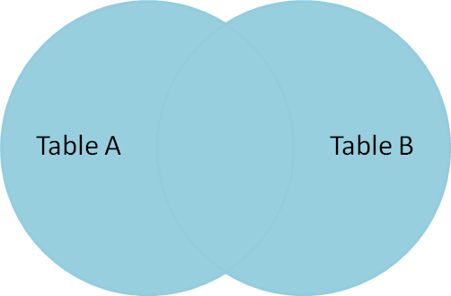

# SQL基础 单表查询,多表查询

## 单表查询

### 聚合函数

- **聚合**:  将分散的聚集到一起
- **聚合函数**: 对列进行操作,返回的结果是一个单一的值,除了 COUNT 以外，都会忽略空值

- 函数介绍

  ```
  COUNT：统计指定列不为NULL的记录行数
  SUM：计算指定列的数值和，如果指定列类型不是数值类型，那么计算结果为0
  MAX：计算指定列的最大值，如果指定列是字符串类型，那么使用字符串排序运算
  MIN：计算指定列的最小值，如果指定列是字符串类型，那么使用字符串排序运算
  AVG：计算指定列的平均值，如果指定列类型不是数值类型，那么计算结果为0
  ```

- 语法

  ```
  select 聚合函数(字段) from 表名;
  ```

- 示例

  ```sql
  -- 统计人员中最大年龄、最小年龄，平均年龄分别是多少
  select max(age),min(age),avg(age) from person;
  ```

### 分组查询

- 分组的含义:将一些具有相同特征的数据 进行归类.比如:性别,部门,岗位等等

- 语法

  ```sql
  select 被分组的字段 from 表名 group by 分组字段 [having 条件字段]
  -- 分组查询可以与 聚合函数 组合使用.
  ```

- 示例

  ```sql
  -- 查询每个部门的平均薪资
  select avg(salary),dept from person  GROUP BY dept;
  
  -- 查询每个部门的平均薪资 并且看看这个部门的员工都有谁?
  select avg(salary),dept,GROUP_CONCAT(name) from person GROUP BY dept;
  -- GROUP_CONCAT(expr):按照分组，将expr字符串按逗号分隔，组合起来
  
  -- 查询平均薪资大于10000的部门, 并且看看这个部门的员工都有谁?  
  select avg(salary),dept,GROUP_CONCAT(name) from person GROUP BY dept having avg(salary)>10000
  ```

- where 与 having区别

  执行优先级从高到低：where > group by > having 

  1. Where 发生在分组group by之前，因而Where中可以有任意字段，但是绝对不能使用聚合函数
  2. \2. Having发生在分组group by之后，因而Having中可以使用分组的字段，无法直接取到其他字段,可以使用聚合函数

### 分页查询

- 限制查询数据条数,提高查询效率

- 语法

  ```
  limit (起始条数),(查询多少条数);
  ```

- 案例

  ```sql
  -- 查询前5条数据
  select * from person limit 5;
  -- 等同于
  select * from person limit 0,5;
   
  -- 查询第5条到第10条数据
  select * from person limit 5,5;
   
  -- 查询第10条到第15条数据
  select * from person limit 10,5;
  ```

### SQL语句的执行顺序

**执行顺序: FROM -> WHERE -> GROUP BY -> HAVING -> SELECT -> ORDER BY -> limit**　　

```sql
-- 查询:姓名不同人员的最高工资,并且要求大于5000元,同时按最大工资进行排序并取出前5条
SELECT NAME,max(salary) FROM person WHERE NAME IS NOT NULL GROUP BY NAME HAVING max(salary)> 5000 ORDER BY max(salary) LIMIT 0,5

在上面的示例中 SQL 语句的执行顺序如下:
1. 首先执行 FROM 子句, 从 person 表 组装数据源的数据
2. 执行 WHERE 子句, 筛选 person 表中 name 不为 NULL 的数据
3. 执行 GROUP BY 子句, 把 person 表按 "name" 列进行分组
4. 计算 max() 聚集函数, 按 "工资" 求出工资中最大的一些数值
5. 执行 HAVING 子句, 筛选工资大于 5000的人员.
7. 执行 ORDER BY 子句, 把最后的结果按 "Max 工资" 进行排序.
8. 最后执行 LIMIT 子句, . 进行分页查询
```

## 多表查询

- 数据准备

  ```sql
  CREATE TABLE IF NOT EXISTS dept (did INT NOT NULL auto_increment PRIMARY KEY,dname VARCHAR (50) NOT NULL COMMENT '部门名称') ENGINE=INNODB DEFAULT charset utf8; 
  
  INSERT INTO `dept` VALUES ('1','教学部'); 
  INSERT INTO `dept` VALUES ('2','销售部'); 
  INSERT INTO `dept` VALUES ('3','市场部'); 
  INSERT INTO `dept` VALUES ('4','人事部'); 
  INSERT INTO `dept` VALUES ('5','鼓励部');
  
  CREATE TABLE `person` (`id` INT (11) NOT NULL AUTO_INCREMENT,`name` VARCHAR (50) NOT NULL,`age` TINYINT (4) DEFAULT '0',`sex` enum ('男','女','人妖') NOT NULL DEFAULT '人妖',`salary` DECIMAL (10,2) NOT NULL DEFAULT '250.00',`hire_date` date NOT NULL,`dept_id` INT (11) DEFAULT NULL,PRIMARY KEY (`id`)) ENGINE=INNODB AUTO_INCREMENT=13 DEFAULT CHARSET=utf8; 
  
  INSERT INTO `person` VALUES ('1','alex','28','人妖','53000.00','2010-06-21','1'); 
  INSERT INTO `person` VALUES ('2','wupeiqi','23','男','8000.00','2011-02-21','1'); 
  INSERT INTO `person` VALUES ('3','egon','30','男','6500.00','2015-06-21','1'); 
  INSERT INTO `person` VALUES ('4','jingnvshen','18','女','6680.00','2014-06-21','1');
  INSERT INTO `person` VALUES ('5','歪歪','20','女','3000.00','2015-02-21','2'); 
  INSERT INTO `person` VALUES ('6','星星','20','女','2000.00','2018-01-30','2'); 
  INSERT INTO `person` VALUES ('7','格格','20','女','2000.00','2018-02-27','2'); 
  INSERT INTO `person` VALUES ('8','周周','20','女','2000.00','2015-06-21','2');
  INSERT INTO `person` VALUES ('9','月月','21','女','4000.00','2014-07-21','3'); 
  INSERT INTO `person` VALUES ('10','安琪','22','女','4000.00','2015-07-15','3');
  INSERT INTO `person` VALUES ('11','周明月','17','女','5000.00','2014-06-21','4');
  INSERT INTO `person` VALUES ('12','苍老师','33','女','1000000.00','2018-02-21',NULL);
  ```

  

  

### 多表联合查询

- 语法

  ```
  select 字段1,字段2... from 表1,表2... [where 条件]
  ```

- 注意: 如果不加条件直接进行查询,则会出现以下效果,这种结果我们称之为 **笛卡尔乘积**

  ```sql
  -- 查询人员和部门所有信息
  select * from person,dept
  ```

  

- 笛卡尔乘积公式 : A表中数据条数   *  B表中数据条数  = 笛卡尔乘积.

- 根据部门进行匹配

  ```sql
  -- 部门匹配
  -- 为了防止两个表有相同的列名, 可以在 where 条件后面指定对应表的对应字段
  SELECT * FROM person,dept WHERE person.dept_id = dept.did;
  ```

  

  

### 多表连接查询

- 语法

  ```
  `SELECT` `字段列表``    ``FROM` `表1  ``INNER``|``LEFT``|``RIGHT` `JOIN`  `表2``ON` `表1.字段 = 表2.字段;`
  ```

#### 内连接

```sql
-- 查询人员和部门所有信息
SELECT * FROM person INNER JOIN dept WHERE person.dept_id=dept.did;
```


- **效果: 大家可能会发现, 内连接查询与多表联合查询的效果是一样的**


#### 左外连接

- **左边表中的数据优先全部显示**

```sql
SELECT * FROM person LEFT JOIN dept on person.dept_id=dept.did;
```


- **效果:人员表中的数据全部都显示,而 部门表中的数据符合条件的才会显示,不符合条件的会以 null 进行填充**


#### 右外连接

- **右边表中的数据优先全部显示**

```sql
SELECT * FROM person RIGHT JOIN dept on person.dept_id=dept.did;
```


- **效果:正好与[左外连接相反]**

#### 全连接

- **显示左右表中全部数据**

- 全连接查询：是在内连接的基础上增加 左右两边没有显示的数据

- **注意**

  1. mysql并不支持全连接 full JOIN 关键字

  2. 但是mysql 提供了 UNION 关键字.使用 UNION 可以间接实现 full JOIN 功能

```sql
SELECT * FROM person LEFT JOIN dept on person.dept_id=dept.did
UNION
SELECT * FROM person RIGHT JOIN dept on person.dept_id=dept.did;
```




### 复杂条件的多表查询

- 查询出 教学部 年龄大于20岁,并且工资小于40000的员工,按工资倒序排列.(要求:分别使用多表联合查询和内连接查询)

  ```sql
  -- 内连接查询
  SELECT * FROM person INNER JOIN dept WHERE person.dept_id = dept.did and person.age > 20 AND person.salary < 40000 ORDER BY person.salary DESC
  
  -- 多表联合查询
  SELECT * FROM person,dept WHERE person.dept_id=dept.did AND person.age> 20 AND person.salary< 40000 ORDER BY person.salary DESC
  ```

  

- 查询每个部门中最高工资和最低工资是多少,显示部门名称

  ```sql
  SELECT MAX(salary),MIN(salary),dept.dname FROM person INNER JOIN dept WHERE person.dept_id=dept.did GROUP BY person.dept_id;
  
  SELECT MAX(salary),MIN(salary),dept.dname FROM person,dept WHERE person.dept_id = dept.did GROUP BY dept.did;
  ```

  

### 子语句查询

- 子查询(嵌套查询): 查多次, 多个select

- 注意: 第一次的查询结果可以作为第二次的查询的 条件 或者 表名 使用.

- 子查询中可以包含：IN、NOT IN、ANY、ALL、EXISTS 和 NOT EXISTS等关键字. 还可以包含比较运算符：= 、 !=、> 、<等

- **案例1:作为表名使用**

  ```sql
  SELECT * FROM (SELECT id,name,salary FROM person WHERE id < 8) as tb_user;
  ```


- 注意
  1.  一条语句中可以有多个这样的子查询,在执行时,最里层括号(sql语句) 具有优先执行权
  2. as后面的表名称不能加引号('')

- **案例2:求最大工资那个人的姓名和薪水**

  ```sql
  SELECT name,salary FROM person WHERE salary = (SELECT MAX(salary) FROM person);
  ```

- **案例3:求工资高于所有人员平均工资的人员**

  ```sql
  SELECT * FROM person WHERE salary > (SELECT avg(salary) FROM person);
  ```

- 其他案例:

  ```sql
  -- 查询平均年龄在20岁以上的部门名
  SELECT * FROM dept WHERE dept.did IN (
  SELECT dept_id FROM person GROUP BY dept_id HAVING avg(person.age)> 20); 
  
  -- 查询教学部 下的员工信息
  SELECT * FROM person WHERE dept_id=(SELECT did FROM dept WHERE dname='教学部'); 
  
  -- 查询大于所有人平均工资的人员的姓名与年龄
  SELECT*FROM person WHERE salary> (SELECT avg(salary) FROM person);
  ```

### 关键字

#### any

```
假设any内部的查询语句返回的结果个数是三个，如:result1,result2,result3,那么，
select ...from ... where a > any(...);
->
select ...from ... where a > result1 or a > result2 or a > result3;
```

#### all

```
ALL关键字与any关键字类似，只不过上面的or改成and。即:
select ...from ... where a > all(...);
->
select ...from ... where a > result1 and a > result2 and a > result3;
```

#### some

```
some关键字和any关键字是一样的功能。所以:
select ...from ... where a > some(...);
->
select ...from ... where a > result1 or a > result2 or a > result3;
```

#### EXISTS 和 NOT EXISTS

```
SELECT ... FROM table WHERE  EXISTS (subquery)
该语法可以理解为：主查询(外部查询)会根据子查询验证结果（TRUE 或 FALSE）来决定主查询是否得以执行

SELECT * FROM person WHERE EXISTS (SELECT * FROM dept WHERE did=5);
此处内层循环并没有查询到满足条件的结果，因此返回false，外层查询不执行。

NOT EXISTS刚好与之相反
```

```
当然，EXISTS关键字可以与其他的查询条件一起使用，条件表达式与EXISTS关键字之间用AND或者OR来连接，

如下：
SELECT * FROM person WHERE AGE >23 AND NOT EXISTS (SELECT * FROM dept WHERE did=5);

提示：
EXISTS (subquery) 只返回 TRUE 或 FALSE，因此子查询中的 SELECT * 也可以是 SELECT 1 或其他，官方说法是实际执行时会忽略 SELECT 清单，因此没有区别
```

