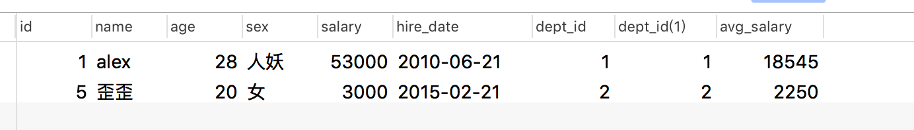
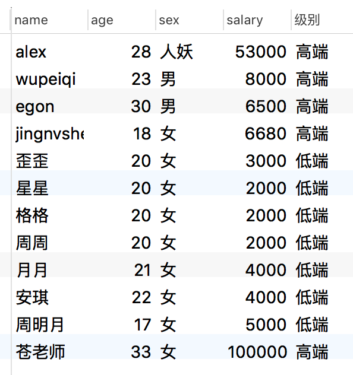
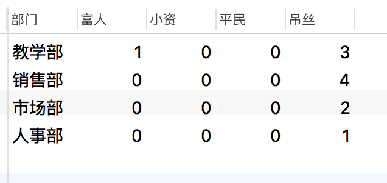
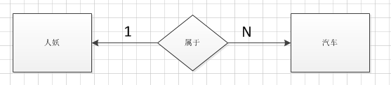
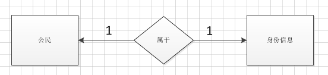
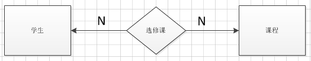

# SQL 临时表查询,条件判断,SQL查询语句执行顺序,外键约束,其他约束,表与表的关系

## 其他查询

### 临时表查询

案例: 查询高于本部门平均工资的人员

```sql
SELECT * FROM person,(
SELECT dept_id,avg(salary) AS avg_salary FROM person GROUP BY dept_id) AS tb_salary WHERE person.dept_id=tb_salary.dept_id AND person.salary> avg_salary;
```



### 判断查询 if关键字

#### 第一种语法

```
IF(条件表达式,"结果为true",'结果为false')
```

案例: 根据工资高低,将人员划分为两个级别,分别为 高端人群和低端人群。显示效果:姓名,年龄,性别,工资,级别

```sql
SELECT name,age,sex,salary,IF (salary> 5000,'高端','低端') AS '级别' FROM person;
```



#### 第二种语法

```sql
#语法一:
SELECT
    CASE WHEN STATE = '1' THEN '成功'
         WHEN STATE = '2' THEN '失败'
         ELSE '其他' END 
FROM 表;
 
#语法二:
SELECT CASE age
           WHEN 23 THEN '23岁'
           WHEN 27 THEN '27岁'
           WHEN 30 THEN '30岁'
        ELSE '其他岁' END
FROM person;
```

案例: 根据工资高低,统计每个部门人员收入情况,划分为 富人,小资,平民,吊丝 四个级别, 要求统计四个级别分别有多少人

```sql
SELECT
	dname '部门',
	sum( CASE WHEN salary > 50000 THEN 1 ELSE 0 END ) AS '富人',
	sum( CASE WHEN salary BETWEEN 29000 AND 50000 THEN 1 ELSE 0 END ) AS '小资',
	sum( CASE WHEN salary BETWEEN 10000 AND 29000 THEN 1 ELSE 0 END ) AS '平民',
	sum( CASE WHEN salary < 10000 THEN 1 ELSE 0 END ) AS '吊丝' 
FROM
	person,
	dept 
WHERE
	person.dept_id = dept.did 
GROUP BY
	dept_id
```



## SQL逻辑查询语句执行顺序

### 定义顺序

```
-- 前面的序号表示执行的顺序号
(7)     SELECT 
(8)     DISTINCT <select_list>
(1)     FROM <left_table>
(3)     <join_type> JOIN <right_table>
(2)     ON <join_condition>
(4)     WHERE <where_condition>
(5)     GROUP BY <group_by_list>
(6)     HAVING <having_condition>
(9)     ORDER BY <order_by_condition>
(10)    LIMIT <limit_number>
```

## 外键约束

- **什么是约束:**约束是一种限制，它通过对表的行或列的数据做出限制，来确保表的数据的完整性、唯一性

- foreign key 定义:就是表与表之间的某种约定的关系，由于这种关系的存在，能够让表与表之间的数据，更加的完整，关连性更强

### 创建约束

- 创建表的时候添加外键约束

  ```sql
  CREATE TABLE IF NOT EXISTS dept (
      did int not null auto_increment PRIMARY KEY,
      dname VARCHAR(50) not null COMMENT '部门名称'
  )ENGINE=INNODB DEFAULT charset utf8;
     
  CREATE TABLE IF NOT EXISTS person(
      id int not null auto_increment PRIMARY KEY,
      name VARCHAR(50) not null,
      age TINYINT(4) null DEFAULT 0,
      sex enum('男','女','人妖') NOT NULL DEFAULT '人妖',
      salary decimal(10,2) NULL DEFAULT '250.00',
      hire_date date NOT NULL,
      dept_id int(11) DEFAULT NULL,
  　  CONSTRAINT fk_did FOREIGN KEY(dept_id) REFERENCES dept(did) -- 添加外键约束
  )ENGINE = INNODB DEFAULT charset utf8;
  ```

- 在已经创建的表添加外键约束

  ```sql
  -- 添加外键约束
  ALTER table person add constraint fk_did FOREIGN key(dept_id) REFERENCES dept(did);
   
  -- 删除外键约束
  ALTER TABLE person drop FOREIGN key fk_did;
  ```

### 定义外键的条件

1. 外键对应的字段数据类型保持一致,且被关联的字段(即references指定的另外一个表的字段)，必须保证唯一

2. 所有tables的存储引擎必须是InnoDB类型.

3. 外键的约束4种类型: 1.RESTRICT 2. NO ACTION 3.CASCADE 4.SET NULL

   ```
   RESTRICT
   同no action, 都是立即检查外键约束
   
   NO ACTION
   如果子表中有匹配的记录,则不允许对父表对应候选键进行update/delete操作  
   
   CASCADE
   在父表上update/delete记录时，同步update/delete掉子表的匹配记录 
   
   SET NULL
   在父表上update/delete记录时，将子表上匹配记录的列设为null (要注意子表的外键列不能为not null)
   ```

- **建议**
  1. 如果需要外键约束,最好创建表同时创建外键约束
  2. 如果需要设置级联关系,删除时最好设置为 SET NULL
  3. **插入数据时，先插入主表中的数据，再插入从表中的数据**
  4.  **删除数据时，先删除从表中的数据，再删除主表中的数据**

## 其他约束

### 非空约束

- 关键字: NOT NULL ,表示 不可空. 用来约束表中的字段列

  ```sql
  create table t1(
         id int(10) not null primary key,
         name varchar(100) null
   ); 
  ```

### 主键约束

- 用于约束表中的一行，作为这一行的标识符，在一张表中通过主键就能准确定位到一行，因此主键十分重要

  ```sql
  create table t2(
      id int(10) not null primary key
  );
  ```

- 主键这一行的数据**不能重复**且**不能为空**

- 还有一种特殊的主键——复合主键。主键不仅可以是表中的一列，也可以由表中的两列或多列来共同标识

  ```sql
  create table t3(
      id int(10) not null,
      name varchar(100) ,
      primary key(id,name)
  );
  ```

### 唯一约束

关键字: UNIQUE, 比较简单，它规定一张表中指定的一列的值必须不能有重复值，即这一列每个值都是唯一的

```sql
create table t4(
    id int(10) not null,
    name varchar(255) ,
    unique id_name(id,name)
);

-- 添加唯一约束
alter table t4 add unique id_name(id,name);

-- 删除唯一约束
alter table t4 drop index id_name;
```

注意: 当INSERT语句新插入的数据和已有数据重复的时候，如果有UNIQUE约束，则INSERT失败.　

### 默认值约束

关键字: DEFAULT

```sql
create table t5(
    id int(10) not null primary key,
    name varchar(255) default '张三'   
);

-- 插入数据
INSERT into t5(id) VALUES(1),(2);
```

注意: INSERT语句执行时.，如果被DEFAULT约束的位置没有值，那么这个位置将会被DEFAULT的值填充

## 表之间的关系

- 总体可以分为三类: 一对一 、一对多(多对一) 、多对多

```
#多对一 /一对多
#1.站在左表的角度去看右表(情况一)
如果左表中的一条记录,对应右表中多条记录.那么他们的关系则为 一对多 关系.约束关系为:左表普通字段, 对应右表foreign key 字段.

注意:如果左表与右表的情况反之.则关系为 多对一 关系.约束关系为:左表foreign key 字段, 对应右表普通字段.

#一对一
#2.站在左表的角度去看右表(情况二)
如果左表中的一条记录 对应 右表中的一条记录. 则关系为 一对一关系.
约束关系为:左表foreign key字段上 添加唯一(unique)约束, 对应右表 关联字段.
或者:右表foreign key字段上 添加唯一(unique)约束, 对应右表 关联字段.

#多对多
#3.站在左表和右表同时去看(情况三)
如果左表中的一条记录 对应 右表中的多条记录,并且右表中的一条记录同时也对应左表的多条记录. 那么这种关系 则 多对多 关系. 
这种关系需要定义一个这两张表的[关系表]来专门存放二者的关系
```

### 一对多

- 例如:一个人可以拥有多辆汽车，要求查询某个人拥有的所有车辆。 
  分析：人和车辆分别单独建表，那么如何将两个表关联呢？有个巧妙的方法，在车辆的表中加个外键字段(人的编号)即可。 
- (思路小结：’建两个表，一’方不动，’多’方添加一个外键字段)*



- 示例代码

  ```sql
  //建立人员表
  CREATE TABLE people(
      id VARCHAR(12) PRIMARY KEY,
      sname VARCHAR(12),
      age INT,
      sex CHAR(1)
  );
  INSERT INTO people VALUES('H001','小王',27,'1');
  INSERT INTO people VALUES('H002','小明',24,'1');
  INSERT INTO people VALUES('H003','张慧',28,'0');
  INSERT INTO people VALUES('H004','李小燕',35,'0');
  INSERT INTO people VALUES('H005','王大拿',29,'1');
  INSERT INTO people VALUES('H006','周强',36,'1');
   //建立车辆信息表
  CREATE TABLE car(
      id VARCHAR(12) PRIMARY KEY,
      mark VARCHAR(24),
      price NUMERIC(6,2),
      pid VARCHAR(12),
      CONSTRAINT fk_people FOREIGN KEY(pid) REFERENCES people(id)
  );
  INSERT INTO car VALUES('C001','BMW',65.99,'H001');
  INSERT INTO car VALUES('C002','BenZ',75.99,'H002');
  INSERT INTO car VALUES('C003','Skoda',23.99,'H001');
  INSERT INTO car VALUES('C004','Peugeot',20.99,'H003');
  INSERT INTO car VALUES('C005','Porsche',295.99,'H004');
  INSERT INTO car VALUES('C006','Honda',24.99,'H005');
  INSERT INTO car VALUES('C007','Toyota',27.99,'H006');
  INSERT INTO car VALUES('C008','Kia',18.99,'H002');
  INSERT INTO car VALUES('C009','Bentley',309.99,'H005');
  ```

### 一对一

- 例如：一个中国公民只能有一个身份证信息
  分析: 一对一的表关系实际上是 变异了的 一对多关系. 
- 通过在从表的外键字段上添加唯一约束(unique)来实现一对一表关系



- 示例

  ```sql
   #身份证信息表
  CREATE TABLE card (
    id int NOT NULL AUTO_INCREMENT PRIMARY KEY,
    code varchar(18) DEFAULT NULL,
    UNIQUE un_code (CODE) -- 创建唯一索引的目的,保证身份证号码同样不能出现重复
  );
  
  INSERT INTO card VALUES(null,'210123123890890678'),
                         (null,'210123456789012345'),
                         (null,'210098765432112312');
  
  #公民表
  CREATE TABLE people (
    id int NOT NULL AUTO_INCREMENT PRIMARY KEY,
    name varchar(50) DEFAULT NULL,
    sex char(1) DEFAULT '0',
    c_id int UNIQUE, -- 外键添加唯一约束,确保一对一
    CONSTRAINT fk_card_id FOREIGN KEY (c_id) REFERENCES card(id)
  );
  
  INSERT INTO people VALUES(null,'zhangsan','1',1),
                           (null,'lisi','0',2),
                           (null,'wangwu','1',3);
  ```

### 多对多

- 例如：学生选课，一个学生可以选修多门课程，每门课程可供多个学生选择。 
  分析：这种方式可以按照类似一对多方式建表，但冗余信息太多，好的方式是实体和关系分离并单独建表，实体表为学生表和课程表，关系表为选修表，
  其中关系表采用联合主键的方式(由学生表主键和课程表主键组成)建表



- 示例

  ```sql
  #//建立学生表
  CREATE TABLE student(
      id VARCHAR(10) PRIMARY KEY,
      sname VARCHAR(12),
      age INT,
      sex CHAR(1)
  );
  INSERT INTO student VALUES('S0001','王军',20,1);
  INSERT INTO student VALUES('S0002','张宇',21,1);
  INSERT INTO student VALUES('S0003','刘飞',22,1);
  INSERT INTO student VALUES('S0004','赵燕',18,0);
  INSERT INTO student VALUES('S0005','曾婷',19,0);
  INSERT INTO student VALUES('S0006','周慧',21,0);
  INSERT INTO student VALUES('S0007','小红',23,0);
  INSERT INTO student VALUES('S0008','杨晓',18,0);
  INSERT INTO student VALUES('S0009','李杰',20,1);
  INSERT INTO student VALUES('S0010','张良',22,1);
  
  # //建立课程表
  CREATE TABLE course(
      id VARCHAR(10) PRIMARY KEY,
      sname VARCHAR(12),
      credit DOUBLE(2,1),
      teacher VARCHAR(12)
  );
  INSERT INTO course VALUES('C001','Java',3.5,'李老师');
  INSERT INTO course VALUES('C002','高等数学',5.0,'赵老师');
  INSERT INTO course VALUES('C003','JavaScript',3.5,'王老师');
  INSERT INTO course VALUES('C004','离散数学',3.5,'卜老师');
  INSERT INTO course VALUES('C005','数据库',3.5,'廖老师');
  INSERT INTO course VALUES('C006','操作系统',3.5,'张老师');
  
  # //建立选修表
  CREATE TABLE sc(
      sid VARCHAR(10),
      cid VARCHAR(10),
        PRIMARY KEY(sid,cid),
        CONSTRAINT fk_student FOREIGN KEY(sid) REFERENCES student(id),
        CONSTRAINT fk_course FOREIGN KEY(cid) REFERENCES course(id)
  );
  
  INSERT INTO sc VALUES('S0001','C001');
  INSERT INTO sc VALUES('S0001','C002');
  INSERT INTO sc VALUES('S0001','C003');
  INSERT INTO sc VALUES('S0002','C001');
  INSERT INTO sc VALUES('S0002','C004');
  INSERT INTO sc VALUES('S0003','C002');
  INSERT INTO sc VALUES('S0003','C005');
  INSERT INTO sc VALUES('S0004','C003');
  INSERT INTO sc VALUES('S0005','C001');
  INSERT INTO sc VALUES('S0006','C004');
  INSERT INTO sc VALUES('S0007','C002');
  INSERT INTO sc VALUES('S0008','C003');
  INSERT INTO sc VALUES('S0009','C001');
  INSERT INTO sc VALUES('S0009','C005');
  ```


