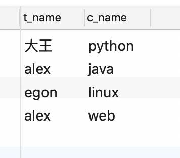
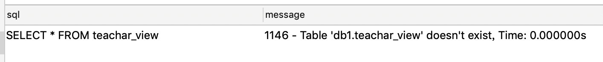
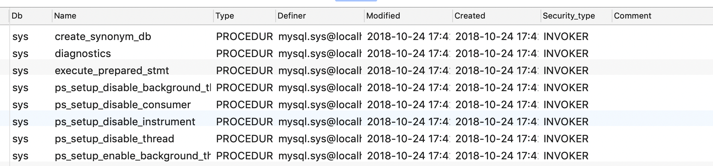
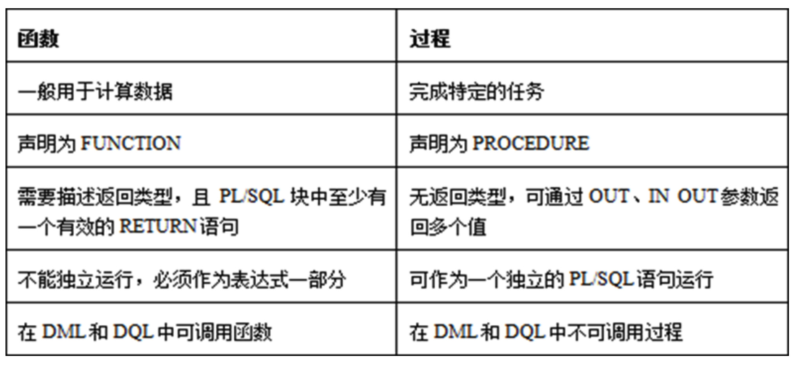

# SQL基础 视图,触发器,存储过程,函数,事务,锁,数据库的备份和恢复

## 视图

- **是一个虚拟表，其内容由查询定义**。同真实的表一样，视图包含一系列带有名称的列和行数据
- 特点:
  1. 视图的列可以来自不同的表，是表的抽象和逻辑意义上建立的新关系
  2. 视图是由基本表（实表）产生的表（虚表）
  3. 视图的建立和删除不影响基本表
  4. 对视图内容的更新（添加、删除和修改）直接影响基本表
  5. 当视图来自多个基本表时，不允许添加和删除数据

### 创建视图

- 语法

  ```
  create view 视图名称  as sql 查询语句  
  ```

- 示例

  ```sql
  CREATE VIEW teachar_view AS SELECT teacher.t_name,course.c_name FROM teacher,course WHERE teacher.t_id=course.t_id;
  ```

### 使用视图

- 语法名称

  ```
  `select` `* ``from` `视图名称;`
  ```

- 示例

  ```sql
  -- 效果相当于 SELECT teacher.t_name,course.c_name FROM teacher,course WHERE teacher.t_id=course.t_id
  SELECT * FROM teachar_view;
  ```

  

### 更新视图

- 语法

  ```
  alter view 视图名称 AS SQL语句
  ```

- 示例

  ```sql
  -- 修改视图
  ALTER VIEW teachar_view AS SELECT teacher.t_name FROM teacher,course WHERE teacher.t_id=course.t_id;
  
  -- 使用视图查看数据
  SELECT * FROM teachar_view
  ```

  

### 删除视图

- 语法

  ```
  drop view 视图名称;
  ```

- 示例

  ```sql
  DROP VIEW teachar_view;
  
  -- 重新查看视图,就会提示视图不存在
  ```

  

## 触发器

- 作用: **监视某种情况，并触发某种操作**
- 触发器创建的四要素
  1. 监视地点(table)
  2. 监视事件(insert/update/delete)
  3. 触发时间(after/before)
  4. 触发事件(insert/update/delete)

### 创建触发器

- 语法

  ```
  create trigger triggerName  after/before  insert/update/delete
       on 表名 for each row  # 这句话是固定的
   begin
       # 需要执行的sql语句
   end
  注意1:after/before: 只能选一个 ,after 表示 后置触发, before 表示前置触发
  注意2:insert/update/delete:只能选一个
  ```

- 示例

  - 数据准备

    ```sql
    -- 商品表
    create table goods(
      id int primary key auto_increment,
      name varchar(20),
      num int
    );
    
    -- 订单表
    create table order_table(
        oid int primary key auto_increment,
        gid int,
        much int
    );
    
    -- 添加3条商品数据
    insert into goods(name,num) values('商品1',10),('商品2',10),('商品3',10);
    ```

  - 在没有触发器的情况下, 添加一条商品记录,需要程序员手动来执行货物表的剩余数据

    ```sql
    INSERT INTO order_table (gid,much) VALUES (1,2); 
    UPDATE goods SET goods.num=goods.num-2 WHERE goods.id=1;
    ```

  - 如果能自动的执行第二条数据, 那么就需要使用到触发器

  - 监视新增操作

    **对于insert而言，新插入的行用new来表示，行中的每一列的值用new.列名来表示**

    ```sql
    -- 监视 order_table 表的新增操作
    -- 在新增完毕后进行触发(后置触发) tg1 触发器中的代码
    CREATE TRIGGER tg1 AFTER INSERT ON order_table
    FOR EACH ROW
    BEGIN
    	UPDATE goods SET goods.num=goods.num-new.much WHERE goods.id=new.gid;
    END
    ```

    ```sql
    -- 当执行订单表的新增操作时, 可以发现货物表的数据同时发生了变化 
    INSERT INTO order_table (gid,much) VALUES (1,2); 
    ```

  - 监视删除操作

    **对于delete而言：原本有一行,后来被删除，想引用被删除的这一行，用old来表示旧表中的值，old.列名可以引用原(旧)表中的值**

    ```sql
    CREATE TRIGGER tg2 AFTER DELETE ON order_table
    FOR EACH ROW
    BEGIN
    	UPDATE goods SET goods.num = goods.num + old.much WHERE goods.id = old.gid;
    END
    ```

    ```sql
    -- 当执行订单表的删除操作时, 货物表的数据也发生了变化
    DELETE FROM order_table WHERE order_table.oid = 1;
    ```

  - 监视更新操作

    ```sql
    CREATE TRIGGER tg3 AFTER UPDATE ON order_table
    FOR EACH ROW
    BEGIN
    	UPDATE goods SET goods.num = goods.num + old.much - new.much WHERE goods.id = new.gid;
    END
    ```

## 存储过程

- MySQL数据库在5.0版本后开始支持存储过程

- **存储过程**：类似于函数(方法),简单的说存储过程是为了完成某个数据库中的特定功能而编写的语句集合，该语句集包括SQL语句（对数据的增删改查）、条件语句和循环语句等

- 查看现有的存储过程

  ```sql
  SHOW PROCEDURE STATUS;
  ```

  

- 删除存储过程

  ```sql
  drop procedure 存储过程名称;
  ```

- 调用存储过程

  ```
  call 存储过程名称(参数入/出类型 参数名 数据类型);
  ```

- 注意

  1. mysql中有三种出入参数类型:分别为:1. **in** 入参类型  2.**out** 出参类型   3. **inout** 出入参类型 
  2. into 关键字 可以 将前面字段的查询结果 执行 给 into 后面的变量.  

- 示例

- ```sql
  -- 创建存储过程
  -- 无参数
  CREATE PROCEDURE p1()
  BEGIN
   SELECT * FROM goods;
  END
  
  -- 调用存储过程
  CALL p1();
  ```

  ```sql
  -- 创建存储过程
  -- 带参数
  CREATE PROCEDURE p2(IN id_params INT)
  BEGIN
   SELECT * FROM goods WHERE goods.id = id_params;
  END
  
  -- 调用存储过程
  CALL p2(1);
  ```

  - in 示例

    ```sql
    -- 创建存储过程 in 入参
    create procedure p_in (IN num int )
    begin
        select num;
        set num=100;
        select num;
    end;
    
    -- 调用
    set @num=1;
    call p_in(@num);
    select @num;
    -- 总结: IN 参数只是将变量在存储过程内部做了修改，并没有影响到外部，@num仍为1。
    ```

  - out 示例

    ```sql
    -- 创建存储过程 out 出参
    create procedure p_out (out num int )
    begin
        select num;
        set num=100;
        select num;
    end;
    
    -- 调用
    set @num=1;
    call p_out(@num);
    select @num;  -- 100
    ```

  - in out 示例

    ```sql
    -- 创建存储过程 inout 出入参
    create procedure p_inout (inout num int )
    begin
        select num;
        set num=100;
        select num;
    end;
    
    -- 调用
    set @num=1;
    call p_inout(@num);
    select @num;
    ```

- 存储过程中使用 if 

  ```sql
  create procedure p3(in x int,in c char(1))
   begin
      if c ='d' then
           select * from account where money >x;
     else
           select * from account where money <x;     
  　　end if;
  end
  ```

- 存储过程中使用循环

  ```sql
  -- 循环:计算1-100累加的和,并且返回计算结果.
  create procedure p4(inout n int)
  begin
        DECLARE sum int default 0; -- 设置总和变量,并且指定初始值0
        declare i int; -- 声明变量
        set i = 0;    -- 通过set为变量设置值
  　　  while i<=n DO  -- 开始循环
              set sum = sum +i;
              set i = i+1;
        end while; -- 结束循环
   
  　　  select sum; -- 提供结果
                       
       set n = sum;--将计算结果提供给 输出变量 n;
  end;
                   
   -- 调用:
   set @n = 100;
   call p4(@n);
   select @n;
  ```

- 存储过程优点

  1. 存储过程增强了SQL语言灵活性

     存储过程可以使用控制语句编写，可以完成复杂的判断和较复杂的运算，有很强的灵活性

  2. 减少网络流量，降低了网络负载

     存储过程在服务器端创建成功后，只需要调用该存储过程即可，而传统的做法是每次都将大量的SQL语句通过网络发送至数据库服务器端然后再执行

  3. 存储过程只在创造时进行编译，以后每次执行存储过程都不需再重新编译

     一般SQL语句每执行一次就编译一次,所以使用存储过程可提高数据库执行速度

- 存储过程缺点

  1. 扩展功能不方便
  2. 不便于系统后期维护

## 函数

### MySQL提供的内置函数

#### 数学函数

```
ROUND(x,y)
返回参数x的四舍五入的有y位小数的值
        
RAND()
返回０到１内的随机值,可以通过提供一个参数(种子)使RAND()随机数生成器生成一个指定的值。
```

#### 聚合函数

- 常用于GROUP BY从句的SELECT查询中

```
AVG(col)
返回指定列的平均值

COUNT(col)
返回指定列中非NULL值的个数

MIN(col)
返回指定列的最小值

MAX(col)
返回指定列的最大值

SUM(col)
返回指定列的所有值之和

GROUP_CONCAT(col) 
返回由属于一组的列值连接组合而成的结果  
```

#### 字符串函数

```
CHAR_LENGTH(str)
返回值为字符串str 的长度，长度的单位为字符。一个多字节字符算作一个单字符。

CONCAT(str1,str2,...)
字符串拼接
	如有任何一个参数为NULL ，则返回值为 NULL。

CONCAT_WS(separator,str1,str2,...)
字符串拼接（自定义连接符）
	CONCAT_WS()不会忽略任何空字符串。 (然而会忽略所有的 NULL）。

FORMAT(X,D)
将数字X 的格式写为'#,###,###.##',以四舍五入的方式保留小数点后 D 位， 并将结果以字符串的形式返回。若  D 为 0, 则返回结果不带有小数点，或不含小数部分。
	例如：
		SELECT FORMAT(12332.1,4); 结果为： '12,332.1000'
    
INSERT(str,pos,len,newstr)
在str的指定位置插入字符串
	pos：要替换位置其实位置
	len：替换的长度
	newstr：新字符串
例如:
	SELECT INSERT('abcd',1,2,'tt'); 结果为: 'ttcd'
	SELECT INSERT('abcd',1,4,'tt'); 结果为: 'tt'
特别的：
	如果pos超过原字符串长度，则返回原字符串
	如果len超过原字符串长度，则由新字符串完全替换

INSTR(str,substr)
	返回字符串 str 中子字符串的第一个出现位置。

LEFT(str,len)
返回字符串str 从开始的len位置的子序列字符。
例如:
	SELECT INSTR('abc','c'); 结果为： 3
	SELECT INSTR('abc','d'); 结果为： 0

LOWER(str)
变小写

UPPER(str)
变大写

REVERSE(str)
返回字符串 str ，顺序和字符顺序相反。
例如:
	SELECT REVERSE('1234567') 结果为：7654321
            
SUBSTRING(str,pos) , SUBSTRING(str FROM pos) SUBSTRING(str,pos,len) , SUBSTRING(str FROM pos FOR len)
不带有len 参数的格式从字符串str返回一个子字符串，起始于位置 pos。带有len参数的格式从字符串str返回一个长度同len字符相同的子字符串，起始于位置 pos。 使用 FROM的格式为标准 SQL 语法。也可能对pos使用一个负值。假若这样，则子字符串的位置起始于字符串结尾的pos 字符，而不是字符串的开头位置。在以下格式的函数中可以对pos 使用一个负值。

mysql> SELECT SUBSTRING('Quadratically',5); -- 从第5位开始截取
-> 'ratically'

mysql> SELECT SUBSTRING('foobarbar' FROM 4); -- 从第4位开始截取
-> 'barbar'

mysql> SELECT SUBSTRING('Quadratically',5,6); --从第5位开始截取,截取6个长度
-> 'ratica'

mysql> SELECT SUBSTRING('Sakila', -3);    -- 从倒数第3位开始截取
-> 'ila'

mysql> SELECT SUBSTRING('Sakila', -5, 3); -- 从倒数第5位开始截取,截取3个长度
-> 'aki'
```

#### 日期和时间函数

```
CURDATE()或CURRENT_DATE() 
返回当前的日期

CURTIME()或CURRENT_TIME() 
返回当前的时间

DAYOFWEEK(date)  
返回date所代表的一星期中的第几天(1~7)

DAYOFMONTH(date)  
返回date是一个月的第几天(1~31)

DAYOFYEAR(date)   
返回date是一年的第几天(1~366)

DAYNAME(date)   
返回date的星期名，如：SELECT DAYNAME(CURRENT_DATE);

FROM_UNIXTIME(ts,fmt)  
根据指定的fmt格式，格式化UNIX时间戳ts

HOUR(time)   
返回time的小时值(0~23)

MINUTE(time)   
返回time的分钟值(0~59)

MONTH(date)   
返回date的月份值(1~12)

MONTHNAME(date)   
返回date的月份名，如：SELECT MONTHNAME(CURRENT_DATE);

NOW()    
返回当前的日期和时间

QUARTER(date)   
返回date在一年中的季度(1~4)，如SELECT QUARTER(CURRENT_DATE);

WEEK(date)   
返回日期date为一年中第几周(0~53)

YEAR(date)   
返回日期date的年份(1000~9999)

重点:
DATE_FORMAT(date,format) 根据format字符串格式化date值

mysql> SELECT DATE_FORMAT('2009-10-04 22:23:00', '%W %M %Y');
-> 'Sunday October 2009'

mysql> SELECT DATE_FORMAT('2007-10-04 22:23:00', '%H:%i:%s');
-> '22:23:00'

mysql> SELECT DATE_FORMAT('1900-10-04 22:23:00','%D %y %a %d %m %b %j');
-> '4th 00 Thu 04 10 Oct 277'

mysql> SELECT DATE_FORMAT('1997-10-04 22:23:00', '%H %k %I %r %T %S %w');
-> '22 22 10 10:23:00 PM 22:23:00 00 6'

mysql> SELECT DATE_FORMAT('1999-01-01', '%X %V');
-> '1998 52'

mysql> SELECT DATE_FORMAT('2006-06-00', '%d');
-> '00'
```

#### 加密函数

```
MD5()    
计算字符串str的MD5校验和
例如:
	SELECT MD5('1234') 结果为：81dc9bdb52d04dc20036dbd8313ed055

PASSWORD(str)   
返回字符串str的加密版本，这个加密过程是不可逆转的
例如:
	SELECT PASSWORD('1234') 结果为:*A4B6157319038724E3560894F7F932C8886EBFCF
```

#### 控制流函数

```
CASE WHEN[test1] THEN [result1]...ELSE [default] END
如果testN是真，则返回resultN，否则返回default

CASE [test] WHEN[val1] THEN [result]...ELSE [default]END  
如果test和valN相等，则返回resultN，否则返回default

IF(test,t,f)   
如果test是真，返回t；否则返回f

IFNULL(arg1,arg2) 
如果arg1不是空，返回arg1，否则返回arg2
例如:
	SELECT IFNULL('bbb','abc'); 结果为: bbb
	SELECT IFNULL(null,'abc');  结果为: abc

NULLIF(arg1,arg2) 
如果arg1=arg2返回NULL；否则返回arg1
例如:
	SELECT NULLIF('bbb','bbb');结果为： null
	SELECT NULLIF('aaa','bbb');结果为： aaa
```

### 自定义函数的使用

#### 创建

```sql
CREATE FUNCTION fun1(i1 int,i2 int)
RETURNS INT -- 设置返回类型
 
BEGIN
    DECLARE sum int default 0;
    set sum = i1+i2;
    RETURN(sum); -- 返回结果
END
```

#### 调用

```
-- 直接调用自定义函数
select fun1(1,5);
 
-- 在sql语句中使用自定义函数
select fun1(参数1,参数2),name from 表名
```

#### 删除自定义函数

```
DROP FUNCTION fun_name
```

### 函数和存储过程的区别



## 事务

- 一组sql语句批量执行,要么全部执行成功,要么全部执行失败

- 特性:

  - **原子性**

    对于其数据修改，要么全都执行，要么全都不执行

  - **一致性**

    数据库原来有什么样的约束，事务执行之后还需要存在这样的约束，所有规则都必须应用于事务的修改，以保持所有数据的完整性

  - **隔离性**

    一个事务不能知道另外一个事务的执行情况（中间状态）

  - **持久性**

    即使出现致命的系统故障也将一直保持。不要告诉我系统说commit成功了，回头电话告诉我，服务器机房断电了，我的事务涉及到的数据修改可能没有进入数据库

- 注意点

  - 在 MySQL 中只有使用了 Innodb 数据库引擎的数据库或表才支持事务
  - 事务处理可以用来维护数据库的完整性，保证成批的 SQL 语句要么全部执行，要么全部不执行
  - 事务用来管理 insert,update,delete 语句

### 事务控制语句

- BEGIN 或 START TRANSACTION；显式地开启一个事务
- COMMIT；也可以使用COMMIT WORK，不过二者是等价的。COMMIT会提交事务，并使已对数据库进行的所有修改称为永久性的
- ROLLBACK；有可以使用ROLLBACK WORK，不过二者是等价的。回滚会结束用户的事务，并撤销正在进行的所有未提交的修改
- SAVEPOINT : 保存点,可以把一个事物分割成几部分.在执行ROLLBACK 时 可以指定在什么位置上进行回滚操作
- 注意: SET AUTOCOMMIT=0 ;禁止自动提交 和 SET AUTOCOMMIT=1 开启自动提交

### 转账案例

- 创建表

  ```sql
  create table account(
      id int(50) not null auto_increment primary key,
      name VARCHAR(50) not null,
      money DOUBLE(10,2) not NULL
  );
  ```

- 插入数据

  ```sql
  insert into account (id,name,money) values(1,'鲁班',250),(2,'后羿',5000);
  ```

- 转账

  ```sql
  start transaction; -- 开启事务
   --  执行sql语句操作
   update account set money = money - 500 where id =1;  
   update account set money = money+500 where id = 2;
   
  commit;  -- 手动提交事务
  rollback; -- 回滚事务
   
  --  查看结果
  select * from account;
  ```

- 保存点的使用

  ```sql
  START TRANSACTION ;
  insert into account (name,money) values('李元芳',1000);
  SAVEPOINT s1; -- 设置保存点
  insert into account (name,money) values('张桂枝',1500);
  ROLLBACK to s1; -- 事物回滚到保存点COMMIT; -- 提交事务
  ```

## 数据锁

- 当并发事务同时访问一个资源时，有可能导致数据不一致，因此需要一种机制来将数据访问顺序化，以保证数据库数据的一致性

### 锁的基本类型

- 多个事务同时读取一个对象的时候，是不会有冲突的。同时读和写，或者同时写才会产生冲突。因此为了提高数据库的并发性能，通常会定义两种锁：**共享锁和排它锁**

- 共享锁 (Shared Lock,也叫S锁)

  共享锁(S)表示对数据进行读操作。因此多个事务可以同时为一个对象加共享锁。（如果试衣间的门还没被锁上，顾客都能够同时进去参观）

- 排他锁 (Exclusive Lock,也叫X锁)

  排他锁(X)表示对数据进行写操作。如果一个事务对 对象加了排他锁，其他事务就不能再给它加任何锁了。(某个顾客把试衣间从里面反锁了，其他顾客想要使用这个试衣间，就只有等待锁从里面给打开了).

### 实际开发使用的锁

#### 悲观锁

- 就是很悲观，每次去拿数据的时候都认为别人会修改，所以每次在拿数据的时候都会上锁，这样别人想拿这个数据就会block(阻塞)直到它拿到锁。传统的关系型数据库里边就用到了很多这种锁机制

- 注意：要使用悲观锁，我们必须关闭mysql数据库的自动提交属性.因为MySQL默认使用autocommit模式，也就是说，当你执行一个更新操作后，MySQL会立刻将结果进行提交。关闭自动提交命令为：set autocommit=0, 设置完autocommit后，我们就可以执行我们的正常业务了

  - 窗口1执行

    ```sql
    -- 0.开始事务
    start transaction;
     
    -- 1.查询账户余额
    set @m = 0; -- 账户余额
    select money into @m from account where id = 1 for update;
    select @m;
     
    -- 2.修改账户余额
    update account set money = @m -100 where id = 1;
     
    select * FROM account where id = 1;
    -- 3. 提交事务
    commit;
    ```

  - 窗口2执行

    ```sql
    -- 0.开始事务
    start transaction;
     
    -- 1.查询账户余额
    set @m = 0; -- 账户余额
    select money into @m from account where id = 1 for update;
    select @m;
     
    -- 2.修改账户余额
    update account set money = @m +100 where id = 1;
     
    select * FROM account where id = 1;
    -- 3. 提交事务
    commit;
    ```

  会发现当前查询会进入到等待状态,不会显示出数据,当上面的sql执行完毕提交事物后,当前sql才会显示结果

- 注意点

  1. 在使用悲观锁时,如果表中没有指定主键,则会进行锁表操作
  2. 悲观锁的确保了数据的安全性，在数据被操作的时候锁定数据不被访问，但是这样会带来很大的性能问题。因此悲观锁在实际开发中使用是相对比较少的

#### 乐观锁

- 就是很乐观，每次去拿数据的时候都认为别人不会修改，所以不会上锁，但是在更新的时候会判断一下在此期间别人有没有去更新这个数据，可以使用版本号等机制

- 使用乐观锁的两种方式

  - 方式1

    使用数据版本（Version）记录机制实现，这是乐观锁最常用的一种实现 方式。何谓数据版本？即为数据增加一个版本标识，一般是通过为数据库表增加一个数字类型的 “version” 字段来实现。当读取数据时，将version字段的值一同读出，数据每更新一次，对此version值加一。当我们提交更新的时候，判断数据库表对应记录 的当前版本信息与第一次取出来的version值进行比对，如果数据库表当前版本号与第一次取出来的version值相等，则予以更新，否则认为是过期数据

    ```sql
    -- 1.查询账户余额
    set @m = 0; -- 账户余额
    select money into @m from account where id = 1 ;
    select @m;
    -- 2.查询版本号
    set @version = 0; -- 版本号
    select version into @version from account where id = 1 ;
    select @version;
     
    -- 3.修改账户余额
    update account set money = @m -100,version=version+1 where id = 1 and version = @version;
     
    select * FROM account where id = 1;
    ```

  - 方式2

    乐观锁定的第二种实现方式和第一种差不多，同样是在需要乐观锁控制的table中增加一个字段，名称无所谓，字段类型使用时间戳 （datatime）, 和上面的version类似，也是在更新提交的时候检查当前数据库中数据的时间戳和自己更新前取到的时间戳进行对比，如果一致则OK，否则就是版本冲突

#### 悲观锁和乐观锁的优缺点

- 乐观锁适用于写入比较少的情况下，即冲突真的很少发生的时候，这样可以省去了锁的开销，加大了系统的整个吞吐量
- 但如果经常产生冲突，上层应用会不断的进行重试操作，这样反倒是降低了性能，所以这种情况下用悲观锁就比较合适

## 数据库备份

- mysqldump 命令将数据库中的数据备份成一个文本文件。表的结构和表中的数据将存储在生成的文本文件中
- mysqldump命令的工作原理很简单。它先查出需要备份的表的结构，再在文本文件中生成一个CREATE语句。然后，将表中的所有记录转换成一条INSERT语句。然后通过这些语句，就能够创建表并插入数据

### 使用mysqldump实现逻辑备份

```sql
语法：
mysqldump -h 服务器 -u用户名 -p密码 数据库名 > 备份文件.sql
 
示例：
单库备份
mysqldump -uroot -p123456 db1 > c:/db1.sql
mysqldump -uroot -p123456 db1 table1 table2 > c:/db1-table1-table2.sql
 
多库备份
mysqldump -uroot -p123456 --databases db1 db2 mysql db3 > c:/db1_db2_mysql_db3.sql
 
备份所有库
mysqldump -uroot -p123456 --all-databases > c:/all.sql
```

- 参数说明

  ```
  --all-databases  , -A
  导出全部数据库。
  mysqldump  -uroot -p --all-databases
  --all-tablespaces  , -Y
  导出全部表空间。
  mysqldump  -uroot -p --all-databases --all-tablespaces
  --no-tablespaces  , -y
  不导出任何表空间信息。
  mysqldump  -uroot -p --all-databases --no-tablespaces
  --add-drop-database
  每个数据库创建之前添加drop数据库语句。
  mysqldump  -uroot -p --all-databases --add-drop-database
  --add-drop-table
  每个数据表创建之前添加drop数据表语句。(默认为打开状态，使用--skip-add-drop-table取消选项)
  mysqldump  -uroot -p --all-databases  (默认添加drop语句)
  mysqldump  -uroot -p --all-databases –skip-add-drop-table  (取消drop语句)
  --add-locks
  在每个表导出之前增加LOCK TABLES并且之后UNLOCK  TABLE。(默认为打开状态，使用--skip-add-locks取消选项)
  mysqldump  -uroot -p --all-databases  (默认添加LOCK语句)
  mysqldump  -uroot -p --all-databases –skip-add-locks   (取消LOCK语句)
  --allow-keywords
  允许创建是关键词的列名字。这由表名前缀于每个列名做到。
  mysqldump  -uroot -p --all-databases --allow-keywords
  --apply-slave-statements
  在'CHANGE MASTER'前添加'STOP SLAVE'，并且在导出的最后添加'START SLAVE'。
  mysqldump  -uroot -p --all-databases --apply-slave-statements
  --character-sets-dir
  字符集文件的目录
  mysqldump  -uroot -p --all-databases  --character-sets-dir=/usr/local/mysql/share/mysql/charsets
  --comments
  附加注释信息。默认为打开，可以用--skip-comments取消
  mysqldump  -uroot -p --all-databases  (默认记录注释)
  mysqldump  -uroot -p --all-databases --skip-comments   (取消注释)
  --compatible
  导出的数据将和其它数据库或旧版本的MySQL 相兼容。值可以为ansi、mysql323、mysql40、postgresql、oracle、mssql、db2、maxdb、no_key_options、no_tables_options、no_field_options等，
  要使用几个值，用逗号将它们隔开。它并不保证能完全兼容，而是尽量兼容。
  mysqldump  -uroot -p --all-databases --compatible=ansi
  --compact
  导出更少的输出信息(用于调试)。去掉注释和头尾等结构。可以使用选项：--skip-add-drop-table  --skip-add-locks --skip-comments --skip-disable-keys
  mysqldump  -uroot -p --all-databases --compact
  --complete-insert,  -c
  使用完整的insert语句(包含列名称)。这么做能提高插入效率，但是可能会受到max_allowed_packet参数的影响而导致插入失败。
  mysqldump  -uroot -p --all-databases --complete-insert
  --compress, -C
  在客户端和服务器之间启用压缩传递所有信息
  mysqldump  -uroot -p --all-databases --compress
  --create-options,  -a
  在CREATE TABLE语句中包括所有MySQL特性选项。(默认为打开状态)
  mysqldump  -uroot -p --all-databases
  --databases,  -B
  导出几个数据库。参数后面所有名字参量都被看作数据库名。
  mysqldump  -uroot -p --databases test mysql
  --debug
  输出debug信息，用于调试。默认值为：d:t,/tmp/mysqldump.trace
  mysqldump  -uroot -p --all-databases --debug
  mysqldump  -uroot -p --all-databases --debug=” d:t,/tmp/debug.trace”
  --debug-check
  检查内存和打开文件使用说明并退出。
  mysqldump  -uroot -p --all-databases --debug-check
  --debug-info
  输出调试信息并退出
  mysqldump  -uroot -p --all-databases --debug-info
  --default-character-set
  设置默认字符集，默认值为utf8
  mysqldump  -uroot -p --all-databases --default-character-set=utf8
  --delayed-insert
  采用延时插入方式（INSERT DELAYED）导出数据
  mysqldump  -uroot -p --all-databases --delayed-insert
  --delete-master-logs
  master备份后删除日志. 这个参数将自动激活--master-data。
  mysqldump  -uroot -p --all-databases --delete-master-logs
  --disable-keys
  对于每个表，用/*!40000 ALTER TABLE tbl_name DISABLE KEYS */;和/*!40000 ALTER TABLE tbl_name ENABLE KEYS */;语句引用INSERT语句。这样可以更快地导入dump出来的文件，因为它是在插入所有行后创建索引的。该选项只适合MyISAM表，默认为打开状态。
  mysqldump  -uroot -p --all-databases 
  --dump-slave
  该选项将主的binlog位置和文件名追加到导出数据的文件中(show slave status)。设置为1时，将会以CHANGE MASTER命令输出到数据文件；设置为2时，会在change前加上注释。该选项将会打开--lock-all-tables，除非--single-transaction被指定。该选项会自动关闭--lock-tables选项。默认值为0。
  mysqldump  -uroot -p --all-databases --dump-slave=1
  mysqldump  -uroot -p --all-databases --dump-slave=2
  --master-data
  该选项将当前服务器的binlog的位置和文件名追加到输出文件中(show master status)。如果为1，将会输出CHANGE MASTER 命令；如果为2，输出的CHANGE  MASTER命令前添加注释信息。该选项将打开--lock-all-tables 选项，除非--single-transaction也被指定（在这种情况下，全局读锁在开始导出时获得很短的时间；其他内容参考下面的--single-transaction选项）。该选项自动关闭--lock-tables选项。
  mysqldump  -uroot -p --host=localhost --all-databases --master-data=1;
  mysqldump  -uroot -p --host=localhost --all-databases --master-data=2;
  --events, -E
  导出事件。
  mysqldump  -uroot -p --all-databases --events
  --extended-insert,  -e
  使用具有多个VALUES列的INSERT语法。这样使导出文件更小，并加速导入时的速度。默认为打开状态，使用--skip-extended-insert取消选项。
  mysqldump  -uroot -p --all-databases
  mysqldump  -uroot -p --all-databases--skip-extended-insert   (取消选项)
  --fields-terminated-by
  导出文件中忽略给定字段。与--tab选项一起使用，不能用于--databases和--all-databases选项
  mysqldump  -uroot -p test test --tab=”/home/mysql” --fields-terminated-by=”#”
  --fields-enclosed-by
  输出文件中的各个字段用给定字符包裹。与--tab选项一起使用，不能用于--databases和--all-databases选项
  mysqldump  -uroot -p test test --tab=”/home/mysql” --fields-enclosed-by=”#”
  --fields-optionally-enclosed-by
  输出文件中的各个字段用给定字符选择性包裹。与--tab选项一起使用，不能用于--databases和--all-databases选项
  mysqldump  -uroot -p test test --tab=”/home/mysql”  --fields-enclosed-by=”#” --fields-optionally-enclosed-by  =”#”
  --fields-escaped-by
  输出文件中的各个字段忽略给定字符。与--tab选项一起使用，不能用于--databases和--all-databases选项
  mysqldump  -uroot -p mysql user --tab=”/home/mysql” --fields-escaped-by=”#”
  --flush-logs
  开始导出之前刷新日志。
  请注意：假如一次导出多个数据库(使用选项--databases或者--all-databases)，将会逐个数据库刷新日志。除使用--lock-all-tables或者--master-data外。在这种情况下，日志将会被刷新一次，相应的所以表同时被锁定。因此，如果打算同时导出和刷新日志应该使用--lock-all-tables 或者--master-data 和--flush-logs。
  mysqldump  -uroot -p --all-databases --flush-logs
  --flush-privileges
  在导出mysql数据库之后，发出一条FLUSH  PRIVILEGES 语句。为了正确恢复，该选项应该用于导出mysql数据库和依赖mysql数据库数据的任何时候。
  mysqldump  -uroot -p --all-databases --flush-privileges
  --force
  在导出过程中忽略出现的SQL错误。
  mysqldump  -uroot -p --all-databases --force
  --help
  显示帮助信息并退出。
  mysqldump  --help
  --hex-blob
  使用十六进制格式导出二进制字符串字段。如果有二进制数据就必须使用该选项。影响到的字段类型有BINARY、VARBINARY、BLOB。
  mysqldump  -uroot -p --all-databases --hex-blob
  --host, -h
  需要导出的主机信息
  mysqldump  -uroot -p --host=localhost --all-databases
  --ignore-table
  不导出指定表。指定忽略多个表时，需要重复多次，每次一个表。每个表必须同时指定数据库和表名。例如：--ignore-table=database.table1 --ignore-table=database.table2 ……
  mysqldump  -uroot -p --host=localhost --all-databases --ignore-table=mysql.user
  --include-master-host-port
  在--dump-slave产生的'CHANGE  MASTER TO..'语句中增加'MASTER_HOST=<host>，MASTER_PORT=<port>'  
  mysqldump  -uroot -p --host=localhost --all-databases --include-master-host-port
  --insert-ignore
  在插入行时使用INSERT IGNORE语句.
  mysqldump  -uroot -p --host=localhost --all-databases --insert-ignore
  --lines-terminated-by
  输出文件的每行用给定字符串划分。与--tab选项一起使用，不能用于--databases和--all-databases选项。
  mysqldump  -uroot -p --host=localhost test test --tab=”/tmp/mysql”  --lines-terminated-by=”##”
  --lock-all-tables,  -x
  提交请求锁定所有数据库中的所有表，以保证数据的一致性。这是一个全局读锁，并且自动关闭--single-transaction 和--lock-tables 选项。
  mysqldump  -uroot -p --host=localhost --all-databases --lock-all-tables
  --lock-tables,  -l
  开始导出前，锁定所有表。用READ  LOCAL锁定表以允许MyISAM表并行插入。对于支持事务的表例如InnoDB和BDB，--single-transaction是一个更好的选择，因为它根本不需要锁定表。
  请注意当导出多个数据库时，--lock-tables分别为每个数据库锁定表。因此，该选项不能保证导出文件中的表在数据库之间的逻辑一致性。不同数据库表的导出状态可以完全不同。
  mysqldump  -uroot -p --host=localhost --all-databases --lock-tables
  --log-error
  附加警告和错误信息到给定文件
  mysqldump  -uroot -p --host=localhost --all-databases  --log-error=/tmp/mysqldump_error_log.err
  --max_allowed_packet
  服务器发送和接受的最大包长度。
  mysqldump  -uroot -p --host=localhost --all-databases --max_allowed_packet=10240
  --net_buffer_length
  TCP/IP和socket连接的缓存大小。
  mysqldump  -uroot -p --host=localhost --all-databases --net_buffer_length=1024
  --no-autocommit
  使用autocommit/commit 语句包裹表。
  mysqldump  -uroot -p --host=localhost --all-databases --no-autocommit
  --no-create-db,  -n
  只导出数据，而不添加CREATE DATABASE 语句。
  mysqldump  -uroot -p --host=localhost --all-databases --no-create-db
  --no-create-info,  -t
  只导出数据，而不添加CREATE TABLE 语句。
  mysqldump  -uroot -p --host=localhost --all-databases --no-create-info
  --no-data, -d
  不导出任何数据，只导出数据库表结构。
  mysqldump  -uroot -p --host=localhost --all-databases --no-data
  --no-set-names,  -N
  等同于--skip-set-charset
  mysqldump  -uroot -p --host=localhost --all-databases --no-set-names
  --opt
  等同于--add-drop-table,  --add-locks, --create-options, --quick, --extended-insert, --lock-tables,  --set-charset, --disable-keys 该选项默认开启,  可以用--skip-opt禁用.
  mysqldump  -uroot -p --host=localhost --all-databases --opt
  --order-by-primary
  如果存在主键，或者第一个唯一键，对每个表的记录进行排序。在导出MyISAM表到InnoDB表时有效，但会使得导出工作花费很长时间。 
  mysqldump  -uroot -p --host=localhost --all-databases --order-by-primary
  --password, -p
  连接数据库密码
  --pipe(windows系统可用)
  使用命名管道连接mysql
  mysqldump  -uroot -p --host=localhost --all-databases --pipe
  --port, -P
  连接数据库端口号
  --protocol
  使用的连接协议，包括：tcp, socket, pipe, memory.
  mysqldump  -uroot -p --host=localhost --all-databases --protocol=tcp
  --quick, -q
  不缓冲查询，直接导出到标准输出。默认为打开状态，使用--skip-quick取消该选项。
  mysqldump  -uroot -p --host=localhost --all-databases 
  mysqldump  -uroot -p --host=localhost --all-databases --skip-quick
  --quote-names,-Q
  使用（`）引起表和列名。默认为打开状态，使用--skip-quote-names取消该选项。
  mysqldump  -uroot -p --host=localhost --all-databases
  mysqldump  -uroot -p --host=localhost --all-databases --skip-quote-names
  --replace
  使用REPLACE INTO 取代INSERT INTO.
  mysqldump  -uroot -p --host=localhost --all-databases --replace
  --result-file,  -r
  直接输出到指定文件中。该选项应该用在使用回车换行对（\\r\\n）换行的系统上（例如：DOS，Windows）。该选项确保只有一行被使用。
  mysqldump  -uroot -p --host=localhost --all-databases --result-file=/tmp/mysqldump_result_file.txt
  --routines, -R
  导出存储过程以及自定义函数。
  mysqldump  -uroot -p --host=localhost --all-databases --routines
  --set-charset
  添加'SET NAMES  default_character_set'到输出文件。默认为打开状态，使用--skip-set-charset关闭选项。
  mysqldump  -uroot -p --host=localhost --all-databases 
  mysqldump  -uroot -p --host=localhost --all-databases --skip-set-charset
  --single-transaction
  该选项在导出数据之前提交一个BEGIN SQL语句，BEGIN 不会阻塞任何应用程序且能保证导出时数据库的一致性状态。它只适用于多版本存储引擎，仅InnoDB。本选项和--lock-tables 选项是互斥的，因为LOCK  TABLES 会使任何挂起的事务隐含提交。要想导出大表的话，应结合使用--quick 选项。
  mysqldump  -uroot -p --host=localhost --all-databases --single-transaction
  --dump-date
  将导出时间添加到输出文件中。默认为打开状态，使用--skip-dump-date关闭选项。
  mysqldump  -uroot -p --host=localhost --all-databases
  mysqldump  -uroot -p --host=localhost --all-databases --skip-dump-date
  --skip-opt
  禁用–opt选项.
  mysqldump  -uroot -p --host=localhost --all-databases --skip-opt
  --socket,-S
  指定连接mysql的socket文件位置，默认路径/tmp/mysql.sock
  mysqldump  -uroot -p --host=localhost --all-databases --socket=/tmp/mysqld.sock
  --tab,-T
  为每个表在给定路径创建tab分割的文本文件。注意：仅仅用于mysqldump和mysqld服务器运行在相同机器上。注意使用--tab不能指定--databases参数
  mysqldump  -uroot -p --host=localhost test test --tab="/home/mysql"
  --tables
  覆盖--databases (-B)参数，指定需要导出的表名，在后面的版本会使用table取代tables。
  mysqldump  -uroot -p --host=localhost --databases test --tables test
  --triggers
  导出触发器。该选项默认启用，用--skip-triggers禁用它。
  mysqldump  -uroot -p --host=localhost --all-databases --triggers
  --tz-utc
  在导出顶部设置时区TIME_ZONE='+00:00' ，以保证在不同时区导出的TIMESTAMP 数据或者数据被移动其他时区时的正确性。
  mysqldump  -uroot -p --host=localhost --all-databases --tz-utc
  --user, -u
  指定连接的用户名。
  --verbose, --v
  输出多种平台信息。
  --version, -V
  输出mysqldump版本信息并退出
  --where, -w
  只转储给定的WHERE条件选择的记录。请注意如果条件包含命令解释符专用空格或字符，一定要将条件引用起来。
  mysqldump  -uroot -p --host=localhost --all-databases --where=” user=’root’”
  --xml, -X
  导出XML格式.
  mysqldump  -uroot -p --host=localhost --all-databases --xml
  --plugin_dir
  客户端插件的目录，用于兼容不同的插件版本。
  mysqldump  -uroot -p --host=localhost --all-databases --plugin_dir=”/usr/local/lib/plugin”
  --default_auth
  客户端插件默认使用权限。
  mysqldump  -uroot -p --host=localhost --all-databases --default-auth=”/usr/local/lib/plugin/<PLUGIN>”
  ```

- unknown option '--no-beep' 问题的解决

  ```
  解决办法是：
  1. 删除my.ini [client]下的 no-beep 参数;
  2. 在 mysqldump 后加--no-defaults参数,即:mysqldump --no-defualts -h主机IP -u用户名 -p密码 数据库 > xxx.sql 。
  ```

### 恢复数据库

```
在mysql命令下，用source命令导入备份文件：
mysql>  USE 数据库名;
mysql>  source 备份文件.sql;
 
注意：只能在cmd界面下执行source命令，不能在mysql工具里面执行source命令，会报错，因为cmd是直接调用mysql.exe来执行命令的
```

