# SQL基础 存储引擎,索引,查询计划,慢日志查询,大数据查询优化

## 存储引擎

- MySQL中的数据用各种不同的技术存储在文件（或者内存）中。这些技术中的每一种技术都使用不同的存储机制、索引技巧、锁定水平并且最终提供广泛的不同的功能和能力。通过选择不同的技术，你能够获得额外的速度或者功能，从而改善你的应用的整体功能

- 例如，如果你在研究大量的临时数据，你也许需要使用内存存储引擎。内存存储引擎能够在内存中存储所有的表格数据。又或者，你也许需要一个支持事务处理的数据库(以确保事务处理不成功时数据的回退能力)。

- 这些不同的技术以及配套的相关功能在MySQL中被称作存储引擎(也称作表类型)。 

- MySQL默认配置了许多不同的存储引擎，可以预先设置或者在MySQL服务器中启用。你可以选择适用于服务器、数据库和表格的存储引擎，以便在选择如何存储你的信息、如何检索这些信息以及你需要你的数据结合什么性能和功能的时候为你提供最大的灵活性。

- 选择如何存储和检索你的数据的这种灵活性是MySQL为什么如此受欢迎的主要原因。其它数据库系统(包括大多数商业选择)仅支持一种类型的数据存储

- 遗憾的是，其它类型的数据库解决方案采取的“一个尺码满足一切需求”的方式意味着你要么就牺牲一些性能，要么你就用几个小时甚至几天的时间详细调整你的数据库。使用MySQL，我们仅需要修改我们使用的存储引擎就可以了

### mysql支持的存储引擎

mysql5.6支持的存储引擎包括InnoDB、MyISAM、MEMORY、CSV、BLACKHOLE、FEDERATED、MRG_MYISAM、ARCHIVE、PERFORMANCE_SCHEMA。其中NDB和InnoDB提供事务安全表，其他存储引擎都是非事务安全表

### 存储引擎特性

```
并发性：某些应用程序比其他应用程序具有很多的颗粒级锁定要求（如行级锁定）。
事务支持：并非所有的应用程序都需要事务，但对的确需要事务的应用程序来说，有着定义良好的需求，如ACID兼容等。
引用完整性：通过DDL定义的外键，服务器需要强制保持关联数据库的引用完整性。
物理存储：它包括各种各样的事项，从表和索引的总的页大小，到存储数据所需的格式，到物理磁盘。
索引支持：不同的应用程序倾向于采用不同的索引策略，每种存储引擎通常有自己的编制索引方法，但某些索引方法（如B-tree索引）对几乎所有的存储引擎来说是共同的。
内存高速缓冲：与其他应用程序相比，不同的应用程序对某些内存高速缓冲策略的响应更好，因此，尽管某些内存高速缓冲对所有存储引擎来说是共同的（如用于用户连接的高速缓冲，MySQL的高速查询高速缓冲等），其他高速缓冲策略仅当使用特殊的存储引擎时才唯一定义。
性能帮助：包括针对并行操作的多I/O线程，线程并发性，数据库检查点，成批插入处理等。
其他目标特性：可能包括对地理空间操作的支持，对特定数据处理操作的安全限制等。
```

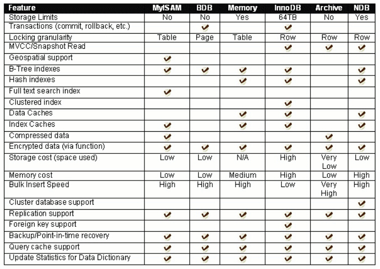

### 存储引擎介绍

```
InnoDB
MySql 5.6 版本默认的存储引擎。InnoDB 是一个事务安全的存储引擎，它具备提交、回滚以及崩溃恢复的功能以保护用户数据。InnoDB 的行级别锁定以及 Oracle 风格的一致性无锁读提升了它的多用户并发数以及性能。InnoDB 将用户数据存储在聚集索引中以减少基于主键的普通查询所带来的 I/O 开销。为了保证数据的完整性，InnoDB 还支持外键约束。

MyISAM
MyISAM既不支持事务、也不支持外键、其优势是访问速度快，但是表级别的锁定限制了它在读写负载方面的性能，因此它经常应用于只读或者以读为主的数据场景。

Memory
在内存中存储所有数据，应用于对非关键数据由快速查找的场景。Memory类型的表访问数据非常快，因为它的数据是存放在内存中的，并且默认使用HASH索引，但是一旦服务关闭，表中的数据就会丢失

BLACKHOLE
黑洞存储引擎，类似于 Unix 的 /dev/null，Archive 只接收但却并不保存数据。对这种引擎的表的查询常常返回一个空集。这种表可以应用于 DML 语句需要发送到从服务器，但主服务器并不会保留这种数据的备份的主从配置中。

CSV
它的表真的是以逗号分隔的文本文件。CSV 表允许你以 CSV 格式导入导出数据，以相同的读和写的格式和脚本和应用交互数据。由于 CSV 表没有索引，你最好是在普通操作中将数据放在 InnoDB 表里，只有在导入或导出阶段使用一下 CSV 表。

NDB
(又名 NDBCLUSTER)——这种集群数据引擎尤其适合于需要最高程度的正常运行时间和可用性的应用。注意：NDB 存储引擎在标准 MySql 5.6 版本里并不被支持。目前能够支持

MySql 集群的版本有：基于 MySql 5.1 的 MySQL Cluster NDB 7.1；基于 MySql 5.5 的 MySQL Cluster NDB 7.2；基于 MySql 5.6 的 MySQL Cluster NDB 7.3。同样基于 MySql 5.6 的 MySQL Cluster NDB 7.4 目前正处于研发阶段。

Merge
允许 MySql DBA 或开发者将一系列相同的 MyISAM 表进行分组，并把它们作为一个对象进行引用。适用于超大规模数据场景，如数据仓库。

Federated
提供了从多个物理机上联接不同的 MySql 服务器来创建一个逻辑数据库的能力。适用于分布式或者数据市场的场景。

Example
这种存储引擎用以保存阐明如何开始写新的存储引擎的 MySql 源码的例子。它主要针对于有兴趣的开发人员。这种存储引擎就是一个啥事也不做的 "存根"。你可以使用这种引擎创建表，但是你无法向其保存任何数据，也无法从它们检索任何索引
```

### 存储引擎适用场景

- InnoDB

  用于事务处理应用程序，支持外键和行级锁。如果应用对事物的完整性有比较高的要求，在并发条件下要求数据的一致性，数据操作除了插入和查询之外，还包括很多更新和删除操作，那么InnoDB存储引擎是比较合适的。InnoDB除了有效的降低由删除和更新导致的锁定，还可以确保事务的完整提交和回滚，对于类似计费系统或者财务系统等对数据准确要求性比较高的系统都是合适的选择

- MyISAM

  如果应用是以读操作和插入操作为主，只有很少的更新和删除操作，并且对事务的完整性、并发性要求不高，那么可以选择这个存储引擎

- Memory

  将所有的数据保存在内存中，在需要快速定位记录和其他类似数据的环境下，可以提供极快的访问。Memory的缺陷是对表的大小有限制，虽然数据库因为异常终止的话数据可以正常恢复，但是一旦数据库关闭，存储在内存中的数据都会丢失

### 存储引擎在mysql的使用

```
查看当前的默认存储引擎:
mysql> show variables like "default_storage_engine";

查询当前数据库支持的存储引擎
mysql> show engines \G;

建表时指定存储引擎
mysql> create table ai(id bigint(12),name varchar(200)) ENGINE=MyISAM; 
mysql> create table country(id int(4),cname varchar(50)) ENGINE=InnoDB;
也可以使用alter table语句，修改一个已经存在的表的存储引擎
mysql> alter table ai engine = innodb;

配置文件中指定存储引擎
# my.ini文件
[mysqld]
default-storage-engine=INNODB
```

### mysql工作流程

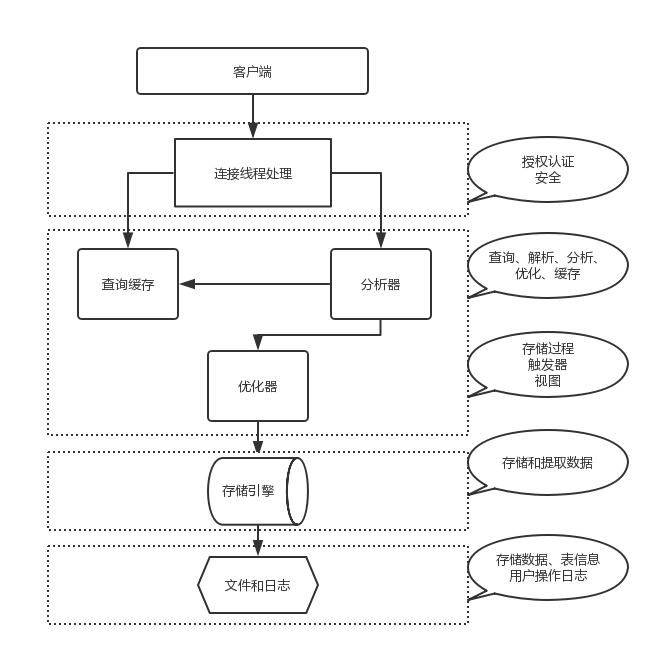

MySQL架构总共四层，在上图中以虚线作为划分。 

- 首先，最上层的服务并不是MySQL独有的，大多数给予网络的客户端/服务器的工具或者服务都有类似的架构。比如：连接处理、授权认证、安全等。 
- 第二层的架构包括大多数的MySQL的核心服务。包括：查询解析、分析、优化、缓存以及所有的内置函数（例如：日期、时间、数学和加密函数）。同时，所有的跨存储引擎的功能都在这一层实现：存储过程、触发器、视图等。
- 第三层包含了存储引擎。存储引擎负责MySQL中数据的存储和提取。服务器通过API和存储引擎进行通信。这些接口屏蔽了不同存储引擎之间的差异，使得这些差异对上层的查询过程透明化。存储引擎API包含十几个底层函数，用于执行“开始一个事务”等操作。但存储引擎一般不会去解析SQL（InnoDB会解析外键定义，因为其本身没有实现该功能），不同存储引擎之间也不会相互通信，而只是简单的响应上层的服务器请求。
- 第四层包含了文件系统，所有的表结构和数据以及用户操作的日志最终还是以文件的形式存储在硬盘上

## 索引

### 介绍

```
需求:
　　一般的应用系统，读写比例在10:1左右，而且插入操作和一般的更新操作很少出现性能问题，在生产环境中，我们遇到最多的，也是最容易出问题的，还是一些复杂的查询操作，因此对查询语句的优化显然是重中之重。
说起加速查询，就不得不提到索引了
```

- 索引简单的说,相当于图书的目录,可以帮助用户快速的找到需要的内容

  在MySQL中也叫做“键”，是存储引擎用于快速找到记录的一种数据结构。能够大大提高查询效率。特别是当数据量非常大，查询涉及多个表时，使用索引往往能使查询速度加快成千上万倍

- **索引本质：通过不断地缩小想要获取数据的范围来筛选出最终想要的结果，同时把随机的事件变成顺序的事件，也就是说，有了这种索引机制，我们可以总是用同一种查找方式来锁定数据**

### B+TREE索引

- B+树是一种经典的数据结构，由**平衡树**和**二叉查找树**结合产生，它是为磁盘或其它直接存取辅助设备而设计的一种**平衡查找树**，在B+树中，所有的记录节点都是按键值大小顺序存放在同一层的叶节点中，叶节点间用指针相连，构成双向循环链表，非叶节点（根节点、枝节点）只存放键值，不存放实际数据。下面看一个2层B+树的例子

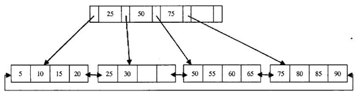

- 注意:通常其高度都在2~3层，查询时可以有效减少IO次数


系统从磁盘读取数据到内存时是以磁盘块（block）为基本单位的，位于同一磁盘块中的数据会被一次性读取出来，而不是按需读取。InnoDB 存储引擎使用页作为数据读取单位，页是其磁盘管理的最小单位，默认 page 大小是 16kB

#### 查找过程

如图所示，如果要查找数据项30，那么首先会把磁盘块1由磁盘加载到内存，此时发生一次IO，在内存中用二分查找确定30在28和65之间，锁定磁盘块1的P2指针，内存时间因为非常短（相比磁盘的IO）可以忽略不计，通过磁盘块1的P2指针的磁盘地址把磁盘块由磁盘加载到内存，发生第二次IO，30在28和35之间，锁定当前磁盘块的P1指针，通过指针加载磁盘块到内存，发生第三次IO，同时内存中做二分查找找到30，结束查询，总计三次IO。真实的情况是，3层的b+树可以表示上百万的数据，如果上百万的数据查找只需要三次IO，性能提高将是巨大的，如果没有索引，每个数据项都要发生一次IO，那么总共需要百万次的IO，显然成本非常非常高

**强烈注意: 索引字段要尽量的小,磁盘块可以存储更多的索引**

### HASH索引

- hash就是一种（key=>value）形式的键值对,允许多个key对应相同的value，但不允许一个key对应多个value,为某一列或几列建立hash索引，就会利用这一列或几列的值通过一定的算法计算出一个hash值，对应一行或几行数据.   hash索引可以一次定位，不需要像树形索引那样逐层查找,因此具有极高的效率.

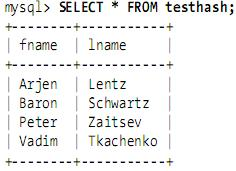

假设索引使用hash函数f( )

```
f('Arjen') = 2323
f('Baron') = 7437
f('Peter') = 8784
f('Vadim') = 2458
```

此时，索引的结构大概如下


### B+TREE和HASH索引的比较

```
hash类型的索引：查询单条快，范围查询慢
btree类型的索引：b+树，层数越多，数据量越大,范围查询和随机查询快（innodb默认索引类型）

不同的存储引擎支持的索引类型也不一样
InnoDB 支持事务，支持行级别锁定，支持 Btree、Hash 等索引，不支持Full-text 索引；
MyISAM 不支持事务，支持表级别锁定，支持 Btree、Full-text 等索引，不支持 Hash 索引；
Memory 不支持事务，支持表级别锁定，支持 Btree、Hash 等索引，不支持 Full-text 索引；
NDB 支持事务，支持行级别锁定，支持 Hash 索引，不支持 Btree、Full-text 等索引；
Archive 不支持事务，支持表级别锁定，不支持 Btree、Hash、Full-text 等索引；
```

### 索引类型

- 四种分类

  普通索引, 唯一索引, 主键索引, 组合索引

#### 普通索引

- **普通索引仅有一个功能：加速查询**

- 创建表 + 索引

  ```sql
  -- 创建表同时添加name字段为普通索引
  create table tb1(
     id int not null auto_increment primary key,
     name varchar(100) not null,
     index idx_name(name)  
  );
  ```

- 创建索引

  ```sql
  -- 单独为表指定普通索引
  create index idx_name on tb1(name);
  ```

- 删除索引

  ```sql
  drop index idx_name on tb1;
  ```

- 查看索引

  ```sql
  show index from tb1;
  ```

  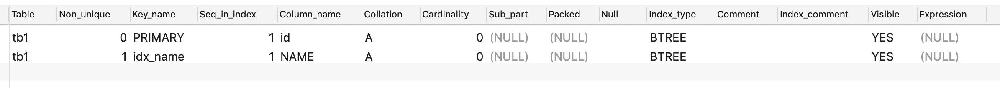

  ```
  -- 列的介绍
  1、 Table 表的名称。
  2、 Non_unique 如果索引为唯一索引,则为0,如果可以则为1。
  3、 Key_name 索引的名称
  4、 Seq_in_index 索引中的列序列号，从1开始。
  5、 Column_name 列名称。
  6、 Collation 列以什么方式存储在索引中。在MySQL中，有值‘A’（升序）或NULL（无分类）。
  7、 Cardinality 索引中唯一值的数目的估计值。
  8、 Sub_part 如果列只是被部分地编入索引，则为被编入索引的字符的数目。如果整列被编入索引，则为NULL。
  9、 Packed 指示关键字如何被压缩。如果没有被压缩，则为NULL。
  10、Null 如果列含有NULL，则含有YES。如果没有，则该列含有NO。
  11、Index_type 用过的索引方法（BTREE, FULLTEXT, HASH, RTREE）。
  12、Comment 多种评注
  ```

#### 唯一索引

- **唯一索引有两个功能：加速查询 和 唯一约束（可含一个null 值）**

- 创建表 + 唯一索引

  ```sql
  create table tb2(
    id int not null auto_increment primary key,
    name varchar(50) not null,
    age int not null,
    unique index idx_age (age)   
  )
  ```

- 创建唯一索引

  ```sql
  create unique index idx_age on tb2(age);
  ```

#### 主键索引

- **主键有两个功能：加速查询 和 唯一约束（不可含null）**

- 注意:一个表中最多只能有一个主键索引

- 创建表 + 主键索引

  ```sql
  # 方式一:
  create table tb3(
     id int not null auto_increment primary key,
     name varchar(50) not null,
     age int default 0 
  );
  
  # 方式二:
  create table tb3(
     id int not null auto_increment,
     name varchar(50) not null,
     age int default 0 ,
     primary key(id)
  );
  ```

- 创建主键

  ```sql
  alter table tb3 add primary key(id);
  ```

- 删除主键

  ```sql
  # 方式一
  alter table tb3 drop primary key;
  
  # 方式二:
  # 如果当前主键为自增主键,则不能直接删除.需要先修改自增属性,再删除
  alter table tb3 modify id int ,drop primary key;
  ```

#### 组合索引

- 组合索引是将n个列组合成一个索引

- 其应用场景为：频繁的同时使用n列来进行查询，如：where n1 = 'alex' and n2 = 666

- 创建表 + 组合索引

  ```sql
  create table tb4(
    id int not null ,
    name varchar(50) not null,
    age int not null,
    index idx_name_age (name,age)   
  )
  ```

- 创建组合索引

  ```sql
  create index idx_name_age on tb4(name,age);
  ```

- 组合索引使用场景

  ```
  举个例子来说，比如你在为某商场做一个会员卡的系统。
  
  这个系统有一个会员表
  有下列字段：
  会员编号 INT
  会员姓名 VARCHAR(10)
  会员身份证号码 VARCHAR(18)
  会员电话 VARCHAR(10)
  会员住址 VARCHAR(50)
  会员备注信息 TEXT
  
  那么这个 会员编号，作为主键，使用 PRIMARY
  会员姓名 如果要建索引的话，那么就是普通的 INDEX
  会员身份证号码 如果要建索引的话，那么可以选择 UNIQUE （唯一的，不允许重复）
  ```

### 聚合索引和辅助索引

- **数据库中的B+树索引可以分为聚集索引和辅助索引**

#### 聚集索引

- InnoDB表 索引组织表, 即表中数据按主键B+树存放, 叶子节点直接存放整条数据, 每张表只能有一个聚集索引

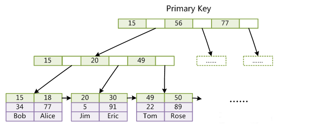

```
1.当你定义一个主键时，InnnodDB存储引擎则把它当做聚集索引
2.如果你没有定义一个主键，则InnoDB定位到第一个唯一索引，且该索引的所有列值均飞空的，则将其当做聚集索引。
3.如果表没有主键或合适的唯一索引INNODB会产生一个隐藏的行ID值6字节的行ID聚集索引，
补充：由于实际的数据页只能按照一颗B+树进行排序，因此每张表只能有一个聚集索引，聚集索引对于主键的排序和范围查找非常有利.
```

#### 辅助索引

- （也称非聚集索引）是指叶节点不包含行的全部数据，叶节点除了包含键值之外，还包含一个书签连接，通过该书签再去找相应的行数据

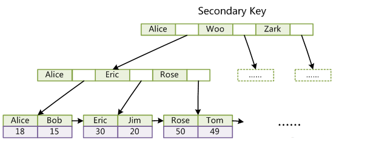

- 查找方式

  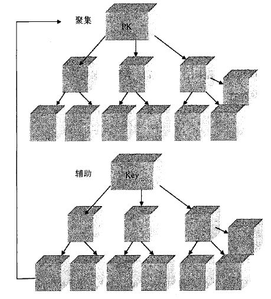

  从上图中可以看出，辅助索引叶节点存放的是主键值，获得主键值后，再从聚集索引中查找整行数据。举个例子，如果在一颗高度为3的辅助索引中查找数据，首先从辅助索引中获得主键值（3次IO），接着从高度为3的聚集索引中查找以获得整行数据（3次IO），总共需6次IO。一个表上可以存在多个辅助索引

#### 聚集索引和辅助索引的区别

- 相同

  不管是聚集索引还是辅助索引，其内部都是B+树的形式，即高度是平衡的，叶子结点存放着所有的数据

- 不同

  聚集索引叶子结点存放的是一整行的信息,而辅助索引叶子结点存放的是单个索引列信息

#### 何时使用聚集索引或非聚集索引

|      动作描述      | 使用聚集索引 | 使用非聚集索引 |
| :----------------: | :----------: | :------------: |
|  列经常被分组排序  |      应      |       应       |
| 返回某范围内的数据 |      应      |      不应      |
|  一个或极少不同值  |     不应     |      不应      |
|    频繁更新的列    |     不应     |       应       |
|       外键列       |      应      |       应       |
|       主键列       |      应      |       应       |
|   频繁修改索引列   |     不应     |       应       |

### 索引的正确使用方式

```sql
#1. 范围查询(>、>=、<、<=、!= 、between...and)
    #1. = 等号
    select count(*) from userinfo where id = 1000 -- 执行索引,索引效率高
    
    #2. > >= < <= between...and 区间查询
    select count(*) from userinfo where id <100; -- 执行索引,区间范围越小,索引效率越高
    
    select count(*) from userinfo where id >100; -- 执行索引,区间范围越大,索引效率越低
    
    select count(*) from userinfo where id between 10 and 500000; -- 执行索引,区间范围越大,索引效率越低
    
   #3. != 不等于
   select count(*) from userinfo where id != 1000;  -- 索引范围大,索引效率低
   
   
#2.like '%xx%'
    #为 name 字段添加索引
    create index idx_name on userinfo(name);
    
    select count(*) from userinfo where name like '%xxxx%'; -- 全模糊查询,索引效率低
    select count(*) from userinfo where name like '%xxxx';   -- 以什么结尾模糊查询,索引效率低
  
    #例外: 当like使用以什么开头会索引使用率高
    select * from userinfo where name like 'xxxx%'; 

#3. or 
    select count(*) from userinfo where id = 12334 or email ='xxxx'; -- email不是索引字段,索引此查询全表扫描
    
    #例外：当or条件中有未建立索引的列才失效，以下会走索引
    select count(*) from userinfo where id = 12334 or name = 'alex3'; -- id 和 name 都为索引字段时, or条件也会执行索引

#4.使用函数
    select count(*) from userinfo where reverse(name) = '5xela'; -- name索引字段,使用函数时,索引失效
    
    #例外:索引字段对应的值可以使用函数,我们可以改为一下形式
    select count(*) from userinfo where name = reverse('5xela');

#5.类型不一致
    #如果列是字符串类型，传入条件是必须用引号引起来，不然...
    select count(*) from userinfo where name = 454;
        
    #类型一致
    select count(*) from userinfo where name = '454';

#6.order by
    #排序条件为索引，则select字段必须也是索引字段，否则无法命中  
    select email from userinfo ORDER BY name DESC; -- 无法命中索引

    select name from userinfo ORDER BY name DESC;  -- 命中索引
        
    #特别的:如果对主键排序，则还是速度很快：
    select id from userinfo order by id desc;
```

### 组合索引

- 是指对表上的多个列组合起来做一个索引
- 优点
  1. "一个顶三个"。建了一个(a,b,c)的组合索引，那么实际等于建了(a),(a,b),(a,b,c)三个索引，因为每多一个索引，都会增加写操作的开销和磁盘空间的开销。对于大量数据的表，这可是不小的开销！
  2. 索引列越多，通过索引筛选出的数据越少。有1000W条数据的表，有如下sql:select * from table where a = 1 and b =2 and c = 3,假设假设每个条件可以筛选出10%的数据，如果只有单值索引，那么通过该索引能筛选出1000W*10%=100w 条数据，然后再回表从100w条数据中找到符合b=2 and c= 3的数据，然后再排序，再分页；如果是组合索引，通过索引筛选出1000w *10% *10% *10%=1w，然后再排序、分页，哪个更高效，一眼便知

#### 最左匹配原则

- 从左往右依次使用生效，如果中间某个索引没有使用，那么断点前面的索引部分起作用，断点后面的索引没有起作用

```sql
select * from mytable where a=3 and b=5 and c=4;
　  #abc三个索引都在where条件里面用到了，而且都发挥了作用

select * from mytable where  c=4 and b=6 and a=3;
　　#这条语句列出来只想说明 mysql没有那么笨，where里面的条件顺序在查询之前会被mysql自动优化，效果跟上一句一样

select * from mytable where a=3 and c=7;
　　#a用到索引，b没有用，所以c是没有用到索引效果的

select * from mytable where a=3 and b>7 and c=3;
　　#a用到了，b也用到了，c没有用到，这个地方b是范围值，也算断点，只不过自身用到了索引

select * from mytable where b=3 and c=4;
　　#因为a索引没有使用，所以这里 bc都没有用上索引效果

select * from mytable where a>4 and b=7 and c=9;
　　#a用到了  b没有使用，c没有使用

select * from mytable where a=3 order by b;
　　#a用到了索引，b在结果排序中也用到了索引的效果

select * from mytable where a=3 order by c;
　　#a用到了索引，但是这个地方c没有发挥排序效果，因为中间断点了

select * from mytable where b=3 order by a;
　　#b没有用到索引，排序中a也没有发挥索引效果
```

### 索引的注意事项

```
1. 避免使用select *
2. 其他数据库中使用count(1)或count(列) 代替 count(*),而mysql数据库中count(*)经过优化后,效率与前两种基本一样.
3. 创建表时尽量时 char 代替 varchar
4. 表的字段顺序固定长度的字段优先
5. 组合索引代替多个单列索引（经常使用多个条件查询时）
6. 使用连接（JOIN）来代替子查询(Sub-Queries)
7. 不要有超过4个以上的表连接（JOIN）
8. 优先执行那些能够大量减少结果的连接。
9. 连表时注意条件类型需一致
10.索引散列值不适合建索引，例：性别不适合
```

## 查询计划

- **explain + 查询SQL - 用于显示SQL执行信息参数，根据参考信息可以进行SQL优化**

```sql
explain  select count(*) from userinfo where  id = 1;
```


```
执行计划：让mysql预估执行操作(一般正确)
type : 查询计划的连接类型, 有多个参数，先从最佳类型到最差类型介绍

性能： null > system/const > eq_ref > ref > ref_or_null > index_merge >  range > index >  all 

慢：
	explain select * from userinfo where email='alex';
	type: ALL(全表扫描)
	特别的: select * from userinfo limit 1;
快：
	explain select * from userinfo where name='alex';
	type: ref(走索引)
```

### 介绍

- EXPLAIN 命令用于SQL语句的**查询执行计划**。这条命令的输出结果能够让我们了解MySQL 优化器是如何执行SQL 语句的。这条命令并没有提供任何调整建议，但它能够提供重要的信息帮助你做出调优决策

```sql
EXPLAIN SELECT  * FROM person,dept WHERE person.dept_id = dept.did and person.salary >20000
```

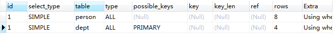

#### id: 查询序号列

```sql
EXPLAIN select * from person where dept_id =(select did from dept where dname ='python');
```

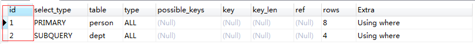

- 从 2 个表中查询，对应输出 2 行，每行对应一个表， id 列表示执行顺序，id 越大，越先执行，id 相同时，由上至下执行

#### select_type : 查询类型

select_type 列提供了 对表的查询类型。最常见的值包括**SIMPLE、PRIMARY、DERIVED 和UNION**。其他可能的值还有 **UNION RESULT**、**SUBQUERY 等等**

- simple 简单查询 (没有union和子查询)

  对于不包含子查询和其他复杂语法的简单查询，这是一个常见的类型

  

- primary  最外层查询 (在存在子查询的语句中，最外面的select查询就是primary)

  这是为更复杂的查询而创建的首要表(也就是最外层的表)。这个类型通常可以在DERIVED 和 UNION 类型混合使用时见到

- derived   子查询(在FROM列表中包含的子查询)

  当一个表不是一个物理表时，那么这个就被叫做DERIVED

  ```sql
  EXPLAIN SELECT *FROM (SELECT* FROM person LIMIT 5) AS s
  ```

  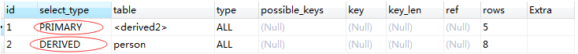

- subquery   映射为子查询(在SELECT或WHERE列表中包含了子查询)

  这个select-type 的值是为使用子查询而定义的

  ```sql
  EXPLAIN SELECT person.*,(select 2 from person as p2) FROM person where dept_id = (select did from dept where dname='python');
  ```

  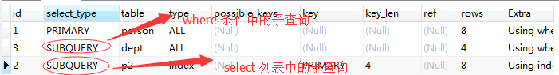

- union 联合

  ```sql
  EXPLAIN SELECT * FROM person union all select * from person ;
  ```

  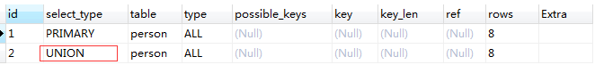

- union result  使用联合的结果

  ```sql
  EXPLAIN SELECT * FROM person union  select * from person ;
  ```

  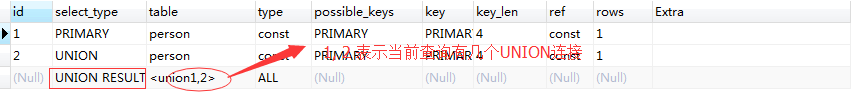

#### table 输出的行所用的表

```sql
EXPLAIN SELECT * FROM person;
```

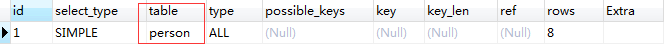

注意: table 列是EXPLAIN 命令输出结果中的一个单独行的唯一标识符。这个值可能是表名、表的别名或者一个为查询产生临时表的标识符，如派生表、子查询或集合

#### type 连接类型

type 列代表表示 查询计划的连接类型, 有多个参数，先从最佳类型到最差类型介绍 重要且困难

**性能： null > system/const > eq_ref > ref > ref_or_null  >index_merge >  range > index >  all** 

- type=NULL　在优化过程中就已得到结果，不用再访问表或索引

  ```sql
  EXPLAIN SELECT max(id) FROM person;
  ```

  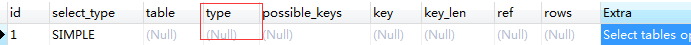

- type=const/system 常量

  在整个查询过程中这个表最多只会有一条匹配的行，比如主键 id=1 就肯定只有一行；

  表最多有一个匹配行，const用于比较primary key 或者unique索引。因为只匹配一行数据，所以一定是用到primary key 或者unique 情况下才会是const,看下面这条语句

  ```sql
  EXPLAIN SELECT * FROM person where id =2;
  ```

  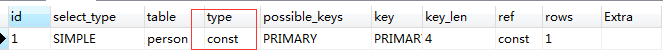

  所以说可以理解为const是最优化的

- type=eq_ref  使用有唯一性 索引查找（主键或唯一性索引）

  对于eq_ref的解释，mysql手册是这样说的:"对于每个来自于前面的表的行组合，从该表中读取一行。这可能是最好的联接类型，除了const类型。它用在一个索引的所有部分被联接使用并且索引是UNIQUE或PRIMARY KEY"。eq_ref可以用于使用=比较带索引的列

  ```sql
  EXPAIN select * from person,dept where person.id = dept.did;
  ```

  得到的结果是下图所示。很明显，mysql使用eq_ref联接来处理 dept 表

  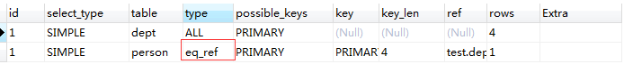

- type=ref　非唯一性索引访问

  这是一种索引访问（有时也叫做索引查找），它返回所有匹配某个单个值的行，然而，它可能会找到多个符合条件的行。因此，它是查找和扫描的混合体，此类索引访问只有当使用非唯一性索引或者唯一性索引的非唯一性前缀时才会发生。把它叫做ref是因为索引要跟某个参考值相比较。这个参考值或者是一个常数，或者是来自多表查询前一个表里的结果值

  ```sql
  EXPLAIN select * from person where name='alex';
  ```

  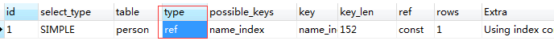

- ref_or_null 该联接类型如同ref类似,结果包含空行

- type=range

  索引范围扫描，常见于　<,<=,>,>=,between,in等操作符

  ```sql
  EXPLAIN select * from person where id BETWEEN 1 and 5;
  ```

  


- type=index  

  该联接类型与ALL相同都是扫描表，但index只对索引树进行扫描，而ALL是是对数据表文件的扫描。这通常比ALL快，因为索引文件通常比数据文件小。（也就是说虽然all和Index都是读全表，但index是从索引中读取的，而all是从硬盘中读的）主要优点是避免了排序，因为索引是排好序的

  Extra列中看到“Using index”，说明mysql正在使用覆盖索引，只扫描索引的数据

  ```sql
  EXPLAIN select id,name from person;
  ```

  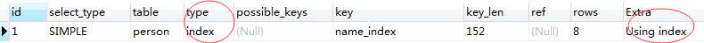

- type=ALL 

  对于每个来自于先前的表的行组合，进行完整的表扫描。如果表是第一个没标记const的表，这通常不好，并且通常在它情况下**很**差。通常可以增加更多的索引而不要使用ALL，使得行能基于前面的表中的常数值或列值被检索出

  ```sql
  EXPLAIN select * from person;
  ```

  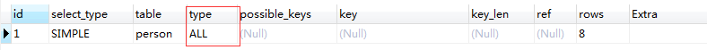

#### possible_keys

- 该 possible_keys列表示MySQL可以从中选择查找表中的行的索引。如果此列是NULL，则没有相关的索引。在这种情况下，您可以通过检查WHERE 子句来检查是否引用某些适合索引的列，从而提高查询的性能。如果是这样，请创建一个适当的索引并使用 EXPLAIN再次检查查询 。

- 另外如果这个列出现大量可能被使用的索引(例如多于3 个), 那么这 意味着备选索引数量太多了，同时也可能提示存在无效的索引

#### key

- 该key 列指出mysql优化器决定选择使用哪个索引来优化对该表的访问。一般来说SQL查询中的每个表都只会使用一个索引。但是也存在索引合并的少数例外情况，如给定表上用到了两个或者更多索引。查询过程中由优化器来决定实际使用的索引。如果possible_keys索引列表中没有适合查找行的索引，那么这个key可能会命名一个不存在于该possible_keys值中的索引 。简单且重要

#### key_len

- 该key_len 列定义了mysql在索引里使用的字节数。如果mysql正在使用的只是索引里的某些列，那么就可以用这个值来算出具体是哪些列。在mysql5.5及以前的版本里，只能使用索引的最左前缀。例如，sakila.film_actor的主键是两个SMALLINT列，并且每个SMALLINT列是两个字节，那么索引中的每项是4个字节。也即说明key_len通过查找表的定义而被计算出，而不是表中的数据。

- 在不损失精确性的情况下，长度越短越好

#### ref

ref 列显示使用哪个列或常数与key一起从表中选择数据行。指出对 key 列所选择的索引的查找方式，常见的值有 const, func, NULL, 具体字段名。当 key 列为 NULL ，即不使用索引时 。如果值是func，则使用的值是某个函数的结果

```
create table a11(id int primary key, age int);
insert into a11 value(1, 10),(2, 10);

mysql> desc select * from a11 where age=10;
+----+-------------+-------+------+---------------+------+---------+------+------+-------------+
| id | select_type | table | type | possible_keys | key  | key_len | ref  | rows | Extra       |
+----+-------------+-------+------+---------------+------+---------+------+------+-------------+
|  1 | SIMPLE      | a11   | ALL  | NULL          | NULL | NULL    | NULL |    2 | Using where |
+----+-------------+-------+------+---------------+------+---------+------+------+-------------+
注意:当 key 列为 NULL ， ref 列也相应为 NULL 。

mysql> desc select * from a11 where id=1;
+----+-------------+-------+-------+---------------+---------+---------+-------+------+-------+
| id | select_type | table | type  | possible_keys | key     | key_len | ref   | rows | Extra |
+----+-------------+-------+-------+---------------+---------+---------+-------+------+-------+
|  1 | SIMPLE      | a11   | const | PRIMARY       | PRIMARY | 4       | const |    1 |       |
+----+-------------+-------+-------+---------------+---------+---------+-------+------+-------+

注意:这次 key 列使用了主键索引，where id=1 中 1 为常量， ref 列的 const 便是指这种常量。
```

#### row

- 这一列是mysql评估 为了找到所需的行而要读取的行数。这个数字是内嵌循环关联计划里的循环数目，也就是说它不是mysql认为它最终要从表里读取出来的行数，而是mysql为了找到符合查询的每一点上标准的那些行而必须读取的行的平均数。

- rows 列提供了试图分析所有存在于累计结果集中的行数目的MySQL 优化器估计值。执行计划很容易描述这个很困难的统计量。

- 查询中总的读操作数量是基于合并之前行的每一行的rows 值的连续积累而得出的。这是一种嵌套行算法。

- 简单且重要，数值越大越不好，说明没有用好索引

#### extra

该列包含 MySQL 查询的详细信息

- Not exists : 不存在信息

- range checked for each record :没有找到合适的索引

- Using index condition :出现这个说明mysql使用了覆盖索引，避免访问了表的数据行，效率不错

  ```
  建表及插入数据：
  create table a13 (id int primary key, age int);
  insert into a13 value(1, 10),(2, 10);
  mysql> explain select id from a13;
  +----+-------------+-------+------------+-------+---------------+---------+---------+------+------+----------+-------------+
  | id | select_type | table | partitions | type | possible_keys | key | key_len | ref | rows | Extra |
  +----+-------------+-------+------------+-------+---------------+---------+---------+------+------+----------+-------------+
  | 1  | SIMPLE        | a13   | NULL         | index | NULL            | PRIMARY | 4   | NULL|  2   | Using index |
  +----+-------------+-------+------------+-------+---------------+---------+---------+------+------+----------+-------------+
  因为 id 为主键索引，索引中直接包含了 id 的值，所以无需访问表，直接查找索引就能返回结果。
  
  mysql> explain select age from a13;
  +----+-------------+-------+------------+------+---------------+------+---------+------+------+----------+-------+
  | id | select_type | table | partitions | type | possible_keys | key | key_len | ref | rows | Extra |
  +----+-------------+-------+------------+------+---------------+------+---------+------+------+----------+-------+
  | 1  | SIMPLE        | a13   | NULL         | ALL  | NULL            | NULL |  NULL  | NULL|  2   |  NULL |
  +----+-------------+-------+------------+------+---------------+------+---------+------+------+----------+-------+
  age 列没有索引，因此没有 Using index ，意即需要访问表。
  为 age 列添加索引：
  create table a14 (id int primary key, age int);
  insert into a14 value(1, 10),(2, 10);
  create index age on a14(id, age);
  mysql> explain select age from a14;
  +----+-------------+-------+------------+-------+---------------+------+---------+------+------+----------+-------------+
  | id | select_type | table | partitions | type | possible_keys | key | key_len | ref | rows |  Extra |
  +----+-------------+-------+------------+-------+---------------+------+---------+------+------+----------+-------------+
  | 1  | SIMPLE      | a14   | NULL       | index|     NULL        | age |       9    | NULL| 2     |Using index |
  +----+-------------+-------+------------+-------+---------------+------+---------+------+------+----------+-------------+
  现在索引 age 中也包含了 age 列的值，因此不用访问表便能返回结果了。
  ```

- using temporary ：mysql对查询结果进行排序的时候使用了一张临时表

  ```
  mysql> EXPLAIN SELECT p.id,d.did from person p LEFT JOIN dept d ON p.dept_id = d.did group by p.dept_id ORDER BY p.dept_id;
  +----+-------------+-------+--------+---------------+---------+---------+------------+------+---------------------------------+
  | id | select_type | table | type   | possible_keys | key     | key_len | ref        | rows | Extra                           |
  +----+-------------+-------+--------+---------------+---------+---------+------------+------+---------------------------------+
  |  1 | SIMPLE      | p     | ALL    | NULL          | NULL    | NULL    | NULL       |    8 | Using temporary; Using filesort |
  |  1 | SIMPLE      | d     | eq_ref | PRIMARY       | PRIMARY | 4       | test.p.dept_id| 1 | Using where; Using index        |
  
  我们发现在执行这条SQL语句时出现了 using temporary,我们再来看看下面这条SQL语句,去掉 条件中 group by 分组
  
  mysql> EXPLAIN SELECT p.id,d.did from person p LEFT JOIN dept d ON p.dept_id = d.did ORDER BY p.dept_id;
  +----+-------------+-------+--------+---------------+---------+---------+------------+------+--------------------------+
  | id | select_type | table | type   | possible_keys | key     | key_len | ref        | rows | Extra                    |
  +----+-------------+-------+--------+---------------+---------+---------+------------+------+--------------------------+
  |  1 | SIMPLE      | p     | ALL    | NULL          | NULL    | NULL    | NULL       |    8 | Using filesort           |
  |  1 | SIMPLE      | d     | eq_ref | PRIMARY       | PRIMARY | 4       | test.p.dept_id|1  | Using where; Using index |
  +----+-------------+-------+--------+---------------+---------+---------+------------+------+--------------------------+
  
  而为什么第一个用了临时表，而第二个没有用呢？
  因为如果有GROUP BY子句，或者如果GROUP BY中的字段都来自其他的表而非连接顺序中的第一个表的话，就会创建一个临时表了。
  
  那么如何解决呢?
  咱们为group by 字段添加一个索引 
  
  mysql> alter table person add index did_idx(dept_id);
  Query OK, 0 rows affected
  
  mysql> EXPLAIN SELECT p.id,d.did from person p LEFT JOIN dept d ON p.dept_id = d.did group by p.dept_id ORDER BY p.dept_id;
  +----+-------------+-------+--------+---------------+---------+---------+------------+------+--------------------------+
  | id | select_type | table | type   | possible_keys | key     | key_len | ref        | rows | Extra                    |
  +----+-------------+-------+--------+---------------+---------+---------+------------+------+--------------------------+
  |  1 | SIMPLE      | p     | index  | NULL          | did_idx | 5       | NULL       |    8 | Using index              |
  |  1 | SIMPLE      | d     | eq_ref | PRIMARY       | PRIMARY | 4       | test.p.dept_id| 1 | Using where; Using index |
  +----+-------------+-------+--------+---------------+---------+---------+------------+------+--------------------------+
  
  为什么添加个索引就不会创建临时表了呢? 原因就在于 SQL查询时优先在索引树中执行,如果索引树满足不了当前SQL,才会进行数据表查询,那么现在加了索引,
  已经可以满足查询条件了,就没有必要创建临时表了
  ```

- using filesort： mysql对数据不是按照表内的索引顺序进行读取,而是使用了其他字段重新排序

  ```
  mysql> EXPLAIN select * from person ORDER BY id;
  +----+-------------+--------+-------+---------------+---------+---------+------+------+-------+
  | id | select_type | table  | type  | possible_keys | key     | key_len | ref  | rows | Extra |
  +----+-------------+--------+-------+---------------+---------+---------+------+------+-------+
  |  1 | SIMPLE      | person | index | NULL          | PRIMARY | 4       | NULL |    8 |       |
  +----+-------------+--------+-------+---------------+---------+---------+------+------+-------+
  如果我们用聚合主键进行排序,则Extra 为null,我们知道在innodb引擎中,主键为聚合索引,插入数据就会排好顺序.最后说明mysql是按照表内的索引顺序进行读的
  
  再看下面的列子:
  mysql> EXPLAIN select * from person ORDER BY salary;
  +----+-------------+--------+------+---------------+------+---------+------+------+----------------+
  | id | select_type | table  | type | possible_keys | key  | key_len | ref  | rows | Extra          |
  +----+-------------+--------+------+---------------+------+---------+------+------+----------------+
  |  1 | SIMPLE      | person | ALL  | NULL          | NULL | NULL    | NULL |    8 | Using filesort |
  +----+-------------+--------+------+---------------+------+---------+------+------+----------------+
  我们使用非主键字段进行排序,这是mysql就不能按照表内的索引顺序进行读了.需要读取数据行后再进行排序处理
  ```

- using where: 表示 MySQL 服务器从存储引擎收到查询数据,再进行“后过滤”（Post-filter）。所谓“后过滤”，就是先读取整行数据，再检查此行是否符合 where 句的条件，符合就留下，不符合便丢弃。因为检查是在读取行后才进行的，所以称为“后过滤”

  ```
  建表及插入数据：
  create table a16 (num_a int not null, num_b int not null, key(num_a));
  insert into a16 value(1,1),(1,2),(2,1),(2,2);
  mysql> explain select * from a16 where num_a=1;
  +----+-------------+-------+------------+------+---------------+-------+---------+-------+------+----------+-------+
  | id | select_type | table | partitions | type | possible_keys | key | key_len | ref | rows | Extra |
  +----+-------------+-------+------------+------+---------------+-------+---------+-------+------+----------+-------+
  | 1  | SIMPLE      | a16   | NULL       | ref  | num_a         | num_a | 4        | const| 2     |  NULL |
  +----+-------------+-------+------------+------+---------------+-------+---------+-------+------+----------+-------+
  
  虽然查询中有 where 子句，但只有 num_a=1 一个条件，且 num_a 列存在索引，通过索引便能确定返回的行，无需进行“后过滤”。
  所以，并非带 WHERE 子句就会显示"Using where"的。
  mysql> explain select * from a16 where num_a=1 and num_b=1;
  +----+-------------+-------+------------+------+---------------+-------+---------+-------+------+----------+-------------+
  | id | select_type | table | partitions | type | possible_keys | key | key_len | ref | rows | Extra |
  +----+-------------+-------+------------+------+---------------+-------+---------+-------+------+----------+-------------+
  | 1  | SIMPLE      | a16   | NULL       | ref  | num_a            | num_a | 4     | const | 2  | Using where |
  +----+-------------+-------+------------+------+---------------+-------+---------+-------+------+----------+-------------+
  
  此查询增加了条件 num_b=1 ，此列没有索引，但可以看到查询同样能使用 num_a 索引。 MySQL 先通过索引 num_a 找到 num_a=1 的行，然后读取整行数据，
  再检查 num_b 是否等于 1 ，执行过程看上去象这样：
  
  num_a索引|num_b 没有索引，属于行数据
  +-------+-------+
  | num_a | num_b | where 子句(num_b=1)
  +-------+-------+
  | 1 | 1 | 符合
  | 1 | 2 | 不符合
  | ... | ... | ...
  +-------+-------+
  ```

#### EXPLAIN结果中哪些信息要引起关注

- 首先看下 **type** 这列的结果，如果有类型是 ALL 时，表示预计会进行全表扫描（full table scan）。通常全表扫描的代价是比较大的，建议创建适当的索引，通过索引检索避免全表扫描。
- 再来看下 **Extra** 列的结果，如果有出现 **Using temporary** 或者 **Using filesort** 则要多加关注：
  - **Using temporary**，表示需要创建临时表以满足需求，通常是因为GROUP BY的列没有索引，或者GROUP BY和ORDER BY的列不一样，也需要创建临时表，建议添加适当的索引。
  - **Using filesort**，表示无法利用索引完成排序，也有可能是因为多表连接时，排序字段不是驱动表中的字段，因此也没办法利用索引完成排序，建议添加适当的索引。
  - **Using where**，通常是因为全表扫描或全索引扫描时（**type** 列显示为 **ALL** 或 **index**），又加上了WHERE条件，建议添加适当的索引。

- 其他状态例如：Using index、Using index condition、Using index for group-by 则都还好

## 慢日志查询

- 将mysql服务器中影响数据库性能的相关SQL语句记录到日志文件，通过对这些特殊的SQL语句分析，改进以达到提高数据库性能的目的

- 慢查询日志参数

  ```
  long_query_time     ：  设定慢查询的阀值，超出设定值的SQL即被记录到慢查询日志，缺省值为10s
  slow_query_log      ：  指定是否开启慢查询日志
  log_slow_queries    ：  指定是否开启慢查询日志(该参数已经被slow_query_log取代，做兼容性保留)
  slow_query_log_file ：  指定慢日志文件存放位置，可以为空，系统会给一个缺省的文件host_name-slow.log
  log_queries_not_using_indexes: 如果值设置为ON，则会记录所有没有利用索引的查询.
  ```

- 查看慢日志信息

  ```sql
  #.查询慢日志配置信息 :
  show variables like '%query%';
  #.修改配置信息
  set global slow_query_log  = on;
  ```

- 查看不使用索引参数状态

  ```sql
  # 显示参数　　
  show variables like '%log_queries_not_using_indexes';
  # 开启状态
  set global log_queries_not_using_indexes  = on;
  ```

- 查看慢日志显示的方式

  ```sql
  # 查看慢日志记录的方式
  show variables like '%log_output%';
   
  # 设置慢日志在文件和表中同时记录
  set global log_output='FILE,TABLE';
  ```

- 测试慢查询日志

  ```sql
  #查询时间超过10秒就会记录到慢查询日志中
  select sleep(3) FROM user ;
   
  #查看表中的日志
  select * from mysql.slow_log;
  ```

## 大数据分页优化

- 代码

  ```sql
  select * from userinfo limit 3000000,10;
  ```

- 优化方案

  **优先考虑方案1, 然后是方案2, 最后是方案3**

  - 方案1

    简单粗暴，就是不允许查看这么靠后的数据，比如百度就是这样的

    

  - 方案2

    在查询下一页时把上一页的行id作为参数传递给客户端程序，然后sql就改成了

    ```sql
    -- 这条语句执行也是在毫秒级完成的，id>300w其实就是让mysql直接跳到这里了，不用依次在扫描全面所有的行
    select * from userinfo where id>3000000 limit 10;
    ```

    如果你的table的主键id是自增的，并且中间没有删除和断点，那么还有一种方式，比如100页的10条数据

    ```sql
    select * from userinfo where id>100*10 limit 10;
    ```

  - 方案3 : 延迟关联

    我们在来分析一下这条语句为什么慢，慢在哪里

    ```sql
    select * from userinfo limit 3000000,10;
    ```

    玄机就处在这个 * 里面，这个表除了id主键肯定还有其他字段  比如 name  age  之类的，因为select  *  所以mysql在沿着id主键走的时候要回行拿数据，走一下拿一下数据

    ```sql
    -- 你会发现时间缩短了一半；然后我们在拿id分别去取10条数据就行了
    select id from userinfo limit 3000000,10;
    
    select table.* from userinfo inner join ( select id from userinfo limit 3000000,10 ) as tmp on tmp.id=userinfo.id;
    ```


