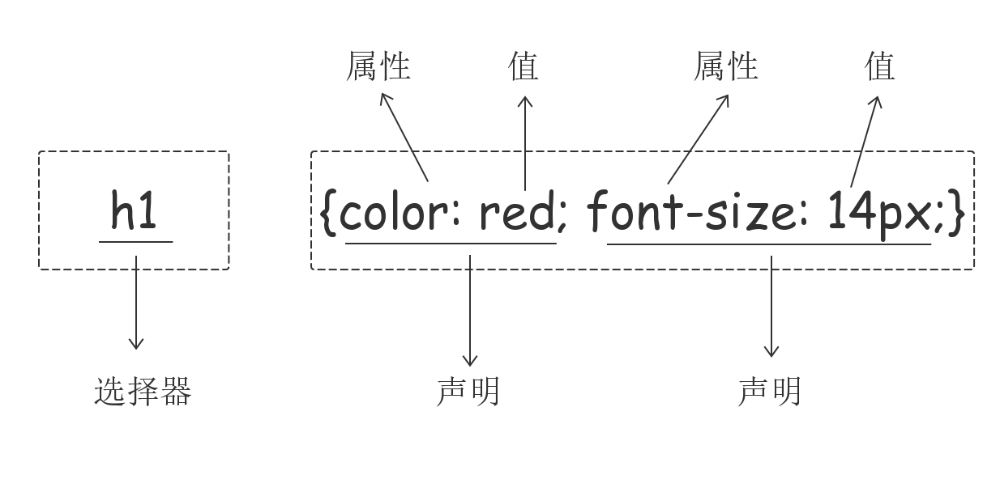

# html与css基础 form表单,input标签,css的引入,css选择器及选择器的优先级

## form表单

### 功能

- 表单用于向服务器传输数据，从而实现用户与Web服务器的交互
- 表单能够包含input系列标签，比如文本字段、复选框、单选框、提交按钮等等
- 表单还可以包含textarea、select、fieldset和 label标签

### 表单属性

|      属性      |                           描述                           |
| :------------: | :------------------------------------------------------: |
| accept-charset |    规定在被提交表单中使用的字符集（默认：页面字符集）    |
|     action     |       规定向何处提交表单的地址（URL）（提交页面）        |
|  autocomplete  |         规定浏览器应该自动完成表单（默认：开启）         |
|    enctype     |        规定被提交数据的编码（默认：url-encoded）         |
|     method     |      规定在提交表单时所用的 HTTP 方法（默认：GET）       |
|      name      | 规定识别表单的名称（对于 DOM 使用：document.forms.name） |
|   novalidate   |                   规定浏览器不验证表单                   |
|     target     |       规定 action 属性中地址的目标（默认：_self）        |

### 表单元素

#### 基本概念

- HTML表单是HTML元素中较为复杂的部分，表单往往和脚本、动态页面、数据处理等功能相结合，因此它是制作动态网站很重要的内容
- 表单一般用来收集用户的输入信息

#### 表单工作原理

- 访问者在浏览有表单的网页时，可填写必需的信息，然后按某个按钮提交。这些信息通过Internet传送到服务器上
- 服务器上专门的程序对这些数据进行处理，如果有错误会返回错误信息，并要求纠正错误。当数据完整无误后，服务器反馈一个输入完成的信息

## input标签

- \<input> 元素会根据不同的 type 属性，变化为多种形态

| type属性值 | 表现形式     | 对应代码                                      |
| ---------- | ------------ | --------------------------------------------- |
| text       | 单行输入文本 | <input type=text" />                          |
| password   | 密码输入框   | \<input type="password"  />                   |
| date       | 日期输入框   | \<input type="date" />                        |
| checkbox   | 复选框       | \<input type="checkbox" checked="checked"  /> |
| radio      | 单选框       | \<input type="radio"  />                      |
| submit     | 提交按钮     | \<input type="submit" value="提交" />         |
| reset      | 重置按钮     | \<input type="reset" value="重置"  />         |
| button     | 普通按钮     | \<input type="button" value="普通按钮"  />    |
| hidden     | 隐藏输入框   | \<input type="hidden"  />                     |
| file       | 文本选择框   | \<input type="file"  />                       |

### 属性说明

- name：表单提交时的“键”，注意和id的区别
- value：表单提交时对应项的值
  - type="button", "reset", "submit"时，为按钮上显示的文本年内容
  - type="text","password","hidden"时，为输入框的初始值
  - type="checkbox", "radio", "file"，为输入相关联的值
- checked：radio和checkbox默认被选中的项
- readonly：text和password设置只读
- disabled：所有input均适用

## select标签

```html
<form action="" method="post">
  <select name="city" id="city">
    <option value="1">北京</option>
    <option selected="selected" value="2">上海</option>
    <option value="3">广州</option>
    <option value="4">深圳</option>
  </select>
</form>
```

### 属性说明

- multiple：布尔属性，设置后为多选，否则默认单选
- disabled：禁用
- selected：默认选中该项
- value：定义提交时的选项值

## label标签

- 定义：\<label> 标签为 input 元素定义标注（标记）

### 说明

- label 元素不会向用户呈现任何特殊效果
- \<label> 标签的 for 属性值应当与相关元素的 id 属性值相同

```html
<form action="">
  <label for="username">用户名</label>
  <input type="text" id="username" name="username">
</form>
```

### textarea多行文本

```html
<textarea name="memo" id="memo" cols="30" rows="10">
  默认内容
</textarea>
```

### 说明

- name：名称
- rows：行数
- cols：列数
- disabled：禁用

## css介绍

- CSS（Cascading Style Sheet，层叠样式表)定义**如何显示**HTML元素
- 当浏览器读到一个样式表，它就会按照这个样式表来对文档进行格式化（渲染）

## css语法

- 每个CSS样式由两个组成部分：选择器和声明。声明又包括属性和属性值。每个声明之后用分号结束



## css注释

```css
/*这是注释*/
```

## css引入的方式

### 行内样式

- 行内式是在标记的style属性中设定CSS样式。**不推荐大规模使用**

```css
<p style="color: red">Hello world.</p>
```

### 内部样式

- 嵌入式是将CSS样式集中写在网页的\<head>\</head>标签对的\<style>\</style>标签对中

```css
<head>
    <meta charset="UTF-8">
    <title>Title</title>
    <style>
        p{
            background-color: #2b99ff;
        }
    </style>
</head>
```

### 外部样式

- 外部样式就是将css写在一个单独的文件中，然后在页面进行引入即可。推荐使用此方式

```css
<link href="mystyle.css" rel="stylesheet" type="text/css"/>
```

## css选择器

### 基本选择器

- 元素选择器

  ```css
  p {color: "red";}
  ```

-  id选择器

  ```css
  #i1 {
    background-color: red;
  }
  ```

- 类选择器

  ```css
  .c1 {
    font-size: 14px;
  }
  p.c1 {
    color: red;
  }
  ```

- **注意点**

  1. 样式类名不要用数字开头（有的浏览器不认）
  2. 标签中的class属性如果有多个，要用空格分隔

- 通用选择器

  ```css
  * {
    color: white;
  }
  ```

### 组合选择器

- 后代选择器

  ```css
  /*li内部的a标签设置字体颜色*/
  li a {
    color: green;
  }
  ```

- 儿子选择器

  ```css
  /*选择所有父级是 <div> 元素的 <p> 元素*/
  div>p {
    font-family: "Arial Black", arial-black, cursive;
  }
  ```

- 毗邻选择器

  ```css
  /*选择所有紧接着<div>元素之后的<p>元素*/
  div+p {
    margin: 5px;
  }
  ```

- 弟弟选择器

  ```css
  /*i1后面所有的兄弟p标签*/
  #i1~p {
    border: 2px solid royalblue;
  }
  ```

### 属性选择器

```css
/*用于选取带有指定属性的元素。*/
p[title] {
  color: red;
}
/*用于选取带有指定属性和值的元素。*/
p[title="213"] {
  color: green;
}
```

```css
/*找到所有title属性以hello开头的元素*/
[title^="hello"] {
  color: red;
}

/*找到所有title属性以hello结尾的元素*/
[title$="hello"] {
  color: yellow;
}

/*找到所有title属性中包含（字符串包含）hello的元素*/
[title*="hello"] {
  color: red;
}

/*找到所有title属性(有多个值或值以空格分割)中有一个值为hello的元素：*/
[title~="hello"] {
  color: green;
}
```

### 分组和嵌套

#### 分组

- 当多个元素的样式相同的时候，我们没有必要重复地为每个元素都设置样式，我们可以通过在多个选择器之间使用逗号分隔的分组选择器来统一设置元素样式

```css
/* div标签和p标签统一设置字体为红色 */
div, p {
  color: red;
}

/* 通常，我们会分两行来写，更清晰 */
div,
p {
  color: red;
}
```

#### 嵌套

- 多种选择器可以混合起来使用

```css
/* c1类内部所有p标签设置字体颜色为红色 */
.c1 p {
  color: red;
}
```

### 伪类选择器

```css
/* 未访问的链接 */
a:link {
  color: #FF0000
}

/* 已访问的链接 */
a:visited {
  color: #00FF00
} 

/* 鼠标移动到链接上 */
a:hover {
  color: #FF00FF
} 

/* 选定的链接 */ 
a:active {
  color: #0000FF
}

/*input输入框获取焦点时样式*/
input:focus {
  outline: none;
  background-color: #eee;
}
```

### 伪元素选择器

- first-letter

  ```css
  p:first-letter {
    font-size: 48px;
    color: red;
  }
  ```

- before

  ```css
  /* 在每个<p>元素之前插入内容 */
  p:before {
    content:"*";
    color:red;
  }
  ```

- after

  before和after多用于清除浮动

  ```css
  /* 在每个<p>元素之后插入内容 */
  p:after {
    content:"[?]";
    color:blue;
  } 
  ```

### 选择器的优先级

#### css的继承

继承是CSS的一个主要特征，它是依赖于祖先-后代的关系的。继承是一种机制，它允许样式不仅可以应用于某个特定的元素，还可以应用于它的后代。例如一个body定义了的字体颜色值也会应用到段落的文本中

```css
body {
  color: red;
}
```

此时页面上所有标签都会继承body的字体颜色。然而CSS继承性的权重是非常低的，是比普通元素的权重还要低的0

我们只要给对应的标签设置字体颜色就可覆盖掉它继承的样式

```css
p {
  color: green;
}
```

此外，继承是CSS重要的一部分，我们甚至不用去考虑它为什么能够这样，但CSS继承也是有限制的。有一些属性不能被继承，如：border, margin, padding, background等

#### 选择器的优先级

- 其实是按照不同选择器的权重来决定的


- 除此之外还可以通过添加 !important方式来强制让样式生效，但并不推荐使用。因为如果过多的使用!important会使样式文件混乱不易维护

- 万不得已可以使用!important

