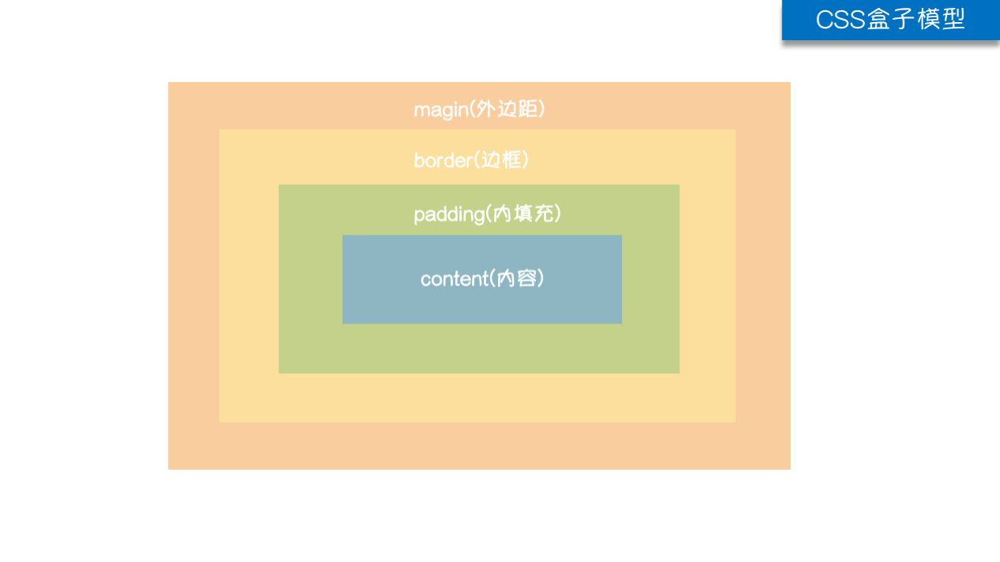

# css属性

## 宽高属性

- width属性可以为元素设置宽度
- height属性可以为元素设置高度
- **块级标签才能设置宽度，内联标签的宽度由内容来决定**

## 字体属性

### 文字字体

- font-family可以把多个字体名称作为一个“回退”系统来保存。如果浏览器不支持第一个字体，则会尝试下一个。浏览器会使用它可识别的第一个值

```css
body {
  font-family: "Microsoft Yahei", "微软雅黑", "Arial", sans-serif
}
```

### 字体大小

- 如果设置成inherit表示继承父元素的字体大小值

```css
p {
  font-size: 14px;
}
```

### 字重（粗细） 

- font-weight用来设置字体的字重（粗细）

|   值    |                      描述                      |
| :-----: | :--------------------------------------------: |
| normal  |                默认值，标准粗细                |
|  bold   |                      粗体                      |
| bolder  |                      更粗                      |
| lighter |                      更细                      |
| 100~900 | 设置具体粗细，400等同于normal，而700等同于bold |
| inherit |             继承父元素字体的粗细值             |

### 文本颜色

- 颜色属性被用来设置文字的颜色
- 颜色是通过CSS最经常的指定
  - 十六进制值 - 如: **＃**FF0000
  - 一个RGB值 - 如: RGB(255,0,0)
  - 颜色的名称 - 如:  red
- 还有rgba(255,0,0,0.3)，第四个值为alpha, 指定了色彩的透明度/不透明度，它的范围为0.0到1.0之间

## 文字属性

### 文字对齐

- text-align 属性规定元素中的文本的水平对齐方式

|   值    |      描述       |
| :-----: | :-------------: |
|  left   | 左边对齐 默认值 |
|  right  |     右对齐      |
| center  |    居中对齐     |
| justify |    两端对齐     |

### 文字装饰

- text-decoration 属性用来给文字添加特殊效果

|      值      |                 描述                  |
| :----------: | :-----------------------------------: |
|     none     |        默认。定义标准的文本。         |
|  underline   |         定义文本下的一条线。          |
|   overline   |         定义文本上的一条线。          |
| line-through |       定义穿过文本下的一条线。        |
|   inherit    | 继承父元素的text-decoration属性的值。 |

- 常用的为去掉a标签默认的自划线

  ```css
  a {
    text-decoration: none;
  }
  ```

### 首行缩进

- 将段落的第一行缩进 32像素

  ```css
  p {
    text-indent: 32px;
  }
  ```

## 背景属性

```css
/*背景颜色*/
background-color: red;

/*背景图片*/
background-image: url('1.jpg');

/*
 背景重复
 repeat(默认):背景图片平铺排满整个网页
 repeat-x：背景图片只在水平方向上平铺
 repeat-y：背景图片只在垂直方向上平铺
 no-repeat：背景图片不平铺
*/
background-repeat: no-repeat; 

/*背景位置*/
background-position: right top;
/*background-position: 200px 200px;*/
```

支持简写

```css
background:#ffffff url('1.png') no-repeat right top;
```

## 边框

- 边框属性 

  - border-width
  - border-style
  - border-color

  ```css
  #i1 {
    border-width: 2px;
    border-style: solid;
    border-color: red;
  }
  ```

  通常使用简写方式

  ```css
  #i1 {
    border: 2px solid red;
  }
  ```

- 边框样式

  |   值   |     描述     |
  | :----: | :----------: |
  |  none  |    无边框    |
  | dotted | 点状虚线边框 |
  | dashed | 矩形虚线边框 |
  | solid  |   实线边框   |

  除了可以统一设置边框外还可以单独为某一个边框设置样式

  ```css
  #i1 {
    border-top-style:dotted;
    border-top-color: red;
    border-right-style:solid;
    border-bottom-style:dotted;
    border-left-style:none;
  }
  ```

## border-radius(圆角边框)

- 用这个属性能实现圆角边框的效果
- 将border-radius设置为长或高的一半即可得到一个圆形

## display属性

- 用于控制HTML元素的显示效果

  |           值           |                             意义                             |
  | :--------------------: | :----------------------------------------------------------: |
  |     display:"none"     | HTML文档中元素存在，但是在浏览器中不显示。一般用于配合JavaScript代码使用 |
  |    display:"block"     | 默认占满整个页面宽度，如果设置了指定宽度，则会用margin填充剩下的部分 |
  |    display:"inline"    | 按行内元素显示，此时再设置元素的width、height、margin-top、margin-bottom和float属性都不会有什么影响 |
  | display:"inline-block" |            使元素同时具有行内元素和块级元素的特点            |

- **display:"none"与visibility:hidden的区别**

  - visibility:hidden: 可以隐藏某个元素，但隐藏的元素仍需占用与未隐藏之前一样的空间。也就是说，该元素虽然被隐藏了，但仍然会影响布局
  - display:none: 可以隐藏某个元素，且隐藏的元素不会占用任何空间。也就是说，该元素不但被隐藏了，而且该元素原本占用的空间也会从页面布局中消失

## CSS盒子模型

- **margin**:用于控制元素与元素之间的距离；margin的最基本用途就是控制元素周围空间的间隔，从视觉角度上达到相互隔开的目的
- **padding**:用于控制内容与边框之间的距离
- **Border**(边框): 围绕在内边距和内容外的边框
- **Content**(内容):盒子的内容，显示文本和图像



## margin外边距

```css
.margin-test {
  margin-top:5px;
  margin-right:10px;
  margin-bottom:15px;
  margin-left:20px;
}
```

推荐使用简写

```css
/* 顺序：上右下左 */
.margin-test {
  margin: 5px 10px 15px 20px;
}
```

常见居中

```css
.mycenter {
  margin: 0 auto;
}
```

## padding内填充

```css
.padding-test {
  padding-top: 5px;
  padding-right: 10px;
  padding-bottom: 15px;
  padding-left: 20px;
}
```

推荐使用简写

```css
/* 顺序：上右下左 */
.padding-test {
  padding: 5px 10px 15px 20px;
}
```

- 补充padding的常用简写方式
  - 提供一个，用于四边
  - 提供两个，第一个用于上－下，第二个用于左－右
  - 如果提供三个，第一个用于上，第二个用于左－右，第三个用于下
  - 提供四个参数值，将按上－右－下－左的顺序作用于四边

## float

- 在 CSS 中，任何元素都可以浮动
- 浮动元素会生成一个块级框，而不论它本身是何种元素
- 关于浮动的两个特点
  1. 浮动的框可以向左或向右移动，直到它的外边缘碰到包含框或另一个浮动框的边框为止
  2. 由于浮动框不在文档的普通流中，所以文档的普通流中的块框表现得就像浮动框不存在一样
- 三种取值
  - left：向左浮动
  - right：向右浮动
  - none：默认值，不浮动

## clear

- clear属性规定元素的哪一侧不允许其他浮动元素

  **注意: clear属性只会对自身起作用，而不会影响其他元素**

  |   值    |                描述                 |
  | :-----: | :---------------------------------: |
  |  left   |        在左侧不允许浮动元素         |
  |  right  |        在右侧不允许浮动元素         |
  |  both   |     在左右两侧均不允许浮动元素      |
  |  none   |   默认值。允许浮动元素出现在两侧    |
  | inherit | 规定应该从父元素继承 clear 属性的值 |

### 清除浮动

- 清除浮动的副作用（父标签塌陷问题）

- 主要有三种方式

  1. 固定高度
  2. 伪元素清除法
  3. overflow:hidden

- 伪元素清除法（使用较多）

  ```css
  .clearfix:after {
    content: "";
    display: block;
    clear: both;
  }
  ```

## overflow溢出属性

|   值    |                          描述                          |
| :-----: | :----------------------------------------------------: |
| visible |       默认值。内容不会被修剪，会呈现在元素框之外       |
| hidden  |          内容会被修剪，并且其余内容是不可见的          |
| scroll  | 内容会被修剪，但是浏览器会显示滚动条以便查看其余的内容 |
|  auto   | 如果内容被修剪，则浏览器会显示滚动条以便查看其余的内容 |
| inherit |         规定应该从父元素继承 overflow 属性的值         |

- 参数

  - overflow（水平和垂直均设置）

  - overflow-x（设置水平方向）

  - overflow-y（设置垂直方向）

### 圆形头像示例

```html
<!DOCTYPE HTML>
<html>
<head>
  <meta charset="UTF-8">
  <meta http-equiv="x-ua-compatible" content="IE=edge">
  <meta name="viewport" content="width=device-width, initial-scale=1">
  <title>圆形的头像示例</title>
  <style>
    * {
      margin: 0;
      padding: 0;
      background-color: #eeeeee;
    }
    .header-img {
      width: 150px;
      height: 150px;
      border: 3px solid white;
      border-radius: 50%;
      overflow: hidden;
    }
    .header-img>img {
      max-width: 100%;
    }
  </style>
</head>
<body>

<div class="header-img">
  
</div>

</body>
</html>
```

## 定位（position）

### static

- static 默认值，无定位，不能当作绝对定位的参照物，并且设置标签对象的left、top等值是不起作用的的

### relative（相对定位）

- 相对定位是相对于该元素在文档流中的原始位置，即以自己原始位置为参照物。有趣的是，即使设定了元素的相对定位以及偏移值，元素还占有着原来的位置，即占据文档流空间。对象遵循正常文档流，但将依据top，right，bottom，left等属性在正常文档流中偏移位置。而其层叠通过z-index属性定义
- 注意：position：relative的一个主要用法：方便绝对定位元素找到参照物

### absolute（绝对定位）

- 定义：设置为绝对定位的元素框从文档流完全删除，并相对于最近的已定位祖先元素定位，如果元素没有已定位的祖先元素，那么它的位置相对于最初的包含块（即body元素）。元素原先在正常文档流中所占的空间会关闭，就好像该元素原来不存在一样。元素定位后生成一个块级框，而不论原来它在正常流中生成何种类型的框
- 重点：如果父级设置了position属性，例如position:relative;，那么子元素就会以父级的左上角为原始点进行定位。这样能很好的解决自适应网站的标签偏离问题，即父级为自适应的，那我子元素就设置position:absolute;父元素设置position:relative;，然后Top、Right、Bottom、Left用百分比宽度表示
- 另外，对象脱离正常文档流，使用top，right，bottom，left等属性进行绝对定位。而其层叠通过z-index属性定义

### fixed（固定）

- fixed：对象脱离正常文档流，使用top，right，bottom，left等属性以窗口为参考点进行定位，当出现滚动条时，对象不会随着滚动。而其层叠通过z-index属性 定义。 注意点： 一个元素若设置了 position:absolute | fixed; 则该元素就不能设置float。这 是一个常识性的知识点，因为这是两个不同的流，一个是浮动流，另一个是“定位流”。但是 relative 却可以。因为它原本所占的空间仍然占据文档流
- 在理论上，被设置为fixed的元素会被定位于浏览器窗口的一个指定坐标，不论窗口是否滚动，它都会固定在这个位置

#### 返回顶部示例

```html
<!DOCTYPE html>
<html lang="en">
<head>
  <meta charset="UTF-8">
  <meta http-equiv="x-ua-compatible" content="IE=edge">
  <meta name="viewport" content="width=device-width, initial-scale=1">
  <title>返回顶部示例</title>
  <style>
    * {
      margin: 0;
    }

    .d1 {
      height: 1000px;
      background-color: #eeee;
    }

    .scrollTop {
      background-color: darkgrey;
      padding: 10px;
      text-align: center;
      position: fixed;
      right: 10px;
      bottom: 20px;
    }
  </style>
</head>
<body>
<div class="d1">111</div>
<div class="scrollTop">返回顶部</div>
</body>
</html>
```

## z-index

```css
#i2 {
  z-index: 999;
}
```

- 设置对象的层叠顺序
  - z-index 值表示谁压着谁，数值大的压盖住数值小的
  - 只有定位了的元素，才能有z-index,也就是说，不管相对定位，绝对定位，固定定位，都可以使用z-index，而浮动元素不能使用z-index
  - z-index值没有单位，就是一个正整数，默认的z-index值为0如果大家都没有z-index值，或者z-index值一样，那么谁写在HTML后面，谁在上面压着别人，定位了元素，永远压住没有定位的元素
  - 从父现象：父亲怂了，儿子再牛逼也没用

### 自定义模态框

```html
<!DOCTYPE html>
<html lang="en">
<head>
  <meta charset="UTF-8">
  <meta http-equiv="x-ua-compatible" content="IE=edge">
  <meta name="viewport" content="width=device-width, initial-scale=1">
  <title>自定义模态框</title>
  <style>
    .cover {
      background-color: rgba(0,0,0,0.65);
      position: fixed;
      top: 0;
      right: 0;
      bottom: 0;
      left: 0;
      z-index: 998;
    }

    .modal {
      background-color: white;
      position: fixed;
      width: 600px;
      height: 400px;
      left: 50%;
      top: 50%;
      margin: -200px 0 0 -300px;
      z-index: 1000;
    }
  </style>
</head>
<body>

<div class="cover"></div>
<div class="modal"></div>
</body>
</html>
```

## opacity

用来定义透明效果。取值范围是0~1，0是完全透明，1是完全不透明

## 综合示例: 顶部导航菜单

```html
<!DOCTYPE HTML>
<html>
<head>
  <meta charset="UTF-8">
  <meta http-equiv="x-ua-compatible" content="IE=edge">
  <meta name="viewport" content="width=device-width, initial-scale=1">
  <title>li标签的float示例</title>
  <style>
    /*清除浏览器默认外边距和内填充*/
    * {
      margin: 0;
      padding: 0;
    }
    a {
      text-decoration: none; /*去除a标签默认的下划线*/
    }

    .nav {
      background-color: black;
      height: 40px;
      width: 100%;
      position: fixed;
      top: 0;
    }

    ul {
      list-style-type: none; /*删除列表默认的圆点样式*/
      margin: 0; /*删除列表默认的外边距*/
      padding: 0; /*删除列表默认的内填充*/
    }
    /*li元素向左浮动*/
    li {
      float: left;
    }

    li > a {
      display: block; /*让链接显示为块级标签*/
      padding: 0 15px; /*设置左右各15像素的填充*/
      color: #b0b0b0; /*设置字体颜色*/
      line-height: 40px; /*设置行高*/
    }
    /*鼠标移上去颜色变白*/
    li > a:hover {
      color: #fff;
    }

    /*清除浮动 解决父级塌陷问题*/
    .clearfix:after {
      content: "";
      display: block;
      clear: both;
    }
  </style>
</head>
<body>
<!-- 顶部导航栏 开始 -->
<div class="nav">
  <ul class="clearfix">
    <li><a href="">玉米商城</a></li>
    <li><a href="">MIUI</a></li>
    <li><a href="">ioT</a></li>
    <li><a href="">云服务</a></li>
    <li><a href="">水滴</a></li>
    <li><a href="">金融</a></li>
    <li><a href="">优品</a></li>
  </ul>
</div>
<!-- 顶部导航栏 结束 -->
</body>
</html>
```


