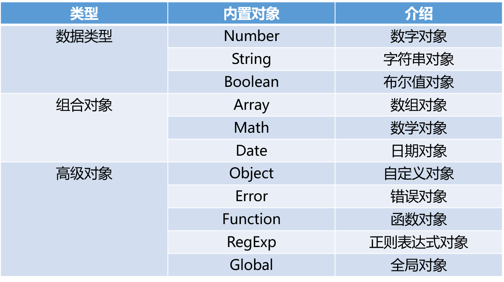

# js基础 词法分析,内置对象和方法

## 词法分析

- JavaScript中在调用函数的那一瞬间，会先进行词法分析

### 过程

- 当函数调用的前一瞬间，会先形成一个激活对象：Avtive Object（AO），并会分析以下3个方面
  1. 函数参数，如果有，则将此参数赋值给AO，且值为undefined。如果没有，则不做任何操作
  2. 函数局部变量，如果AO上有同名的值，则不做任何操作。如果没有，则将此变量赋值给AO，并且值为undefined
  3. 函数声明，如果AO上有，则会将AO上的对象覆盖。如果没有，则不做任何操作
- **函数内部无论是使用参数还是使用局部变量都到AO上找**

## 内置对象和方法

- JavaScript中的所有事物都是对象：字符串、数字、数组、日期，等等。在JavaScript中，对象是拥有属性和方法的数据

  ```js
  var s1 = "abc" 和 var s2 = new String("abc") 的区别：
  typeof s1 --> string
  typeof s2 --> Object
  ```



### 自定义对象

- JavaScript的对象（Object）本质上是键值对的集合（Hash结构），但是只能用字符串作为键

  ```js
  var a = {"name": "Alex", "age": 18};
  console.log(a.name);
  console.log(a["age"]);
  ```

- 遍历对象中的内容

  ```js
  var a = {"name": "Alex", "age": 18};
  for (var i in a){
    console.log(i, a[i]);
  }
  ```

- 创建对象

  ```js
  var person=new Object();  // 创建一个person对象
  person.name="Alex";  // person对象的name属性
  person.age=18;  // person对象的age属性
  ```

- **注意点**

  ES6中提供了Map数据结构。它类似于对象，也是键值对的集合，但是“键”的范围不限于字符串，各种类型的值（包括对象）都可以当做键

  也就是说，Object结构提供了“字符串--值”的对应，Map结构提供了“值--值”的对应，是一种更完善的Hash结构实现

  ```js
  var m = new Map();
  var o = {p: "Hello World"}
  
  m.set(o, "content"}
  m.get(o)  // "content"
  
  m.has(o)  // true
  m.delete(o)  // true
  m.has(o) // false
  ```

- 扩展(js 中的继承)

  ```js
  // 父类构造函数
  var Car = function (loc) {
    this.loc = loc;
  };
  
  // 父类方法
  Car.prototype.move = function () {
    this.loc ++;
  };
  
  // 子类构造函数
  var Van = function (loc) {
    Car.call(this, loc);
  };
  
  // 继承父类的方法
  Van.prototype = Object.create(Car.prototype);
  // 修复 constructor
  Van.prototype.constructor = Van;
  // 扩展方法
  Van.prototype.grab = function () {
    /* ... */
  };
  ```

### Date对象

- 创建Date对象

  ```js
  //方法1：不指定参数
  var d1 = new Date();
  console.log(d1.toLocaleString());
  //方法2：参数为日期字符串
  var d2 = new Date("2004/3/20 11:12");
  console.log(d2.toLocaleString());
  var d3 = new Date("04/03/20 11:12");
  console.log(d3.toLocaleString());
  //方法3：参数为毫秒数
  var d3 = new Date(5000);
  console.log(d3.toLocaleString());
  console.log(d3.toUTCString());
  
  //方法4：参数为年月日小时分钟秒毫秒
  var d4 = new Date(2004,2,20,11,12,0,300);
  console.log(d4.toLocaleString());  //毫秒并不直接显示
  ```

- 常用方法

  ```js
  var d = new Date(); 
  //getDate()                 获取日
  //getDay ()                 获取星期
  //getMonth ()               获取月（0-11）
  //getFullYear ()            获取完整年份
  //getHours ()               获取小时
  //getMinutes ()             获取分钟
  //getSeconds ()             获取秒
  //getMilliseconds ()        获取毫秒
  //getTime ()                返回累计毫秒数(从1970/1/1午夜)
  ```

### JSON对象

```js
var str1 = '{"name": "Alex", "age": 18}';
var obj1 = {"name": "Alex", "age": 18};
// JSON字符串转换成对象
var obj = JSON.parse(str1); 
// 对象转换成JSON字符串
var str = JSON.stringify(obj1);
```

### RegExp 正则对象

#### 正则对象的创建方式

- 方式1

  ```
  参数1 正则表达式(不能有空格)
  参数2 匹配模式：常用g(全局匹配;找到所有匹配，而不是在第一个匹配后停止)和i(忽略大小写)
  ```

  ```js
  // 匹配用户名
  // 用户名只能是英文字母、数字和_，并且首字母必须是英文字母。长度最短不能少于6位 最长不能超过12位
  var reg1 = new RegExp("^[a-zA-Z][a-zA-Z0-9_]{5,11}$");
  
  // RegExp对象的test方法，测试一个字符串是否符合对应的正则规则，返回值是true或false。
  reg1.test(s1);  // true
  ```

- 方式2

  ```js
  // 填写正则表达式/匹配模式（逗号后面不要加空格）
  var reg2 = /^[a-zA-Z][a-zA-Z0-9_]{5,11}$/;
  
  reg2.test(s1);  // true
  ```

#### String对象与正则结合的4个方法

```js
var s2 = "hello world";

s2.match(/o/g);         // ["o", "o"]             查找字符串中 符合正则 的内容
s2.search(/h/g);        // 0                      查找字符串中符合正则表达式的内容位置
s2.split(/o/g);         // ["hell", " w", "rld"]  按照正则表达式对字符串进行切割
s2.replace(/o/g, "s");  // "hells wsrld"          对字符串按照正则进行替换
```

#### 匹配模式

```js
var s1 = "name:Alex age:18";

s1.replace(/a/, "哈哈哈");      // "n哈哈哈me:Alex age:18"
s1.replace(/a/g, "哈哈哈");     // "n哈哈哈me:Alex 哈哈哈ge:18"      全局匹配
s1.replace(/a/gi, "哈哈哈");    // "n哈哈哈me:哈哈哈lex 哈哈哈ge:18"  不区分大小写
```

#### 注意事项

```js
// 如果regExpObject带有全局标志g，test()函数不是从字符串的开头开始查找，而是从属性regExpObject.lastIndex所指定的索引处开始查找。
// 该属性值默认为0，所以第一次仍然是从字符串的开头查找。
// 当找到一个匹配时，test()函数会将regExpObject.lastIndex的值改为字符串中本次匹配内容的最后一个字符的下一个索引位置。
// 当再次执行test()函数时，将会从该索引位置处开始查找，从而找到下一个匹配。
// 因此，当我们使用test()函数执行了一次匹配之后，如果想要重新使用test()函数从头开始查找，则需要手动将regExpObject.lastIndex的值重置为 0。
// 如果test()函数再也找不到可以匹配的文本时，该函数会自动把regExpObject.lastIndex属性重置为 0。

var reg3 = /foo/g;
// 此时 regex.lastIndex=0
reg3.test('foo'); // 返回true
// 此时 regex.lastIndex=3
reg3.test('xxxfoo'); // 还是返回true
// 所以我们在使用test()方法校验一个字符串是否完全匹配时，一定要加上^和$符号。
```

```js
// 当我们不加参数调用RegExpObj.test()方法时, 相当于执行RegExpObj.test("undefined"), 并且/undefined/.test()默认返回true。
var reg4 = /^undefined$/;
reg4.test(); // 返回true
reg4.test(undefined); // 返回true
reg4.test("undefined"); // 返回true
```

### Math对象

|  方法名  |            描述            |
| :------: | :------------------------: |
|  abs(x)  |       返回数的绝对值       |
|  exp(x)  |       返回 e 的指数        |
| floor(x) |       对数进行下舍入       |
|  log(x)  | 返回数的自然对数（底为e）  |
| max(x,y) |   返回 x 和 y 中的最高值   |
| min(x,y) |   返回 x 和 y 中的最低值   |
| pow(x,y) |      返回 x 的 y 次幂      |
| random() |  返回 0 ~ 1 之间的随机数   |
| round(x) | 把数四舍五入为最接近的整数 |
|  sin(x)  |        返回数的正弦        |
| sqrt(x)  |       返回数的平方根       |
|  tan(x)  |        返回角的正切        |


