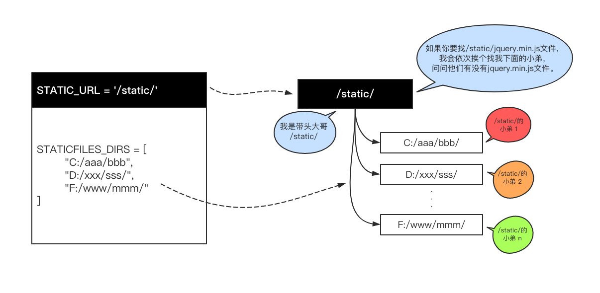

# Django 工程结构,配置,基础api(HttpResponse, render, redirect)

## 介绍

- 官网

  https://www.djangoproject.com/

- Django的安装

  pip install django==1.11.17

- Django的卸载

  Pip uninstall django

## Django项目

### 创建方式

- 方式1: 通过pyCharm创建工程

- 方式2: 通过命令创建

  ```
  # 创建了一个名为"mysite"的Django 项目
  django-admin startproject mysite
  ```

### 工程目录结构

```
mysite/
├── manage.py  # 管理文件
└── mysite  # 项目目录
    ├── __init__.py
    ├── settings.py  # 配置
    ├── urls.py  # 路由 --> URL和函数的对应关系
    └── wsgi.py  # runserver命令就使用wsgiref模块做简单的web server
```

### 运行

- 方式1: 通过pyCharm的运行按钮

- 方式2: 命令方式运行

  ```
  python manage.py runserver 127.0.0.1:8000
  ```

### 配置

#### 模板文件配置

```python
# settings.py
TEMPLATES = [
    {
        'BACKEND': 'django.template.backends.django.DjangoTemplates',

        # 配置 templates文件夹位置
        'DIRS': [os.path.join(BASE_DIR, 'templates')]
        ,
        'APP_DIRS': True,
        'OPTIONS': {
            'context_processors': [
                'django.template.context_processors.debug',
                'django.template.context_processors.request',
                'django.contrib.auth.context_processors.auth',
                'django.contrib.messages.context_processors.messages',
            ],
        },
    },
]
```

#### 静态文件配置

```python
# settings.py
STATIC_URL = '/static/'

STATICFILES_DIRS = [
    # 静态文件存放位置
    os.path.join(BASE_DIR, "static")
]
```



#### 禁用csrf中间件

- **刚开始学习时可在配置文件中暂时禁用csrf中间件，方便表单提交测试**

```python
# settings.py
MIDDLEWARE = [
    'django.middleware.security.SecurityMiddleware',
    'django.contrib.sessions.middleware.SessionMiddleware',
    'django.middleware.common.CommonMiddleware',
    # 刚开始学习时可在配置文件中暂时禁用csrf中间件，方便表单提交测试
    # 'django.middleware.csrf.CsrfViewMiddleware',
    'django.contrib.auth.middleware.AuthenticationMiddleware',
    'django.contrib.messages.middleware.MessageMiddleware',
    'django.middleware.clickjacking.XFrameOptionsMiddleware',
]
```

## Django基础三件套

- HttpResponse, render, redirect

```python
from django.contrib import admin
from django.urls import path

from django.contrib import admin
from django.shortcuts import HttpResponse
from django.shortcuts import render
from django.shortcuts import redirect


def index(request):
    # 内部传入一个字符串参数，返回给浏览器
    return HttpResponse("这是index页面")


def home(request):
    # 将 home.html 数据的内容返回给浏览器
    # 需要将 home.html 先放入到 templates 目录下
    return render(request, "home.html")


def qq(request):
    # 重定向跳转到指定的页面
    return redirect("http://www.qq.com")


urlpatterns = [
    # 相当于路由转发
    # 第一个参数为路径名, 第二个为调用的方法名

    path('admin/', admin.site.urls),
    # 例: 访问 http://127.0.0.1:8000/index/ 会调用 index 方法
    path('index/', index),
    path('home/', home),
    path('qq/', qq),
]
```

### HttpResponse

- 内部传入一个字符串参数，返回给浏览器

### render

- 除request参数外还接受一个待渲染的模板文件和一个保存具体数据的字典参数. 将数据填充进模板文件，最后把结果返回给浏览器

```python
def index(request):
    # 业务逻辑代码
    return render(request, "index.html", {"name": "alex", "hobby": ["烫头", "泡吧"]})
```

### redirect

- 接受一个URL参数，表示跳转到指定的URL