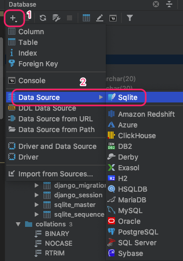
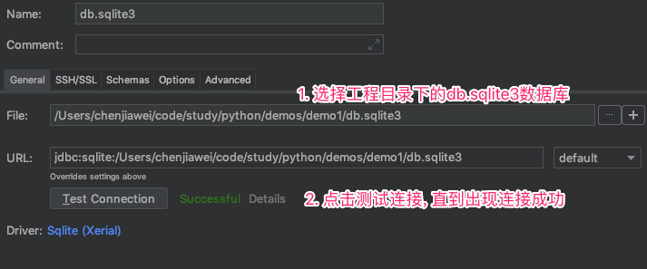
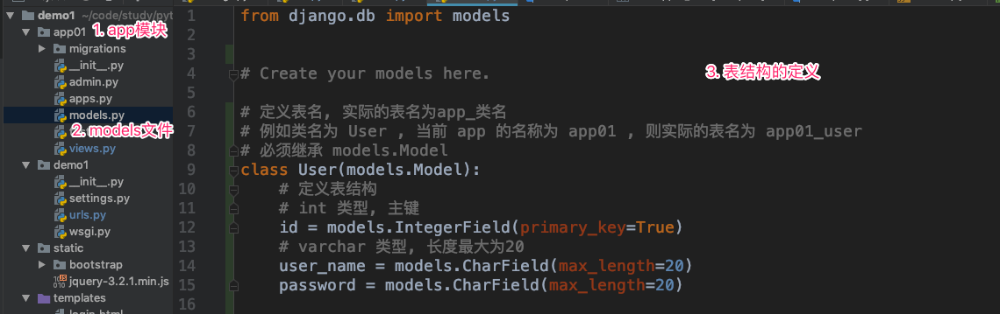
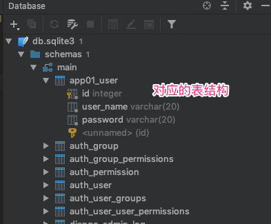

# Django shortcuts三大基础api, GET与POST请求, Django操作sqlite3数据库

## HttpResponse

- 设置一个字符串直接传给浏览器

```python
def get_test(request):
    print(request.GET)
    # http://127.0.0.1:8000/getTest
    # <QueryDict: {}>

    # http://127.0.0.1:8000/getTest?id=1&password=123
    # <QueryDict: {'id': ['1'], 'password': ['123']}>
    return HttpResponse("服务端接收到 GET 请求")


def post_test(request):
    print(request.POST)
    return HttpResponse("服务端接收到 POST 请求")
```

## render

- 将数据渲染到模板文件, 然后返回给浏览器

  - 直接将源文件的数据返回给浏览器

    ```python
    def login(request):
            return render(request, "login.html")
    ```

  - 先将数据填充到模板文件, 然后返回给浏览器

    ```html
    <!DOCTYPE html>
    <html lang="zh-CN">
    <head>
        <meta charset="UTF-8">
        <title>登录注册示例</title>
        <meta name="viewport" content="width=device-width, initial-scale=1">
        <link rel="stylesheet" href="/static/bootstrap/css/bootstrap.min.css">
        <style>
            body {
                background-color: #eee;
            }
    
            #login-box {
                margin-top: 100px;
            }
        </style>
    </head>
    <body>
    
    <div class="container">
        <div class="row">
            <div id="login-box" class="col-md-4 col-md-offset-4">
                <h3 class="text-center">请登录</h3>
                <form class="form-horizontal" action="/login3/" method="post" novalidate>
                    <div class="form-group">
                        <label for="inputUsername" class="col-sm-3 control-label">用户名</label>
                        <div class="col-sm-9">
                            <input type="email" class="form-control" name="username" id="inputUsername" placeholder="Email">
                            <span style="color: red" class="help-block">{{ error_username }}</span>
                        </div>
                    </div>
                    <div class="form-group">
                        <label for="inputPassword" class="col-sm-3 control-label">密码</label>
                        <div class="col-sm-9">
                            <input type="password" class="form-control" name="password" id="inputPassword"
                                   placeholder="Password">
                            <span style="color: red" class="help-block">{{ error_password }}</span>
                        </div>
                    </div>
                    <div class="form-group">
                        <div class="col-sm-offset-3 col-sm-9">
                            <input type="submit" class="btn btn-primary" value="登录">
                        </div>
                    </div>
                </form>
                <span style="color: red" class="help-block">{{ error_msg }}</span>
            </div>
        </div>
    </div>
    
    <script src="/static/jquery-3.2.1.min.js"></script>
    <script src="/static/bootstrap/js/bootstrap.min.js"></script>
    </body>
    </html>
    ```

    ```python
    def login3(request):
        data = {}
        if request.method.upper() == "POST":
            data = {"error_username": "用户名错误", "error_password": "密码错误", "error_msg": "登录失败"}
        return render(request, "login2.html", data)
    ```

## redirect

- 重定向

  ```python
  def redirect_test(request):
      return redirect("http://www.qq.com")
  ```

## GET与POST请求

- 查看当前请求的请求方式

  ```python
  def login(request):
  	# 查看请求方式, 常用的取值为 GET 和 POST , 注意字母均为大写
  	method = request.method
  ```

- 参考请求的参数

  ```python
  def get_test(request):
      print(request.GET)
      # http://127.0.0.1:8000/getTest
      # <QueryDict: {}>
  
      # http://127.0.0.1:8000/getTest?id=1&password=123
      # <QueryDict: {'id': ['1'], 'password': ['123']}>
      return HttpResponse("服务端接收到 GET 请求")
  
  
  def post_test(request):
      print(request.POST)
      return HttpResponse("服务端接收到 POST 请求")
  ```

  request.GET / reqeust.POST 获取的返回值为一个字典, 对请求参数进行了一层封装, 获取指定参数只需要对这个字典操作即可

  ```python
  def login(request):
      if request.method.upper() == "POST":
          username = request.POST.get("username")
          password = request.POST.get("password")
  
          print(f'用户名 {username} , 密码 {password}')
          if username == "a" and password == "1":
              return HttpResponse("登录成功")
          else:
              return HttpResponse("登录失败")
      else:
          print(f'请求方式 {request.method}')
          return render(request, "login.html")
  ```

## Django操作sqlite数据库

### 添加sqlite数据库





### 添加表

1. 在app的 `models.py `文件中添加对应的类

   

2. 执行命令

   python manage.py makemigrations

   python manage.py migrate

   执行后, 查看表结构

   

### 查询表

- 查询所有数据

  ```python
  def check_user1(username, password):
      # 查询所有用户
      # 导入 molel 模块, 通过类名.objects.all() 可以查询所有数据
      ret = models.User.objects.all()
  
      for item_user in ret:
          if item_user.user_name == username and item_user.password == password:
              return True
      return False
  ```

- 查询指定数据(方式1)

  ```python
  def check_user2(username, password):
      # 查询指定用户
      # 返回的是一个列表, 如果数据不存在, 也是一个空列表
      ret = models.User.objects.filter(user_name=username, password=password)
      if ret:
          for index, value in enumerate(ret):
              print(f'check_user2 查询的第 {index+1} 条数据, username:{value.user_name}, password:{value.password}')
  
          return True
      else:
          return False
  ```

- 查询指定数据(方式2)

  ```python
  def check_user3(username, password):
      try:
          # 查询指定用户, 如果查询不到, 则会发生异常, 必须要做异常处理
          ret = models.User.objects.get(user_name=username, password=password)
          print(f'check_user3 查询的数据 : username:{ret.user_name}, password:{ret.password}')
          return True
      except Exception as ex:
          print("查询发生了异常")
          return False
  ```

