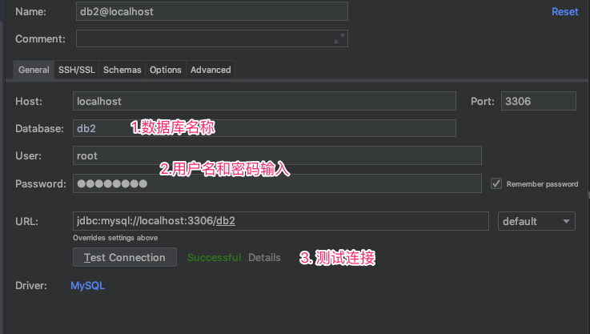
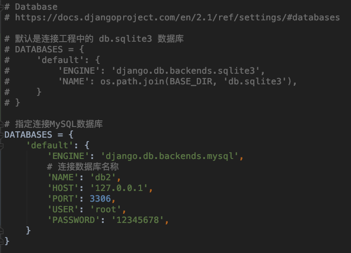
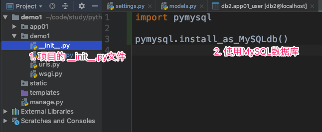
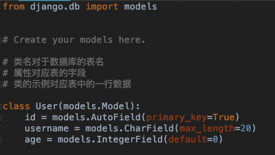
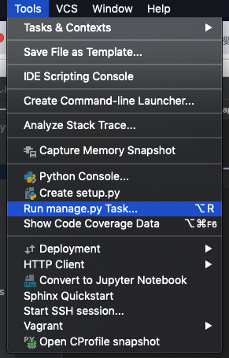
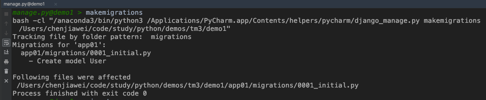
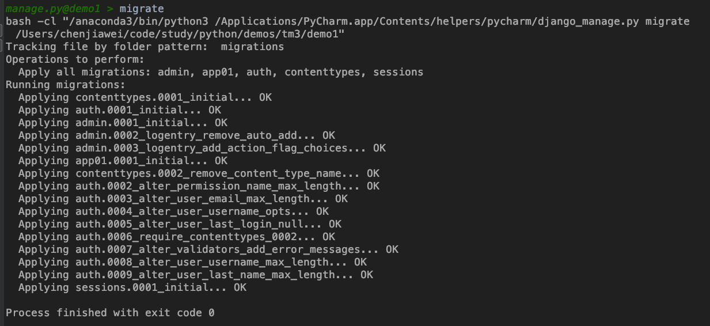
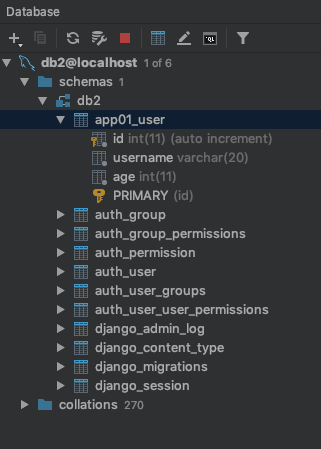

# Django

## Django操作MySQL数据库

### 连接数据库+创建表

1. MySQL中必须存在一个数据库

2. PyCharm中的Database视图中连接MySQL数据库

   

3. Setting.py文件配置

   

4. 在项目的 `__init__.py` 文件中导入 pymysql

   

5. 创建对应的类(表名)

   

6. 选择 `Run manage.py Task ...`

   

7. 执行 makemigrations

   

8. 执行 migrate

   

9. 生成的表如下

   

### Django操作MySQL表中的数据

#### 增加

```python
def test(request):
    name = 'aaa'
    age = 20

    # 创建对象
    new_user = models.User.objects.create(username=name, age=age)
    # 保存到数据库
    new_user.save()
    return HttpResponse('ok')
```

#### 删除

```python
def test(request):
    name = 'aaa'
    age = 20

    # 删除数据之前必须先要查询到这条数据
    user_query = models.User.objects.get(username=name, age=age)

    # 调用对象的删除即可删除MySQL对应的数据
    user_query.delete()

    return HttpResponse('ok')
```

#### 更新

```python
def test(request):
    name = 'aaa'
    age = 20

    # 更新数据之前必须先要查询到这条数据
    user_query = models.User.objects.get(id=3)
    user_query.username = name
    user_query.age = age

    # 调用对象的更新即可更新MySQL对应的数据
    user_query.save()

    return HttpResponse('ok')
```

#### 查询

- 查询所有

  ```python
  def test(request):
      user_list = models.User.objects.all()
      for item in user_list:
          print(item)
      return HttpResponse('ok')
  ```

- 查询指定数据

  ```python
  def test(request):
      try:
          # 如果数据不存在则报错, 需要进行异常处理
          user = models.User.objects.get(id=31)
          print(user.username)
      except Exception:
          pass
      return HttpResponse('ok')
  ```

- 筛选数据

  ```python
  def test(request):
      # 返回一个列表
      # 如果数据不存在,也是一个空列表
      user_list = models.User.objects.filter(id=3)
      print(f'数据个数 : {len(user_list)}')
      return HttpResponse('ok')
  ```

