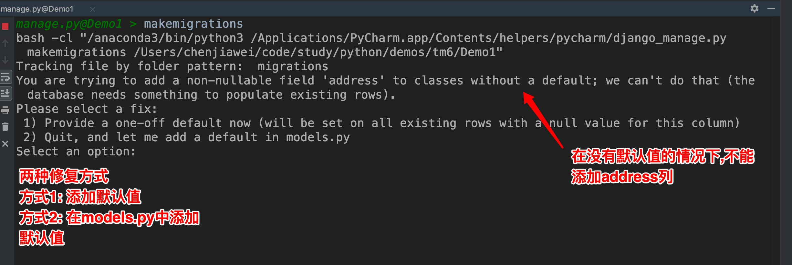
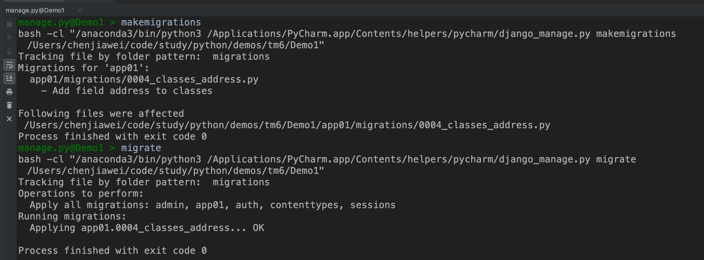

# Django 表的修改,外键操作,反向查询

## 修改表结构注意点

在对一个已经存在数据的表添加列时, 需要注意如果被添加的列的值不能为空时, 修改时会出现以下提示



- 方式1修复

  

  修改后的表查看所有数据

  

- 方式2修复

  

  执行命令

  

  查看最新的表

  

## Django中操作外键

### 外键的设置

- models.py 配置

  ```python
  class Classes(models.Model):
      id = models.AutoField(primary_key=True)
      name = models.CharField(max_length=20)
  
  
  class Student(models.Model):
      id = models.AutoField(primary_key=True)
      name = models.CharField(max_length=20)
      
      # 添加外键
      # 在 Django2 中 on_delete 参数是必须设置的
      # 关联班级表Classes的id字段
      cid = models.ForeignKey(to="Classes", to_field="id", on_delete=models.CASCADE)
  
      """
      on_delete 参数详解
      
      on_delete = None,  # 删除关联表中的数据时,当前表与其关联的field的行为
      on_delete = models.CASCADE,  # 删除关联数据,与之关联也删除
      on_delete = models.DO_NOTHING,  # 删除关联数据,什么也不做
      on_delete = models.PROTECT,  # 删除关联数据,引发错误ProtectedError
      # models.ForeignKey('关联表', on_delete=models.SET_NULL, blank=True, null=True)
      on_delete = models.SET_NULL,  # 删除关联数据,与之关联的值设置为null（前提FK字段需要设置为可空,一对一同理）
      # models.ForeignKey('关联表', on_delete=models.SET_DEFAULT, default='默认值')
      on_delete = models.SET_DEFAULT,  # 删除关联数据,与之关联的值设置为默认值（前提FK字段需要设置默认值,一对一同理）
      on_delete = models.SET,  # 删除关联数据,
      a.与之关联的值设置为指定值, 设置：models.SET(值)
      b.与之关联的值设置为可执行对象的返回值, 设置：models.SET(可执行对象)
      """
  ```

- 数据库的显示结果

  

- **注意: 对于外键的名称进行了一层封装 原名称_关联的表字段名称**

### 查询外键


### 新增时操作外键

- 通过关联表的对象进行操作

  

- 通过关联的字段直接添加

  

## 反向查询

- 从上可以看出, 通过一个外键, 可以找出学生对象关联对象班级的信息, 同样对于一个班级信息可以反向查出关联这个班级的所有学生数据

  


