# Django 多对多关系的处理, ORM相关操作(一)

## 多对多关系

### 建表

- 数据库建表的时候, 如果是一对多的关系, 会在多的表中建立外键字段

  如: 班级和学生的关系

  ```python
  class Classes(models.Model):
      id = models.AutoField(primary_key=True)
      name = models.CharField(max_length=20, default='默认班级')
  
  
  class Student(models.Model):
      id = models.AutoField(primary_key=True)
      name = models.CharField(max_length=20, default='')
      cid = models.ForeignKey(to='Classes', to_field='id', on_delete=models.CASCADE)
  ```

- 如果是多对多的关系, 一般会建立第三张表, 用于保存两张表之间的关系

  如: 班级和老师的关系

  ```sql
  create table teacher_class_id(
  	id int primary key auto_increment, -- 主键
      teacher_id int, -- 老师表id
      class_id int -- 班级表id
  );
  ```

- 在Django中, 对于多对多关系, 不需要开发者手动来创建第三张表, 只需要将原来的表进行相应的配置即可

  ```python
  class Classes(models.Model):
      id = models.AutoField(primary_key=True)
      name = models.CharField(max_length=20, default='默认班级')
  
  
  class Teacher(models.Model):
      id = models.AutoField(primary_key=True)
      name = models.CharField(max_length=20, default='')
      # 多对多的关系
      cid = models.ManyToManyField(to='Classes')
  ```

  最后生成的表

  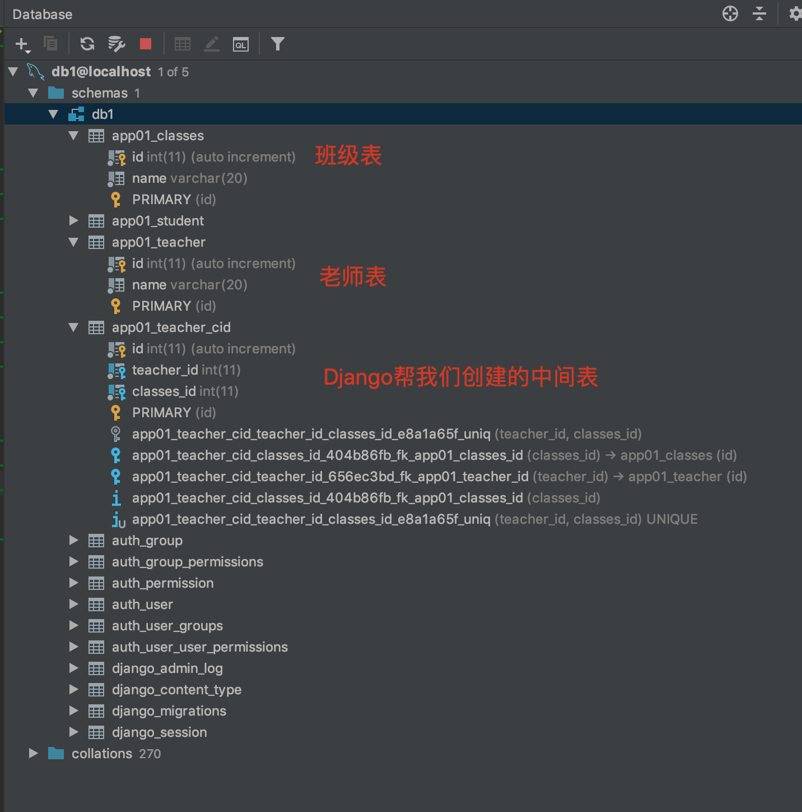

### 数据操作

#### 新增

```html
<!DOCTYPE html>
<html lang="en">
<head>
    <meta charset="UTF-8">
    <title>老师新增页面</title>
</head>
<body>

<form method="post" action="/add_teacher/" novalidate>
    <label>
        姓名
        <input type="text" name="name">
    </label>
    <br>
    <label>
        授课班级
        <select multiple name="class_list">
            
                <option value="{{ item_class.id }}">{{ item_class.name }}</option>
            
        </select>
    </label>
    <br>
    <input type="submit" value="创建老师">
</form>

</body>
</html>
```

```python
def add_teacher(request):
    """
    添加老师
    :param request:
    :return:
    """
    if is_post_request(request):
        teacher_name = request.POST.get('name')

        # 获取一组值的时候, 需要使用 getlist 方法
        class_id_list = request.POST.getlist('class_list')
        new_teacher = models.Teacher.objects.create(name=teacher_name)
        # 设置当前老师授课的班级
        new_teacher.cid.set(class_id_list)
        new_teacher.save()
        return redirect(URL_TEACHER_LIST)
    else:
        query_class_list = models.Classes.objects.all()
        return render(request, "add_teacher.html", {"class_list": query_class_list})
```

#### 查询

```html
<!DOCTYPE html>
<html lang="en">
<head>
    <meta charset="UTF-8">
    <title>老师列表页面</title>
</head>
<body>

<a href="/add_teacher/">添加老师</a>
<br>
<table border="1">
    <thead>
    <tr>
        <td>序号</td>
        <td>老师id</td>
        <td>老师名称</td>
        <td>授课班级</td>
        <td>操作</td>
    </tr>
    </thead>
    <tbody>
    
        <tr>
            <td>{{ forloop.counter }}</td>
            <td>{{ item_teacher.id }}</td>
            <td>{{ item_teacher.name }}</td>
            <td>
                {# 注意不要加() #}
                
                    {{ item_class.name }}
                
            </td>
            <td>
                <a href="/edit_teacher?id={{ item_teacher.id }}">编辑</a>
                <a href="/delete_teacher?id={{ item_teacher.id }}">删除</a>
            </td>
        </tr>
    
    </tbody>
</table>

</body>
</html>
```

```python
def teacher_list(request):
    """
    老师列表
    :param request:
    :return:
    """
    query_teacher_list = models.Teacher.objects.all()
    return render(request, "teacher_list.html", {"teacher_list": query_teacher_list})
```

#### 更新

```html
<!DOCTYPE html>
<html lang="en">
<head>
    <meta charset="UTF-8">
    <title>老师编辑页面</title>
</head>
<body>

<form method="post" action="/edit_teacher/" novalidate>
    <label hidden>
        老师id
        <input type="text" name="id" value="{{ teacher.id }}">
    </label>
    <label>
        姓名
        <input type="text" name="name" value="{{ teacher.name }}">
    </label>
    <br>
    <label>
        授课班级
        <select multiple name="class_list">
            
                {# 判断当前的班级是否在老师授课的班级列表中 #}
                
                    <option selected value="{{ item_class.id }}">{{ item_class.name }}</option>
                
                    <option value="{{ item_class.id }}">{{ item_class.name }}</option>
                
            
        </select>
    </label>
    <br>
    <input type="submit" value="创建老师">
</form>

</body>
</html>
```

```python
def edit_teacher(request):
    """
    编辑老师
    :param request:
    :return:
    """
    if is_post_request(request):
        edit_id = request.POST.get('id')
        teacher_obj = models.Teacher.objects.get(id=edit_id)
        teacher_obj.name = request.POST.get('name')

        class_id_list = request.POST.getlist('class_list')
        teacher_obj.cid.set(class_id_list)
        teacher_obj.save()
        return redirect(URL_TEACHER_LIST)
    else:
        edit_teacher_id = request.GET.get('id')
        teacher_obj = models.Teacher.objects.get(id=edit_teacher_id)
        query_class_list = models.Classes.objects.all()
        return render(request, "edit_teacher.html", {"teacher": teacher_obj, "class_list": query_class_list})
```

## Django ORM相关操作

- [文档](https://docs.djangoproject.com/en/1.11/ref/models/querysets/)

### 一般操作

- all()

  查询所有结果 

  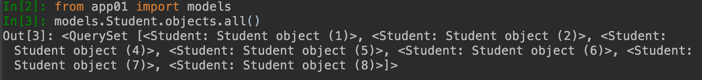

- filter()

  筛选结果

  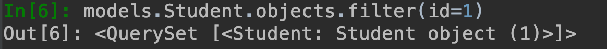

- get()

  获取某一个结果

  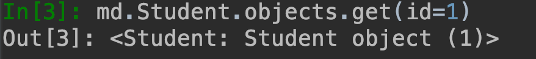

- exclude()

  获取筛选条件不匹配的对象

  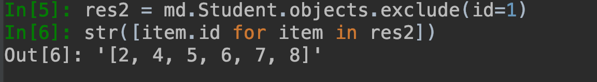

- values()

  返回一个ValueQuerySet, 一个特殊的QuerySet，运行后得到的并不是一系列model的实例化对象，而是一个可迭代的字典序列

  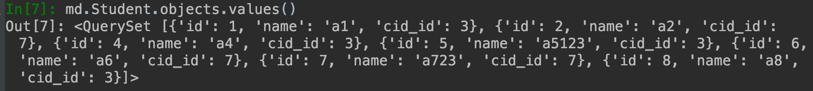

- values_list()

  与 values()非常相似，它返回的是一个元组序列，values返回的是一个字典序列

  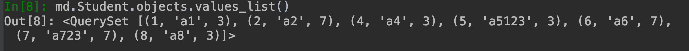

- orderBy()

  对查询结果排序

  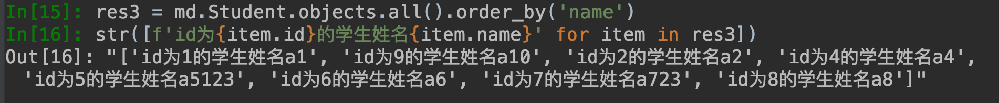

- reverse() 

  对查询结果反向排序，请注意reverse()通常只能在具有已定义顺序的QuerySet上调用(在model类的Meta中指定ordering或调用order_by()方法) 

  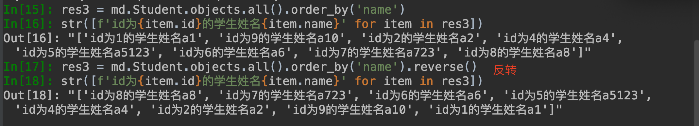

- distinct() 

  从返回结果中剔除重复纪录(如果你查询跨越多个表，可能在计算QuerySet时得到重复的结果。此时可以使用distinct()，注意只有在PostgreSQL中支持按字段去重

- count()

  返回数据库中匹配查询(QuerySet)的对象数量

  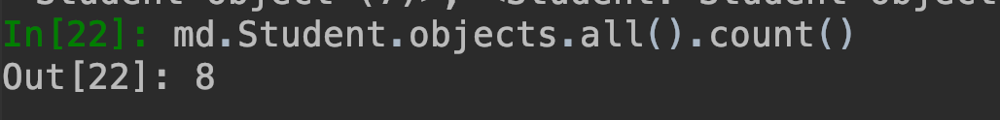

- first()

  返回第一条记录

  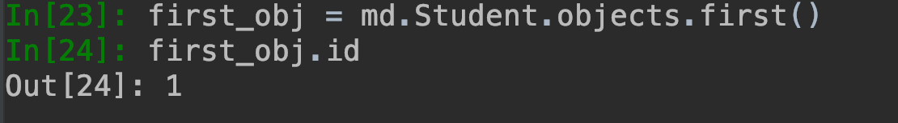

- last()

  返回最后一条记录

  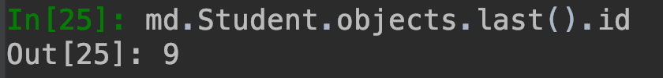

- exists()

  如果QuerySet包含数据，就返回True，否则返回False

  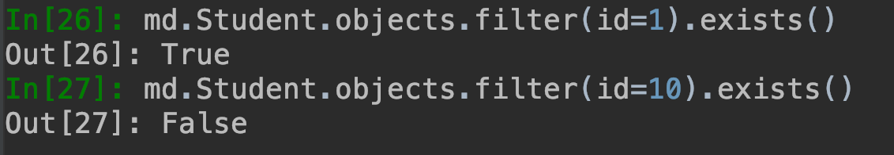

#### 总结

```
返回QuerySet对象的方法有
all()
filter()
exclude()
order_by()
reverse()
distinct()

特殊的QuerySet
values()       返回一个可迭代的字典序列
values_list() 返回一个可迭代的元祖序列

返回具体对象的
get()
first()
last()

返回布尔值的方法
exists()

返回数字的方法
count()
```

### 单表查询之神奇的双下划线

```python
models.Tb1.objects.filter(id__lt=10, id__gt=1)   # 获取id大于1 且 小于10的值
 
models.Tb1.objects.filter(id__in=[11, 22, 33])   # 获取id等于11、22、33的数据
models.Tb1.objects.exclude(id__in=[11, 22, 33])  # not in
 
models.Tb1.objects.filter(name__contains="ven")  # 获取name字段包含"ven"的
models.Tb1.objects.filter(name__icontains="ven") # icontains大小写不敏感
 
models.Tb1.objects.filter(id__range=[1, 3])      # id范围是1到3的，等价于SQL的bettwen and
 
类似的还有：startswith，istartswith, endswith, iendswith　

date字段还可以：
models.Class.objects.filter(first_day__year=2017)
```

### ForeignKey操作

- 正向查找

  对象查找（跨表）

  语法

  **对象.关联字段.字段**

  ```python
  book_obj = models.Book.objects.first()  # 第一本书对象
  print(book_obj.publisher)  # 得到这本书关联的出版社对象
  print(book_obj.publisher.name)  # 得到出版社对象的名称
  ```

- 反向查找

  语法：

  **关联字段__字段**

  ```python
  print(models.Book.objects.values_list("publisher__name"))
  ```


