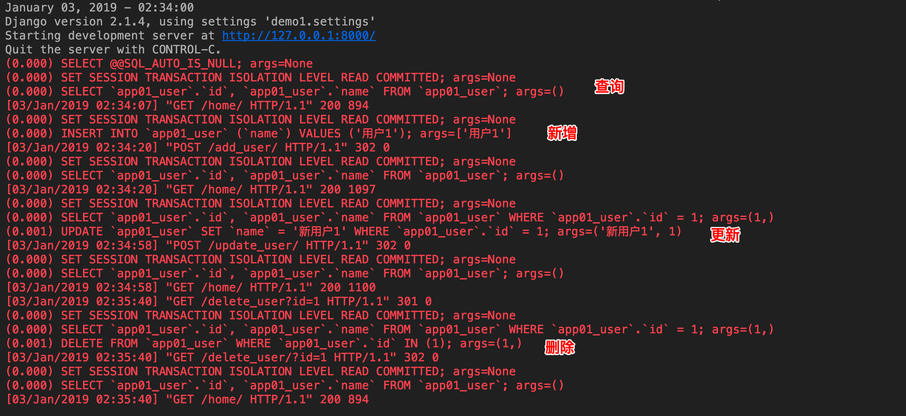
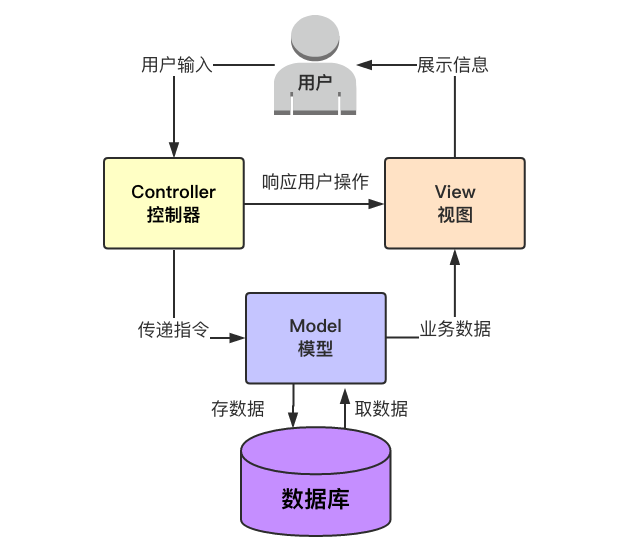
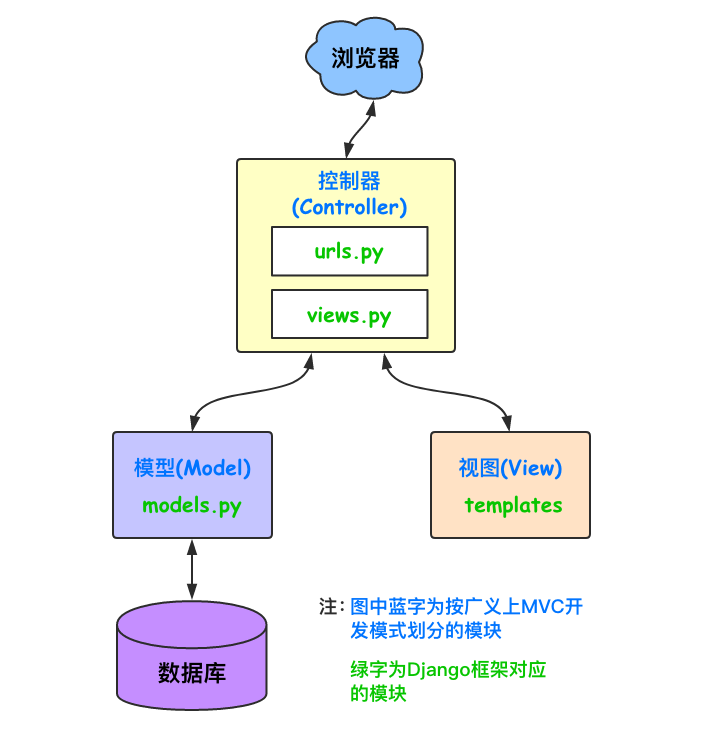
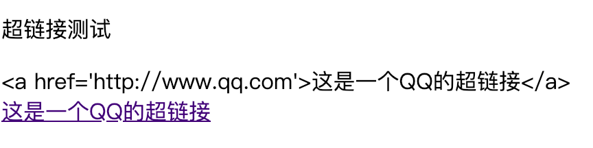
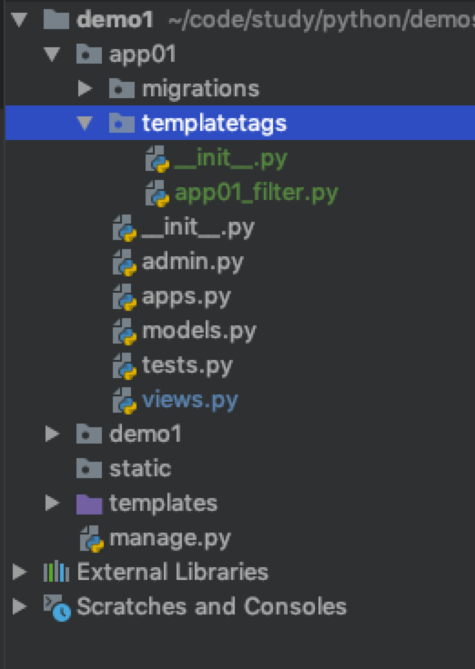

# Django 日志中打印SQL,Django框架,模板系统,母版,块,组件,静态文件

## 日志中显示SQL语句

通过配置 `setting.py` 文件, 可以在日志查看执行的SQL语句

### 配置

#### 简单方式配置

```python
# settings.py 文件中添加
# LOG
import logging
import django.utils.log
import logging.handlers

LOGGING = {
    'version': 1,
    'disable_existing_loggers': False,
    'handlers': {
        'console': {
            'level': 'DEBUG',
            'class': 'logging.StreamHandler',
        },
    },
    'loggers': {
        'django.db.backends': {
            'handlers': ['console'],
            'propagate': True,
            'level': 'DEBUG',
        },
    }
}
```

#### 完整方式配置

```python
LOGGING = {
    'version': 1,
    'disable_existing_loggers': False,
    'formatters': {
        'standard': {
            'format': '[%(asctime)s][%(threadName)s:%(thread)d][task_id:%(name)s][%(filename)s:%(lineno)d]'
                      '[%(levelname)s][%(message)s]'
        },
        'simple': {
            'format': '[%(levelname)s][%(asctime)s][%(filename)s:%(lineno)d]%(message)s'
        },
        'collect': {
            'format': '%(message)s'
        }
    },
    'filters': {
        'require_debug_true': {
            '()': 'django.utils.log.RequireDebugTrue',
        },
    },
    'handlers': {
        'console': {
            'level': 'DEBUG',
            'filters': ['require_debug_true'],  # 只有在Django debug为True时才在屏幕打印日志
            'class': 'logging.StreamHandler',
            'formatter': 'simple'
        },
        'default': {
            'level': 'INFO',
            'class': 'logging.handlers.RotatingFileHandler',  # 保存到文件，自动切
            'filename': os.path.join(BASE_LOG_DIR, "xxx_info.log"),  # 日志文件
            'maxBytes': 1024 * 1024 * 50,  # 日志大小 50M
            'backupCount': 3,
            'formatter': 'standard',
            'encoding': 'utf-8',
        },
        'error': {
            'level': 'ERROR',
            'class': 'logging.handlers.RotatingFileHandler',  # 保存到文件，自动切
            'filename': os.path.join(BASE_LOG_DIR, "xxx_err.log"),  # 日志文件
            'maxBytes': 1024 * 1024 * 50,  # 日志大小 50M
            'backupCount': 5,
            'formatter': 'standard',
            'encoding': 'utf-8',
        },
        'collect': {
            'level': 'INFO',
            'class': 'logging.handlers.RotatingFileHandler',  # 保存到文件，自动切
            'filename': os.path.join(BASE_LOG_DIR, "xxx_collect.log"),
            'maxBytes': 1024 * 1024 * 50,  # 日志大小 50M
            'backupCount': 5,
            'formatter': 'collect',
            'encoding': "utf-8"
        }
    },
    'loggers': {
       # 默认的logger应用如下配置
        '': {
            'handlers': ['default', 'console', 'error'],  # 上线之后可以把'console'移除
            'level': 'DEBUG',
            'propagate': True,
        },
        # 名为 'collect'的logger还单独处理
        'collect': {
            'handlers': ['console', 'collect'],
            'level': 'INFO',
        }
    },
}
```

### 执行的效果



## Django框架(MVC与MTV框架)

### MVC框架

MVC，全名是Model View Controller，是软件工程中的一种软件架构模式，把软件系统分为三个基本部分：模型(Model)、视图(View)和控制器(Controller)，具有耦合性低、重用性高、生命周期成本低等优点



### MTV框架



- Django框架的不同之处在于它拆分的三部分为：Model（模型）、Template（模板）和View（视图），也就是MTV框架

- Model(模型)：负责业务对象与数据库的对象(ORM)

  Template(模版)：负责如何把页面展示给用户

  View(视图)：负责业务逻辑，并在适当的时候调用Model和Template

  此外，Django还有一个urls分发器，它的作用是将一个个URL的页面请求分发给不同的view处理，view再调用相应的Model和Template

## Django模板系统

### 官网

[文档地址](https://docs.djangoproject.com/en/1.11/ref/templates/)

### 符号

只需要记两种特殊符号

{{  }}和 

变量相关的用{{}}，逻辑相关的用

### 变量

- 在Django的模板语言中按此语法使用：{{ 变量名 }}
- 当模版引擎遇到一个变量，它将计算这个变量，然后用结果替换掉它本身。 变量的命名包括任何字母数字以及下划线 ("_")的组合。 变量名称中不能有空格或标点符号
- 点（.）在模板语言中有特殊的含义。当模版系统遇到点(".")，它将以这样的顺序查询
  - 字典查询（Dictionary lookup）
  - 属性或方法查询（Attribute or method lookup）
  - 数字索引查询（Numeric index lookup）

- **注意**
  - 如果计算结果的值是可调用的，它将被无参数的调用。 调用的结果将成为模版的值
  - 如果使用的变量不存在， 模版系统将插入 string_if_invalid 选项的值， 它被默认设置为'' (空字符串)

- 示例

  ```python
  def test(request):
      value1 = 'aaa'
      value2 = [value1, 'bbb']
      value3 = {'k1': 'v1', 'k2': 'v2'}
  
      class Person:
          def __init__(self, name, age):
              self.name = name
              self.age = age
  
          def __str__(self):
              return f'name:{self.name}, age:{self.age}'
  
          def show_info(self):
              return f'用户信息 : {str(self)}'
  
      p1 = Person('用户1', 20)
      p2 = Person('用户2', 30)
  
      value4 = p1
      value5 = [p1, p2]
  
      return render(request, "home.html",
                    {
                        'v1': value1,
                        'v2': value2,
                        'v3': value3,
                        'v4': value4,
                        'v5': value5
                    }
                    )
  ```

  ```html
  <h4>变量测试</h4>
  <p>取一个不存在的数据 {{ v0 }}</p>
  <p>取列表的第一个数据 {{ v2.0 }}</p>
  <p>取列表的第二个数据 {{ v2.1 }}</p>
  <p>取字典指定key的值 {{ v3.k1 }}</p>
  <p>取对象的属性 {{ v4.name }}</p>
  <p>调用对象的方法 {{ v4.show_info }}</p>
  <p>对用对象列表中对象的方法 {{ v5.1.show_info }}</p>
  ```

  显示效果

  ```
  变量测试
  取一个不存在的数据
  取列表的第一个数据 aaa
  取列表的第二个数据 bbb
  取字典指定key的值 v1
  取对象的属性 用户1
  调用对象的方法 用户信息 : name:用户1, age:20
  对用对象列表中对象的方法 用户信息 : name:用户2, age:30
  ```

### 过滤器

- 在Django的模板语言中，通过使用 过滤器 来改变变量的显示

- **过滤器的语法： {{ value|filter_name:参数 }}**

- 使用管道符"|"来应用过滤器

  例如：{{ name|lower }}会将name变量应用lower过滤器之后再显示它的值。lower在这里的作用是将文本全都变成小写

- **注意**

  1. 过滤器支持“链式”操作。即一个过滤器的输出作为另一个过滤器的输入
  2. 过滤器可以接受参数，例如：{{ sss|truncatewords:30 }}，这将显示sss的前30个词
  3. 过滤器参数包含空格的话，必须用引号包裹起来。比如使用逗号和空格去连接一个列表中的元素，如：{{ list|join:', ' }}
  4. '|'左右没有空格没有空格没有空格

- Django的模板语言中提供了大约六十个内置过滤器

#### default

- 如果一个变量是false或者为空，使用给定的默认值。 否则，使用变量的值

  ```html
  {{ value|default:"nothing"}}
  ```

#### length

- 返回值的长度，作用于字符串和列表

  ```
  {{ value|length }}
  返回value的长度，如 value=['a', 'b', 'c', 'd']的话，就显示4
  ```

#### filesizeformat

- 将值格式化为一个 “人类可读的” 文件尺寸 （例如 13 KB, 4.1 MB, 102 bytes, 等等）

  ```
  {{ value|filesizeformat }}
  如果 value 是 123456789，输出将会是 117.7 MB
  ```

#### slice

- 切片

  ```
  {{value|slice:"2:-1"}}
  ```

#### date

- 日期格式化

  ```
  {{ value|date:"Y-m-d H:i:s"}}
  ```

- 参数

  | 格式化字符 |                             描述                             |                           示例输出                           |
  | ---------- | :----------------------------------------------------------: | :----------------------------------------------------------: |
  | a          | `'a.m.'`或`'p.m.'`（请注意，这与PHP的输出略有不同，因为这包括符合Associated Press风格的期间） |                           `'a.m.'`                           |
  | A          |                       `'AM'`或`'PM'`。                       |                            `'AM'`                            |
  | b          |                  月，文字，3个字母，小写。                   |                           `'jan'`                            |                                                              |
  | c          | ISO 8601格式。 （注意：与其他格式化程序不同，例如“Z”，“O”或“r”，如果值为naive datetime，则“c”格式化程序不会添加时区偏移量（请参阅[`datetime.tzinfo`](https://docs.python.org/3/library/datetime.html#datetime.tzinfo)） 。 | `2008-01-02T10:30:00.000123+02:00`或`2008-01-02T10:30:00.000123`如果datetime是天真的 |
  | d          |                月的日子，带前导零的2位数字。                 |                        `'01'`到`'31'`                        |
  | D          |                   一周中的文字，3个字母。                    |                          `“星期五”`                          |
  | e          | 时区名称 可能是任何格式，或者可能返回一个空字符串，具体取决于datetime。 |          `''`、`'GMT'`、`'-500'`、`'US/Eastern'`等           |
  | E          |         月份，特定地区的替代表示通常用于长日期表示。         |     `'listopada'`（对于波兰语区域，而不是`'Listopad'`）      |
  | f          | 时间，在12小时的小时和分钟内，如果它们为零，则分钟停留。 专有扩展。 |                       `'1'`，`'1:30'`                        |
  | F          |                         月，文，长。                         |                           `'一月'`                           |
  | g          |                 小时，12小时格式，无前导零。                 |                        `'1'`到`'12'`                         |
  | G          |                 小时，24小时格式，无前导零。                 |                        `'0'`到`'23'`                         |
  | h          |                      小时，12小时格式。                      |                        `'01'`到`'12'`                        |
  | H          |                      小时，24小时格式。                      |                        `'00'`到`'23'`                        |
  | i          |                            分钟。                            |                        `'00'`到`'59'`                        |
  | I          |                   夏令时间，无论是否生效。                   |                         `'1'`或`'0'`                         |
  | j          |                   没有前导零的月份的日子。                   |                        `'1'`到`'31'`                         |
  | l          |                       星期几，文字长。                       |                          `'星期五'`                          |
  | L          |                    布尔值是否是一个闰年。                    |                       `True`或`False`                        |
  | m          |                    月，2位数字带前导零。                     |                        `'01'`到`'12'`                        |
  | M          |                     月，文字，3个字母。                      |                            `“扬”`                            |
  | n          |                         月无前导零。                         |                        `'1'`到`'12'`                         |
  | N          |              美联社风格的月份缩写。 专有扩展。               |            `'Jan.'`，`'Feb.'`，`'March'`，`'May'`            |
  | o          | ISO-8601周编号，对应于使用闰年的ISO-8601周数（W）。 对于更常见的年份格式，请参见Y。 |                          `'1999年'`                          |
  | O          |               与格林威治时间的差异在几小时内。               |                          `'+0200'`                           |
  | P          | 时间为12小时，分钟和'a.m。'/'p.m。'，如果为零，分钟停留，特殊情况下的字符串“午夜”和“中午”。 专有扩展。 | `'1 am'`，`'1:30 pm' / t3>，'midnight'，'noon'，'12：30 pm' / T10>` |
  | r          | [**RFC 5322**](https://tools.ietf.org/html/rfc5322.html)格式化日期。 |             `'Thu, 21 Dec 2000 16:01:07 +0200'`              |
  | s          |                   秒，带前导零的2位数字。                    |                        `'00'`到`'59'`                        |
  | S          |               一个月的英文序数后缀，2个字符。                |                `'st'`，`'nd'`，`'rd'`或`'th'`                |
  | t          |                       给定月份的天数。                       |                         `28` to `31`                         |
  | T          |                         本机的时区。                         |                       `'EST'`，`'MDT'`                       |
  | u          |                            微秒。                            |                     `000000` to `999999`                     |
  | U          |   自Unix Epoch以来的二分之一（1970年1月1日00:00:00 UTC）。   |                                                              |
  | w          |                    星期几，数字无前导零。                    |               `'0'`（星期日）至`'6'`（星期六）               |
  | W          |               ISO-8601周数，周数从星期一开始。               |                          `1`，`53`                           |
  | y          |                       年份，2位数字。                        |                            `'99'`                            |
  | Y          |                         年，4位数。                          |                          `'1999年'`                          |
  | z          |                         一年中的日子                         |                          `0`到`365`                          |
  | Z          | 时区偏移量，单位为秒。UTC以西时区的偏移量总是为负数，对于UTC以东时，它们总是为正。 |                      `-43200`到`43200`                       |

#### safe

- Django的模板中会对HTML标签和JS等语法标签进行自动转义，原因显而易见，这样是为了安全。但是有的时候我们可能不希望这些HTML元素被转义，比如我们做一个内容管理系统，后台添加的文章中是经过修饰的，这些修饰可能是通过一个类似于FCKeditor编辑加注了HTML修饰符的文本，如果自动转义的话显示的就是保护HTML标签的源文件。为了在Django中关闭HTML的自动转义有两种方式，如果是一个单独的变量我们可以通过过滤器“|safe”的方式告诉Django这段代码是安全的不必转义

- 示例

  ```python
  def test(request):
      value = "<a href='http://www.qq.com'>这是一个QQ的超链接</a>"
      return render(request, "home.html", {'v6': value})
  ```

  ```html
  <p>超链接测试</p>
  {{ v6 }}
  <br>
  {{ v6|safe }}
  ```

  显示效果

  

#### truncatechars

- 如果字符串字符多于指定的字符数量，那么会被截断。截断的字符串将以可翻译的省略号序列（“...”）结尾

- 参数：截断的**字符**数

  ```
  {{ value|truncatechars:9}}
  ```

#### truncatewords

- 在一定数量的字后截断字符串

  ```
  {{ value|truncatewords:9}}
  ```

#### cut

- 移除value中所有的与给出的变量相同的字符串

  ```
  {{ value|cut:' ' }}
  如果value为'i love you'，那么将输出'iloveyou'
  ```

#### join

- 使用字符串连接列表，例如Python的str.join(list)

#### timesince

- 将日期格式设为自该日期起的时间（例如，“4天，6小时”）

- 采用一个可选参数，它是一个包含用作比较点的日期的变量（不带参数，比较点为现在）。 例如，如果blog_date是表示2006年6月1日午夜的日期实例，并且comment_date是2006年6月1日08:00的日期实例，则以下将返回“8小时”：

  ```
  {{ blog_date|timesince:comment_date }}
  ```

  分钟是所使用的最小单位，对于相对于比较点的未来的任何日期，将返回“0分钟”

#### timeuntil

- 似于timesince，除了它测量从现在开始直到给定日期或日期时间的时间。 例如，如果今天是2006年6月1日，而conference_date是保留2006年6月29日的日期实例，则{{ conference_date | timeuntil }}将返回“4周”

- 使用可选参数，它是一个包含用作比较点的日期（而不是现在）的变量。 如果from_date包含2006年6月22日，则以下内容将返回“1周”

  ```
  { conference_date|timeuntil:from_date }}
  ```

### 自定义filter

- 自定义过滤器只是带有一个或两个参数的Python函数

  **变量（输入）的值 : 不一定是一个字符串**

  **参数的值 : 这可以有一个默认值，或完全省略**

  例如，在过滤器{{var | foo:'bar'}}中，过滤器foo将传递变量var和参数bar

#### 步骤

1. 自定义的filter必须放在指定的包下

   - **包名必须为 templatetags**
   - **必须放在app下面**
   - filter的名称不是固定的, 可任意取名

   

2. 自定义过滤器

   ```python
   from django import template
   
   register = template.Library()
   
   
   # 定义 t1 过滤器
   @register.filter(name='t1')
   def test1(value):
       return f'{value} 哈哈'
   
   
   # 定义 t2 过滤器
   @register.filter(name='t2')
   def test2(value, arg1):
       return f'{value} {arg1}'
   ```

3. html中使用自定义过滤器

   ```html
   <p>自定义filter测试</p>
   
   {# 使用自定义filter之前必须先进行导入 #}
   
   
   {{ v6|t1 }}
   <br>
   {{ v6|t2:'123' }}
   ```

4. 显示结果

   ```
   自定义filter测试
   
   abc 哈哈 
   abc 123
   ```

### tags

#### for循环

- 普通for循环

  ```
  <ul>
  
      <li>{{ user.name }}</li>
  
  </ul>
  ```

- 可用参数

  |       Variable        |             Description              |
  | :-------------------: | :----------------------------------: |
  |   `forloop.counter`   |     当前循环的索引值（从1开始）      |
  |  `forloop.counter0`   |     当前循环的索引值（从0开始）      |
  | `forloop.revcounter`  |   当前循环的倒序索引值（从1开始）    |
  | `forloop.revcounter0` |   当前循环的倒序索引值（从0开始）    |
  |    `forloop.first`    |  当前循环是不是第一次循环（布尔值）  |
  |    `forloop.last`     | 当前循环是不是最后一次循环（布尔值） |
  | `forloop.parentloop`  |          本层循环的外层循环          |

- for ... empty

  ```
  <ul>
  
      <li>{{ user.name }}</li>
  
      <li>空空如也</li>
  
  </ul>
  ```

#### if 判断

- if ... esif 和 if ... else

  **if语句支持 and 、or、==、>、<、!=、<=、>=、in、not in、is、is not判断**

  ```
  
    用户人数：{{ user_list|length }}
  
    黑名单数：{{ black_list|length }}
  
    没有用户
  
  ```

  ```
  
    七座豪华SUV
  
      黄包车
  
  ```

#### with

- 定义一个中间变量，多用于给一个复杂的变量起别名

- **注意等号左右不要加空格**

- 两种定义方式

  ```
  
      {{ total }} employee{{ total|pluralize }}
  
  ```

  ```
  
      {{ total }} employee{{ total|pluralize }}
  
  ```

#### csrf_token

- 这个标签用于跨站请求伪造保护
- 在页面的form表单里面写上

#### 注释

```
{# ... #}
```

#### 注意事项

1. Django的模板语言**不支持连续判断**，即不支持以下写法

   ```
   {# Django 中不支持这种写法, 注意! #}
   
   ...
   
   ```

2. Django的模板语言中属性的优先级大于方法

   ```
   def xx(request):
       d = {"a": 1, "b": 2, "c": 3, "items": "100"}
       return render(request, "xx.html", {"data": d})
   ```

   如上，我们在使用render方法渲染一个页面的时候，传的字典d有一个key是items并且还有默认的 d.items() 方法，此时在模板语言中

   ```
   {{ data.items }}
   ```

   默认会取d的items key的值

## 母版

注意：我们通常会在母板中定义页面专用的CSS块和JS块，方便子页面替换

```html
<!DOCTYPE html>
<html lang="en">
<head>
  <meta charset="UTF-8">
  <meta http-equiv="x-ua-compatible" content="IE=edge">
  <meta name="viewport" content="width=device-width, initial-scale=1">
  <title>Title</title>
  
  
  
</head>
<body>

<h1>这是母板的标题</h1>




<h1>母板底部内容</h1>



</body>
</html>
```

## 继承母版

- 在子页面中在页面**最上方**使用下面的语法来继承母板

  ```
  
  ```

## 块 block

- 通过在母板中使用来定义"块"

- 在子页面中通过定义母板中的block名来对应替换母板中相应的内容

  ```
  
    <p>世情薄</p>
    <p>人情恶</p>
    <p>雨送黄昏花易落</p>
  
  ```

## 组件

- 可以将常用的页面内容如导航条，页尾信息等组件保存在单独的文件中，然后在需要使用的地方按如下语法导入即可

  ```
  
  ```

## 静态文件相关

### 

```


```

引用JS文件时使用

```

<script src=""></script>
```

某个文件多处被用到可以存为一个变量

```


</img>
```

### 

```


```

或者

```




```

## simple_tag

- 和自定义filter类似，只不过接收更灵活的参数

- 定义注册simple tag

  ```
  @register.simple_tag(name="plus")
  def plus(a, b, c):
      return "{} + {} + {}".format(a, b, c)
  ```

  使用自定义simple tag

  ```
  
  
  {# simple tag #}
  
  ```

## inclusion_tag

- 多用于返回html代码片段

- 示例

  templatetags/my_inclusion.py

  ```
  from django import template
  
  register = template.Library()
  
  
  @register.inclusion_tag('result.html')
  def show_results(n):
      n = 1 if n < 1 else int(n)
      data = ["第{}项".format(i) for i in range(1, n+1)]
      return {"data": data}
  ```

  templates/snippets/result.html

  ```
  <ul>
    
      <li>{{ choice }}</li>
    
  </ul>
  ```

  templates/index.html

  ```
  <!DOCTYPE html>
  <html lang="en">
  <head>
    <meta charset="UTF-8">
    <meta http-equiv="x-ua-compatible" content="IE=edge">
    <meta name="viewport" content="width=device-width, initial-scale=1">
    <title>inclusion_tag test</title>
  </head>
  <body>
  
  
  
  
  </body>
  </html>
  ```

