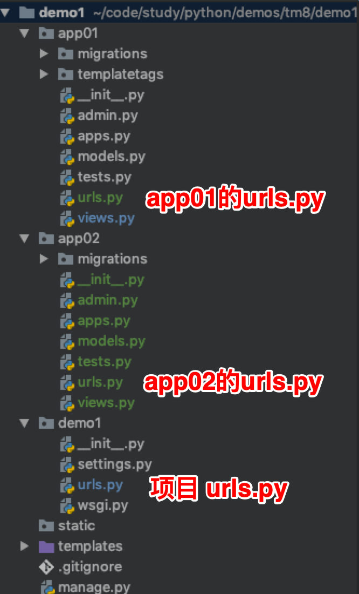

# Django 路由,url配置,url正则匹配,分组命名,视图,CBV与FBV及其装饰器,Request,Response,JsonResponse

## 路由系统

### 官网文档

[1.11版本官方文档](https://docs.djangoproject.com/en/1.11/topics/http/urls/)

[2.0版本官方文档](https://docs.djangoproject.com/en/2.0/topics/http/urls/)

### URL配置

URL配置(URLconf)就像Django 所支撑网站的目录。它的本质是URL与要为该URL调用的视图函数之间的映射

#### 1.11版本格式

```python
from django.conf.urls import url

urlpatterns = [
     url(正则表达式, views视图函数，参数，别名),
]
```

#### 参数说明

- 正则表达式：一个正则表达式字符串
- views视图函数：一个可调用对象，通常为一个视图函数或一个指定视图函数路径的字符串
- 参数：可选的要传递给视图函数的默认参数（字典形式）
- 别名：一个可选的name参数

#### 2.0版本格式

```python
from django.urls import path

urlpatterns = [
    path('articles/2003/', views.special_case_2003),
    path('articles/<int:year>/', views.year_archive),
    path('articles/<int:year>/<int:month>/', views.month_archive),
    path('articles/<int:year>/<int:month>/<slug:slug>/', views.article_detail),
]
```

在 Django 2.0 版本中, 如果需要通过正则进行匹配, 需要引入 `re_path` 模块

```python
from app01 import views
# 导入模块
from django.urls import re_path

urlpatterns = [
    path('admin/', admin.site.urls),
    # 可以匹配 t1/后面任意个数字的 url
    re_path(r't1/(\d+)', views.t1),
]
```

**注意**

如果url是通过正则进行匹配并且正则中包含了`()`, 那么 `view.py` 文件对应接收的参数就需要有指定 `()` 个参数

```
def t1(request, user_id):
    # t1/(\d+) 中会将 (\d+) 的值传给 user_id
    print(f'user id : {user_id}')
    return render(request, "test1.html", {'id': user_id})
```

### 正则表达式详解

#### 基础配置

```python
from django.conf.urls import url

from . import views

urlpatterns = [
    url(r'^articles/2003/$', views.special_case_2003),
    url(r'^articles/([0-9]{4})/$', views.year_archive),
    url(r'^articles/([0-9]{4})/([0-9]{2})/$', views.month_archive),
    url(r'^articles/([0-9]{4})/([0-9]{2})/([0-9]+)/$', views.article_detail),
]
```

#### 注意事项

1. urlpatterns中的元素按照书写顺序从上往下逐一匹配正则表达式，一旦匹配成功则不再继续
2. 若要从URL中捕获一个值，只需要在它周围放置一对圆括号（分组匹配）
3. 不需要添加一个前导的反斜杠，因为每个URL 都有。例如，应该是 `^articles` 而不是 `^/articles`
4. 每个正则表达式前面的'r' 是可选的但是建议加上

#### 补充说明

```python
# 是否开启URL访问地址后面不为/跳转至带有/的路径的配置项
APPEND_SLASH = True
```

Django settings.py 配置文件中默认没有 `APPEND_SLASH` 这个参数，但 Django 默认这个参数为 `APPEND_SLASH = True`。 其作用就是自动在网址结尾加 '/'

```python
# urls.py 文件配置
from django.conf.urls import url
from app01 import views

urlpatterns = [
        url(r'^blog/$', views.blog),
]

# 其效果就是
# 访问 http://www.example.com/blog 时，默认将网址自动转换为 http://www.example/com/blog/
```

**如果在settings.py中设置了 APPEND_SLASH=False，此时我们再请求 http://www.example.com/blog 时就会提示找不到页面**

### 分组命名匹配

上面的示例使用简单的正则表达式分组匹配（通过圆括号）来捕获URL中的值并以位置参数形式传递给视图

在更高级的用法中，可以使用分组命名匹配的正则表达式组来捕获URL中的值并以关键字参数形式传递给视图

在Python的正则表达式中，分组命名正则表达式组的语法是`(?P<name>pattern)`，其中`name`是组的名称，`pattern`是要匹配的模式

```python
from django.conf.urls import url

from . import views

urlpatterns = [
    url(r'^articles/2003/$', views.special_case_2003),
    url(r'^articles/(?P<year>[0-9]{4})/$', views.year_archive),
    url(r'^articles/(?P<year>[0-9]{4})/(?P<month>[0-9]{2})/$', views.month_archive),
    url(r'^articles/(?P<year>[0-9]{4})/(?P<month>[0-9]{2})/(?P<day>[0-9]{2})/$', views.article_detail),
]
```

这个实现与前面的示例完全相同，只有一个细微的差别：**捕获的值作为关键字参数而不是位置参数传递给视图函数**

例如，针对url /articles/2017/12/相当于按以下方式调用视图函数

```python
views.month_archive(request, year="2017", month="12")
```

在实际应用中，使用分组命名匹配的方式可以让你的URLconf 更加明晰且不容易产生参数顺序问题的错误

**注意**

- 参数匹配示例

  ```python
  # views.py
  def t2(request, *args, **kwargs):
      print(f'args = {args}, kwargs = {kwargs}')
      return render(request, "test1.html")
  ```

  ```python
  # 访问的 url 均为 http://127.0.0.1:8000/t02/abc/123
  
  # 情况1
  # re_path(r't02/(\w+)/(?P<user_id>\d+)', views.t2)
  # args = (), kwargs = {'user_id': '123'}
  
  # 情况2
  # re_path(r't02/(?P<user_name>\w+)/(?P<user_id>\d+)', views.t2),
  # args = (), kwargs = {'user_name': 'abc', 'user_id': '123'}
  
  # 情况3
  # re_path(r't02/(\w+)/(\d+)', views.t2)
  # args = ('abc', '123'), kwargs = {}
  
  # 情况4
  # re_path(r't02/(?P<user_name>\w+)/(\d+)', views.t2)
  # args = (), kwargs = {'user_name': 'abc'}
  ```

#### URLconf匹配的位置

URLconf 在请求的URL 上查找，将它当做一个普通的Python 字符串。不包括GET和POST参数以及域名

例如，http://www.example.com/myapp/ 请求中，URLconf 将查找`myapp/`

在 http://www.example.com/myapp/?page=3 请求中，URLconf 仍将查找`myapp/`

URLconf 不检查请求的方法。换句话讲，所有的请求方法, 同一个URL的`POST`、`GET`、`HEAD`等等, 都将路由到相同的函数

#### 捕获的参数永远都是字符串

每个在URLconf中捕获的参数都作为一个普通的Python字符串传递给视图，无论正则表达式使用的是什么匹配方式。例如，下面这行URLconf 中

```
url(r'^articles/(?P<year>[0-9]{4})/$', views.year_archive),
```

传递到视图函数`views.year_archive()` 中的`year` 参数永远是一个字符串类型

#### 视图函数中指定默认值

```python
# urls.py中
from django.conf.urls import url

from . import views

urlpatterns = [
    url(r'^blog/$', views.page),
    url(r'^blog/page(?P<num>[0-9]+)/$', views.page),
]

# views.py中，可以为num指定默认值
def page(request, num="1"):
    pass
```

在上面的例子中，两个URL模式指向相同的view - views.page - 但是第一个模式并没有从URL中捕获任何东西。如果第一个模式匹配上了，page()函数将使用其默认参数`num=“1”`,如果第二个模式匹配，page()将使用正则表达式捕获到的num值

#### include其他的URLconfs

实际开发中, 对于不同的业务会写在不同的app中, 这时候为了方便管理url, 不会将所有的 url 都写在工程的 urls.py 文件下, 而是会在每个 app 中创建对应的 urls.py



- 项目 urls.py

  ```python
  from django.urls import re_path
  from django.urls import include
  
  
  urlpatterns = [
      # 当访问 app01/*** 时, 会分发到 app01.urls 继续匹配 url
      re_path(r'app01/', include('app01.urls')),
      # 当访问 app02/*** 时, 会分发到 app02.urls 继续匹配 url
      re_path(r'app02/', include('app02.urls'))
  ]
  ```

- app01中的urls.py

  ```python
  # 导入模块
  from django.urls import re_path
  from django.urls import include
  from . import views
  
  urlpatterns = [
      re_path(r'(?P<user_id>\d+)/', views.test),
  ]
  ```

- app02中的urls.py

  ```python
  # 导入模块
  from django.urls import re_path
  from django.urls import include
  from . import views
  
  urlpatterns = [
      re_path(r'(?P<user_id>\d+)', views.test)
  ]
  ```

- 效果

  ```
  http://127.0.0.1:8000/app01/123/
  执行 app01 模块 view.py 的 test 方法
  
  http://127.0.0.1:8000/app02/123/
  执行 app02 模块 view.py 的 test 方法
  ```

### 传递额外的参数给视图函数(使用较少)

URLconfs 具有一个钩子，让你传递一个Python 字典作为额外的参数传递给视图函数

`django.conf.urls.url()` 函数可以接收一个可选的第三个参数，它是一个字典，表示想要传递给视图函数的额外关键字参数

```python
from django.conf.urls import url
from . import views

urlpatterns = [
    url(r'^blog/(?P<year>[0-9]{4})/$', views.year_archive, {'foo': 'bar'}),
]

# 在这个例子中，对于/blog/2005/请求，Django 将调用views.year_archive(request, year='2005', foo='bar')。
# 这个技术在Syndication 框架中使用，来传递元数据和选项给视图
```

## 命名URL与URL反向解析

在使用Django 项目时，一个常见的需求是获得URL的最终形式，以用于嵌入到生成的内容中（视图中和显示给用户的URL等）或者用于处理服务器端的导航（重定向等）

人们强烈希望不要硬编码这些URL（费力、不可扩展且容易产生错误）或者设计一种与URLconf 毫不相关的专门的URL 生成机制，因为这样容易导致一定程度上产生过期的URL

换句话讲，需要的是一个DRY 机制。除了其它有点，它还允许设计的URL 可以自动更新而不用遍历项目的源代码来搜索并替换过期的URL

获取一个URL 最开始想到的信息是处理它视图的标识（例如名字），查找正确的URL 的其它必要的信息有视图参数的类型（位置参数、关键字参数）和值

Django 提供一个办法是让URL 映射是URL 设计唯一的地方。你填充你的URLconf，然后可以双向使用它：

- 根据用户/浏览器发起的URL 请求，它调用正确的Django 视图，并从URL 中提取它的参数需要的值。
- 根据Django 视图的标识和将要传递给它的参数的值，获取与之关联的URL。

第一种方式是我们在前面的章节中一直讨论的用法。第二种方式叫做反向解析URL、反向URL 匹配、反向URL 查询或者简单的URL 反查。
在需要URL 的地方，对于不同层级，Django 提供不同的工具用于URL 反查：

- 在模板中：使用url模板标签。
- 在Python 代码中：使用django.core.urlresolvers.reverse() 函数。
- 在更高层的与处理Django 模型实例相关的代码中：使用get_absolute_url() 方法

**简单来说就是可以给我们的URL匹配规则起个名字，一个URL匹配模式起一个名字。这样我们以后就不需要写死URL代码了，只需要通过名字来调用当前的URL**

### 案例

- 案例1: 当访问 http://127.0.0.1:8000/app01/t4/123/ 时, 自动跳转到 http://127.0.0.1:8000/app01/t5/123/

  - app路由分发的代码与上面一致

  - app01中urls.py

    ```python
    urlpatterns = [
        # 为路径定义名称 name , 那么在 python中, 可以通过这个 name 反推出 url
        re_path(r't4/(?P<user_id>\d+)/', views.t4, name='t4'),
        re_path(r't5/(?P<user_id>\d+)/', views.t5, name='t5'),
    ]
    ```

  - app01中views.py

    ```python
    def t4(request, user_id):
        # 目的: 将 user_id 作为参数传入, 跳转到 t5
        # 通过 t5 的 name 反推出 url, 并将参数传入
        url = reverse('t5', args=(user_id,))
        return redirect(url)
    
    
    def t5(request, user_id):
        return render(request, "test1.html", {"content": f't5 {user_id}'})
    ```

- 案例2: 当访问 http://127.0.0.1:8000/app01/t4/123/ 时, 显示 t4.html 文件内容, 通过 t4.html 内容中的 a 标签跳转到 http://127.0.0.1:8000/app01/t5/123/

  - 第一种做法

    - 与案例1类似, 通过在 view.py 中生成 url , 然后通过参数传递给对应的html

      ```python
      from django.shortcuts import reverse
      
      
      def t4(request, user_id):
          url = reverse('t5', args=(user_id,))
          return render(request, "t4.html", {'user_id': user_id, 'url': url})
      
      
      def t5(request, user_id):
          return render(request, "test1.html", {"content": f't5 {user_id}'})
      ```

  - 第二种做法

    - app路由分发的代码与上面一致

    - views.py

      ```python
      def t4(request, user_id):
          return render(request, "t4.html", {'user_id': user_id, })
      
      
      def t5(request, user_id):
          print(f't5 user_id = {user_id}')
          return render(request, "test1.html", {"content": f't5 {user_id}'})
      ```

    - t4.html

      ```html
      <!DOCTYPE html>
      <html lang="en">
      <head>
          <meta charset="UTF-8">
          <title>t4页面</title>
      </head>
      <body>
      
      <p> user_id = {{ user_id }}</p>
      
      <!-- user_id 作为参数进行传递 -->    
      <a href="">跳转到 h5 页面中 : {{ user_id }}</a>
      
      </body>
      </html>
      ```

### namespace 命名空间模式

即使不同的APP使用相同的URL名称，URL的命名空间模式也可以让你唯一反转命名的URL

**即使app中URL的命名相同，也可以反转得到正确的URL了**

```python
# project中的urls.py
from django.conf.urls import url, include
 
urlpatterns = [
    url(r'^app01/', include('app01.urls', namespace='app01')),
    url(r'^app02/', include('app02.urls', namespace='app02')),
]
```

```python
# app01中的urls.py
from django.conf.urls import url
from app01 import views
 
app_name = 'app01'
urlpatterns = [
    url(r'^(?P<pk>\d+)/$', views.detail, name='detail')
]
```

```python
# app02中的urls.py
from django.conf.urls import url
from app02 import views
 
app_name = 'app02'
urlpatterns = [
    url(r'^(?P<pk>\d+)/$', views.detail, name='detail')
]
```

现在，我的两个app中 url名称重复了，我反转URL的时候就可以通过命名空间的名称得到我当前的URL

- 语法

  **'命名空间名称:URL名称'**

  - 模板中使用

    ```
    
    ```

  - views.py 函数中进行使用

    ```
    v = reverse('app01:detail', kwargs={'pk':11})
    ```

## Django中的View(视图)

一个视图函数（类）, 简称视图，是一个简单的Python 函数（类），它接受Web请求并且返回Web响应. 响应可以是一张网页的HTML内容，一个重定向，一个404错误，一个XML文档，或者一张图片. 无论视图本身包含什么逻辑，都要返回响应。代码写在哪里也无所谓，只要它在你当前项目目录下面。除此之外没有更多的要求了——可以说“没有什么神奇的地方”。为了将代码放在某处，大家约定成俗将视图放置在项目（project）或应用程序（app）目录中的名为`views.py`的文件中

### 一个简单的视图

```python
from django.http import HttpResponse
import datetime

def current_datetime(request):
    now = datetime.datetime.now()
    html = "<html><body>It is now %s.</body></html>" % now
    return HttpResponse(html)
```

让我们来逐行解释下上面的代码

- 首先，我们从 `django.http`模块导入了`HttpResponse`类，以及Python的`datetime`库

- 接着，我们定义了`current_datetime`函数。它就是视图函数。每个视图函数都使用`HttpRequest`对象作为第一个参数，并且通常称之为`request`

  注意，视图函数的名称并不重要；不需要用一个统一的命名方式来命名，以便让Django识别它。我们将其命名为`current_datetime`，是因为这个名称能够比较准确地反映出它实现的功能

- 这个视图会返回一个`HttpResponse`对象，其中包含生成的响应。每个视图函数都负责返回一个`HttpResponse`对象

Django使用请求和响应对象来通过系统传递状态

当浏览器向服务端请求一个页面时，Django创建一个HttpRequest对象，该对象包含关于请求的元数据。然后，Django加载相应的视图，将这个HttpRequest对象作为第一个参数传递给视图函数

每个视图负责返回一个HttpResponse对象

### CBV与FBV

**基于函数的view为 FBV , 基于类的view为 CBV**

#### FBV

```python
# FBV版添加班级
def add_class(request):
    if request.method == "POST":
        class_name = request.POST.get("class_name")
        models.Classes.objects.create(name=class_name)
        return redirect("/class_list/")
    return render(request, "add_class.html")
```

#### CBV

```python
# CBV版添加班级
from django.views import View


class AddClass(View):

    def get(self, request):
        return render(request, "add_class.html")

    def post(self, request):
        class_name = request.POST.get("class_name")
        models.Classes.objects.create(name=class_name)
        return redirect("/class_list/")
```

**注意**

使用CBV时，urls.py中也做对应的修改

```python
# urls.py中
url(r'^add_class/$', views.AddClass.as_view()),
```

### 视图装饰器

#### 装饰FBV

- FBV本身就是一个函数，所以和给普通的函数加装饰器无差

  ```python
  def wrapper(func):
      def inner(*args, **kwargs):
          start_time = time.time()
          ret = func(*args, **kwargs)
          end_time = time.time()
          print("used:", end_time-start_time)
          return ret
      return inner
  
  
  # FBV版添加班级
  @wrapper
  def add_class(request):
      if request.method == "POST":
          class_name = request.POST.get("class_name")
          models.Classes.objects.create(name=class_name)
          return redirect("/class_list/")
      return render(request, "add_class.html")
  ```

#### 装饰CBV

类中的方法与独立函数不完全相同，因此不能直接将函数装饰器应用于类中的方法 ，我们需要先将其转换为方法装饰器

Django中提供了method_decorator装饰器用于将函数装饰器转换为方法装饰器

```python
# CBV版添加班级
from django.views import View
from django.utils.decorators import method_decorator

class AddClass(View):

    @method_decorator(wrapper)
    def get(self, request):
        return render(request, "add_class.html")

    def post(self, request):
        class_name = request.POST.get("class_name")
        models.Classes.objects.create(name=class_name)
        return redirect("/class_list/")
```

注意

```python
# 使用CBV时要注意，请求过来后会先执行dispatch()这个方法，如果需要批量对具体的请求处理方法，如get，post等做一些操作的时候，这里我们可以手动改写dispatch方法，这个dispatch方法就和在FBV上加装饰器的效果一样。

class Login(View):
     
    def dispatch(self, request, *args, **kwargs):
        print('before')
        obj = super(Login,self).dispatch(request, *args, **kwargs)
        print('after')
        return obj
 
    def get(self,request):
        return render(request,'login.html')
 
    def post(self,request):
        print(request.POST.get('user'))
        return HttpResponse('Login.post')
```

### Request对象

当一个页面被请求时，Django就会创建一个包含本次请求原信息的HttpRequest对象

Django会将这个对象自动传递给响应的视图函数，一般视图函数约定俗成地使用 request 参数承接这个对象

[官方文档](https://docs.djangoproject.com/en/1.11/ref/request-response/)

#### 请求相关的常用值

| 参数          | 描述                                                      |
| ------------- | --------------------------------------------------------- |
| **path_info** | 返回用户访问url，不包括域名                               |
| **method**    | 请求中使用的HTTP方法的字符串表示，全大写表示              |
| **GET**       | 包含所有HTTP  GET参数的类字典对象                         |
| **POST**      | 包含所有HTTP POST参数的类字典对象                         |
| **body**      | 请求体，byte类型 request.POST的数据就是从body里面提取到的 |

#### 属性

所有的属性应该被认为是只读的，除非另有说明

```
属性：
　　django将请求报文中的请求行、头部信息、内容主体封装成 HttpRequest 类中的属性。
   除了特殊说明的之外，其他均为只读的。


0.HttpRequest.scheme
   表示请求方案的字符串（通常为http或https）

1.HttpRequest.body

　　一个字符串，代表请求报文的主体。在处理非 HTTP 形式的报文时非常有用，例如：二进制图片、XML,Json等。

　　但是，如果要处理表单数据的时候，推荐还是使用 HttpRequest.POST 。

　　另外，我们还可以用 python 的类文件方法去操作它，详情参考 HttpRequest.read() 。

 

2.HttpRequest.path

　　一个字符串，表示请求的路径组件（不含域名）。

　　例如："/music/bands/the_beatles/"


3.HttpRequest.method

　　一个字符串，表示请求使用的HTTP 方法。必须使用大写。

　　例如："GET"、"POST"

 

4.HttpRequest.encoding

　　一个字符串，表示提交的数据的编码方式（如果为 None 则表示使用 DEFAULT_CHARSET 的设置，默认为 'utf-8'）。
   这个属性是可写的，你可以修改它来修改访问表单数据使用的编码。
   接下来对属性的任何访问（例如从 GET 或 POST 中读取数据）将使用新的 encoding 值。
   如果你知道表单数据的编码不是 DEFAULT_CHARSET ，则使用它。

 

5.HttpRequest.GET 

　　一个类似于字典的对象，包含 HTTP GET 的所有参数。详情请参考 QueryDict 对象。

 

6.HttpRequest.POST

　　一个类似于字典的对象，如果请求中包含表单数据，则将这些数据封装成 QueryDict 对象。

　　POST 请求可以带有空的 POST 字典 —— 如果通过 HTTP POST 方法发送一个表单，但是表单中没有任何的数据，QueryDict 对象依然会被创建。
   因此，不应该使用 if request.POST  来检查使用的是否是POST 方法；应该使用 if request.method == "POST" 

　　另外：如果使用 POST 上传文件的话，文件信息将包含在 FILES 属性中。

 7.HttpRequest.COOKIES

　　一个标准的Python 字典，包含所有的cookie。键和值都为字符串。

 

8.HttpRequest.FILES

　　一个类似于字典的对象，包含所有的上传文件信息。
   FILES 中的每个键为<input type="file" name="" /> 中的name，值则为对应的数据。

　　注意，FILES 只有在请求的方法为POST 且提交的<form> 带有enctype="multipart/form-data" 的情况下才会
   包含数据。否则，FILES 将为一个空的类似于字典的对象。

 

9.HttpRequest.META

 　　一个标准的Python 字典，包含所有的HTTP 首部。具体的头部信息取决于客户端和服务器，下面是一些示例：

    CONTENT_LENGTH —— 请求的正文的长度（是一个字符串）。
    CONTENT_TYPE —— 请求的正文的MIME 类型。
    HTTP_ACCEPT —— 响应可接收的Content-Type。
    HTTP_ACCEPT_ENCODING —— 响应可接收的编码。
    HTTP_ACCEPT_LANGUAGE —— 响应可接收的语言。
    HTTP_HOST —— 客服端发送的HTTP Host 头部。
    HTTP_REFERER —— Referring 页面。
    HTTP_USER_AGENT —— 客户端的user-agent 字符串。
    QUERY_STRING —— 单个字符串形式的查询字符串（未解析过的形式）。
    REMOTE_ADDR —— 客户端的IP 地址。
    REMOTE_HOST —— 客户端的主机名。
    REMOTE_USER —— 服务器认证后的用户。
    REQUEST_METHOD —— 一个字符串，例如"GET" 或"POST"。
    SERVER_NAME —— 服务器的主机名。
    SERVER_PORT —— 服务器的端口（是一个字符串）。
 　　从上面可以看到，除 CONTENT_LENGTH 和 CONTENT_TYPE 之外，请求中的任何 HTTP 首部转换为 META 的键时，
    都会将所有字母大写并将连接符替换为下划线最后加上 HTTP_  前缀。
    所以，一个叫做 X-Bender 的头部将转换成 META 中的 HTTP_X_BENDER 键。

 
10.HttpRequest.user

　　一个 AUTH_USER_MODEL 类型的对象，表示当前登录的用户。

　　如果用户当前没有登录，user 将设置为 django.contrib.auth.models.AnonymousUser 的一个实例。你可以通过 is_authenticated() 区分它们。

    例如：

    if request.user.is_authenticated():
        # Do something for logged-in users.
    else:
        # Do something for anonymous users.
     

     　　user 只有当Django 启用 AuthenticationMiddleware 中间件时才可用。

     -------------------------------------------------------------------------------------

    匿名用户
    class models.AnonymousUser

    django.contrib.auth.models.AnonymousUser 类实现了django.contrib.auth.models.User 接口，但具有下面几个不同点：

    id 永远为None。
    username 永远为空字符串。
    get_username() 永远返回空字符串。
    is_staff 和 is_superuser 永远为False。
    is_active 永远为 False。
    groups 和 user_permissions 永远为空。
    is_anonymous() 返回True 而不是False。
    is_authenticated() 返回False 而不是True。
    set_password()、check_password()、save() 和delete() 引发 NotImplementedError。
    New in Django 1.8:
    新增 AnonymousUser.get_username() 以更好地模拟 django.contrib.auth.models.User。

 

11.HttpRequest.session

 　　一个既可读又可写的类似于字典的对象，表示当前的会话。只有当Django 启用会话的支持时才可用。
    完整的细节参见会话的文档。
```

上传文件示例

```python
def upload(request):
    """
    保存上传文件前，数据需要存放在某个位置。默认当上传文件小于2.5M时，django会将上传文件的全部内容读进内存。从内存读取一次，写磁盘一次。
    但当上传文件很大时，django会把上传文件写到临时文件中，然后存放到系统临时文件夹中。
    :param request: 
    :return: 
    """
    if request.method == "POST":
        # 从请求的FILES中获取上传文件的文件名，file为页面上type=files类型input的name属性值
        filename = request.FILES["file"].name
        # 在项目目录下新建一个文件
        with open(filename, "wb") as f:
            # 从上传的文件对象中一点一点读
            for chunk in request.FILES["file"].chunks():
                # 写入本地文件
                f.write(chunk)
        return HttpResponse("上传OK")
```

#### 方法

```
1.HttpRequest.get_host()

　　根据从HTTP_X_FORWARDED_HOST（如果打开 USE_X_FORWARDED_HOST，默认为False）和 HTTP_HOST 头部信息返回请求的原始主机。
   如果这两个头部没有提供相应的值，则使用SERVER_NAME 和SERVER_PORT，在PEP 3333 中有详细描述。

　　USE_X_FORWARDED_HOST：一个布尔值，用于指定是否优先使用 X-Forwarded-Host 首部，仅在代理设置了该首部的情况下，才可以被使用。

　　例如："127.0.0.1:8000"

　　注意：当主机位于多个代理后面时，get_host() 方法将会失败。除非使用中间件重写代理的首部。

 

2.HttpRequest.get_full_path()

　　返回 path，如果可以将加上查询字符串。

　　例如："/music/bands/the_beatles/?print=true"

 

3.HttpRequest.get_signed_cookie(key, default=RAISE_ERROR, salt='', max_age=None)

　　返回签名过的Cookie 对应的值，如果签名不再合法则返回django.core.signing.BadSignature。

　　如果提供 default 参数，将不会引发异常并返回 default 的值。

　　可选参数salt 可以用来对安全密钥强力攻击提供额外的保护。max_age 参数用于检查Cookie 对应的时间戳以确保Cookie 的时间不会超过max_age 秒。

        复制代码
        >>> request.get_signed_cookie('name')
        'Tony'
        >>> request.get_signed_cookie('name', salt='name-salt')
        'Tony' # 假设在设置cookie的时候使用的是相同的salt
        >>> request.get_signed_cookie('non-existing-cookie')
        ...
        KeyError: 'non-existing-cookie'    # 没有相应的键时触发异常
        >>> request.get_signed_cookie('non-existing-cookie', False)
        False
        >>> request.get_signed_cookie('cookie-that-was-tampered-with')
        ...
        BadSignature: ...    
        >>> request.get_signed_cookie('name', max_age=60)
        ...
        SignatureExpired: Signature age 1677.3839159 > 60 seconds
        >>> request.get_signed_cookie('name', False, max_age=60)
        False
        复制代码
         


4.HttpRequest.is_secure()

　　如果请求时是安全的，则返回True；即请求通是过 HTTPS 发起的。

 

5.HttpRequest.is_ajax()

　　如果请求是通过XMLHttpRequest 发起的，则返回True，方法是检查 HTTP_X_REQUESTED_WITH 相应的首部是否是字符串'XMLHttpRequest'。

　　大部分现代的 JavaScript 库都会发送这个头部。如果你编写自己的 XMLHttpRequest 调用（在浏览器端），你必须手工设置这个值来让 is_ajax() 可以工作。

　　如果一个响应需要根据请求是否是通过AJAX 发起的，并且你正在使用某种形式的缓存例如Django 的 cache middleware， 
   你应该使用 vary_on_headers('HTTP_X_REQUESTED_WITH') 装饰你的视图以让响应能够正确地缓存
```

**注意：键值对的值是多个的时候,比如checkbox类型的input标签，select标签，需要用 getlist**

```
request.POST.getlist("hobby")
```

### Response对象

与由Django自动创建的HttpRequest对象相比，HttpResponse对象是我们的职责范围了。我们写的每个视图都需要实例化，填充和返回一个HttpResponse

HttpResponse类位于django.http模块中

```python
# 传递字符串
from django.http import HttpResponse

response = HttpResponse("Here's the text of the Web page.")
response = HttpResponse("Text only, please.", content_type="text/plain")
```

```python
# 设置或删除响应头信息
response = HttpResponse()
response['Content-Type'] = 'text/html; charset=UTF-8'
del response['Content-Type']
```

- 属性

  HttpResponse.content：响应内容

  HttpResponse.charset：响应内容的编码

  HttpResponse.status_code：响应的状态码

### JsonResponse对象

- JsonResponse是HttpResponse的子类，专门用来生成JSON编码的响应

  ```python
  from django.http import JsonResponse
  
  response = JsonResponse({'foo': 'bar'})
  print(response.content)
  
  # b'{"foo": "bar"}'
  ```

  默认只能传递字典类型，如果要传递非字典类型需要设置一下safe关键字参数

  ```
  response = JsonResponse([1, 2, 3], safe=False)
  ```

### Django shortcut functions

[官方文档](https://docs.djangoproject.com/en/1.11/topics/http/shortcuts/)

#### render


结合一个给定的模板和一个给定的上下文字典，并返回一个渲染后的 HttpResponse 对象

- 参数

  | 参数名称      | 描述                                                         |
  | ------------- | ------------------------------------------------------------ |
  | request       | 用于生成响应的请求对象                                       |
  | template_name | 要使用的模板的完整名称，可选的参数                           |
  | context       | 添加到模板上下文的一个字典。默认是一个空字典。如果字典中的某个值是可调用的，视图将在渲染模板之前调用它 |
  | content_type  | 生成的文档要使用的MIME类型。默认为 DEFAULT_CONTENT_TYPE 设置的值。默认为'text/html' |
  | status        | 响应的状态码。默认为200                                      |
  | useing        | 用于加载模板的模板引擎的名称                                 |

- 示例

  ```python
  from django.shortcuts import render
  
  def my_view(request):
      # 视图的代码写在这里
      return render(request, 'myapp/index.html', {'foo': 'bar'})
  ```

  上面的代码等于

  ```python
  from django.http import HttpResponse
  from django.template import loader
  
  def my_view(request):
      # 视图代码写在这里
      t = loader.get_template('myapp/index.html')
      c = {'foo': 'bar'}
      return HttpResponse(t.render(c, request))
  ```

### redirect

参数可以是

- 一个模型：将调用模型的`get_absolute_url()` 函数
- 一个视图，可以带有参数：将使用`urlresolvers.reverse` 来反向解析名称
- 一个绝对的或相对的URL，将原封不动的作为重定向的位置

默认返回一个临时的重定向；传递`permanent=True` 可以返回一个永久的重定向。

示例:

你可以用多种方式使用`redirect()` 函数。

**传递一个具体的ORM对象（了解即可）**

将调用具体ORM对象的`get_absolute_url()` 方法来获取重定向的URL：

```
from django.shortcuts import redirect
 
def my_view(request):
    ...
    object = MyModel.objects.get(...)
    return redirect(object)
```

**传递一个视图的名称**

```
def my_view(request):
    ...
    return redirect('some-view-name', foo='bar')
```

**传递要重定向到的一个具体的网址**

```
def my_view(request):
    ...
    return redirect('/some/url/')
```

**当然也可以是一个完整的网址**

```
def my_view(request):
    ...
    return redirect('http://example.com/')
```

默认情况下，`redirect()` 返回一个临时重定向。以上所有的形式都接收一个`permanent` 参数；如果设置为`True`，将返回一个永久的重定向：

```
def my_view(request):
    ...
    object = MyModel.objects.get(...)
    return redirect(object, permanent=True)　　
```

**扩展阅读：** 

临时重定向（响应状态码：302）和永久重定向（响应状态码：301）对普通用户来说是没什么区别的，它主要面向的是搜索引擎的机器人。

A页面临时重定向到B页面，那搜索引擎收录的就是A页面。

A页面永久重定向到B页面，那搜索引擎收录的就是B页面