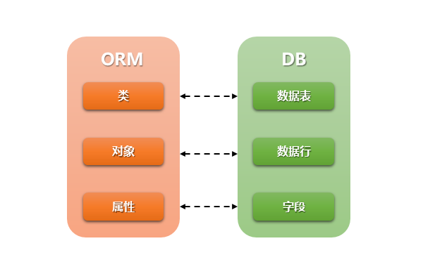
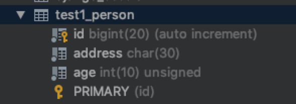
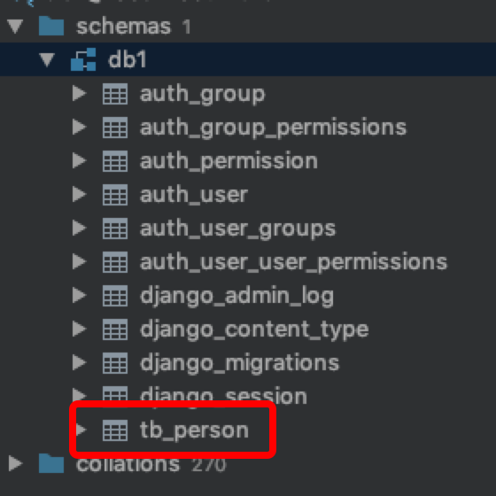
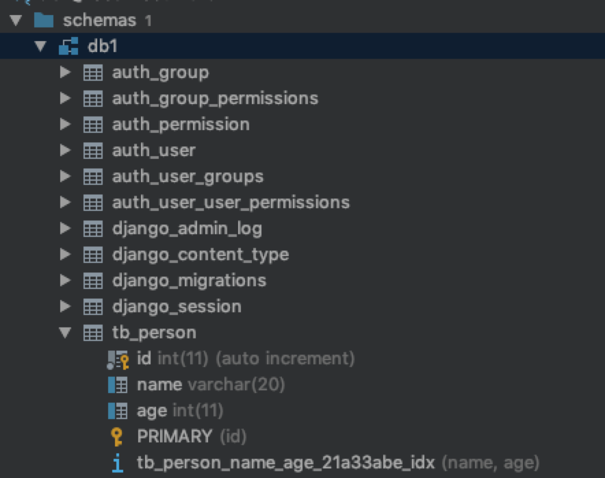
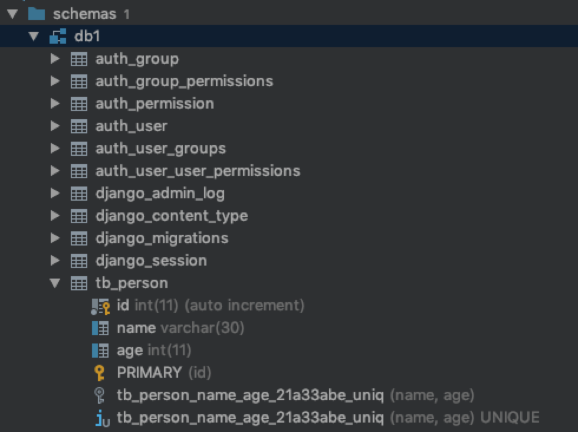
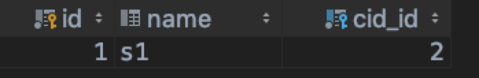
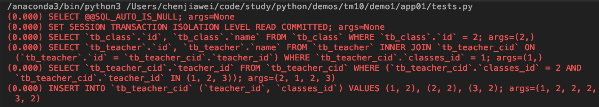
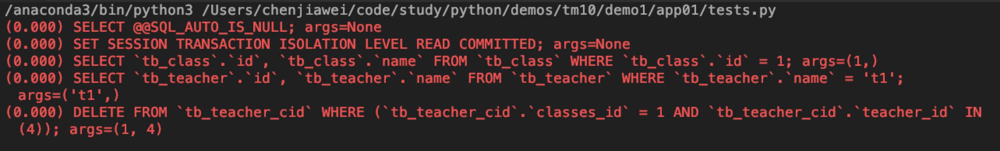

# Django ORM介绍,python datetime模块,ORM字段和参数,元信息,ORM相关操作(二)

## Django中打印SQL语句

```python
LOGGING = {
    'version': 1,
    'disable_existing_loggers': False,
    'handlers': {
        'console':{
            'level':'DEBUG',
            'class':'logging.StreamHandler',
        },
    },
    'loggers': {
        'django.db.backends': {
            'handlers': ['console'],
            'propagate': True,
            'level':'DEBUG',
        },
    }
}
```

## Python脚本中调用Django环境

```python
import os

if __name__ == '__main__':
    # 这里的 BMS 是项目名称
    # 可直接拷贝项目目录下的 manage.py 文件的相关设置
    os.environ.setdefault("DJANGO_SETTINGS_MODULE", "BMS.settings")
    
    import django
    django.setup()

    from app01 import models
	# 数据操作等等
```

## ORM介绍

### 概念

对象关系映射（Object Relational Mapping，简称ORM）模式是一种为了解决面向对象与关系数据库存在的互不匹配的现象的技术。

简单的说，ORM是通过使用描述对象和数据库之间映射的元数据，将程序中的对象自动持久化到关系数据库中。

ORM在业务逻辑层和数据库层之间充当了桥梁的作用

### 由来

让我们从O/R开始。字母O起源于"对象"(Object),而R则来自于"关系"(Relational)。

几乎所有的软件开发过程中都会涉及到对象和关系数据库。在用户层面和业务逻辑层面，我们是面向对象的。当对象的信息发生变化的时候，我们就需要把对象的信息保存在关系数据库中。

按照之前的方式来进行开发就会出现程序员会在自己的业务逻辑代码中夹杂很多SQL语句用来增加、读取、修改、删除相关数据，而这些代码通常都是重复的

### 优势

ORM解决的主要问题是对象和关系的映射。它通常把一个类和一个表一一对应，类的每个实例对应表中的一条记录，类的每个属性对应表中的每个字段。 

ORM提供了对数据库的映射，不用直接编写SQL代码，只需像操作对象一样从数据库操作数据。

让软件开发人员专注于业务逻辑的处理，提高了开发效率

### 劣势

ORM的缺点是会在一定程度上牺牲程序的执行效率。

ORM用多了SQL语句就不会写了，关系数据库相关技能退化...

### ORM总结

ORM只是一种工具，工具确实能解决一些重复，简单的劳动。这是不可否认的。

但我们不能指望某个工具能一劳永逸地解决所有问题，一些特殊问题还是需要特殊处理的。

但是在整个软件开发过程中需要特殊处理的情况应该都是很少的，否则所谓的工具也就失去了它存在的意义

## Django 中的 ORM

### 使用mysql数据库

1. 在Django项目的settings.py文件中，配置数据库连接信息：

   **Django 无法帮开发者创建数据库, 所以在配置Django之前, 必须保证mysql中存在着一个数据库**

   ```python
   DATABASES = {
       "default": {
           "ENGINE": "django.db.backends.mysql",
           "NAME": "你的数据库名称",  # 需要自己手动创建数据库
           "USER": "数据库用户名",
           "PASSWORD": "数据库密码",
           "HOST": "数据库IP",
           "POST": 3306
       }
   }
   ```

2. 在Django项目的__init__.py文件中写如下代码，告诉Django使用pymysql模块连接MySQL数据库:

   ```python
   import pymysql
   
   pymysql.install_as_MySQLdb()
   ```

### model

在Django中model是你数据的单一、明确的信息来源。它包含了你存储的数据的重要字段和行为。通常，一个模型（model）映射到一个数据库表，

基本情况：

- 每个模型都是一个Python类，它是django.db.models.Model的子类。
- 模型的每个属性都代表一个数据库字段。
- 综上所述，Django为您提供了一个自动生成的数据库访问API，详询 [官方文档链接](https://docs.djangoproject.com/en/2.0/topics/db/queries/)



### 快速入门

下面这个例子定义了一个 **Person** 模型，包含 **first_name** 和 **last_name**。

```python
from django.db import models

class Person(models.Model):
    first_name = models.CharField(max_length=30)
    last_name = models.CharField(max_length=30)
```

**first_name** 和 **last_name** 是模型的字段。每个字段被指定为一个类属性，每个属性映射到一个数据库列。

上面的 **Person** 模型将会像这样创建一个数据库表：

```sql
CREATE TABLE myapp_person (
    "id" serial NOT NULL PRIMARY KEY,
    "first_name" varchar(30) NOT NULL,
    "last_name" varchar(30) NOT NULL
);
```

一些说明：

- 表myapp_person的名称是自动生成的，如果你要自定义表名，需要在model的Meta类中指定 db_table 参数，强烈建议使用小写表名，特别是使用MySQL作为后端数据库时。
- id字段是自动添加的，如果你想要指定自定义主键，只需在其中一个字段中指定 primary_key=True 即可。如果Django发现你已经明确地设置了Field.primary_key，它将不会添加自动ID列。
- 本示例中的CREATE TABLE SQL使用PostgreSQL语法进行格式化，但值得注意的是，Django会根据配置文件中指定的数据库后端类型来生成相应的SQL语句。
- Django支持MySQL5.5及更高版本

## Python datetime模块介绍

### 介绍

datetime模块用于是date和time模块的合集，datetime有两个常量，MAXYEAR和MINYEAR，分别是9999和1.

datetime模块定义了5个类，分别是

1. datetime.date：表示日期的类

2. datetime.datetime：表示日期时间的类

3. datetime.time：表示时间的类

4. datetime.timedelta：表示时间间隔，即两个时间点的间隔

5. datetime.tzinfo：时区的相关信息

### datetime.date类

date类有三个参数,datetime.date(year,month,day)，返回year-month-day

方法：

1. datetime.date.ctime()

   返回格式如 Sun Apr 16 00:00:00 2017

   ```python
   import datetime
   
   if __name__ == '__main__':
       print(datetime.date(2019, 1, 10).ctime())
       # Thu Jan 10 00:00:00 2019
   ```

2. datetime.date.fromtimestamp(timestamp)

   根据给定的时间戮，返回一个date对象；datetime.date.today()作用相同

   ```python
   import datetime
   import time
   
   if __name__ == '__main__':
       time_str = '2019-01-10'
       time_struct = time.strptime(time_str, '%Y-%m-%d')
       time_stamp = time.mktime(time_struct)
   
       print(datetime.date.fromtimestamp(time_stamp))
       # 2019-01-10
   ```

3. datetime.date.isocalendar(): 

   返回iso格式年月日封装的元祖, 如(year，month，day)的元组,(2017, 15, 6)

   ```python
   import datetime
   
   if __name__ == '__main__':
       print(datetime.date(2019, 1, 10).isocalendar())
       # (2019, 2, 4)
   ```

4. datetime.date.isoformat()：

   返回格式如YYYY-MM-DD

   ```python
   import datetime
   
   if __name__ == '__main__':
       print(datetime.date(2019, 1, 10).isoformat())
       # 2019-01-10
   ```

5. datetime.date.isoweekday()：

   返回给定日期的星期（0-6），星期一=0，星期日=6

   ```python
   import datetime
   
   if __name__ == '__main__':
       print(datetime.date(2019, 1, 10).isoweekday())
       # 4
   ```

6. datetime.date.replace(year,month,day)：

   替换给定日期，但不改变原日期

   ```python
   import datetime
   
   if __name__ == '__main__':
       print(datetime.date(2019, 1, 10).replace(2018, 2, 14))
       # 2018-02-14
   ```

7. datetime.date.strftime(format):

   把日期时间按照给定的format进行格式化

   ```python
   import datetime
   
   if __name__ == '__main__':
       print(datetime.date(2019, 1, 10).strftime('%Y-%m-%d %X'))
       # 2019-01-10 00:00:00
   ```

8. datetime.date.timetuple()：

   返回日期对应的time.struct_time对象

   time.struct_time(tm_year=2017, tm_mon=4, tm_mday=15, tm_hour=0, tm_min=0, tm_sec=0, tm_wday=5, tm_yday=105, tm_isdst=-1)

   ```python
   import datetime
   
   if __name__ == '__main__':
       print(datetime.date(2019, 1, 10).timetuple())
       # time.struct_time(tm_year=2019, tm_mon=1, tm_mday=10, tm_hour=0, tm_min=0, tm_sec=0, tm_wday=3, tm_yday=10, tm_isdst=-1)
   ```

9. datetime.date.weekday()：

   返回日期的星期（0-6），星期一=0，星期日=6

   ```python
   import datetime
   
   if __name__ == '__main__':
       print(datetime.date(2019, 1, 7).weekday())
       # 0
   
       print(datetime.date(2019, 1, 10).weekday())
       # 3
   
       print(datetime.date(2019, 1, 13).weekday())
       # 6
   ```

10. python中时间日期格式化符号：

  | 符号 | 功能                                      |
  | ---- | ----------------------------------------- |
  | %y   | 两位数的年份表示（00-99）                 |
  | %Y   | 四位数的年份表示（000-9999）              |
  | %m   | 月份（01-12）                             |
  | %d   | 月内中的一天（0-31）                      |
  | %H   | 24小时制小时数（0-23）                    |
  | %I   | 12小时制小时数（01-12）                   |
  | %M   | 分钟数（00-59）                           |
  | %S   | 秒（00-59）                               |
  | %a   | 本地简化星期名称                          |
  | %A   | 本地完整星期名称                          |
  | %b   | 本地简化的月份名称                        |
  | %B   | 本地完整的月份名称                        |
  | %c   | 本地相应的日期表示和时间表示              |
  | %j   | 年内的一天（001-366）                     |
  | %p   | 本地A.M.或P.M.的等价符                    |
  | %U   | 一年中的星期数（00-53）星期天为星期的开始 |
  | %w   | 星期（0-6），星期天为星期的开始           |
  | %W   | 一年中的星期数（00-53）星期一为星期的开始 |
  | %x   | 本地相应的日期表示                        |
  | %X   | 本地相应的时间表示                        |
  | %Z   | 当前时区的名称                            |
  | %%   | %号本身                                   |

### datetime的time类

time类有5个参数，datetime.time(hour,minute,second,microsecond,tzoninfo), 返回08:29:30

1. datetime.time.replace()

   时间替换

   ```python
   import datetime
   
   if __name__ == '__main__':
       print(datetime.time(10, 0, 0).replace(9, 30, 0))
       # 09:30:00
   ```

2. datetime.time.strftime(format):

   按照format格式返回时间

   ```python
   import datetime
   
   if __name__ == '__main__':
       print(datetime.time(10, 0, 0).strftime('%p %X'))
       # AM 10:00:00
   ```

3. datetime.time.tzname()：

   返回时区名字

4. datetime.time.utcoffset()：

   返回时区的时间偏移量

### datetime的datetime类

datetime类有很多参数，datetime(year, month, day[, hour[, minute[, second[, microsecond[,tzinfo]]]]])，返回年月日，时分秒

1. datetime.datetime.ctime()

   ```python
   import datetime
   
   if __name__ == '__main__':
       print(datetime.datetime.now().ctime())
       # Thu Jan 10 17:41:32 2019
   ```

2. datetime.datetime.now().date()：

   返回当前日期时间的日期部分

   ```python
   import datetime
   
   if __name__ == '__main__':
       print(datetime.datetime.now().date())
       # 2019-01-10
   ```

3. datetime.datetime.now().time()：

   返回当前日期时间的时间部分

   ```python
   import datetime
   
   if __name__ == '__main__':
       print(datetime.datetime.now().time())
       # 17:43:19.789280
   ```

4. datetime.datetime.fromtimestamp()

   ```python
   import datetime
   import time
   
   if __name__ == '__main__':
       print(datetime.datetime.fromtimestamp(time.time()))
       # 2019-01-10 17:45:01.953088
   ```

5. datetime.datetime.now()：

   返回当前系统时间

   ```python
   import datetime
   
   if __name__ == '__main__':
       print(datetime.datetime.now())
       # 2019-01-10 17:45:40.452549
   ```

6. datetime.datetime.replace()

   ```python
   import datetime
   
   if __name__ == '__main__':
       print(datetime.datetime.now().replace(2019, 2, 1, 10, 0, 0, 0))
       # 2019-02-01 10:00:00
   ```

7. datetime.datetime.strftime()：

   由日期格式转化为字符串格式

   ```python
   import datetime
   
   if __name__ == '__main__':
       print(datetime.datetime.now().strftime('%Y-%m-%d %p %X'))
       # 2019-01-10 PM 17:48:52
   ```

8. datetime.datetime.strptime()

   由字符串格式转化为日期格式

   ```python
   import datetime
   
   if __name__ == '__main__':
       time_str = '2019-01-10 PM 17:48:52'
       print(datetime.datetime.strptime(time_str, '%Y-%m-%d %p %X'))
       # 2019-01-10 17:48:52
   ```

### datetime的timedelta类

用于计算两个日期之间的差值

```python
import datetime

if __name__ == '__main__':
    time_start = '2019-01-01 10:00:00'
    time_end = '2019-01-03 10:00:30'

    datetime_start = datetime.datetime.strptime(time_start, '%Y-%m-%d %X')
    datetime_end = datetime.datetime.strptime(time_end, '%Y-%m-%d %X')

    # 日期差
    print((datetime_end - datetime_start).days)
    # 2

    # 秒差(只对秒数进行比较)
    print((datetime_end - datetime_start).seconds)
    # 30

    # 秒差(对日期和秒数进行比较)
    print((datetime_end - datetime_start).total_seconds())
    # 172830.0

    # 毫秒差
    print((datetime_end - datetime_start).microseconds)
    # 0
```


## Django ORM 常用字段和参数

### 常用字段

- AutoField

  int自增列，必须填入参数 primary_key=True。当model中如果没有自增列，则自动会创建一个列名为id的列

- IntegerField

  一个整数类型,范围在 -2147483648 to 2147483647

- CharField

  字符类型，必须提供max_length参数， max_length表示字符长度

- DateField

  日期字段，日期格式  YYYY-MM-DD，相当于Python中的datetime.date()实例

- DateTimeField

  日期时间字段，格式 `YYYY-MM-DD HH:MM[:ss[.uuuuuu]][TZ]`，相当于Python中的datetime.datetime()实例

### 字段合集

- AutoField(Field)

  int自增列，必须填入参数 primary_key=True

- BigAutoField(AutoField)

  bigint自增列，必须填入参数 primary_key=True

  **当model中如果没有自增列，则自动会创建一个列名为id的列**

  ```python
  from django.db import models
  
  class UserInfo(models.Model):
  	# 自动创建一个列名为id的且为自增的整数列
  	username = models.CharField(max_length=32)
  
  class Group(models.Model):
  	# 自定义自增列
  	nid = models.AutoField(primary_key=True)
  	name = models.CharField(max_length=32)
  ```

- SmallIntegerField(IntegerField)

  小整数 -32768 ～ 32767

- PositiveSmallIntegerField(PositiveIntegerRelDbTypeMixin, IntegerField)

  正小整数 0 ～ 32767

- IntegerField(Field)

  整数列(有符号的) -2147483648 ～ 2147483647

- PositiveIntegerField(PositiveIntegerRelDbTypeMixin, IntegerField)

  正整数 0 ～ 2147483647

- BigIntegerField(IntegerField)

  长整型(有符号的) -9223372036854775808 ～ 9223372036854775807

- BooleanField(Field)

  布尔值类型

- NullBooleanField(Field)

  可以为空的布尔值

- CharField(Field)

  字符类型

  必须提供max_length参数， max_length表示字符长度

- TextField(Field)

  文本类型

- EmailField(CharField)

  字符串类型，Django Admin以及ModelForm中提供验证机制

- IPAddressField(Field)

  字符串类型，Django Admin以及ModelForm中提供验证 IPV4 机制

- GenericIPAddressField(Field)

  字符串类型，Django Admin以及ModelForm中提供验证 Ipv4和Ipv6

  参数

  - protocol，用于指定Ipv4或Ipv6， 'both',"ipv4","ipv6"
  - unpack_ipv4， 如果指定为True，则输入::ffff:192.0.2.1时候，可解析为192.0.2.1，开启此功能，需要protocol="both"

- URLField(CharField)

  字符串类型，Django Admin以及ModelForm中提供验证 URL

- SlugField(CharField)

  字符串类型，Django Admin以及ModelForm中提供验证支持 字母、数字、下划线、连接符（减号）

- CommaSeparatedIntegerField(CharField)

  字符串类型，格式必须为逗号分割的数字

- UUIDField(Field)

  字符串类型，Django Admin以及ModelForm中提供对UUID格式的验证

- FilePathField(Field)

  字符串，Django Admin以及ModelForm中提供读取文件夹下文件的功能

  参数

  |       参数名        |       作用       |
  | :-----------------: | :--------------: |
  |        path         |    文件夹路径    |
  |     match=None      |     正则匹配     |
  |   recursive=False   | 递归下面的文件夹 |
  |  allow_files=True   |     允许文件     |
  | allow_folders=False |    允许文件夹    |

- FileField(Field)

  字符串，路径保存在数据库，文件上传到指定目录

  参数

  - upload_to = ""      上传文件的保存路径
  - storage = None      存储组件，默认django.core.files.storage.FileSystemStorage

- ImageField(FileField)

  字符串，路径保存在数据库，文件上传到指定目录

  参数

  - upload_to = ""      上传文件的保存路径
  - storage = None      存储组件，默认django.core.files.storage.FileSystemStorage
  - width_field=None,   上传图片的高度保存的数据库字段名（字符串）
  - height_field=None   上传图片的宽度保存的数据库字段名（字符串）

- DateTimeField(DateField)

  日期+时间格式 `YYYY-MM-DD HH:MM[:ss[.uuuuuu]][TZ]`

- DateField(DateTimeCheckMixin, Field)

  日期格式      YYYY-MM-DD

- TimeField(DateTimeCheckMixin, Field)

  时间格式      `HH:MM[:ss[.uuuuuu]]`

- DurationField(Field)

  长整数，时间间隔，数据库中按照bigint存储，ORM中获取的值为datetime.timedelta类型

- FloatField(Field)

  浮点型

- DecimalField(Field)

  10进制小数

  参数

  - max_digits，小数总长度
  - decimal_places，小数位长度

- BinaryField(Field)

  二进制类型

### 自定义字段

#### 使用场景

在Django中, 如果需要存储字符类型的数据, 一般会使用 CharField , 对应数据库中的 varchar , 但是如果需要保存固定长的 char 类型, Django中没有这种数据类型, 这时候就需要进行自定义的方式进行支持

#### 自定义无符号整型类型

```python
class UnsignedIntegerField(models.IntegerField):
    def db_type(self, connection):
        return 'integer UNSIGNED'
```

#### 自定义固定长的字符类型

```python
class FixedCharField(models.Field):
    def __init__(self, max_length, *args, **kwargs):
        super().__init__(max_length=max_length, *args, **kwargs)
        self.fixed_char_length = max_length

    def db_type(self, connection):
        return f'char({self.fixed_char_length})'
```

#### 使用

```python
from django.db import models


# Create your models here.

class UnSignedIntegerField(models.IntegerField):

    def db_type(self, connection):
        return 'integer unsigned'


class FixedCharField(models.Field):
    def __init__(self, max_length, *args, **kwargs):
        super().__init__(max_length=max_length, *args, **kwargs)
        self.fixed_char_length = max_length

    def db_type(self, connection):
        return f'char({self.fixed_char_length})'


class Person(models.Model):
    id = models.BigAutoField(primary_key=True)
    age = UnSignedIntegerField(default=0)
    address = FixedCharField(max_length=30, default='')
```



### Django ORM字段与数据库实际字段的对应关系

|    Django orm 字段名称     |               数据库实际字段                |
| :------------------------: | :-----------------------------------------: |
|         AutoField          |           integer AUTO_INCREMENT            |
|        BigAutoField        |            bigint AUTO_INCREMENT            |
|        BinaryField         |                  longblob                   |
|        BooleanField        |                    bool                     |
|         CharField          |           varchar(%(max_length)s)           |
| CommaSeparatedIntegerField |           varchar(%(max_length)s)           |
|         DateField          |                    date                     |
|       DateTimeField        |                  datetime                   |
|        DecimalField        | numeric(%(max_digits)s, %(decimal_places)s) |
|       DurationField        |                   bigint                    |
|         FileField          |           varchar(%(max_length)s)           |
|       FilePathField        |           varchar(%(max_length)s)           |
|         FloatField         |              double precision               |
|        IntegerField        |                   integer                   |
|      BigIntegerField       |                   bigint                    |
|       IPAddressField       |                  char(15)                   |
|   GenericIPAddressField    |                  char(39)                   |
|      NullBooleanField      |                    bool                     |
|       OneToOneField        |                   integer                   |
|    PositiveIntegerField    |              integer UNSIGNED               |
| PositiveSmallIntegerField  |              smallint UNSIGNED              |
|         SlugField          |           varchar(%(max_length)s)           |
|     SmallIntegerField      |                  smallint                   |
|         TextField          |                  longtext                   |
|         TimeField          |                    time                     |
|         UUIDField          |                  char(32)                   |

### 字段参数

- null

  用于表示某个字段可以为空

- unique

  如果设置为unique=True 则该字段在此表中必须是唯一的

- db_index

  如果db_index=True 则代表着为此字段设置数据库索引

- default

  为该字段设置默认值

- 时间字段独有

  DatetimeField、DateField、TimeField这个三个时间字段，都可以设置如下属性

  - auto_now_add

    配置auto_now_add=True，创建数据记录的时候会把当前时间添加到数据库

  - auto_now

    配置上auto_now=True，每次更新数据记录的时候会更新该字段

## 关系字段

### Foreign key

外键类型在ORM中用来表示外键关联关系，一般把ForeignKey字段设置在 '一对多'中'多'的一方

ForeignKey可以和其他表做关联关系同时也可以和自身做关联关系

#### 字段参数

- to

  设置要关联的表

  ```python
  from django.db import models
  
  
  # Create your models here.
  
  class Classes(models.Model):
      id = models.AutoField(primary_key=True),
      name = models.CharField(max_length=30)
  
      def __str__(self):
          return f'Classes: id={self.id}, name={self.name}'
  
  
  class Student(models.Model):
      id = models.AutoField(primary_key=True),
      name = models.CharField(max_length=30)
      # 如果要关联 Classes 表, to 的两种写法
      # cid = models.ForeignKey(to='Classes', to_field='id', on_delete=models.CASCADE)
      # cid = models.ForeignKey(to=Classes, to_field='id', on_delete=models.CASCADE)
  
      def __str__(self):
          return f'Student: id={self.id}, name={self.name}, cid={self.cid}'
  ```

- to_field

  设置要关联的表的字段

- related_name

  反向操作时，使用的字段名，用于代替原反向查询时的'表名_set'

  - 反向查询之默认方式调用

    ```python
    from django.db import models
    
    
    # Create your models here.
    
    class Classes(models.Model):
        id = models.AutoField(primary_key=True),
        name = models.CharField(max_length=30)
    
        def __str__(self):
            return f'Classes: id={self.id}, name={self.name}'
    
    
    class Student(models.Model):
        id = models.AutoField(primary_key=True),
        name = models.CharField(max_length=30)
        cid = models.ForeignKey(to='Classes', to_field='id', on_delete=models.CASCADE)
    
        def __str__(self):
            return f'Student: id={self.id}, name={self.name}, cid={self.cid}'
    ```

    通过指定学生可以查询到对应班级的信息. 如果知道某个班级信息需要对应所有的学生, 会使用的`类名_set`方式

    ```python
    from django.test import TestCase
    import os
    import django
    
    # Create your tests here.
    
    if __name__ == '__main__':
        os.environ.setdefault('DJANGO_SETTINGS_MODULE', 'demo1.settings')
        django.setup()
    
        from app01 import models
    
        class_obj = models.Classes.objects.get(id=1)
        # 反向查询
        print(class_obj.student_set.all())
        # <QuerySet [<Student: Student: id=1, name=s1, cid=Classes: id=1, name=c1>, <Student: Student: id=2, name=s2, cid=Classes: id=1, name=c1>]>
    ```

    如果通过其他方式来替换`类名_set`的方式, 这个时候就需要使用 related_name

  - 反向查询之 related_name

    ```python
    from django.db import models
    
    
    # Create your models here.
    
    class Classes(models.Model):
        id = models.AutoField(primary_key=True),
        name = models.CharField(max_length=30)
    
        def __str__(self):
            return f'Classes: id={self.id}, name={self.name}'
    
    
    class Student(models.Model):
        id = models.AutoField(primary_key=True),
        name = models.CharField(max_length=30)
        # 添加 related_name
        cid = models.ForeignKey(to='Classes', to_field='id', on_delete=models.CASCADE, related_name='Students')
    
        def __str__(self):
            return f'Student: id={self.id}, name={self.name}, cid={self.cid}'
    ```

    ```python
    from django.test import TestCase
    import os
    import django
    
    # Create your tests here.
    
    if __name__ == '__main__':
        os.environ.setdefault('DJANGO_SETTINGS_MODULE', 'demo1.settings')
        django.setup()
    
        from app01 import models
    
        class_obj = models.Classes.objects.get(id=1)
    
        # 无法通过之前的方式进行调用
        # print(class_obj.student_set.all())
    
        # related_name='Students'
        # 由于 related_name 指定了名称, 必须要按照指定名称来进行调用
        print(class_obj.Students.all())
    ```

- related_query_name

  反向查询操作时，使用的连接前缀，用于替换表名

- on_delete

  当删除关联表中的数据时，当前表与其关联的行的行为

  - models.CASCADE

    删除关联数据，与之关联也删除

  - models.DO_NOTHING

    删除关联数据，引发错误IntegrityError

  - models.PROTECT

    删除关联数据，引发错误ProtectedError

  - models.SET_NULL

    删除关联数据，与之关联的值设置为null（前提FK字段需要设置为可空）

  - models.SET_DEFAULT

    删除关联数据，与之关联的值设置为默认值（前提FK字段需要设置默认值）

  - models.SET

    删除关联数据

    - 与之关联的值设置为指定值，设置：models.SET(值)
    - 与之关联的值设置为可执行对象的返回值，设置：models.SET(可执行对象)

    ```python
    def func():
        return 10
    
    class MyModel(models.Model):
        user = models.ForeignKey(
            to="User",
            to_field="id"，
            on_delete=models.SET(func)
        )
    ```

- db_constraint

  是否在数据库中创建外键约束，默认为True

### OneToOneField

一对一字段, 通常一对一字段用来扩展已有字段

**一对一的关联关系多用在当一张表的不同字段查询频次差距过大的情况下，将本可以存储在一张表的字段拆开放置在两张表中，然后将两张表建立一对一的关联关系**

```python
from django.db import models


# Create your models here.

class PersonDetail(models.Model):
    age = models.IntegerField(null=True)
    address = models.CharField(max_length=30, null=True)


class Person(models.Model):
    id = models.AutoField(primary_key=True)
    name = models.CharField(max_length=30)
    detail = models.OneToOneField(to='PersonDetail', on_delete=models.CASCADE)
```

查询数据库建表语句

```sql
-- show create table app01_persondetail

CREATE TABLE `app01_persondetail` (
  `id` int(11) NOT NULL AUTO_INCREMENT,
  `age` int(11) DEFAULT NULL,
  `address` varchar(30) DEFAULT NULL,
  PRIMARY KEY (`id`)
) ENGINE=InnoDB DEFAULT CHARSET=utf8mb4 COLLATE=utf8mb4_0900_ai_ci
```

```sql
-- show create table  app01_person;

CREATE TABLE `app01_person` (
  `id` int(11) NOT NULL AUTO_INCREMENT,
  `name` varchar(30) NOT NULL,
  `detail_id` int(11) NOT NULL,
  PRIMARY KEY (`id`),
  UNIQUE KEY `detail_id` (`detail_id`),
  CONSTRAINT `app01_person_detail_id_bb75e989_fk_app01_persondetail_id` FOREIGN KEY (`detail_id`) REFERENCES `app01_persondetail` (`id`)
) ENGINE=InnoDB DEFAULT CHARSET=utf8mb4 COLLATE=utf8mb4_0900_ai_ci;
```

### ManyToManyField

用于表示多对多的关联关系。在数据库中通过第三张表来建立关联关系

#### 字段参数

- to

- releated_name

- related_query_name

- symmetrical

  仅用于多对多自关联时，指定内部是否创建反向操作的字段。默认为True

  - 示例

    ```python
    class Person(models.Model):
        name = models.CharField(max_length=16)
        friends = models.ManyToManyField("self")
    ```

    此时，person对象就没有person_set属性

    ```python
    class Person(models.Model):
        name = models.CharField(max_length=16)
        friends = models.ManyToManyField("self", symmetrical=False)
    ```

    此时，person对象现在就可以使用person_set属性进行反向查询

    ```python
    from django.test import TestCase
    import os
    import django
    
    # Create your tests here.
    
    if __name__ == '__main__':
        os.environ.setdefault('DJANGO_SETTINGS_MODULE', 'demo1.settings')
        django.setup()
    
        from app01 import models
    
        person_obj = models.Person.objects.get(id=3)
        friend_list = person_obj.person_set.all()
        print(",".join([item_friend.name for item_friend in friend_list]))
    ```

- through

  在使用ManyToManyField字段时，Django将自动生成一张表来管理多对多的关联关系。

  但我们也可以手动创建第三张表来管理多对多关系，此时就需要通过through来指定第三张表的表名

- through_fields

  设置关联的字段

- db_table

  默认创建第三张表时，数据库中表的名称

#### 多对多关联关系的三种方式

- 方式1: 自己创建第三张表

  ```python
  class Book(models.Model):
      title = models.CharField(max_length=32, verbose_name="书名")
  
  
  class Author(models.Model):
      name = models.CharField(max_length=32, verbose_name="作者姓名")
  
  
  # 自己创建第三张表，分别通过外键关联书和作者
  class Author2Book(models.Model):
      author = models.ForeignKey(to="Author")
      book = models.ForeignKey(to="Book")
  
      class Meta:
          unique_together = ("author", "book")
  ```

- 方式二：通过ManyToManyField自动创建第三张表

  ```python
  class Book(models.Model):
      title = models.CharField(max_length=32, verbose_name="书名")
  
  
  # 通过ORM自带的ManyToManyField自动创建第三张表
  class Author(models.Model):
      name = models.CharField(max_length=32, verbose_name="作者姓名")
      books = models.ManyToManyField(to="Book", related_name="authors")
  ```

- 方式三：设置ManyTomanyField并指定自行创建的第三张表

  ```python
  class Book(models.Model):
      title = models.CharField(max_length=32, verbose_name="书名")
  
  
  # 自己创建第三张表，并通过ManyToManyField指定关联
  class Author(models.Model):
      name = models.CharField(max_length=32, verbose_name="作者姓名")
      books = models.ManyToManyField(to="Book", through="Author2Book", through_fields=("author", "book"))
      # through_fields接受一个2元组（'field1'，'field2'）：
      # 其中field1是定义ManyToManyField的模型外键的名（author），field2是关联目标模型（book）的外键名。
  
  
  class Author2Book(models.Model):
      author = models.ForeignKey(to="Author")
      book = models.ForeignKey(to="Book")
  
      class Meta:
          unique_together = ("author", "book")
  ```

- 注意
  1. 当我们需要在第三张关系表中存储额外的字段时，就要使用第三种方式
  2. 但是当我们使用第三种方式创建多对多关联关系时，就无法使用set、add、remove、clear方法来管理多对多的关系了，需要通过第三张表的model来管理多对多关系

## 元信息

ORM对应的类里面包含另一个Meta类，而Meta类封装了一些数据库的信息

- db_table

  ORM在数据库中的表名默认是 app_类名，可以通过db_table可以重写表名

  ```python
  from django.db import models
  
  
  # Create your models here.
  
  class Person(models.Model):
      id = models.AutoField(primary_key=True)
      name = models.CharField(max_length=20, null=True)
      age = models.IntegerField(null=True)
  
      class Meta:
          db_table = 'tb_person'
  ```

  

- index_together

  联合索引

  ```python
  from django.db import models
  
  
  # Create your models here.
  
  class Person(models.Model):
      id = models.AutoField(primary_key=True)
      name = models.CharField(max_length=20, null=True)
      age = models.IntegerField(null=True)
  
      class Meta:
          db_table = 'tb_person'
          index_together = ('name', 'age')
  ```

  

  查看表的创建语句

  ```sql
  -- show create table tb_person;
  
  CREATE TABLE `tb_person` (
    `id` int(11) NOT NULL AUTO_INCREMENT,
    `name` varchar(20) DEFAULT NULL,
    `age` int(11) DEFAULT NULL,
    PRIMARY KEY (`id`),
    KEY `tb_person_name_age_21a33abe_idx` (`name`,`age`)
  ) ENGINE=InnoDB DEFAULT CHARSET=utf8mb4 COLLATE=utf8mb4_0900_ai_ci
  ```

- unique_together

  联合唯一索引

  ```python
  from django.db import models
  
  
  # Create your models here.
  
  class Person(models.Model):
      id = models.AutoField(primary_key=True)
      name = models.CharField(max_length=30, null=True)
      age = models.IntegerField(null=True)
  
      class Meta:
          db_table = 'tb_person'
          unique_together = ('name', 'age')
  ```

  

  ```sql
  -- show create table tb_person
  
  CREATE TABLE `tb_person` (
    `id` int(11) NOT NULL AUTO_INCREMENT,
    `name` varchar(30) DEFAULT NULL,
    `age` int(11) DEFAULT NULL,
    PRIMARY KEY (`id`),
    UNIQUE KEY `tb_person_name_age_21a33abe_uniq` (`name`,`age`)
  ) ENGINE=InnoDB DEFAULT CHARSET=utf8mb4 COLLATE=utf8mb4_0900_ai_ci
  ```

- ordering

  指定默认按什么字段排序

  只有设置了该属性，我们查询到的结果才可以被reverse()

  ```python
  from django.db import models
  
  
  # Create your models here.
  
  class Person(models.Model):
      id = models.AutoField(primary_key=True)
      name = models.CharField(max_length=30, null=True)
      age = models.IntegerField(null=True)
  
      class Meta:
          db_table = 'tb_person'
          # 即使只根据某个字段进行排序,也必须传元祖
          ordering = ('name',)
  ```

## ORM相关操作(二)

### class RelatedManager

"关联管理器"是在一对多或者多对多的关联上下文中使用的管理器。

它存在于下面两种情况：

1. 外键关系的反向查询
2. 多对多关联关系

简单来说就是当 点后面的对象 可能存在多个的时候就可以使用以下的方法

#### create

创建一个新的对象，保存对象，并将它添加到关联对象集之中，返回新创建的对象

- 案例: 通过某个班级来添加学生

  ```python
  from django.db import models
  
  
  # Create your models here.
  
  class Classes(models.Model):
      id = models.AutoField(primary_key=True)
      name = models.CharField(max_length=20, null=True)
  
      class Meta:
          db_table = 'tb_class'
  
  
  class Student(models.Model):
      id = models.AutoField(primary_key=True)
      name = models.CharField(max_length=20, null=True)
      cid = models.ForeignKey(to='Classes', to_field='id', on_delete=models.CASCADE)
  
      class Meta:
          db_table = 'tb_student'
  ```

  ```python
  import os
  import django
  
  # Create your tests here.
  
  if __name__ == '__main__':
      os.environ.setdefault('DJANGO_SETTINGS_MODULE', 'demo1.settings')
      django.setup()
  
      from app01 import models
  
      # 获取 id 为 2 的班级
      second_class = models.Classes.objects.get(id=2)
      print(second_class.name)
      # 创建名称为 s1 的学生
      second_class.student_set.create(name='s1')
  ```

  

#### add

把指定的model对象添加到关联对象集中

- 案例: 将所有对1班授课的老师,添加到2班的授课教师名单中

  ```python
  # from django.test import TestCase
  import os
  import django
  
  # Create your tests here.
  
  if __name__ == '__main__':
      os.environ.setdefault('DJANGO_SETTINGS_MODULE', 'demo1.settings')
      django.setup()
  
      from app01 import models
  
      # 查找2班的班级
      second_class = models.Classes.objects.get(id=2)
      # 查找所有1班授课的老师
      teacher_set = models.Teacher.objects.filter(cid__id=1)
      # 授课到2班中
      second_class.teacher_set.add(*teacher_set)
  ```

  

#### set

更新model对象的关联对象

- 案例: 创建老师, 关联班级

  ```python
  # from django.test import TestCase
  import os
  import django
  
  # Create your tests here.
  
  if __name__ == '__main__':
      os.environ.setdefault('DJANGO_SETTINGS_MODULE', 'demo1.settings')
      django.setup()
  
      from app01 import models
  
      new_teacher = models.Teacher.objects.create(name='t1')
      class_list = models.Classes.objects.filter(id__lt=3)
      new_teacher.cid.set(class_list)
      new_teacher.save()
  ```

#### remove

从关联对象集中移除执行的model对象

```python
# from django.test import TestCase
import os
import django

# Create your tests here.

if __name__ == '__main__':
    os.environ.setdefault('DJANGO_SETTINGS_MODULE', 'demo1.settings')
    django.setup()

    from app01 import models

    class_obj = models.Classes.objects.get(id=1)
    teacher_obj = models.Teacher.objects.get(name='t1')
    class_obj.teacher_set.remove(teacher_obj)
```



#### clear

从关联对象集中移除一切对象

```python
book_obj = models.Book.objects.first()
book_obj.authors.clear()
```

**注意: 对于ForeignKey对象，clear()和remove()方法仅在null=True时存在**

- 案例

  ForeignKey字段没设置null=True时

  ```python
  class Book(models.Model):
      title = models.CharField(max_length=32)
      publisher = models.ForeignKey(to=Publisher)
  ```

  没有clear()和remove()方法

  ```
  models.Publisher.objects.first().book_set.clear()
  Traceback (most recent call last):
    File "<input>", line 1, in <module>
  AttributeError: 'RelatedManager' object has no attribute 'clear'
  ```

  当ForeignKey字段设置null=True时

  ```python
  class Book(models.Model):
      name = models.CharField(max_length=32)
      publisher = models.ForeignKey(to=Class, null=True)
  ```

  此时就有clear()和remove()方法

  ```python
  models.Publisher.objects.first().book_set.clear()
  ```

**对于所有类型的关联字段，add()、create()、remove()、clear()、set()都会马上更新数据库。换句话说，在关联的任何一端，都不需要再调用save()方法**