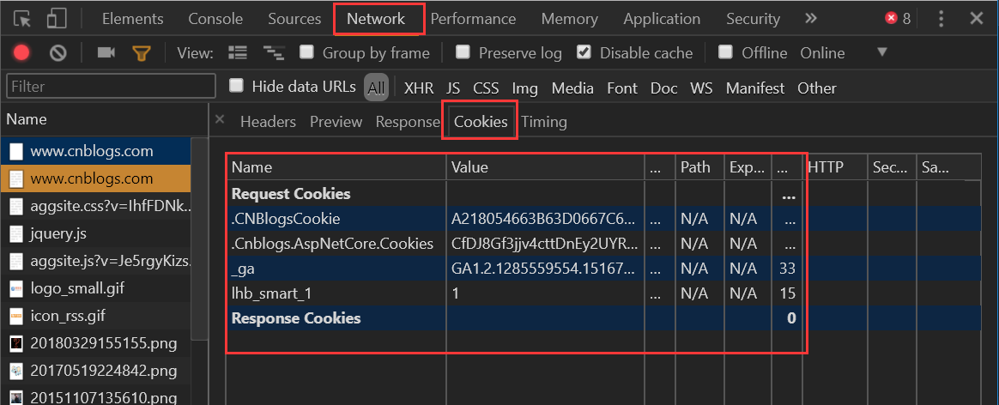
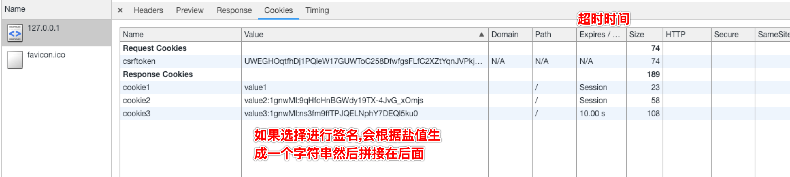
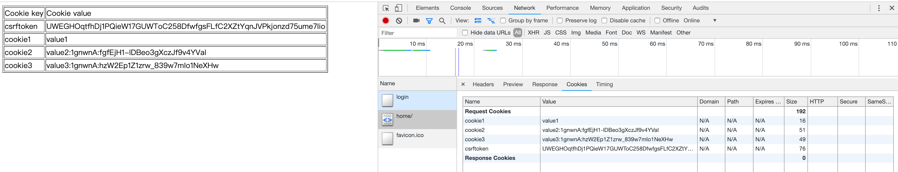
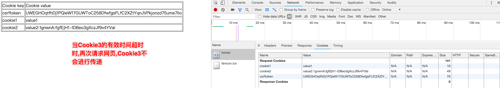
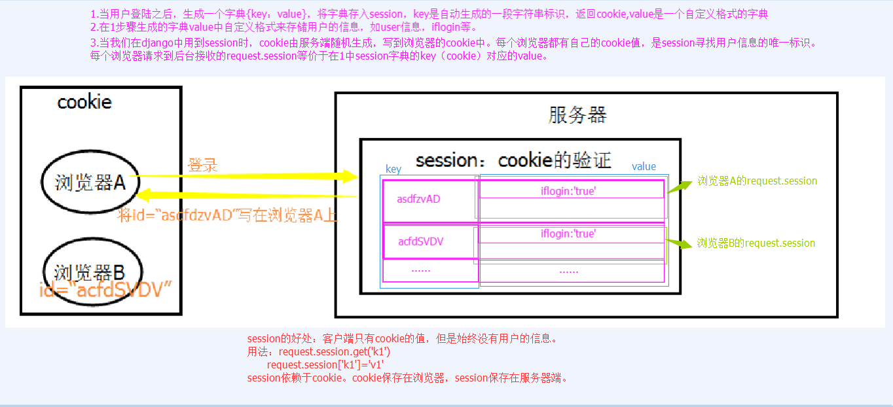
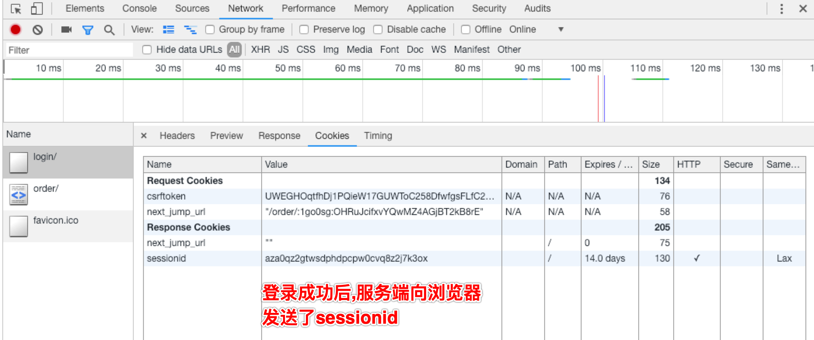
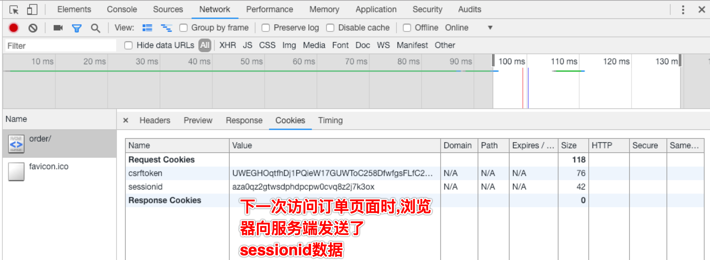
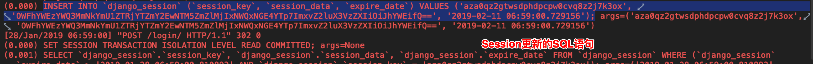

# Cookie Session 分页

## Cookie

### 介绍

- Cookie的由来

  HTTP协议是无状态的. 无状态的意思是每次请求都是独立的，它的执行情况和结果与前面的请求和之后的请求都无直接关系，它不会受前面的请求响应情况直接影响，也不会直接影响后面的请求响应情况。一句有意思的话来描述就是人生只如初见，**对服务器来说，每次的请求都是全新的**。

  状态可以理解为客户端和服务器在某次会话中产生的数据，那无状态的就以为这些数据不会被保留。**会话中产生的数据又是我们需要保存的**，也就是说要“保持状态”。因此Cookie就是在这样一个场景下诞生

- 什么是Cookie

  Cookie具体指的是一段小信息，它是服务器发送出来存储在浏览器上的一组组键值对，下次访问服务器时浏览器会自动携带这些键值对，以便服务器提取有用信息

- Cookie的原理

  **由服务器产生内容，浏览器收到请求后保存在本地；当浏览器再次访问时，浏览器会自动带上Cookie**，这样服务器就能通过Cookie的内容来判断这个是“谁”了

- 查看Cookie

  Chrome浏览器，打开开发者工具

  

### Django中操作Cookie

#### 设置Cookie

```python
rep = HttpResponse(...)
rep ＝ render(request, ...)

rep.set_cookie(key,value,...)
rep.set_signed_cookie(key,value,salt='加密盐', max_age=None, ...)
```

- 参数

  | 参数名         | 说明                                                         |
  | -------------- | ------------------------------------------------------------ |
  | key            | 键                                                           |
  | value=''       | 值                                                           |
  | max_age=None   | 超时时间(单位:秒)                                            |
  | expires=None   | 超时时间, ie浏览器需要设置这个参数                           |
  | path='/'       | Cookie生效的路径, /表示根路径, 特殊的：根路径的cookie可以被任何url的页面访问 |
  | domain=None    | Cookie生效的域名                                             |
  | secure=False   | https传输                                                    |
  | httponly=False | 只能http协议传输,无法被JavaScript获取(不是绝对,底层抓包可以获取到也可以被覆盖） |

- 示例

  ```python
  def login(request):
      """
      登录
      :param request:
      :return:
      """
      if is_get_method(request):
          return render(request, 'login_page.html')
      else:
          user_name = request.POST.get('user_name')
          user_password = request.POST.get('user_password')
          user_set = models.User.objects.filter(name=user_name, password=user_password)
          if user_set:
  
              url_response = HttpResponse(f'登录成功')
              # 设置Cookie的两种方式
  
              # 方式1
              url_response.set_cookie('cookie1', 'value1')
  
              # 方式2
              # 加盐 abc
              url_response.set_signed_cookie('cookie2', 'value2', salt='abc')
              # 加盐 abc 并且设置Cookie有效时间 10s
              url_response.set_signed_cookie('cookie3', 'value3', salt='abc', max_age=10)
  
              return url_response
          else:
              return HttpResponse(f'登录失败')
  ```

  

#### 获取Cookie

```python
request.COOKIES['key']
request.get_signed_cookie(key, default=RAISE_ERROR, salt='', max_age=None)
```

- 参数

  | 参数名  | 说明             |
  | ------- | ---------------- |
  | default | 默认值           |
  | salt    | 加盐值           |
  | max_age | 后台控制过期时间 |

- 示例

  ```python
  def home_page(request):
      """
      首页
      :param request:
      :return:
      """
      
      # 将所有的Cookie参数参数渲染到html中
  	return render(request, 'home_page.html', {"cookie_dict": request.COOKIES})
  
  
  def login(request):
      """
      登录
      :param request:
      :return:
      """
      if is_get_method(request):
          return render(request, 'login_page.html')
      else:
          user_name = request.POST.get('user_name')
          user_password = request.POST.get('user_password')
          user_set = models.User.objects.filter(name=user_name, password=user_password)
          if user_set:
  
              home_page_url = reverse('home_page')
              url_response = redirect(home_page_url)
  
              # 设置Cookie的两种方式
              # 方式1
              url_response.set_cookie('cookie1', 'value1')
  
              # 方式2
              # 加盐 abc
              url_response.set_signed_cookie('cookie2', 'value2', salt='abc')
              # 加盐 abc 并且设置Cookie有效时间 10s
              url_response.set_signed_cookie('cookie3', 'value3', salt='abc', max_age=10)
  
              return url_response
          else:
              return HttpResponse(f'登录失败')
  ```

  ```html
  <!DOCTYPE html>
  <html lang="en">
  <head>
      <meta charset="UTF-8">
      <title>首页</title>
  </head>
  <body>
  
  <table border="1">
      <thead>
      <tr>
          <td>Cookie key</td>
          <td>Cookie value</td>
      </tr>
      </thead>
      <tbody>
      
          <tr>
              <td>{{ cookie_key }}</td>
              <td>{{ cookie_value }}</td>
          </tr>
      
      </tbody>
  </table>
  
  </body>
  </html>
  ```

  

  

#### 删除Cookie

```python
def logout(request):
    rep = redirect("/login/")
    # 删除用户浏览器上之前设置的usercookie值
    rep.delete_cookie("user")  
    return rep
```

#### 案例

首页中, 有查看账单的功能, 点击查看账单, 如果是没有登录的状态, 必须先到登录页进行登录, 登录成功后才可以显示账单页面, 如果之前是已经登录的情况, 点击查看账单, 直接进入账单页面

```html
<!DOCTYPE html>
<html lang="en">
<head>
    <meta charset="UTF-8">
    <title>首页</title>
</head>
<body>

<table border="1">
    <thead>
    <tr>
        <td>Cookie key</td>
        <td>Cookie value</td>
    </tr>
    </thead>
    <tbody>
    
        <tr>
            <td>{{ cookie_key }}</td>
            <td>{{ cookie_value }}</td>
        </tr>
    
    </tbody>
</table>

<a href="">查看账单</a>

</body>
</html>
```

- 方式1

  ```python
  from django.shortcuts import render
  from django.shortcuts import HttpResponse
  from django.shortcuts import redirect
  from django.shortcuts import reverse
  from . import models
  
  
  # Create your views here.
  
  def is_get_method(request):
      """
      判断是否为get请求
      :param request:
      :return:
      """
      return request.method.lower() == 'get'
  
  
  def home_page(request):
      """
      首页
      :param request:
      :return:
      """
      if is_get_method(request):
          return render(request, 'home_page.html', {"cookie_dict": request.COOKIES})
  
  
  def login(request):
      """
      登录
      :param request:
      :return:
      """
      if is_get_method(request):
          return render(request, 'login_page.html')
      else:
          user_name = request.POST.get('user_name')
          user_password = request.POST.get('user_password')
          user_set = models.User.objects.filter(name=user_name, password=user_password)
          if user_set:
              # 获取下个页面跳转的url
              next_jump_url = request.get_signed_cookie('next_jump_url', '', salt='123456')
              url_response = redirect(next_jump_url)
              # 设置登录用户的Cookie
              url_response.set_cookie('login_user', user_name)
              # 删除 下个页面url跳转 的 Cookie
              url_response.delete_cookie('next_jump_url')
              return url_response
          else:
              return HttpResponse(f'登录失败')
  
  
  def user_order(request):
      """
      用户订单
      :param request:
      :return:
      """
      login_user = request.COOKIES.get('login_user', '')
      if login_user:
          return HttpResponse(f'这是 {login_user} 的订单信息')
      else:
          login_url = reverse('login')
          response = redirect(login_url)
  
          order_url = reverse('order')
          response.set_signed_cookie('next_jump_url', order_url, salt='123456')
          return response
  ```

- 方式2: 使用装饰器

  ```python
  from django.shortcuts import render
  from django.shortcuts import HttpResponse
  from django.shortcuts import redirect
  from django.shortcuts import reverse
  from . import models
  
  
  # Create your views here.
  
  def is_get_method(request):
      """
      判断是否为get请求
      :param request:
      :return:
      """
      return request.method.lower() == 'get'
  
  
  def home_page(request):
      """
      首页
      :param request:
      :return:
      """
      return render(request, 'home_page.html', {"cookie_dict": request.COOKIES})
  
  
  def login(request):
      """
      登录
      :param request:
      :return:
      """
      if is_get_method(request):
          return render(request, 'login_page.html')
      else:
          user_name = request.POST.get('user_name')
          user_password = request.POST.get('user_password')
          user_set = models.User.objects.filter(name=user_name, password=user_password)
          if user_set:
              # 获取下个页面跳转的url
              next_jump_url = request.get_signed_cookie('next_jump_url', '', salt='123456')
              url_response = redirect(next_jump_url)
              # 设置登录用户的Cookie
              url_response.set_cookie('login_user', user_name)
              # 删除 下个页面url跳转 的 Cookie
              url_response.delete_cookie('next_jump_url')
              return url_response
          else:
              return HttpResponse(f'登录失败')
  
  
  def check_login(func):
      """
      检测登录的装饰器
      :param func:
      :return:
      """
  
      def wrapper(request, *args, **kwargs):
          login_user = request.COOKIES.get('login_user', '')
          if login_user:
              result = func(request, *args, **kwargs)
              return result
          else:
              login_url = reverse('login')
              response = redirect(login_url)
  
              next_url = request.get_full_path()
              response.set_signed_cookie('next_jump_url', next_url, salt='123456')
              return response
  
      return wrapper
  
  
  @check_login
  def user_order(request):
      """
      用户订单
      :param request:
      :return:
      """
      login_user = request.COOKIES.get('login_user', '')
      return HttpResponse(f'这是 {login_user} 的订单信息')
  ```

##Session

### 由来

Cookie虽然在一定程度上解决了“保持状态”的需求，但是由于**Cookie本身最大支持4096字节，以及Cookie本身保存在客户端，可能被拦截或窃取，因此就需要有一种新的东西，它能支持更多的字节，并且他保存在服务器，有较高的安全性**。这就是Session。

问题来了，基于HTTP协议的无状态特征，服务器根本就不知道访问者是“谁”。那么上述的Cookie就起到桥接的作用。

我们可以给每个客户端的Cookie分配一个唯一的id，这样用户在访问时，通过Cookie，服务器就知道来的人是“谁”。然后我们再根据不同的Cookie的id，在服务器上保存一段时间的私密资料，如“账号密码”等等。

总结而言：Cookie弥补了HTTP无状态的不足，让服务器知道来的人是“谁”；但是Cookie以文本的形式保存在本地，自身安全性较差；所以我们就通过Cookie识别不同的用户，对应的在Session里保存私密的信息以及超过4096字节的文本

### Django中使用Session

相关方法

```
# 获取、设置、删除Session中数据
request.session['k1']
request.session.get('k1',None)
request.session['k1'] = 123
request.session.setdefault('k1',123) # 存在则不设置
del request.session['k1']

# 所有 键、值、键值对
request.session.keys()
request.session.values()
request.session.items()
request.session.iterkeys()
request.session.itervalues()
request.session.iteritems()

# 会话session的key
request.session.session_key

# 将所有Session失效日期小于当前日期的数据删除
request.session.clear_expired()

# 检查会话session的key在数据库中是否存在
request.session.exists("session_key")

# 删除当前会话的所有Session数据
request.session.delete()
　　
# 删除当前的会话数据并删除会话的Cookie。
request.session.flush() 
    这用于确保前面的会话数据不可以再次被用户的浏览器访问
    例如，django.contrib.auth.logout() 函数中就会调用它。

# 设置会话Session和Cookie的超时时间
request.session.set_expiry(value)
    * 如果value是个整数，session会在些秒数后失效。
    * 如果value是个datatime或timedelta，session就会在这个时间后失效。
    * 如果value是0,用户关闭浏览器session就会失效。
    * 如果value是None,session会依赖全局session失效策略
```

### 流程解析



### 登录案例

```python
from django.shortcuts import render
from django.shortcuts import HttpResponse
from django.shortcuts import redirect
from django.shortcuts import reverse
from . import models


# Create your views here.

def is_get_method(request):
    """
    判断是否为get请求
    :param request:
    :return:
    """
    return request.method.lower() == 'get'


def home_page(request):
    """
    首页
    :param request:
    :return:
    """

    # 使用session
    return render(request, 'home_page.html', {"cookie_dict": request.session})


def login(request):
    """
    登录
    :param request:
    :return:
    """
    if is_get_method(request):
        return render(request, 'login_page.html')
    else:
        user_name = request.POST.get('user_name')
        user_password = request.POST.get('user_password')
        user_set = models.User.objects.filter(name=user_name, password=user_password)
        if user_set:
            # 获取下个页面跳转的url
            next_jump_url = request.get_signed_cookie('next_jump_url', '', salt='123456')
            url_response = redirect(next_jump_url)

            # 设置登录用户的Session
            request.session['login_user'] = user_name

            # 删除 下个页面url跳转 的 Cookie
            url_response.delete_cookie('next_jump_url')
            return url_response
        else:
            return HttpResponse(f'登录失败')


def check_login(func):
    """
    检测登录的装饰器
    :param func:
    :return:
    """

    def wrapper(request, *args, **kwargs):
        login_user = request.session.get('login_user', '')
        if login_user:
            result = func(request, *args, **kwargs)
            return result
        else:
            login_url = reverse('login')
            response = redirect(login_url)

            next_url = request.get_full_path()
            response.set_signed_cookie('next_jump_url', next_url, salt='123456')
            return response

    return wrapper


@check_login
def user_order(request):
    """
    用户订单
    :param request:
    :return:
    """
    login_user = request.COOKIES.get('login_user', '')
    return HttpResponse(f'这是 {login_user} 的订单信息')
```







### Session其他配置

Django中默认支持Session，其内部提供了5种类型的Session供开发者使用

```python
# 1. 数据库Session
# 引擎（默认）
SESSION_ENGINE = 'django.contrib.sessions.backends.db'   

# 2. 缓存Session
# 引擎
SESSION_ENGINE = 'django.contrib.sessions.backends.cache'  
# 使用的缓存别名（默认内存缓存，也可以是memcache），此处别名依赖缓存的设置
SESSION_CACHE_ALIAS = 'default'                            

# 3. 文件Session
# 引擎
SESSION_ENGINE = 'django.contrib.sessions.backends.file'    
# 缓存文件路径，如果为None，则使用tempfile模块获取一个临时地址tempfile.gettempdir()
SESSION_FILE_PATH = None                                    

# 4. 缓存+数据库
# 引擎
SESSION_ENGINE = 'django.contrib.sessions.backends.cached_db'        

# 5. 加密Cookie Session
# 引擎
SESSION_ENGINE = 'django.contrib.sessions.backends.signed_cookies'   

# 其他公用设置项：
# Session的cookie保存在浏览器上时的key，即：sessionid＝随机字符串（默认）
SESSION_COOKIE_NAME ＝ "sessionid"                       
# Session的cookie保存的路径（默认）
SESSION_COOKIE_PATH ＝ "/"                               
# Session的cookie保存的域名（默认）
SESSION_COOKIE_DOMAIN = None                             
# 是否Https传输cookie（默认）
SESSION_COOKIE_SECURE = False                            
# 是否Session的cookie只支持http传输（默认）
SESSION_COOKIE_HTTPONLY = True                          
# Session的cookie失效日期（2周）（默认） 
SESSION_COOKIE_AGE = 1209600                            
# 是否关闭浏览器使得Session过期（默认）
SESSION_EXPIRE_AT_BROWSER_CLOSE = False                 
# 是否每次请求都保存Session，默认修改之后才保存（默认） 
SESSION_SAVE_EVERY_REQUEST = False                      
```

### CBV+装饰器

#### 登录示例

```python
from django.urls import re_path

from app01 import views

urlpatterns = [
    re_path('login/', views.Login.as_view(), name='login'),
    re_path('order/', views.UserOrder.as_view(), name='order'),
    re_path('home/', views.HomePage.as_view(), name='home_page'),
    re_path('', views.HomePage.as_view()),
]
```

```python
from django.shortcuts import render
from django.shortcuts import HttpResponse
from django.shortcuts import redirect
from django.shortcuts import reverse
from django.views import View
from django.utils.decorators import method_decorator
from . import models


# Create your views here.

def is_get_method(request):
    """
    判断是否为get请求
    :param request:
    :return:
    """
    return request.method.lower() == 'get'


class HomePage(View):
    """
    首页
    """

    def get(self, request):
        # 使用session
        return render(request, 'home_page.html', {"cookie_dict": request.session})


class Login(View):
    """
    登录
    """

    def get(self, request):
        return render(request, 'login_page.html')

    def post(self, request):
        user_name = request.POST.get('user_name')
        user_password = request.POST.get('user_password')
        user_set = models.User.objects.filter(name=user_name, password=user_password)
        if user_set:
            # 获取下个页面跳转的url
            next_jump_url = request.get_signed_cookie('next_jump_url', '', salt='123456')
            url_response = redirect(next_jump_url)

            # 设置登录用户的Session
            request.session['login_user'] = user_name

            # 删除 下个页面url跳转 的 Cookie
            url_response.delete_cookie('next_jump_url')
            return url_response
        else:
            return HttpResponse(f'登录失败')


def check_login(func):
    """
    检测登录的装饰器
    :param func:
    :return:
    """

    def wrapper(request, *args, **kwargs):
        login_user = request.session.get('login_user', '')
        if login_user:
            result = func(request, *args, **kwargs)
            return result
        else:
            login_url = reverse('login')
            response = redirect(login_url)

            next_url = request.get_full_path()
            response.set_signed_cookie('next_jump_url', next_url, salt='123456')
            return response

    return wrapper


class UserOrder(View):
    """
    用户订单
    """

    @method_decorator(check_login)
    def get(self, request):
        login_user = request.session.get('login_user', '')
        return HttpResponse(f'这是 {login_user} 的订单信息')
```

#### 其他方式

要在CBV视图中使用我们上面的check_login装饰器，有以下三种方式

1. **加在CBV视图的get或post方法上**

   ```python
   from django.utils.decorators import method_decorator
   
   
   class HomeView(View):
   
       def dispatch(self, request, *args, **kwargs):
           return super(HomeView, self).dispatch(request, *args, **kwargs)
   
       def get(self, request):
           return render(request, "home.html")
       
       @method_decorator(check_login)
       def post(self, request):
           print("Home View POST method...")
           return redirect("/index/")
   ```

2. **加在dispatch方法上**

   因为CBV中首先执行的就是dispatch方法，所以这么写相当于给get和post方法都加上了登录校验

   ```python
   from django.utils.decorators import method_decorator
   
   
   class HomeView(View):
   
       @method_decorator(check_login)
       def dispatch(self, request, *args, **kwargs):
           return super(HomeView, self).dispatch(request, *args, **kwargs)
   
       def get(self, request):
           return render(request, "home.html")
   
       def post(self, request):
           print("Home View POST method...")
           return redirect("/index/")
   ```

3. **直接加在视图类上，但method_decorator必须传 name 关键字参数**

   如果get方法和post方法都需要登录校验的话就写两个装饰器

   ```python
   from django.utils.decorators import method_decorator
   
   @method_decorator(check_login, name="get")
   @method_decorator(check_login, name="post")
   class HomeView(View):
   
       def dispatch(self, request, *args, **kwargs):
           return super(HomeView, self).dispatch(request, *args, **kwargs)
   
       def get(self, request):
           return render(request, "home.html")
   
       def post(self, request):
           print("Home View POST method...")
           return redirect("/index/")
   ```

### 补充

CSRF Token相关装饰器在CBV只能加到dispatch方法上，或者加在视图类上然后name参数指定为dispatch方法。

csrf_protect，为当前函数强制设置防跨站请求伪造功能，即便settings中没有设置全局中间件。
csrf_exempt，取消当前函数防跨站请求伪造功能，即便settings中设置了全局中间件

```python
from django.views.decorators.csrf import csrf_exempt, csrf_protect
from django.utils.decorators import method_decorator


class HomeView(View):

    @method_decorator(csrf_exempt)
    def dispatch(self, request, *args, **kwargs):
        return super(HomeView, self).dispatch(request, *args, **kwargs)

    def get(self, request):
        return render(request, "home.html")

    def post(self, request):
        print("Home View POST method...")
        return redirect("/index/")
```

或者

```python
from django.views.decorators.csrf import csrf_exempt, csrf_protect
from django.utils.decorators import method_decorator


@method_decorator(csrf_exempt, name='dispatch')
class HomeView(View):
   
    def dispatch(self, request, *args, **kwargs):
        return super(HomeView, self).dispatch(request, *args, **kwargs)

    def get(self, request):
        return render(request, "home.html")

    def post(self, request):
        print("Home View POST method...")
        return redirect("/index/")
```

## 分页

当数据库中数据有很多，我们通常会在前端页面做分页展示。分页的数据可以在前端页面实现，也可以在后端实现分页。后端实现分页的原理就是每次只请求一页数据

### 批量添加数据

```python
from django.test import TestCase
import django
import os

# Create your tests here.

if __name__ == '__main__':
    os.environ.setdefault('DJANGO_SETTINGS_MODULE', 'demo1.settings')
    django.setup()

    from app01 import models

    user_list = []
    for item in range(1, 285):
        user = models.User(name=f'user{item}', password=f'password{item}')
        user_list.append(user)

    # 批量添加,只执行一次SQL操作
    models.User.objects.bulk_create(user_list)
```

### 自定义分页实现

```python
class User(View):
    def get(self, request):
        user_list = models.User.objects.all()

        # 每页显示的条目数目
        data_page_show = 10
        # 最多显示的页数
        nav_page_show = 11

        # 总数据数目
        data_count = user_list.count()
        total_page_tuple = divmod(data_count, data_page_show)
        # 总页数
        total_page = total_page_tuple[0]
        if total_page_tuple[1] > 0:
            total_page += 1

        # 当前页
        current_page_index = int(request.GET.get('page', '1'))

        page_start = current_page_index - nav_page_show // 2
        page_end = current_page_index + nav_page_show // 2

        if page_start < 1:
            page_start = 1
            page_end = page_start + min(nav_page_show, total_page)

        elif page_end > total_page:
            page_end = total_page
            page_start = page_end - min(nav_page_show, total_page)

        current_page_data_start = (current_page_index - 1) * data_page_show
        current_page_data_end = current_page_index * data_page_show
        if current_page_data_end >= data_count:
            current_page_data_end = data_count - 1
        user_list = user_list[current_page_data_start:current_page_data_end]

        # 生成 html 的 li 列表
        user_url = reverse('user')

        page_li_list = []
        if current_page_index - 1 < 1:
            # 前一页不可点击
            page_li_list.append(f'''
                <li class="disabled">
                    <a aria-label="Previous">
                        <span aria-hidden="true">&laquo;</span>
                    </a>
                </li>
                ''')
        else:
            prev_user_url = f'{user_url}?page={current_page_index - 1}'
            page_li_list.append(f'''
                <li>
                    <a href="{prev_user_url}" aria-label="Previous">
                        <span aria-hidden="true">&laquo;</span>
                    </a>
                </li>
                ''')

        # 添加每个页面
        for item_page_index in range(page_start, page_end + 1):
            page_link_url = f'{user_url}?page={item_page_index}'
            if item_page_index == current_page_index:
                page_li_list.append(f'''
                    <li class="active">
                        <a href="{page_link_url}">{item_page_index}</a>
                    </li>
                    ''')
            else:
                page_li_list.append(f'''
                    <li >
                        <a href="{page_link_url}">{item_page_index}</a>
                    </li>
                    ''')

        # 添加下一页
        if current_page_index + 1 > total_page:
            page_li_list.append(f'''
                <li class="disabled">
                    <a aria-label="Next">
                        <span aria-hidden="true">&raquo;</span>
                    </a>
                </li>
                ''')
        else:
            next_user_url = f'{user_url}?page={current_page_index + 1}'
            page_li_list.append(f'''
                <li>
                    <a href="{next_user_url}" aria-label="Next">
                        <span aria-hidden="true">&raquo;</span>
                    </a>
                </li>
                ''')

        page_li_code = ''.join(page_li_list)

        return render(request, 'user_page.html',
                      {'user_list': user_list, 'page_li_code': page_li_code}
                      )
```

```html
<!DOCTYPE html>
<html lang="en">
<head>
    <meta charset="UTF-8">
    <title>用户列表</title>
    <link rel="stylesheet" href="/static/bootstrap/css/bootstrap.min.css">
</head>
<body>

<div class="container">

    <table class="table table-striped table-bordered">
        <thead>
        <tr>
            <td>id</td>
            <td>姓名</td>
        </tr>
        </thead>

        <tbody>
        
            <tr>
                <td>{{ item_user.id }}</td>
                <td>{{ item_user.name }}</td>
            </tr>
        
        </tbody>
    </table>

    <nav aria-label="Page navigation">
        <ul class="pagination">
            {{ page_li_code|safe }}
        </ul>
    </nav>

</div>

<script src="/static/jquery-3.2.1.min.js"></script>
<script src="/static/bootstrap/js/bootstrap.min.js"></script>

</body>
</html>
```

### Django中内置的分页

```python
from django.core.paginator import Paginator
from django.core.paginator import EmptyPage
from django.core.paginator import PageNotAnInteger


class User(View):
    def get(self, request):
        user_list = models.User.objects.all()

        # 当前页
        current_page_index = int(request.GET.get('page', '1'))

        # 第一个参数: 所有的数据
        # 第二个参数: 每页显示的数据
        user_paginator = Paginator(user_list, 10)

        # 属性
        # per_page     每页显示条目数量
        # count        数据总个数
        # num_pages    总页数
        # page_range   总页数的索引范围，如: (1,10),(1,200)
        # page         page对象

        try:
            result = user_paginator.page(current_page_index)

            # 属性
            # has_next              是否有下一页
            # next_page_number      下一页页码
            # has_previous          是否有上一页
            # previous_page_number  上一页页码
            # object_list           分页之后的数据列表
            # number                当前页
            # paginator             paginator对象

        except PageNotAnInteger:
            # 传递的不是一个数字,默认显示第一页
            result = user_paginator.page(1)
        except EmptyPage:
            result = user_paginator.page(user_paginator.num_pages)

        return render(request, 'user_page.html', {'result': result})
```

```html
<!DOCTYPE html>
<html lang="en">
<head>
    <meta charset="UTF-8">
    <title>用户列表</title>
    <link rel="stylesheet" href="/static/bootstrap/css/bootstrap.min.css">
</head>
<body>

<div class="container">

    <table class="table table-striped table-bordered">
        <thead>
        <tr>
            <td>id</td>
            <td>姓名</td>
        </tr>
        </thead>

        <tbody>
        
            <tr>
                <td>{{ item_user.id }}</td>
                <td>{{ item_user.name }}</td>
            </tr>
        
        </tbody>
    </table>

    <nav aria-label="Page navigation">
        <ul class="pagination">
            {# 判断是否有前一页 #}
            
                <li>
                    <a href="?page={{ result.previous_page_number }}" aria-label="Previous">
                        <span aria-hidden="true">&laquo;</span>
                    </a>
                </li>
            
                <li>
                    <a class="disabled" aria-label="Previous">
                        <span aria-hidden="true">&laquo;</span>
                    </a>
                </li>
            

            {# 当前页码的显示 #}
            <li><a href="#">{{ result.number }}</a></li>

            {# 判断是否有下一页 #}
            
                <li>
                    <a href="?page={{ result.next_page_number }}" aria-label="Next">
                        <span aria-hidden="true">&laquo;</span>
                    </a>
                </li>
            
                <li>
                    <a class="disabled" aria-label="Next">
                        <span aria-hidden="true">&laquo;</span>
                    </a>
                </li>
            

        </ul>
    </nav>

</div>

<script src="/static/jquery-3.2.1.min.js"></script>
<script src="/static/bootstrap/js/bootstrap.min.js"></script>

</body>
</html>
```

