# Django 聚合查询,分组查询,F查询,Q查询,锁,事务,执行原生SQL语句,QuerySet其他方法

## 聚合查询

aggregate()是QuerySet 的一个终止子句，意思是说，它返回一个包含一些键值对的字典。

键的名称是聚合值的标识符，值是计算出来的聚合值。键的名称是按照字段和聚合函数的名称自动生成出来的

- 案例

  ```python
  from django.db import models
  
  
  # Create your models here.
  
  class Person(models.Model):
      name = models.CharField(max_length=20, null=True, default='')
      age = models.IntegerField(null=True)
  
      class Meta:
          db_table = 'tb_person'
  ```

  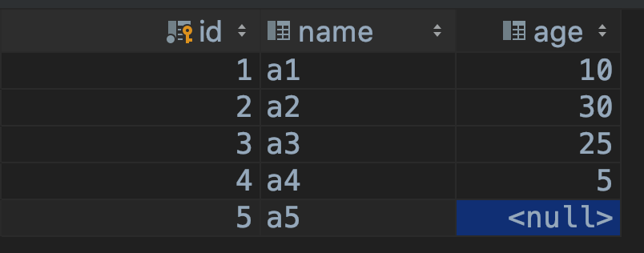

  ```python
  # from django.test import TestCase
  import os
  import django
  
  # Create your tests here.
  
  if __name__ == '__main__':
      os.environ.setdefault('DJANGO_SETTINGS_MODULE', 'demo1.settings')
      django.setup()
  
      from app01 import models
      from django.db.models import Avg, Sum, Max, Min, Count
  
      person_set = models.Person.objects.all()
      print(f'平均年龄 {person_set.aggregate(Avg("age"))}')
      print(f'年龄和 {person_set.aggregate(Sum("age"))}')
      print(f'年龄最大值 {person_set.aggregate(Max("age"))}')
      print(f'年龄最小值 {person_set.aggregate(Min("age"))}')
      print(f'统计个数 {person_set.aggregate(Count("age"))}')
  
      # 多个聚合
      print(f'{person_set.aggregate(Max("age"), Min("age"), Avg("age"))}')
  ```

  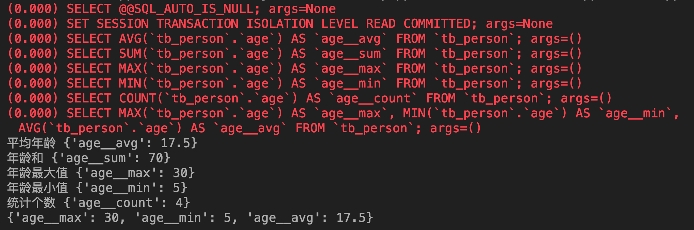

## 分组查询

### 单表分组

```python
from django.db import models


# Create your models here.

class Person(models.Model):
    name = models.CharField(max_length=20, null=True, default='')
    age = models.IntegerField(null=True)
    dept_id = models.IntegerField(null=True)

    class Meta:
        db_table = 'tb_person'
```

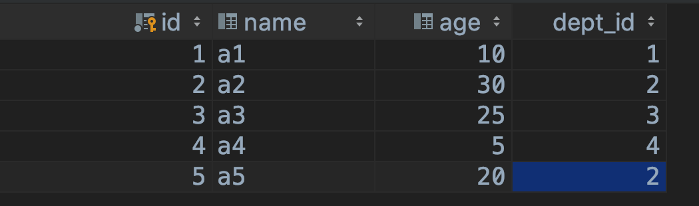

sql语句分组查询

```sql
select tb_person.dept_id as 分组id, avg(tb_person.age) as 平均年龄
from tb_person
group by tb_person.dept_id;
```

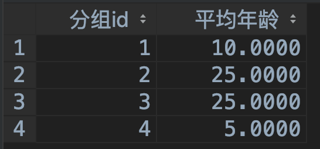

ORM方式查询

```python
# from django.test import TestCase
import os
import django

# Create your tests here.

if __name__ == '__main__':
    os.environ.setdefault('DJANGO_SETTINGS_MODULE', 'demo1.settings')
    django.setup()

    from app01 import models
    from django.db.models import Avg, Sum, Max, Min, Count

    dept_set = models.Person.objects.values("dept_id")
    print(dept_set.annotate(Avg('age')))
```

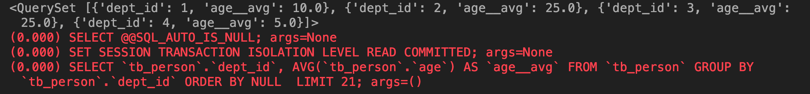

### 多表查询

```python
from django.db import models


# Create your models here.

class Dept(models.Model):
    dept_id = models.AutoField(primary_key=True)
    name = models.CharField(max_length=20, null=True)

    class Meta:
        db_table = 'tb_dept'


class Person(models.Model):
    name = models.CharField(max_length=20, null=True, default='')
    age = models.IntegerField(null=True)
    dept_id = models.ForeignKey(to='Dept', to_field='dept_id', on_delete=models.CASCADE)

    class Meta:
        db_table = 'tb_person'
```

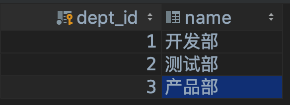

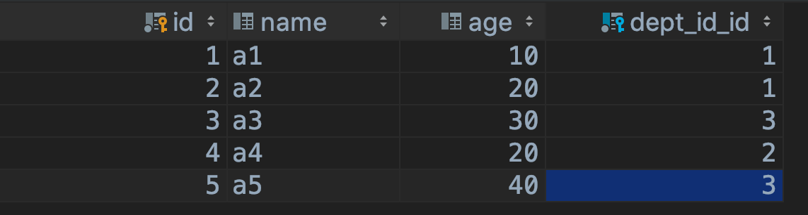

sql语句分组查询

```sql
select tb_dept.name as 部门, avg(tb_person.age) as 平均年龄
from tb_person,
     tb_dept
where tb_dept.dept_id = tb_person.dept_id_id
group by tb_dept.name;
```

ORM方式查询

```python
# from django.test import TestCase
import os
import django

# Create your tests here.

if __name__ == '__main__':
    os.environ.setdefault('DJANGO_SETTINGS_MODULE', 'demo1.settings')
    django.setup()

    from app01 import models
    from django.db.models import Avg, Sum, Max, Min, Count

    res = models.Dept.objects.annotate(Avg('person__age'))
    for item in res:
        print(item.__dict__)
```

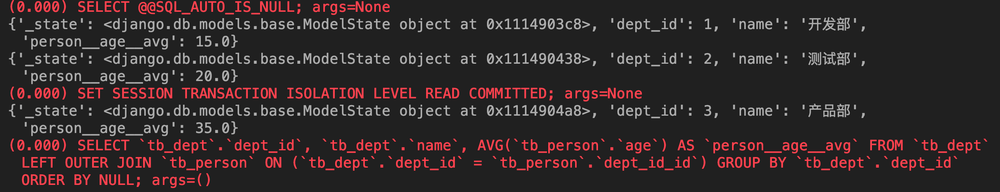

给平均值进行命名

```python
# from django.test import TestCase
import os
import django

# Create your tests here.

if __name__ == '__main__':
    os.environ.setdefault('DJANGO_SETTINGS_MODULE', 'demo1.settings')
    django.setup()

    from app01 import models
    from django.db.models import Avg, Sum, Max, Min, Count

    # 年龄平均值命名为 age_avg
    res = models.Dept.objects.annotate(age_avg=Avg('person__age'))
    for item in res:
        print(item.__dict__)
```

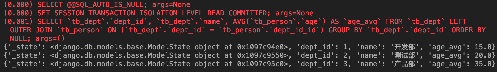

## F查询

在上面所有的例子中，我们构造的过滤器都只是将字段值与某个常量做比较。如果我们要对两个字段的值做比较，那该怎么做呢？Django 提供 F() 来做这样的比较。**F() 的实例可以在查询中引用字段，来比较同一个 model 实例中两个不同字段的值**

Django 支持 F() 对象之间以及 F() 对象和常数之间的加减乘除和取模的操作

### 案例

-  案例1:查询语文比数学成绩高的学生

  ```python
  from django.db import models
  
  
  # Create your models here.
  
  class Student(models.Model):
      name = models.CharField(max_length=20)
      score_chinese = models.SmallIntegerField()
      score_math = models.SmallIntegerField()
  
      class Meta:
          db_table = 'tb_student'
  ```

  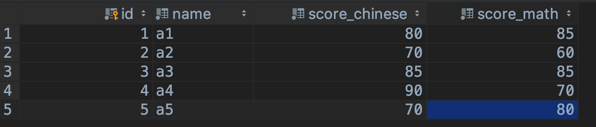

  ```python
  # from django.test import TestCase
  import os
  import django
  
  # Create your tests here.
  
  if __name__ == '__main__':
      os.environ.setdefault('DJANGO_SETTINGS_MODULE', 'demo1.settings')
      django.setup()
  
      from app01 import models
      from django.db.models import F
  
      res = models.Student.objects.filter(score_chinese__gt=F('score_math'))
      for item in res:
          print(item.__dict__)
  ```

  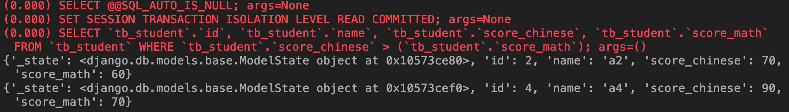

- 案例2:查询语文至少比数学高15分的学生

  ```python
  # from django.test import TestCase
  import os
  import django
  
  # Create your tests here.
  
  if __name__ == '__main__':
      os.environ.setdefault('DJANGO_SETTINGS_MODULE', 'demo1.settings')
      django.setup()
  
      from app01 import models
      from django.db.models import F
  
      res = models.Student.objects.filter(score_chinese__gt=F('score_math') + 15)
      for item in res:
          print(item.__dict__)
  ```

  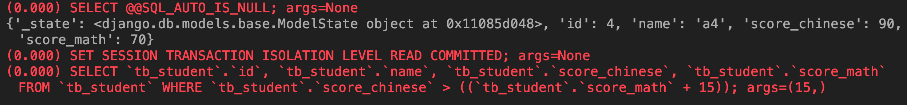

- 修改操作也可以使用F函数

  案例3:将所有学生的数学成绩加5分

  ```python
  # from django.test import TestCase
  import os
  import django
  
  # Create your tests here.
  
  if __name__ == '__main__':
      os.environ.setdefault('DJANGO_SETTINGS_MODULE', 'demo1.settings')
      django.setup()
  
      from app01 import models
      from django.db.models import F
  
      models.Student.objects.update(score_math=F('score_math') + 5)
      student_set = models.Student.objects.all()
      for item in student_set:
          print(item.__dict__)
  ```

  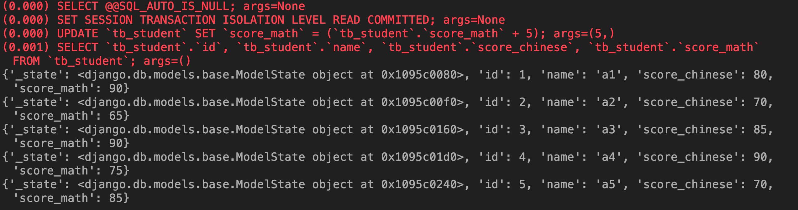

## Q查询

filter() 等方法中的关键字参数查询都是一起进行“AND” 的。 如果你需要执行更复杂的查询（例如OR语句），你可以使用Q对象

### 案例

- 案例1:查询语文成绩为90或者数学成绩为90的学生

  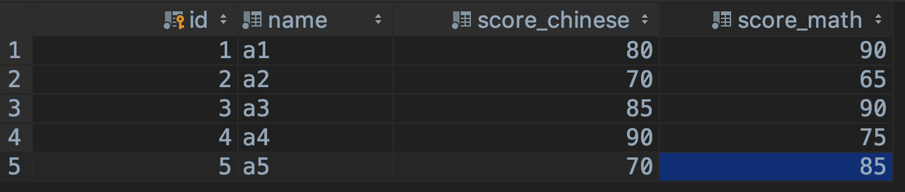

  ```python
  # from django.test import TestCase
  import os
  import django
  
  # Create your tests here.
  
  if __name__ == '__main__':
      os.environ.setdefault('DJANGO_SETTINGS_MODULE', 'demo1.settings')
      django.setup()
  
      from app01 import models
      from django.db.models import Q
  
      res = models.Student.objects.filter(Q(score_chinese=90) | Q(score_math=90))
      for item in res:
          print(item.__dict__)
  ```

  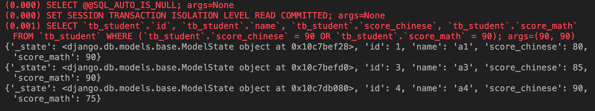

- 案例2: 查询语文为70,数学不为85的学生

  ```python
  # from django.test import TestCase
  import os
  import django
  
  # Create your tests here.
  
  if __name__ == '__main__':
      os.environ.setdefault('DJANGO_SETTINGS_MODULE', 'demo1.settings')
      django.setup()
  
      from app01 import models
      from django.db.models import Q
  
      res = models.Student.objects.filter(Q(score_chinese=70) & ~Q(score_math=85))
      for item in res:
          print(item.__dict__)
  ```

  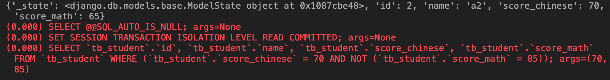

- 查询函数可以混合使用Q 对象和关键字参数。所有提供给查询函数的参数（关键字参数或`Q` 对象）都将"AND”在一起。但是，如果出现Q 对象，它必须位于所有关键字参数的前面

  案例3: 查询语文为70或语文为80,并且数学大于80的学生

  方式1:

  ```python
  # from django.test import TestCase
  import os
  import django
  
  # Create your tests here.
  
  if __name__ == '__main__':
      os.environ.setdefault('DJANGO_SETTINGS_MODULE', 'demo1.settings')
      django.setup()
  
      from app01 import models
      from django.db.models import Q
  
      res = models.Student.objects.filter(Q(score_chinese=70) | Q(score_chinese=80), score_math__gt=80)
      for item in res:
          print(item.__dict__)
  ```

  方式2:

  ```python
  # from django.test import TestCase
  import os
  import django
  
  # Create your tests here.
  
  if __name__ == '__main__':
      os.environ.setdefault('DJANGO_SETTINGS_MODULE', 'demo1.settings')
      django.setup()
  
      from app01 import models
      from django.db.models import Q
  
      res = models.Student.objects.filter((Q(score_chinese=70) | Q(score_chinese=80)) & Q(score_math__gt=80))
      for item in res:
          print(item.__dict__)
  ```

  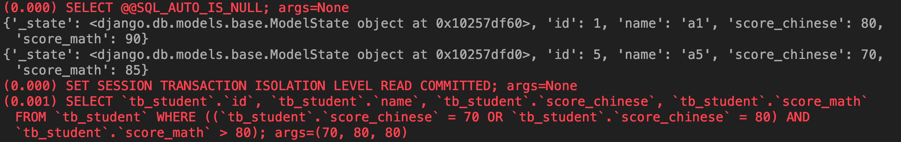

## 锁

select_for_update(nowait=False, skip_locked=False)

返回一个锁住行直到事务结束的查询集，如果数据库支持，它将生成一个 SELECT ... FOR UPDATE 语句。

举个例子：

```
entries = Entry.objects.select_for_update().filter(author=request.user)
```

所有匹配的行将被锁定，直到事务结束。这意味着可以通过锁防止数据被其它事务修改。

一般情况下如果其他事务锁定了相关行，那么本查询将被阻塞，直到锁被释放。 如果这不想要使查询阻塞的话，使用select_for_update(nowait=True)。 如果其它事务持有冲突的锁, 那么查询将引发 DatabaseError 异常。你也可以使用select_for_update(skip_locked=True)忽略锁定的行。 nowait和skip_locked是互斥的，同时设置会导致ValueError。

目前，postgresql，oracle和mysql数据库后端支持select_for_update()。 但是，MySQL不支持nowait和skip_locked参数。

使用不支持这些选项的数据库后端（如MySQL）将nowait=True或skip_locked=True转换为select_for_update()将导致抛出DatabaseError异常，这可以防止代码意外终止

## 事务

### 模板

```python
# from django.test import TestCase
import os
import django

# Create your tests here.

if __name__ == '__main__':
    os.environ.setdefault('DJANGO_SETTINGS_MODULE', 'demo1.settings')
    django.setup()

    from app01 import models
    from django.db import transaction

    try:
        with transaction.atomic():
            # 待执行的代码
            pass
    except Exception as ex:
        # 事务内的代码执行发生异常
        pass
```

### 案例

```python
# from django.test import TestCase
import os
import django

# Create your tests here.

if __name__ == '__main__':
    os.environ.setdefault('DJANGO_SETTINGS_MODULE', 'demo1.settings')
    django.setup()

    from app01 import models
    from django.db import transaction

    try:
        with transaction.atomic():
            models.Student.objects.create(name='name6', score_chinese=90, score_math=80)
            student_obj = models.Student.objects.get(id=100)
            print(f'执行成功')
    except Exception as ex:
        print(f'发生异常了 : {str(ex)}')
```

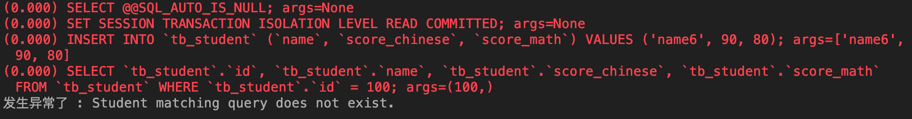

## Django ORM执行原生SQL语句

在模型查询API不够用的情况下，我们还可以使用原始的SQL语句进行查询。

Django 提供两种方法使用原始SQL进行查询：一种是使用raw()方法，进行原始SQL查询并返回模型实例；另一种是完全避开模型层，直接执行自定义的SQL语句

### 原生查询

raw()管理器方法用于原始的SQL查询，并返回模型的实例：

**注意：raw()语法查询必须包含主键**

这个方法执行原始的SQL查询，并返回一个django.db.models.query.RawQuerySet 实例。 这个RawQuerySet 实例可以像一般的QuerySet那样，通过迭代来提供对象实例

- 查询指定的表

  ```python
  # from django.test import TestCase
  import os
  import django
  from django.db import transaction
  
  
  # Create your tests here.
  
  def run_in_transaction(func):
      """
      事务装饰器
      :param func:
      :return:
      """
  
      def wrapper(*args, **kwargs):
          try:
              with transaction.atomic():
                  res = func(*args, **kwargs)
              return res
          except Exception as ex:
              raise ex
  
      return wrapper
  
  
  @run_in_transaction
  def test1():
      # 执行原生查询
      student_set = models.Student.objects.raw('select * from tb_student')
      for item in student_set:
          print(item.__dict__)
  
  
  if __name__ == '__main__':
      os.environ.setdefault('DJANGO_SETTINGS_MODULE', 'demo1.settings')
      django.setup()
  
      from app01 import models
  
      test1()
  ```

- raw()查询其他表中的数据

  ```python
  # from django.test import TestCase
  import os
  import django
  from django.db import transaction
  
  
  # Create your tests here.
  
  def run_in_transaction(func):
      """
      事务装饰器
      :param func:
      :return:
      """
  
      def wrapper(*args, **kwargs):
          try:
              with transaction.atomic():
                  res = func(*args, **kwargs)
              return res
          except Exception as ex:
              raise ex
  
      return wrapper
  
  
  @run_in_transaction
  def test1():
      # 执行原生查询
      student_set = models.Student.objects.raw('select * from django_content_type')
      for item in student_set:
          print(item.__dict__)
  
  
  if __name__ == '__main__':
      os.environ.setdefault('DJANGO_SETTINGS_MODULE', 'demo1.settings')
      django.setup()
  
      from app01 import models
  
      test1()
  ```

- raw()方法自动将查询字段映射到模型字段

  还可以通过translations参数指定一个把查询的字段名和ORM对象实例的字段名互相对应的字典

  ```python
  # from django.test import TestCase
  import os
  import django
  from django.db import transaction
  
  
  # Create your tests here.
  
  def run_in_transaction(func):
      """
      事务装饰器
      :param func:
      :return:
      """
  
      def wrapper(*args, **kwargs):
          try:
              with transaction.atomic():
                  res = func(*args, **kwargs)
              return res
          except Exception as ex:
              raise ex
  
      return wrapper
  
  
  @run_in_transaction
  def test1():
      query_dict = {}
      student_set = models.Student.objects.raw('select * from tb_student', translations=query_dict)
      for item in student_set:
          print(f'id:{item.id}, 姓名:{item.name}, 语文:{item.score_chinese}, 数学:{item.score_math}')
  
  
  if __name__ == '__main__':
      os.environ.setdefault('DJANGO_SETTINGS_MODULE', 'demo1.settings')
      django.setup()
  
      from app01 import models
  
      test1()
  ```

  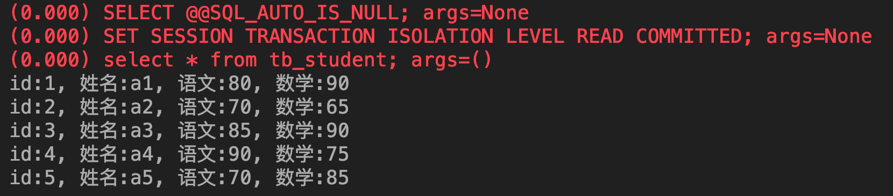

- **原生SQL还可以使用参数，注意不要自己使用字符串格式化拼接SQL语句，防止SQL注入**

  ```python
  # from django.test import TestCase
  import os
  import django
  from django.db import transaction
  
  
  # Create your tests here.
  
  def run_in_transaction(func):
      """
      事务装饰器
      :param func:
      :return:
      """
  
      def wrapper(*args, **kwargs):
          try:
              with transaction.atomic():
                  res = func(*args, **kwargs)
              return res
          except Exception as ex:
              raise ex
  
      return wrapper
  
  
  @run_in_transaction
  def test1():
      query_dict = {}
      student_set = models.Student.objects.raw('select * from tb_student where id > %s', translations=query_dict, params=[3, ])
      for item in student_set:
          print(f'id:{item.id}, 姓名:{item.name}, 语文:{item.score_chinese}, 数学:{item.score_math}')
  
  
  if __name__ == '__main__':
      os.environ.setdefault('DJANGO_SETTINGS_MODULE', 'demo1.settings')
      django.setup()
  
      from app01 import models
  
      test1()
  ```

  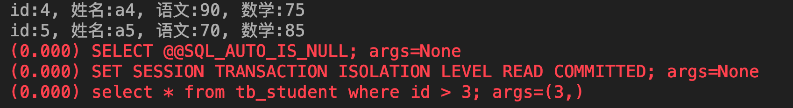

### 直接执行自定义SQL

有时候raw()方法并不十分好用，很多情况下我们不需要将查询结果映射成模型，或者我们需要执行DELETE、 INSERT以及UPDATE操作。在这些情况下，我们可以直接访问数据库，完全避开模型层。

我们可以直接从django提供的接口中获取数据库连接，然后像使用pymysql模块一样操作数据库

- 使用connection

  ```python
  # from django.test import TestCase
  import os
  import django
  from django.db import transaction
  from django.db import connection
  
  
  # Create your tests here.
  
  def run_in_transaction(func):
      """
      事务装饰器
      :param func:
      :return:
      """
  
      def wrapper(*args, **kwargs):
          try:
              with transaction.atomic():
                  res = func(*args, **kwargs)
              return res
          except Exception as ex:
              raise ex
  
      return wrapper
  
  
  @run_in_transaction
  def test1():
      cursor = connection.cursor()
      cursor.execute('select * from tb_student where id > %s', [3, ])
      ret = cursor.fetchone()
      print(ret)
  
  
  if __name__ == '__main__':
      os.environ.setdefault('DJANGO_SETTINGS_MODULE', 'demo1.settings')
      django.setup()
  
      from app01 import models
  
      test1()
  ```

  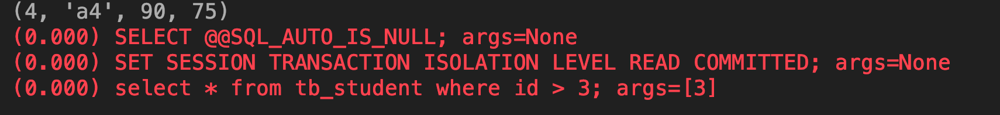

- 使用connections

  ```python
  # from django.test import TestCase
  import os
  import django
  from django.db import transaction
  from django.db import connections
  
  
  # Create your tests here.
  
  def run_in_transaction(func):
      """
      事务装饰器
      :param func:
      :return:
      """
  
      def wrapper(*args, **kwargs):
          try:
              with transaction.atomic():
                  res = func(*args, **kwargs)
              return res
          except Exception as ex:
              raise ex
  
      return wrapper
  
  
  @run_in_transaction
  def test1():
      cursor = connections['default'].cursor()
      cursor.execute('select * from tb_student where id > %s', [3, ])
      ret = cursor.fetchone()
      print(ret)
  
  
  if __name__ == '__main__':
      os.environ.setdefault('DJANGO_SETTINGS_MODULE', 'demo1.settings')
      django.setup()
  
      from app01 import models
  
      test1()
  ```

  

## QuerySet方法大全

```python
##################################################################
# PUBLIC METHODS THAT ALTER ATTRIBUTES AND RETURN A NEW QUERYSET #
##################################################################

def all(self)
    # 获取所有的数据对象
    pass

def filter(self, *args, **kwargs)
    # 条件查询
    # 条件可以是：参数，字典，Q
    pass

def exclude(self, *args, **kwargs)
    # 条件查询
    # 条件可以是：参数，字典，Q
    pass

def select_related(self, *fields)
    # 性能相关：表之间进行join连表操作，一次性获取关联的数据。

    # 总结：
    # 1. select_related主要针一对一和多对一关系进行优化。
    # 2. select_related使用SQL的JOIN语句进行优化，通过减少SQL查询的次数来进行优化、提高性能。
    pass

def prefetch_related(self, *lookups)
    # 性能相关：多表连表操作时速度会慢，使用其执行多次SQL查询在Python代码中实现连表操作。

    # 总结：
    # 1. 对于多对多字段（ManyToManyField）和一对多字段，可以使用prefetch_related()来进行优化。
    # 2. prefetch_related()的优化方式是分别查询每个表，然后用Python处理他们之间的关系。
    pass

def annotate(self, *args, **kwargs)
    # 用于实现聚合group by查询

    from django.db.models import Count, Avg, Max, Min, Sum

    v = models.UserInfo.objects.values('u_id').annotate(uid=Count('u_id'))
    # SELECT u_id, COUNT(ui) AS `uid` FROM UserInfo GROUP BY u_id

    v = models.UserInfo.objects.values('u_id').annotate(uid=Count('u_id')).filter(uid__gt=1)
    # SELECT u_id, COUNT(ui_id) AS `uid` FROM UserInfo GROUP BY u_id having count(u_id) > 1

    v = models.UserInfo.objects.values('u_id').annotate(uid=Count('u_id',distinct=True)).filter(uid__gt=1)
    # SELECT u_id, COUNT( DISTINCT ui_id) AS `uid` FROM UserInfo GROUP BY u_id having count(u_id) > 1

def distinct(self, *field_names)
    # 用于distinct去重
    models.UserInfo.objects.values('nid').distinct()
    # select distinct nid from userinfo

    # 注：只有在PostgreSQL中才能使用distinct进行去重

def order_by(self, *field_names)
    # 用于排序
    models.UserInfo.objects.all().order_by('-id','age')

def extra(self, select=None, where=None, params=None, tables=None, order_by=None, select_params=None)
    # 构造额外的查询条件或者映射，如：子查询

    Entry.objects.extra(select={'new_id': "select col from sometable where othercol > %s"}, select_params=(1,))
    Entry.objects.extra(where=['headline=%s'], params=['Lennon'])
    Entry.objects.extra(where=["foo='a' OR bar = 'a'", "baz = 'a'"])
    Entry.objects.extra(select={'new_id': "select id from tb where id > %s"}, select_params=(1,), order_by=['-nid'])

def reverse(self):
    # 倒序
    models.UserInfo.objects.all().order_by('-nid').reverse()
    # 注：如果存在order_by，reverse则是倒序，如果多个排序则一一倒序

def defer(self, *fields):
    # models.UserInfo.objects.defer('username','id') 或  models.UserInfo.objects.filter(...).defer('username','id')
    # 映射中排除某列数据
	pass

def only(self, *fields):
    # 仅取某个表中的数据
    # models.UserInfo.objects.only('username','id') 或  models.UserInfo.objects.filter(...).only('username','id')
    pass

def using(self, alias):
	# 指定使用的数据库，参数为别名（setting中的设置）
    pass

##################################################
# PUBLIC METHODS THAT RETURN A QUERYSET SUBCLASS #
##################################################

def raw(self, raw_query, params=None, translations=None, using=None):
    # 执行原生SQL
    models.UserInfo.objects.raw('select * from userinfo')

    # 如果SQL是其他表时，必须将名字设置为当前UserInfo对象的主键列名
    models.UserInfo.objects.raw('select id as nid from 其他表')

    # 为原生SQL设置参数
    models.UserInfo.objects.raw('select id as nid from userinfo where nid>%s', params=[12,])

    # 将获取的到列名转换为指定列名
    name_map = {'first': 'first_name', 'last': 'last_name', 'bd': 'birth_date', 'pk': 'id'}
    Person.objects.raw('SELECT * FROM some_other_table', translations=name_map)

    # 指定数据库
    models.UserInfo.objects.raw('select * from userinfo', using="default")

    ################### 原生SQL ###################
    from django.db import connection, connections
    cursor = connection.cursor()  # cursor = connections['default'].cursor()
    cursor.execute("""SELECT * from auth_user where id = %s""", [1])
    row = cursor.fetchone() # fetchall()/fetchmany(..)


def values(self, *fields):
    # 获取每行数据为字典格式
    pass

def values_list(self, *fields, **kwargs):
    # 获取每行数据为元祖
    pass

def dates(self, field_name, kind, order='ASC'):
    # 根据时间进行某一部分进行去重查找并截取指定内容
    # kind只能是："year"（年）, "month"（年-月）, "day"（年-月-日）
    # order只能是："ASC"  "DESC"
    # 并获取转换后的时间
    #   - year : 年-01-01
    #   - month: 年-月-01
    #   - day  : 年-月-日
    models.DatePlus.objects.dates('ctime','day','DESC')

def datetimes(self, field_name, kind, order='ASC', tzinfo=None):
    # 根据时间进行某一部分进行去重查找并截取指定内容，将时间转换为指定时区时间
    # kind只能是 "year", "month", "day", "hour", "minute", "second"
    # order只能是："ASC"  "DESC"
    # tzinfo时区对象
    models.DDD.objects.datetimes('ctime','hour',tzinfo=pytz.UTC)
    models.DDD.objects.datetimes('ctime','hour',tzinfo=pytz.timezone('Asia/Shanghai'))

    """
    pip3 install pytz
    import pytz
    pytz.all_timezones
    pytz.timezone(‘Asia/Shanghai’)
    """

def none(self):
    # 空QuerySet对象
	pass

####################################
# METHODS THAT DO DATABASE QUERIES #
####################################

def aggregate(self, *args, **kwargs):
	# 聚合函数，获取字典类型聚合结果
	from django.db.models import Count, Avg, Max, Min, Sum
	result = models.UserInfo.objects.aggregate(k=Count('u_id', distinct=True), n=Count('nid'))
	# ===> {'k': 3, 'n': 4}

def count(self):
	# 获取个数
    pass

def get(self, *args, **kwargs):
    # 获取单个对象
	pass

def create(self, **kwargs):
   # 创建对象

def bulk_create(self, objs, batch_size=None):
    # 批量插入
    # batch_size表示一次插入的个数
    objs = [
        models.DDD(name='r11'),
        models.DDD(name='r22')
    ]
    models.DDD.objects.bulk_create(objs, 10)

def get_or_create(self, defaults=None, **kwargs):
    # 如果存在，则获取，否则，创建
    # defaults 指定创建时，其他字段的值
    obj, created = models.UserInfo.objects.get_or_create(username='root1', defaults={'email': '1111111','u_id': 2, 't_id': 2})

def update_or_create(self, defaults=None, **kwargs):
    # 如果存在，则更新，否则，创建
    # defaults 指定创建时或更新时的其他字段
    obj, created = models.UserInfo.objects.update_or_create(username='root1', defaults={'email': '1111111','u_id': 2, 't_id': 1})

def first(self):
	# 获取第一个
	pass

def last(self):
	# 获取最后一个
    pass

def in_bulk(self, id_list=None):
	# 根据主键ID进行查找
	id_list = [11,21,31]
	models.DDD.objects.in_bulk(id_list)

def delete(self):
	# 删除
    pass

def update(self, **kwargs):
	# 更新
    pass

def exists(self):
	# 是否有结果
    pass
```