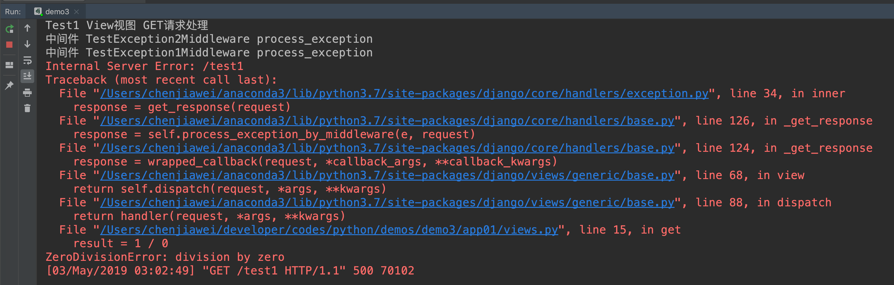
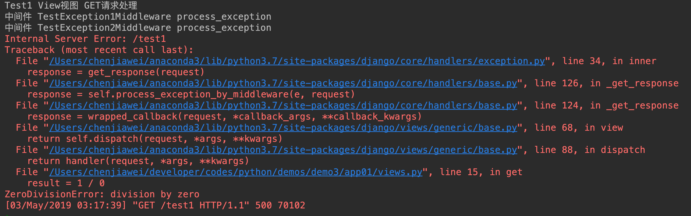
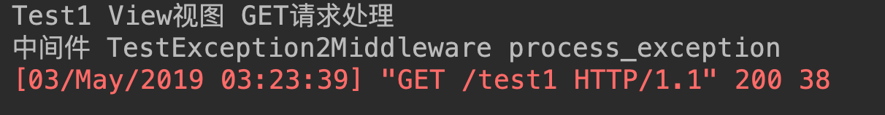
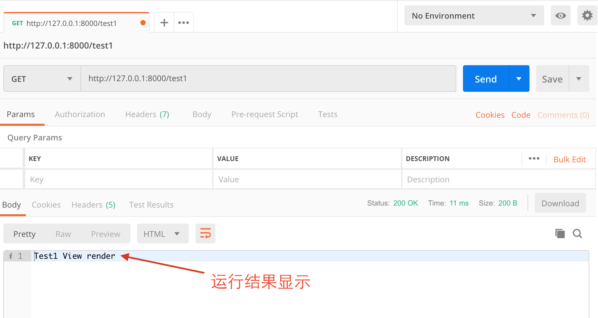
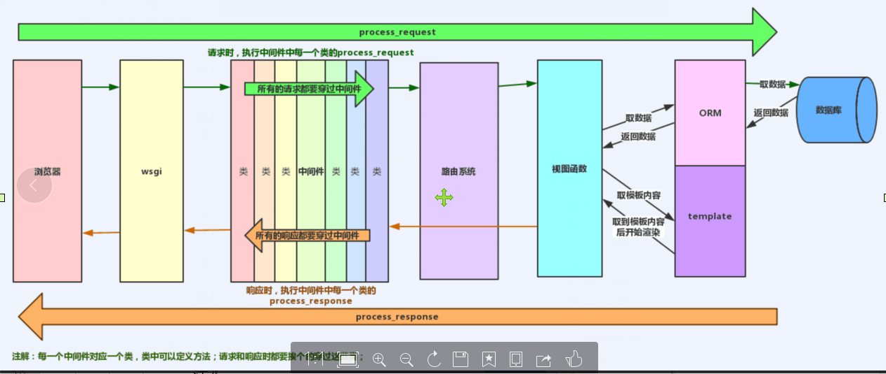

# Django中间件, 默认的中间件, 自定义中间件, 中间件的5个方法, 中间件的执行流程, Django请求流程

## 定义

中间件是一个用来处理Django的请求和响应的框架级别的钩子。它是一个轻量、低级别的插件系统，用于在全局范围内改变Django的输入和输出。每个中间件组件都负责做一些特定的功能

**但是由于其影响的是全局，所以需要谨慎使用，使用不当会影响性能**

中间件是帮助我们在视图函数执行之前和执行之后都可以做一些额外的操作，它本质上就是一个自定义类，类中定义了几个方法，Django框架会在请求的特定的时间去执行这些方法

## Django项目中默认配置的中间件

```python
# settings.py
# 中间件
MIDDLEWARE = [
    'django.middleware.security.SecurityMiddleware',
    'django.contrib.sessions.middleware.SessionMiddleware',
    'django.middleware.common.CommonMiddleware',
    'django.middleware.csrf.CsrfViewMiddleware',
    'django.contrib.auth.middleware.AuthenticationMiddleware',
    'django.contrib.messages.middleware.MessageMiddleware',
    'django.middleware.clickjacking.XFrameOptionsMiddleware',
]
```

MIDDLEWARE配置项是一个列表，列表中是一个个字符串，这些字符串其实是一个个类，也就是一个个中间件

```python
# CsrfViewMiddleware 中间件, 专门处理 csrf_token
class CsrfViewMiddleware(MiddlewareMixin):
    """
    Require a present and correct csrfmiddlewaretoken for POST requests that
    have a CSRF cookie, and set an outgoing CSRF cookie.

    This middleware should be used in conjunction with the 
    template tag.
    """
    # The _accept and _reject methods currently only exist for the sake of the
    # requires_csrf_token decorator.
    def _accept(self, request):
        # Avoid checking the request twice by adding a custom attribute to
        # request.  This will be relevant when both decorator and middleware
        # are used.
        request.csrf_processing_done = True
        return None

    def _reject(self, request, reason):
        response = _get_failure_view()(request, reason=reason)
        log_response(
            'Forbidden (%s): %s', reason, request.path,
            response=response,
            request=request,
            logger=logger,
        )
        return response

    def _get_token(self, request):
        if settings.CSRF_USE_SESSIONS:
            try:
                return request.session.get(CSRF_SESSION_KEY)
            except AttributeError:
                raise ImproperlyConfigured(
                    'CSRF_USE_SESSIONS is enabled, but request.session is not '
                    'set. SessionMiddleware must appear before CsrfViewMiddleware '
                    'in MIDDLEWARE%s.' % ('_CLASSES' if settings.MIDDLEWARE is None else '')
                )
        else:
            try:
                cookie_token = request.COOKIES[settings.CSRF_COOKIE_NAME]
            except KeyError:
                return None

            csrf_token = _sanitize_token(cookie_token)
            if csrf_token != cookie_token:
                # Cookie token needed to be replaced;
                # the cookie needs to be reset.
                request.csrf_cookie_needs_reset = True
            return csrf_token

    def _set_token(self, request, response):
        if settings.CSRF_USE_SESSIONS:
            request.session[CSRF_SESSION_KEY] = request.META['CSRF_COOKIE']
        else:
            response.set_cookie(
                settings.CSRF_COOKIE_NAME,
                request.META['CSRF_COOKIE'],
                max_age=settings.CSRF_COOKIE_AGE,
                domain=settings.CSRF_COOKIE_DOMAIN,
                path=settings.CSRF_COOKIE_PATH,
                secure=settings.CSRF_COOKIE_SECURE,
                httponly=settings.CSRF_COOKIE_HTTPONLY,
                samesite=settings.CSRF_COOKIE_SAMESITE,
            )
            # Set the Vary header since content varies with the CSRF cookie.
            patch_vary_headers(response, ('Cookie',))

    def process_request(self, request):
        csrf_token = self._get_token(request)
        if csrf_token is not None:
            # Use same token next time.
            request.META['CSRF_COOKIE'] = csrf_token

    def process_view(self, request, callback, callback_args, callback_kwargs):
        if getattr(request, 'csrf_processing_done', False):
            return None

        # Wait until request.META["CSRF_COOKIE"] has been manipulated before
        # bailing out, so that get_token still works
        if getattr(callback, 'csrf_exempt', False):
            return None

        # Assume that anything not defined as 'safe' by RFC7231 needs protection
        if request.method not in ('GET', 'HEAD', 'OPTIONS', 'TRACE'):
            if getattr(request, '_dont_enforce_csrf_checks', False):
                # Mechanism to turn off CSRF checks for test suite.
                # It comes after the creation of CSRF cookies, so that
                # everything else continues to work exactly the same
                # (e.g. cookies are sent, etc.), but before any
                # branches that call reject().
                return self._accept(request)

            if request.is_secure():
                # Suppose user visits http://example.com/
                # An active network attacker (man-in-the-middle, MITM) sends a
                # POST form that targets https://example.com/detonate-bomb/ and
                # submits it via JavaScript.
                #
                # The attacker will need to provide a CSRF cookie and token, but
                # that's no problem for a MITM and the session-independent
                # secret we're using. So the MITM can circumvent the CSRF
                # protection. This is true for any HTTP connection, but anyone
                # using HTTPS expects better! For this reason, for
                # https://example.com/ we need additional protection that treats
                # http://example.com/ as completely untrusted. Under HTTPS,
                # Barth et al. found that the Referer header is missing for
                # same-domain requests in only about 0.2% of cases or less, so
                # we can use strict Referer checking.
                referer = request.META.get('HTTP_REFERER')
                if referer is None:
                    return self._reject(request, REASON_NO_REFERER)

                referer = urlparse(referer)

                # Make sure we have a valid URL for Referer.
                if '' in (referer.scheme, referer.netloc):
                    return self._reject(request, REASON_MALFORMED_REFERER)

                # Ensure that our Referer is also secure.
                if referer.scheme != 'https':
                    return self._reject(request, REASON_INSECURE_REFERER)

                # If there isn't a CSRF_COOKIE_DOMAIN, require an exact match
                # match on host:port. If not, obey the cookie rules (or those
                # for the session cookie, if CSRF_USE_SESSIONS).
                good_referer = (
                    settings.SESSION_COOKIE_DOMAIN
                    if settings.CSRF_USE_SESSIONS
                    else settings.CSRF_COOKIE_DOMAIN
                )
                if good_referer is not None:
                    server_port = request.get_port()
                    if server_port not in ('443', '80'):
                        good_referer = '%s:%s' % (good_referer, server_port)
                else:
                    try:
                        # request.get_host() includes the port.
                        good_referer = request.get_host()
                    except DisallowedHost:
                        pass

                # Create a list of all acceptable HTTP referers, including the
                # current host if it's permitted by ALLOWED_HOSTS.
                good_hosts = list(settings.CSRF_TRUSTED_ORIGINS)
                if good_referer is not None:
                    good_hosts.append(good_referer)

                if not any(is_same_domain(referer.netloc, host) for host in good_hosts):
                    reason = REASON_BAD_REFERER % referer.geturl()
                    return self._reject(request, reason)

            csrf_token = request.META.get('CSRF_COOKIE')
            if csrf_token is None:
                # No CSRF cookie. For POST requests, we insist on a CSRF cookie,
                # and in this way we can avoid all CSRF attacks, including login
                # CSRF.
                return self._reject(request, REASON_NO_CSRF_COOKIE)

            # Check non-cookie token for match.
            request_csrf_token = ""
            if request.method == "POST":
                try:
                    request_csrf_token = request.POST.get('csrfmiddlewaretoken', '')
                except IOError:
                    # Handle a broken connection before we've completed reading
                    # the POST data. process_view shouldn't raise any
                    # exceptions, so we'll ignore and serve the user a 403
                    # (assuming they're still listening, which they probably
                    # aren't because of the error).
                    pass

            if request_csrf_token == "":
                # Fall back to X-CSRFToken, to make things easier for AJAX,
                # and possible for PUT/DELETE.
                request_csrf_token = request.META.get(settings.CSRF_HEADER_NAME, '')

            request_csrf_token = _sanitize_token(request_csrf_token)
            if not _compare_salted_tokens(request_csrf_token, csrf_token):
                return self._reject(request, REASON_BAD_TOKEN)

        return self._accept(request)

    def process_response(self, request, response):
        if not getattr(request, 'csrf_cookie_needs_reset', False):
            if getattr(response, 'csrf_cookie_set', False):
                return response

        if not request.META.get("CSRF_COOKIE_USED", False):
            return response

        # Set the CSRF cookie even if it's already set, so we renew
        # the expiry timer.
        self._set_token(request, response)
        response.csrf_cookie_set = True
        return response
```

## 自定义中间件

### 主要方法

- process_request(self,request)
- process_view(self, request, view_func, view_args, view_kwargs)
- process_template_response(self,request,response)
- process_exception(self, request, exception)
- process_response(self, request, response)

**以上方法的返回值可以是None或一个HttpResponse对象，如果是None，则继续按照django定义的规则向后继续执行，如果是HttpResponse对象，则直接将该对象返回给用户**

**一个Django中间件至少需要实现五个方法中的一个方法**

### 自定义中间件步骤

1. 定义中间件类

   ```python
   from django.utils.deprecation import MiddlewareMixin
   
   
   # 需要继承 MiddlewareMixin
   class Test1MiddleWare(MiddlewareMixin):
   
       def process_request(self, request):
           print('中间件 Test1MiddleWare process_request')
   
       def process_response(self, request, response):
           print('中间件 Test1MiddleWare process_response')
           return response
   ```

2. 将中间件配置到 settings.py 文件中

   ```python
   # settings.py
   # 中间件
   MIDDLEWARE = [
       'django.middleware.security.SecurityMiddleware',
       'django.contrib.sessions.middleware.SessionMiddleware',
       'django.middleware.common.CommonMiddleware',
       'django.middleware.csrf.CsrfViewMiddleware',
       'django.contrib.auth.middleware.AuthenticationMiddleware',
       'django.contrib.messages.middleware.MessageMiddleware',
       'django.middleware.clickjacking.XFrameOptionsMiddleware',
       # 自定义中间件
       'app01.middlewares.middleware.Test1MiddleWare'
   ]
   ```

3. 运行测试

   这里为了方便查看调用流程, 在View视图中也添加了打印

   ```python
   from django.shortcuts import HttpResponse
   from django.views import View
   
   
   # Create your views here.
   
   class Test1(View):
   
       def get(self, request):
           print('Test1 View视图 GET请求处理')
           return HttpResponse('Test1 View视图 GET请求处理')
   ```

4. 结果显示

   ```
   中间件 Test1MiddleWare process_request
   Test1 View视图 GET请求处理
   中间件 Test1MiddleWare process_response
   ```

## 中间件方法说明

### process_request

process_request有一个参数，就是request，这个request和视图函数中的request是一样的

它的返回值可以是None也可以是HttpResponse对象。返回值是None的话，按正常流程继续走，交给下一个中间件处理，如果是HttpResponse对象，Django将不执行视图函数，而将相应对象返回给浏览器

#### 多个中间件的调用流程

- 中间件定义

  ```python
  class TestRequest1MiddleWare(MiddlewareMixin):
  
      def process_request(self, request):
          print('中间件 TestRequest1MiddleWare process_request')
  
  
  class TestRequest2MiddleWare(MiddlewareMixin):
  
      def process_request(self, request):
          print('中间件 TestRequest2MiddleWare process_request')
  ```

- settings.py 文件配置

  ```python
  # settings.py
  # 中间件
  MIDDLEWARE = [
      'django.middleware.security.SecurityMiddleware',
      'django.contrib.sessions.middleware.SessionMiddleware',
      'django.middleware.common.CommonMiddleware',
      'django.middleware.csrf.CsrfViewMiddleware',
      'django.contrib.auth.middleware.AuthenticationMiddleware',
      'django.contrib.messages.middleware.MessageMiddleware',
      'django.middleware.clickjacking.XFrameOptionsMiddleware',
      # 自定义中间件
      # 'app01.middlewares.middleware.Test1MiddleWare',
  
      'app01.middlewares.middleware.TestRequest1MiddleWare',
      'app01.middlewares.middleware.TestRequest2MiddleWare',
  ]
  ```

- 运行结果

  ```
  中间件 TestRequest1MiddleWare process_request
  中间件 TestRequest2MiddleWare process_request
  Test1 View视图 GET请求处理
  ```

- 如果将 settings.py 中间件的顺序进行交换

  ```python
  # settings.py
  # 中间件
  MIDDLEWARE = [
      'django.middleware.security.SecurityMiddleware',
      'django.contrib.sessions.middleware.SessionMiddleware',
      'django.middleware.common.CommonMiddleware',
      'django.middleware.csrf.CsrfViewMiddleware',
      'django.contrib.auth.middleware.AuthenticationMiddleware',
      'django.contrib.messages.middleware.MessageMiddleware',
      'django.middleware.clickjacking.XFrameOptionsMiddleware',
      # 自定义中间件
    	# 交换两个中间件顺序
      'app01.middlewares.middleware.TestRequest2MiddleWare',
      'app01.middlewares.middleware.TestRequest1MiddleWare',
  ]
  ```
  
- 运行结果

  ```
  中间件 TestRequest2MiddleWare process_request
  中间件 TestRequest1MiddleWare process_request
  Test1 View视图 GET请求处理
  ```

####  **结论**

  1. **中间件的process_request方法是在执行视图函数之前执行的**
  2. **当配置多个中间件时，会按照MIDDLEWARE中的注册顺序，也就是列表的索引值，从前到后依次执行(顺序执行)**
  3. **不同中间件之间传递的request都是同一个对象**

### process_response

它有两个参数，一个是request，一个是response，request就是上述例子中一样的对象，response是视图函数返回的HttpResponse对象。

**该方法的返回值也必须是HttpResponse对象**

#### 多个中间件的调用流程

- 中间件定义

  ```python
  class TestResponse1Middleware(MiddlewareMixin):
  
      def process_response(self, request, response):
          print('中间件 TestResponse1Middleware process_response')
          return response
  
  
  class TestResponse2Middleware(MiddlewareMixin):
  
      def process_response(self, request, response):
          print('中间件 TestResponse2Middleware process_response')
          return response
  ```

- 配置

  ```python
  # settings.py
  # 中间件
  MIDDLEWARE = [
      'django.middleware.security.SecurityMiddleware',
      'django.contrib.sessions.middleware.SessionMiddleware',
      'django.middleware.common.CommonMiddleware',
      'django.middleware.csrf.CsrfViewMiddleware',
      'django.contrib.auth.middleware.AuthenticationMiddleware',
      'django.contrib.messages.middleware.MessageMiddleware',
      'django.middleware.clickjacking.XFrameOptionsMiddleware',
      # 自定义中间件
      'app01.middlewares.middleware.TestResponse1Middleware',
      'app01.middlewares.middleware.TestResponse2Middleware',
  ]
  ```

- 运行效果

  ```
  Test1 View视图 GET请求处理
  中间件 TestResponse2Middleware process_response
  中间件 TestResponse1Middleware process_response
  ```

- 交换中间件的顺序

  ```python
  # settings.py
  # 中间件
  MIDDLEWARE = [
      'django.middleware.security.SecurityMiddleware',
      'django.contrib.sessions.middleware.SessionMiddleware',
      'django.middleware.common.CommonMiddleware',
      'django.middleware.csrf.CsrfViewMiddleware',
      'django.contrib.auth.middleware.AuthenticationMiddleware',
      'django.contrib.messages.middleware.MessageMiddleware',
      'django.middleware.clickjacking.XFrameOptionsMiddleware',
      # 自定义中间件
      'app01.middlewares.middleware.TestResponse2Middleware',
      'app01.middlewares.middleware.TestResponse1Middleware',
  ]
  ```

- 运行效果

  ```
  Test1 View视图 GET请求处理
  中间件 TestResponse1Middleware process_response
  中间件 TestResponse2Middleware process_response
  ```

#### 结论

1. **process_response方法是在视图函数之后执行的**
2. **多个中间件中的process_response方法是按照MIDDLEWARE中的注册顺序倒序执行的，也就是说第一个中间件的process_request方法首先执行，而它的process_response方法最后执行，最后一个中间件的process_request方法最后一个执行，它的process_response方法是最先执行**

### process_view

```
process_view(self, request, view_func, view_args, view_kwargs)

该方法有四个参数
request 是HttpRequest对象。
view_func 是Django即将使用的视图函数。 （它是实际的函数对象，而不是函数的名称作为字符串。）
view_args 是将传递给视图的位置参数的列表.
view_kwargs 是将传递给视图的关键字参数的字典。 view_args和view_kwargs都不包含第一个视图参数（request）
```

Django会在调用视图函数之前调用process_view方法

**它返回None或一个HttpResponse对象**。 如果返回None，Django将继续处理这个请求，执行任何其他中间件的process_view方法，然后在执行相应的视图。 如果它返回一个HttpResponse对象，Django不会调用适当的视图函数。 它将执行中间件的process_response方法并将应用到该HttpResponse并返回结果

#### 多个中间件的调用流程

- 中间件定义

  ```python
  class TestView1Middleware(MiddlewareMixin):
  
      def process_view(self, request, view_func, view_args, view_kwargs):
          print('中间件 TestView1Middleware process_view')
  
  
  class TestView2Middleware(MiddlewareMixin):
  
      def process_view(self, request, view_func, view_args, view_kwargs):
          print('中间件 TestView2Middleware process_view')
  ```

- 配置

  ```python
  # settings.py
  # 中间件
  MIDDLEWARE = [
      'django.middleware.security.SecurityMiddleware',
      'django.contrib.sessions.middleware.SessionMiddleware',
      'django.middleware.common.CommonMiddleware',
      'django.middleware.csrf.CsrfViewMiddleware',
      'django.contrib.auth.middleware.AuthenticationMiddleware',
      'django.contrib.messages.middleware.MessageMiddleware',
      'django.middleware.clickjacking.XFrameOptionsMiddleware',
      # 自定义中间件
      'app01.middlewares.middleware.TestView1Middleware',
      'app01.middlewares.middleware.TestView2Middleware',
  ]
  ```

- 运行结果

  ```
  中间件 TestView1Middleware process_view
  中间件 TestView2Middleware process_view
  Test1 View视图 GET请求处理
  ```

- 交换中间件顺序

  ```python
  # settings.py
  # 中间件
  MIDDLEWARE = [
      'django.middleware.security.SecurityMiddleware',
      'django.contrib.sessions.middleware.SessionMiddleware',
      'django.middleware.common.CommonMiddleware',
      'django.middleware.csrf.CsrfViewMiddleware',
      'django.contrib.auth.middleware.AuthenticationMiddleware',
      'django.contrib.messages.middleware.MessageMiddleware',
      'django.middleware.clickjacking.XFrameOptionsMiddleware',
      # 自定义中间件
      'app01.middlewares.middleware.TestView2Middleware',
      'app01.middlewares.middleware.TestView1Middleware',
  ]
  ```

- 运行结果

  ```
  中间件 TestView2Middleware process_view
  中间件 TestView1Middleware process_view
  Test1 View视图 GET请求处理
  ```

#### 结论

1. **process_view方法是在process_request之后，视图函数之前执行的**
2. **执行顺序按照MIDDLEWARE中的注册顺序从前到后顺序执行的**

### process_exception

```
process_exception(self, request, exception)

该方法两个参数:
一个HttpRequest对象
一个exception是视图函数异常产生的Exception对象
```

**这个方法只有在视图函数中出现异常了才执行**

**它返回的值可以是一个None也可以是一个HttpResponse对象**。如果是HttpResponse对象，Django将调用模板和中间件中的process_response方法，并返回给浏览器，否则将默认处理异常。如果返回一个None，则交给下一个中间件的process_exception方法来处理异常。它的执行顺序也是按照中间件注册顺序的倒序执行

#### 多个中间件的调用流程

- 中间件定义

  ```python
  class TestException1Middleware(MiddlewareMixin):
  
      def process_exception(self, request, exception):
          print('中间件 TestException1Middleware process_exception')
  
  
  class TestException2Middleware(MiddlewareMixin):
  
      def process_exception(self, request, exception):
          print('中间件 TestException2Middleware process_exception')
  ```

- 视图定义

  ```python
  class Test1(View):
  
      def get(self, request):
          print('Test1 View视图 GET请求处理')
  
          # 模拟错误
          result = 1 / 0
  
          return HttpResponse('Test1 View视图 GET请求处理')
  ```

- 配置

  ```python
  # settings.py
  # 中间件
  MIDDLEWARE = [
      'django.middleware.security.SecurityMiddleware',
      'django.contrib.sessions.middleware.SessionMiddleware',
      'django.middleware.common.CommonMiddleware',
      'django.middleware.csrf.CsrfViewMiddleware',
      'django.contrib.auth.middleware.AuthenticationMiddleware',
      'django.contrib.messages.middleware.MessageMiddleware',
      'django.middleware.clickjacking.XFrameOptionsMiddleware',
      # 自定义中间件
      'app01.middlewares.middleware.TestException1Middleware',
      'app01.middlewares.middleware.TestException2Middleware',
  ]
  ```

- 运行结果

  

- 交换中间件

  ```python
  # settings.py
  # 中间件
  MIDDLEWARE = [
      'django.middleware.security.SecurityMiddleware',
      'django.contrib.sessions.middleware.SessionMiddleware',
      'django.middleware.common.CommonMiddleware',
      'django.middleware.csrf.CsrfViewMiddleware',
      'django.contrib.auth.middleware.AuthenticationMiddleware',
      'django.contrib.messages.middleware.MessageMiddleware',
      'django.middleware.clickjacking.XFrameOptionsMiddleware',
      # 自定义中间件
      'app01.middlewares.middleware.TestException2Middleware',
      'app01.middlewares.middleware.TestException1Middleware',
  ]
  ```

- 运行结果

  

#### 异常情况处理

- 中间件

  ```python
  class TestException1Middleware(MiddlewareMixin):
  
      def process_exception(self, request, exception):
          print('中间件 TestException1Middleware process_exception')
  
  
  class TestException2Middleware(MiddlewareMixin):
  
      def process_exception(self, request, exception):
          print('中间件 TestException2Middleware process_exception')
  
          return HttpResponse('出现了错误了, 现在进行处理')
  ```

- 配置

  ```python
  # settings.py
  # 中间件
  MIDDLEWARE = [
      'django.middleware.security.SecurityMiddleware',
      'django.contrib.sessions.middleware.SessionMiddleware',
      'django.middleware.common.CommonMiddleware',
      'django.middleware.csrf.CsrfViewMiddleware',
      'django.contrib.auth.middleware.AuthenticationMiddleware',
      'django.contrib.messages.middleware.MessageMiddleware',
      'django.middleware.clickjacking.XFrameOptionsMiddleware',
      # 自定义中间件
      'app01.middlewares.middleware.TestException1Middleware',
      'app01.middlewares.middleware.TestException2Middleware',
  ]
  ```

- 运行结果

  

#### 结论

1. **如果视图函数中无异常，process_exception方法不执行, 否则才会执行**
2. **执行顺序按照MIDDLEWARE中的注册顺序倒序执行的**
3. **当方法的返回值为HttpResponse对象，Django将调用模板和中间件中的process_response方法，并返回给浏览器，否则将默认处理异常**

### process_template_response (使用频率小)

```
process_template_response(self, request, response)

它的参数，一个HttpRequest对象，response是TemplateResponse对象（由视图函数或者中间件产生）
```

process_template_response是在视图函数执行完成后立即执行，但是它有一个前提条件，那就是视图函数返回的对象有一个render()方法（或者表明该对象是一个TemplateResponse对象或等价方法）

#### 多个中间件的调用流程

- 中间件

  ```python
  class TestTemplateResponse1Middleware(MiddlewareMixin):
  
      def process_template_response(self, request, response):
          print('中间件 TestTemplateResponse1Middleware process_template_response')
          return response
  
  
  class TestTemplateResponse2Middleware(MiddlewareMixin):
  
      def process_template_response(self, request, response):
          print('中间件 TestTemplateResponse2Middleware process_template_response')
          return response
  ```

- view视图

  ```python
  class Test1(View):
  
      def get(self, request):
          print('Test1 View视图 GET请求处理')
  
          def render():
              return HttpResponse('Test1 View render')
  
          rep = HttpResponse('Test1 View视图 GET请求处理')
          rep.render = render
          return rep
  ```

- 配置

  ```python
  # settings.py
  # 中间件
  MIDDLEWARE = [
      'django.middleware.security.SecurityMiddleware',
      'django.contrib.sessions.middleware.SessionMiddleware',
      'django.middleware.common.CommonMiddleware',
      'django.middleware.csrf.CsrfViewMiddleware',
      'django.contrib.auth.middleware.AuthenticationMiddleware',
      'django.contrib.messages.middleware.MessageMiddleware',
      'django.middleware.clickjacking.XFrameOptionsMiddleware',
      # 自定义中间件
      'app01.middlewares.middleware.TestTemplateResponse1Middleware',
      'app01.middlewares.middleware.TestTemplateResponse2Middleware',
  ]
  ```

- 运行结果

  ```
  Test1 View视图 GET请求处理
  中间件 TestTemplateResponse2Middleware process_template_response
  中间件 TestTemplateResponse1Middleware process_template_response
  ```

  

- 交换中间件顺序

  ```python
  # settings.py
  # 中间件
  MIDDLEWARE = [
      'django.middleware.security.SecurityMiddleware',
      'django.contrib.sessions.middleware.SessionMiddleware',
      'django.middleware.common.CommonMiddleware',
      'django.middleware.csrf.CsrfViewMiddleware',
      'django.contrib.auth.middleware.AuthenticationMiddleware',
      'django.contrib.messages.middleware.MessageMiddleware',
      'django.middleware.clickjacking.XFrameOptionsMiddleware',
      # 自定义中间件
      'app01.middlewares.middleware.TestTemplateResponse2Middleware',
      'app01.middlewares.middleware.TestTemplateResponse1Middleware',
  ]
  ```

- 运行结果

  ```
  Test1 View视图 GET请求处理
  中间件 TestTemplateResponse1Middleware process_template_response
  中间件 TestTemplateResponse2Middleware process_template_response
  ```

  

#### 结论

1. **process_template_response是在视图函数执行完成后立即执行，但是它有一个前提条件，那就是视图函数返回的对象有一个render()方法**
2. 视图函数执行完之后，立即执行了中间件的process_template_response方法，**顺序是倒序**，接着执行了视图函数返回的HttpResponse对象的render方法，返回了一个新的HttpResponse对象，接着执行中间件的process_response方法

## 中间件的执行流程

请求到达中间件之后，先按照正序执行每个注册中间件的process_reques方法，process_request方法返回的值是None，就依次执行，如果返回的值是HttpResponse对象，不再执行后面的process_request方法，而是执行当前对应中间件的process_response方法，将HttpResponse对象返回给浏览器。

也就是说：如果MIDDLEWARE中注册了6个中间件，执行过程中，第3个中间件返回了一个HttpResponse对象，那么第4,5,6中间件的process_request和process_response方法都不执行，顺序执行3,2,1中间件的process_response方法


process_request方法都执行完后，匹配路由，找到要执行的视图函数，先不执行视图函数，先执行中间件中的process_view方法，process_view方法返回None，继续按顺序执行，所有process_view方法执行完后执行视图函数。

加入中间件3 的process_view方法返回了HttpResponse对象，则4,5,6的process_view以及视图函数都不执行，直接从最后一个中间件，也就是中间件6的process_response方法开始倒序执行


process_template_response和process_exception两个方法的触发是有条件的，执行顺序也是倒序。

总结所有的执行流程如下


## Django请求流程图




## 练习案例

- 需求

  实现 session版登录 + 黑名单校验

  1. 每次请求, 获取用户的 session值, 如果存在并且是黑名单列表, 则不允许用户请求, 否则可以进行请求
  2. 获取信息时, 先判断是否有 session值, 如果没有该值, 必须先进行登录操作, 否则才可以查看信息

- urls.py 配置

  ```python
  from django.contrib import admin
  from django.urls import path
  from django.urls import re_path
  
  from app01 import views
  
  urlpatterns = [
      re_path('index', views.IndexPage.as_view(), name='index'),
      re_path('get_user_info', views.UserInfo.as_view()),
      re_path('login', views.Login.as_view(), name='login'),
      re_path('check_info', views.InfoPage.as_view(), name='info'),
  ]
  ```

- model.py 配置

  ```python
  from django.db import models
  
  
  # Create your models here.
  
  class User(models.Model):
      id = models.AutoField(primary_key=True)
      username = models.CharField(max_length=30, null=True)
      password = models.CharField(max_length=30, null=True)
  ```

- views.py

  ```python
  class IndexPage(View):
  
      def get(self, request):
          return render(request, 'index.html')
  
  
  class InfoPage(View):
  
      def get(self, request):
          user_session = request.session.get('user_session', "")
          user_obj = models.User.objects.get(username=user_session)
          return render(request, 'info.html', {'user': user_obj})
  
  
  class Login(View):
  
      def get(self, request):
          return render(request, 'login.html')
  
      def post(self, request):
          username = request.POST.get('username')
          password = request.POST.get('password')
          user_list = models.User.objects.filter(username=username, password=password)
  
          if user_list:
              request.session['user_session'] = username
  
              result_code = 1
              result_message = ''
          else:
              result_code = 0
              result_message = '用户名或密码错误'
  
          data = {
              'result_code': result_code,
              'result_message': result_message
          }
          return JsonResponse(data)
  
  
  class UserInfo(View):
  
      def post(self, request):
          user_session = request.session.get('user_session', "")
          user_list = models.User.objects.filter(username=user_session)
  
          if not user_session or len(user_list) == 0:
              result_code = 0
              data_url = reverse('login')
  
          else:
              result_code = 1
              data_url = reverse('info')
  
          data = {
              'result_code': result_code,
              'url': data_url
          }
  
          print(data)
  
          return JsonResponse(data)
  ```

- 中间件

  ```python
  class AuthMiddleware(MiddlewareMixin):
  
      def process_request(self, request):
          user_list = ['a', ]
          user_session = request.session.get('user_session', '')
  
          if user_session in user_list:
              return HttpResponse('你已经被拉入黑名单')
  ```

- settings.py 配置

  ```python
  # settings.py
  # 中间件
  MIDDLEWARE = [
      'django.middleware.security.SecurityMiddleware',
      'django.contrib.sessions.middleware.SessionMiddleware',
      'django.middleware.common.CommonMiddleware',
      'django.middleware.csrf.CsrfViewMiddleware',
      'django.contrib.auth.middleware.AuthenticationMiddleware',
      'django.contrib.messages.middleware.MessageMiddleware',
      'django.middleware.clickjacking.XFrameOptionsMiddleware',
      # 自定义中间件
      'app01.middlewares.middleware.AuthMiddleware',
  ]
  ```

- 资源文件

  - inddex.html

    ```html
    <!DOCTYPE html>
    <html lang="en">
    <head>
        <meta charset="UTF-8">
        <title>index页面</title>
    </head>
    <body>
    
    
    
    <input type="button" value="查看用户信息" id="get_user_info"/>
    
    <script src="https://code.jquery.com/jquery-3.4.1.js"></script>
    
    <script>
        let csrf_token_value = $("input[name='csrfmiddlewaretoken']").val();
    
        $('#get_user_info').on('click', function () {
            $.ajax(
                {
                    url: 'get_user_info',
                    type: 'POST',
                    data: {
                        'csrfmiddlewaretoken': csrf_token_value
                    },
                    success: function (result_data) {
                        location.href = result_data.url
                    }
                }
            )
        })
    </script>
    
    </body>
    </html>
    ```

  - info.html

    ```html
    <!DOCTYPE html>
    <html lang="en">
    <head>
        <meta charset="UTF-8">
        <title>info 页面</title>
    </head>
    <body>
    
    <p>info 页面</p>
    <p id="username">{{ user.username }}</p>
    <p id="password">{{ user.password }}</p>
    
    </body>
    </html>
    ```

  - login.html

    ```html
    <!DOCTYPE html>
    <html lang="en">
    <head>
        <meta charset="UTF-8">
        <title>login 登录</title>
    </head>
    <body>
    
    
    
    <label>
        用户名
        <input type="text" id="username"/>
    </label>
    
    <br>
    
    <label>
        密码
        <input type="text" id="password"/>
    </label>
    
    <br>
    
    <input type="button" id="login" value="登录">
    
    <span id="error"></span>
    
    <input type="hidden" id="dest_location" value="">
    
    <script src="https://code.jquery.com/jquery-3.4.1.js"></script>
    
    <script>
        let csrf_token_value = $("input[name='csrfmiddlewaretoken']").val();
    
        $('#login').on('click', function () {
            $.ajax(
                {
                    url: 'login',
                    type: 'POST',
                    data: {
                        'csrfmiddlewaretoken': csrf_token_value,
                        'username': $('#username').val(),
                        'password': $('#password').val()
                    },
                    success: function (result_data) {
                        console.log(result_data);
                        if (result_data.result_code === 1) {
                            location.href = $('#dest_location').val()
                        } else {
                            $("#error").text(result_data.result_message)
                        }
                    }
                }
            )
        })
    
    </script>
    
    </body>
    </html>
    ```

